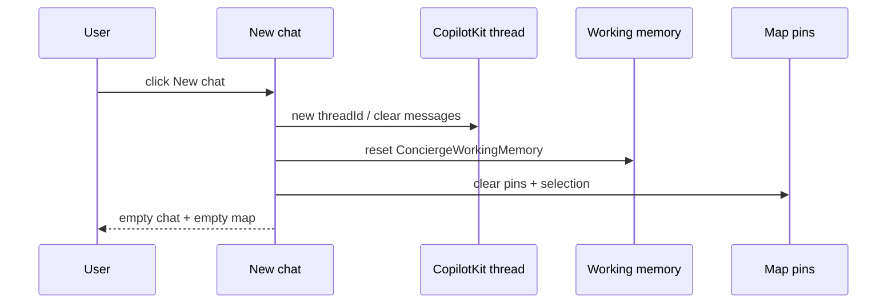

# UX-032 — New chat reset (from UX-006)

## Purpose

**Camila** finishes a rental search, clicks New chat, expects a clean slate — today she keeps old pins, filters, and messages.

## Root cause (verified)

`chat-nav-rail.tsx:24-30` — client nav to `/` without clearing:

- CopilotKit thread / messages
- `useCoAgent<ConciergeWorkingMemory>()` state
- Map pins (`useMapContext`)
- Rich card registrar counts

## Files

| File | Change |
|------|--------|
| `src/components/chat/chat-nav-rail.tsx` | Reset handler vs bare Link |
| `src/components/chat/chat-center-panel.tsx` | Wire reset callback |
| `src/platform/maps/map-context.tsx` | Clear pins API |
| `src/components/chat/rich-card-results-context.tsx` | Reset counts |

## Acceptance

- [x] New chat → empty message list, zero pins, cleared working memory filters (`ConciergeSessionProvider` + `nav-new-chat`).
- [x] Rental fast-path still works on next message (e2e sends second query path via remount).
- [x] Playwright: `npm run test:e2e:new-chat` PASS (localhost 2026-06-01).
- [ ] Optional manual prod: New chat after rental search on [mdeai.co](https://www.mdeai.co).

## Flow diagram

## Verification (2026-06-01)

| Claim | Result |
|-------|--------|
| PR #36 merged `1a51ad2` | ✅ |
| Linear SAN-321 | ✅ Done |
| `test:e2e:new-chat` | ✅ PASS |
| Prod deploy | ✅ on Vercel (post-merge) |
