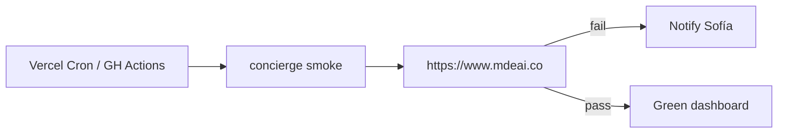

# UX-034 — Prod synthetic concierge monitor (from UX-009)

## Purpose

**Sofía** gets paged when prod concierge breaks — not **Tourist** discovering silence first.

## Gap (verified)

- No `e2e/concierge-agent-smoke.spec.ts`
- No Vercel cron / GitHub scheduled workflow for concierge
- Existing `smoke:*` scripts are manual only (`package.json`)

## Implementation options

| Option | Pros |
|--------|------|
| Playwright against prod URL | Full UI path |
| Vercel Cron + `curl` POST `/api/copilotkit` | Lightweight |
| Extend UX-031 matrix as CI scheduled job | Reuses scenarios |

## Acceptance

- [x] Scheduled run ≥1/day — cron `0 9 * * *` UTC + `workflow_dispatch`.
- [x] Fail on test failure (Playwright + CI red); RUN_ERROR covered by spec assertions.
- [x] Evidence: [`prod-synthetic-smoke-2026-06-01.md`](../../testing/evidence/prod-synthetic-smoke-2026-06-01.md).

**Ops:** `PROD_SMOKE_ENABLED=true`, `PROD_SMOKE_BASE_URL=https://www.mdeai.co` (repo vars set 2026-06-01).

## Flow diagram

## Verification (2026-05-31)

| Claim | Result |
|-------|--------|
| UX-001 same-origin fix | ✅ prerequisite met |
| Monitor exists | ❌ not implemented |
| Depends UX-015 | 🟡 stable error path helps debug failures |
