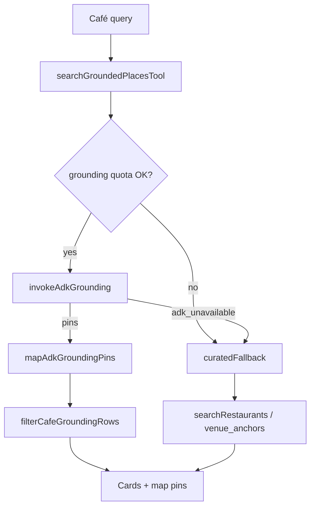

# UX-T-GM — Maps / ADK / Grounding MVP test matrix

**Real-world goal:**

```text
User: “quiet café near Laureles for working”
→ café intent
→ ADK / Google Places called correctly
→ real place_id + lat/lng
→ rich cards + map pins
→ Supabase fallback if Google fails
```

## Disk truth (verify before writing assertions)

| User term | On disk (2026-05-31) | Test against |
|-----------|----------------------|--------------|
| ADK sidecar health | `GET ${ADK_GROUNDING_URL}/health` | `verify-grounding-invoke.mjs`, `smoke-adk-grounding.mjs` |
| Grounding invoke | `POST /v1/grounding/invoke` tool `search_grounded_places` | `adk-grounding-client.ts` |
| PERMISSION_DENIED | ADK returns non-OK → `metadata.reason: adk_unavailable` | `adk-grounding-client.test.ts` |
| Places field masks | `google-places-client.ts` → `validatePlacesFieldMask`, `X-Goog-FieldMask` | `google-places-client.test.ts` (MAP-004) |
| Browser vs server keys | `NEXT_PUBLIC_GOOGLE_MAPS_API_KEY` (referrer) vs `GOOGLE_PLACES_API_KEY` / `GOOGLE_MAPS_SERVER_API_KEY` (server) | `verify-maps-env.mjs`, `maps-grounding.spec.ts` (no browser Places POST) |
| Café fallback | `curatedFallback()` → `searchRestaurants` when ADK empty | `search-grounded-places.ts` L214–224; [UX-T-013](UX-T-013-cafe-fallback-vitest.md) adds `venue_anchors` |
| Duplicate place_id merge | **Not implemented** in `mapAdkGroundingPins` | P2 spec — add dedupe when product requires |
| Quota logging | `grounding-quota.ts` → `grounding_quota_log`; search web → `search-grounding-quota.ts` | `grounding-quota.test.ts` |
| ADK code skill path | Phase 2 `services/adk-grounding/` — sidecar is separate repo/service | `.agents/skills/google-agents-cli-adk-code` for sidecar authoring, not mdeapp runtime |

**Existing scripts (do not duplicate logic):**

| Script | Proves |
|--------|--------|
| `verify-maps-env.mjs` | Env names + Geocoding + Places searchText probe |
| `verify-grounding-invoke.mjs` | ADK health + invoke ≥1 pin, `grounding-lite` |
| `smoke-grounding-attribution.mjs` | Sidecar + Playwright café + attribution UI |
| `smoke-search-grounding.mjs` | Web search grounding citations (ENABLE_SEARCH_GROUNDING=1) |
| `verify-search-grounding.mjs` | ADK health + search_grounded_events invoke |

**Existing Vitest:**

| File | Covers |
|------|--------|
| `adk-grounding-client.test.ts` | Fail-closed, Bearer, 401, locationBias |
| `google-places-client.test.ts` | Field masks, no wildcard |
| `map-adk-grounding-pins.test.ts` | Pin mapping, attribution title recovery |
| `search-grounded-places-quality.test.ts` | Café filter, not events |
| `grounding-quota.test.ts` | Daily cap disabled |

**Playwright:** `e2e/maps-grounding.spec.ts`, `maps-layout-*.spec.ts`, `helpers/maps-layout.ts`

---

## Priority matrix

### P0 — must have

| ID | Test | What it proves | Implementation |
|----|------|----------------|----------------|
| GM-P0-01 | ADK sidecar starts | `/health` 200 | `smoke-adk-grounding.mjs` |
| GM-P0-02 | Health reachable from app env | `ADK_GROUNDING_URL` set | `verify-grounding-invoke.mjs` |
| GM-P0-03 | Grounding auth | No silent PERMISSION_DENIED without fallback | `adk-grounding-client.test.ts` + live invoke |
| GM-P0-04 | Places search works | `searchText` returns places | `smoke-places-new.mjs` |
| GM-P0-05 | Field masks enforced | No `*` mask; headers on every call | `google-places-client.test.ts` |
| GM-P0-06 | Fallback works | ADK fail → curated Supabase rows | `search-grounded-places-fallback.test.ts` |
| GM-P0-07 | No fake geo | Rows without lat/lng dropped | extend `map-adk-grounding-pins.test.ts` |

### P1 — Google Maps / Places

| ID | Test | Implementation |
|----|------|----------------|
| GM-P1-01 | Maps JS loads | `verify-maps-env.mjs` geocode / referrer note |
| GM-P1-02 | Advanced Markers + mapId | `e2e/maps-layout-desktop.spec.ts` + `NEXT_PUBLIC_GOOGLE_MAPS_MAP_ID` |
| GM-P1-03 | Places API New searchText | `smoke-places-new.mjs` |
| GM-P1-04 | Place Details field mask | `google-places-client.test.ts` getPlace |
| GM-P1-05 | Nearby search | `google-places-client.test.ts` searchNearby |
| GM-P1-06 | Key separation | `verify-maps-env.mjs` warns on referrer-restricted server key |

### P2 — grounding / search quality

| ID | Test | Implementation |
|----|------|----------------|
| GM-P2-01 | Citations / attribution | `smoke-grounding-attribution.mjs`, `alignGroundedAttribution` in quality tests |
| GM-P2-02 | Quota logging | `grounding-quota.test.ts` + live `grounding_quota_log` (optional) |
| GM-P2-03 | Medellín relevance | Live invoke query `"coffee Laureles"` + manual audit |
| GM-P2-04 | Graceful empty | ADK empty + empty fallback → `results: []`, no throw |
| GM-P2-05 | Timeout fallback | `adk-grounding-client` 30s abort → `adk_unavailable` |
| GM-P2-06 | Duplicate place_id merge | **Spec only** until dedupe helper exists |

---

## Best first 10 repo tests

| # | Test | Target |
|---|------|--------|
| 1 | verify-maps-env | ✅ `scripts/verify-maps-env.mjs` |
| 2 | ADK health smoke | `smoke-adk-grounding.mjs` |
| 3 | Places searchText smoke | `smoke-places-new.mjs` |
| 4 | Place details field-mask | ✅ `google-places-client.test.ts` |
| 5 | PERMISSION_DENIED fallback | `search-grounded-places-fallback.test.ts` |
| 6 | Café ≠ events | ✅ `search-grounded-places-quality.test.ts` + [UX-T-019](UX-T-019-event-memory-guard.md) |
| 7 | duplicate place_id | P2 backlog |
| 8 | Map pins from tool lat/lng | `maps-grounding.spec.ts` + no browser Places leak |
| 9 | Quota log row | extend `grounding-quota.test.ts` with Supabase mock |
| 10 | Timeout → curated fallback | `search-grounded-places-fallback.test.ts` |

---

## Exact smoke commands

### Places API New

```bash
cd mdeapp
node --env-file=.env.local scripts/smoke-places-new.mjs
```

Equivalent curl (server key):

```bash
curl -X POST "https://places.googleapis.com/v1/places:searchText" \
  -H "Content-Type: application/json" \
  -H "X-Goog-Api-Key: $GOOGLE_PLACES_API_KEY" \
  -H "X-Goog-FieldMask: places.id,places.displayName,places.formattedAddress,places.location,places.rating" \
  -d '{"textQuery":"coffee in Laureles Medellin","pageSize":3}' | jq '.places | length'
```

Expected: integer ≥ 1

### Geocoding (server key)

```bash
curl "https://maps.googleapis.com/maps/api/geocode/json?address=Laureles+Medellin&key=$GOOGLE_MAPS_SERVER_API_KEY" | jq '.status'
```

Expected: `"OK"` (or use browser key — `verify-maps-env` accepts referrer-restricted denial)

### ADK sidecar

```bash
node --env-file=.env.local scripts/smoke-adk-grounding.mjs
# or
curl -s http://localhost:8000/health
```

### Maps JavaScript key (browser)

```bash
curl -s "https://maps.googleapis.com/maps/api/js?key=$NEXT_PUBLIC_GOOGLE_MAPS_API_KEY&libraries=places" | head -5
```

Expected: JavaScript, not HTML error page

---

## Target Vitest — `search-grounded-places-fallback.test.ts`

```typescript
vi.mock("../../lib/adk-grounding-client", () => ({
  invokeAdkGrounding: vi.fn(),
}));
vi.mock("../search-restaurants", () => ({
  searchRestaurants: vi.fn(),
}));

it("GM-P0-06 returns curated fallback when ADK unavailable", async () => {
  vi.mocked(invokeAdkGrounding).mockResolvedValue({
    pins: [],
    attribution: [],
    metadata: { reason: "adk_unavailable", status: 403 },
  });
  vi.mocked(searchRestaurants).mockResolvedValue({
    results: [{ id: "rst_lau_cafe_001", name: "Pergamino Café", /* … */ }],
    total: 1,
    source: "fallback",
  });
  const out = await searchGroundedPlacesTool.execute!({
    query: "specialty coffee Laureles",
  });
  expect(out.results.length).toBeGreaterThan(0);
  expect(out.metadata?.fallback).toBe("curated");
});
```

Link full `venue_anchors` path → [UX-T-013](UX-T-013-cafe-fallback-vitest.md).

---

## Suggested `package.json` scripts

```json
{
  "verify:maps-env": "node --env-file=.env.local scripts/verify-maps-env.mjs",
  "smoke:places-new": "node --env-file=.env.local scripts/smoke-places-new.mjs",
  "smoke:adk-grounding": "node --env-file=.env.local scripts/smoke-adk-grounding.mjs",
  "test:maps": "vitest run src/mastra/lib/google-places-client.test.ts src/mastra/lib/adk-grounding-client.test.ts src/mastra/lib/map-adk-grounding-pins.test.ts src/mastra/tools/__tests__/search-grounded-places-quality.test.ts src/mastra/tools/__tests__/search-grounded-places-fallback.test.ts",
  "smoke:maps-browser": "playwright test e2e/maps-grounding.spec.ts e2e/maps-layout-desktop.spec.ts --project=chromium"
}
```

---

## MCP checklist (before live claims)

| Step | MCP / tool |
|------|------------|
| Places masks + API shape | `google-maps-code-assist` → `retrieve-instructions` then docs query |
| Gemini grounding behavior | `gemini-api-docs-mcp` (production AI = Gemini only in app) |
| ADK sidecar patterns | `.agents/skills/google-agents-cli-adk-code` (authoring only) |

Skill routing: `.claude/skills/mde-maps/SKILL.md` → `references/places-api-new.md`, `references/maps-grounding.md`

---

## Agent prompt — Maps / ADK / Grounding test implementation

```markdown
Implement Maps/ADK/Grounding MVP tests per `tasks/ux/tasks/tests/UX-T-GM-maps-adk-grounding-mvp-tests.md`.

Read first:
- `.claude/skills/mde-maps/SKILL.md`
- `mdeapp/scripts/verify-maps-env.mjs`
- `mdeapp/scripts/verify-grounding-invoke.mjs`
- `mdeapp/src/mastra/lib/adk-grounding-client.ts`
- `mdeapp/src/mastra/tools/search-grounded-places.ts`
- `mdeapp/e2e/helpers/maps-layout.ts`

Rules:
- Every Places call must use explicit X-Goog-FieldMask (no *)
- Browser key must not be used for server Places probes — use GOOGLE_PLACES_API_KEY or GOOGLE_MAPS_SERVER_API_KEY
- ADK default URL http://localhost:8000; health before invoke
- Live smokes require sidecar running + keys in .env.local — never print secret values
- Café misroute tests live in search-grounded-places-quality + UX-T-019, not duplicate here

Deliverables:
1. smoke-places-new.mjs + smoke-adk-grounding.mjs
2. search-grounded-places-fallback.test.ts (ADK fail + quota fail)
3. extend map-adk-grounding-pins.test.ts (drop invalid coords)
4. package.json scripts test:maps, smoke:places-new, smoke:adk-grounding
5. `npm run test:maps` green offline

Evidence → `tasks/testing/evidence/<date>/maps-adk/`
```

---

## Flow diagram



---

## Acceptance criteria

- [ ] P0 Vitest suite passes offline (`npm run test:maps`)
- [ ] `smoke-places-new.mjs` + `smoke-adk-grounding.mjs` pass with `.env.local` + sidecar
- [ ] `verify-maps-env.mjs` documents browser vs server key separation
- [ ] UX-T-013 venue_anchors fallback wired when UX-013 ships
- [ ] INDEX UX-T-GM 🟢 when offline + smoke evidence captured

## Verification (2026-05-31)

| Claim | Result |
|-------|--------|
| verify-maps-env.mjs | ✅ |
| verify-grounding-invoke.mjs | ✅ |
| google-places-client field mask tests | ✅ |
| adk-grounding-client tests | ✅ |
| smoke-places-new.mjs | ✅ |
| smoke-adk-grounding.mjs | ✅ (wraps verify-grounding-invoke) |
| search-grounded-places-fallback.test.ts | ✅ |
| duplicate place_id dedupe | ❌ not in code |
| `npm run test:maps` | ✅ 33 tests |

## Related specs

- [UX-T-013-cafe-fallback-vitest.md](UX-T-013-cafe-fallback-vitest.md) — venue_anchors path
- [UX-T-MA-mastra-mvp-tests.md](UX-T-MA-mastra-mvp-tests.md) — tool registration + fallback envelope
- [UX-T-SB-supabase-mvp-tests.md](UX-T-SB-supabase-mvp-tests.md) — catalog row quality
- [UX-T-031-live-audit-verticals.spec.md](UX-T-031-live-audit-verticals.spec.md) — scenario 4 café
