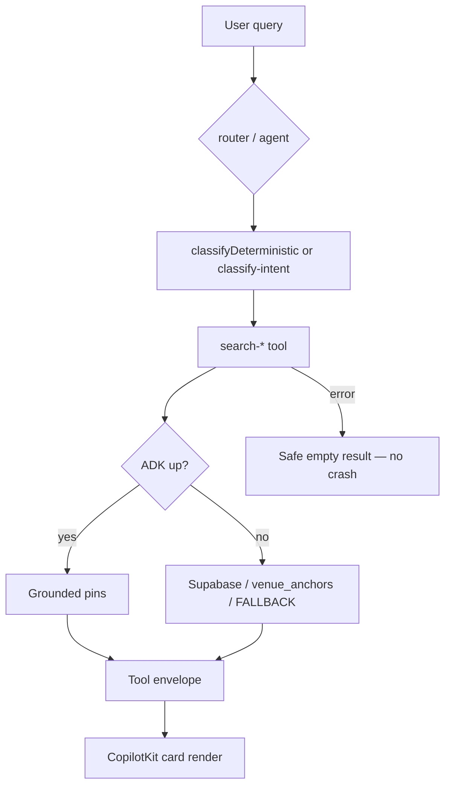

# UX-T-MA — Mastra MVP test matrix

**Real-world goal:**

```text
User asks → Mastra understands intent → correct tool runs → safe fallback works → UI receives cards → map pins update.
```

## Disk truth (verify before writing assertions)

| User term | On disk (2026-05-31) | Test against |
|-----------|----------------------|--------------|
| `extract-intent-slots` | **Not found** | `classify-intent` tool on `routerAgent` + `classifyDeterministic()` in `concierge-routing-workflow.ts` |
| `restaurant_search` / `cafe_search` in working memory | **Not in** `conciergeWorkingMemorySchema.lastIntent` | Workflow `intentEnum` includes `restaurant_search`; café via `filters.cuisine = 'cafe'` or `searchGroundedPlacesTool` |
| `context.writer.custom()` | **`writer?.custom` in 4 search tools** (UX-014 removes) | Test emit shape in tool execute + CopilotKit renders in `search-tool-renders.tsx` |
| `smoke:golden-queries` | **Not in** `package.json` | `npm test` + targeted Vitest globs below |

**Concierge tools (verified):** `search-rentals`, `search-events`, `search-restaurants`, `search-attractions`, `search-grounded-places`, `search-web-grounded-events`.

---

## Priority matrix

### P0 — must have

| ID | Test | What it proves | Implementation |
|----|------|----------------|----------------|
| MA-P0-01 | Mastra agent boots | `conciergeAgent` loads without crash | ✅ `src/__tests__/smoke.test.ts` · extend: `mastra.getAgentById('concierge-agent')` |
| MA-P0-02 | Tools registered | All six search tools on concierge | ✅ `agents/__tests__/concierge.test.ts` — extend negative: no missing ids |
| MA-P0-03 | Intent + slots parse | Rental/event/restaurant/café queries → correct intent + filters | **New** `workflows/__tests__/concierge-routing-workflow.test.ts` → `classifyDeterministic()` |
| MA-P0-04 | Working memory Zod | Concierge state shapes parse; invalid rejected | ✅ `concierge.test.ts` — extend: mapUi, lastEventQuery, **document** `lastIntent` enum lacks `restaurant_search` |
| MA-P0-05 | Tool fallback | Embedding/ADK fail → Supabase/static fallback returns rows | [UX-T-013](UX-T-013-cafe-fallback-vitest.md) · extend `search-restaurants` mock tests |
| MA-P0-06 | Tool errors safe | Network/API failure → structured empty/error, no throw | Mock `fetch`/Supabase reject → tool returns `{ results: [], error?: string }` |
| MA-P0-07 | Result envelope valid | Tools return predictable shape for cards/maps | Assert Zod output schemas on `searchRestaurantsTool`, `searchGroundedPlacesTool` execute mocks |

### P1 — search workflows

| ID | Test | What it proves | Implementation |
|----|------|----------------|----------------|
| MA-P1-01 | Rental workflow | `"1BR Laureles under $80"` → rental rows | `search-rentals` tool test or workflow step mock |
| MA-P1-02 | Restaurant workflow | `"quiet rooftop dinner Provenza"` → restaurant rows | `classifyDeterministic` → `restaurant_search` + neighborhood |
| MA-P1-03 | Café workflow | `"specialty coffee Laureles"` ≠ event routing | ✅ `search-grounded-places-quality.test.ts` · [UX-T-019](UX-T-019-event-memory-guard.md) |
| MA-P1-04 | Event workflow | `"salsa events this weekend"` → event rows | ✅ `search-events-logic.test.ts` · extend dateWindow |
| MA-P1-05 | Ranking deterministic | Same input → stable order in tests | Snapshot or fixed seed in search logic tests |
| MA-P1-06 | Search logs safe | No raw PII in ai_runs / audit logs | ✅ `log-agent-run.test.ts` · extend: query truncation, no full user message in insert payload |

### P2 — runtime / UI bridge

| ID | Test | What it proves | Implementation |
|----|------|----------------|----------------|
| MA-P2-01 | `writer?.custom` migration state | Tools emit cards; renders use `useCopilotAction` only | `mastra-tool-action-names.test.ts` + remove from tools in UX-014 |
| MA-P2-02 | Generative UI receives tool output | Cards render from tool result envelope | Playwright [UX-T-CK](UX-T-CK-copilotkit-mvp-tests.md) CK-P0-06 |
| MA-P2-03 | Grounding failure fallback | ADK 503 → curated/venue_anchors results | [UX-T-013](UX-T-013-cafe-fallback-vitest.md) |
| MA-P2-04 | No invented geo | lat/lng/place_id only from tools/DB | Vitest: tool output without ADK/DB → no synthetic coordinates in envelope |
| MA-P2-05 | No duplicate tool calls | One user turn → bounded tool invocations | Integration smoke or agent run mock counting `execute` calls |

---

## Best first 5 tests to implement

| # | Test | Target file |
|---|------|-------------|
| 1 | Agent + tool registration | extend `concierge.test.ts` |
| 2 | Working memory + workflow intent/slots | `concierge-routing-workflow.test.ts` + `concierge.test.ts` |
| 3 | Restaurant fallback on API fail | `search-restaurants-tool.test.ts` (new) |
| 4 | Café misrouting regression | extend `search-grounded-places-quality.test.ts` + [UX-T-019](UX-T-019-event-memory-guard.md) |
| 5 | Card path without writer.custom | [UX-T-014](UX-T-014-agent-card-emit-vitest.md) + platform copilot tests |

---

## Target Vitest — `concierge-routing-workflow.test.ts`

Export or test `classifyDeterministic` (may need `export` for test-only — prefer testing via workflow step if already exported).

```typescript
import { describe, expect, it } from "vitest";
// import { classifyDeterministic } from "../concierge-routing-workflow";

describe("concierge-routing-workflow classifyDeterministic", () => {
  it("MA-P1-01 extracts rental slots from Laureles budget query", () => {
    const out = classifyDeterministic("1BR in Laureles under $80/night");
    expect(out.intent).toBe("rental_search");
    expect(out.filters.neighborhood).toMatch(/Laureles/i);
    expect(out.filters.minBedrooms).toBe(1);
    expect(out.filters.maxPricePerNight).toBeLessThanOrEqual(80);
  });

  it("MA-P1-02 restaurant dinner in Provenza", () => {
    const out = classifyDeterministic("quiet rooftop dinner in Provenza");
    expect(out.intent).toBe("restaurant_search");
    expect(out.filters.neighborhood).toMatch(/Poblado/i);
  });

  it("MA-P1-03 café query classifies as restaurant_search with cuisine cafe", () => {
    const out = classifyDeterministic("good specialty coffee in Laureles");
    expect(out.intent).toBe("restaurant_search");
    expect(out.filters.cuisine).toBe("cafe");
    expect(out.intent).not.toBe("event_discovery");
  });

  it("MA-P1-04 event query with category", () => {
    const out = classifyDeterministic("salsa events this weekend");
    expect(out.intent).toBe("event_discovery");
    expect(out.filters.category).toBeDefined();
  });
});
```

**Note:** If `classifyDeterministic` is not exported, extract slot helpers (`pickNeighborhood`, `pickBedrooms`, `pickPrice`) to a testable module or test through workflow `.createRun()` with fixture input.

---

## Target Vitest — tool fallback + envelope

### `search-restaurants-tool-fallback.test.ts` (new)

```typescript
it("MA-P0-05 returns FALLBACK_RESTAURANTS when Supabase empty", async () => {
  // mock getServiceClient → { data: [], error: null }
  const out = await searchRestaurants({ neighborhood: "El Poblado", limit: 5 });
  expect(out.results.length).toBeGreaterThan(0);
});

it("MA-P0-06 returns safe envelope on Supabase error", async () => {
  // mock reject
  const out = await searchRestaurantsTool.execute!({ ... }, ctx);
  expect(out).toMatchObject({ results: expect.any(Array) });
  // must not throw
});
```

### `search-grounded-places-cafe-fallback.test.ts`

See [UX-T-013](UX-T-013-cafe-fallback-vitest.md) — MA-P0-05/P2-03 for ADK down + `venue_anchors`.

---

## Working memory — what to test vs gap

**Test today (schema on disk):**

```typescript
conciergeWorkingMemorySchema.parse({
  lastIntent: "rental_search", // enum: rental_search | event_discovery | chitchat | unknown
  lastRentalQuery: { neighborhood: "Laureles", minBedrooms: 1, maxPricePerNight: 80 },
});
```

**Gap (document, do not falsely pass):**

- `restaurant_search` / `cafe_search` are **workflow** intents, not `lastIntent` enum values.
- If product needs café intent in working memory → separate task to extend schema + agent prompt (Phase 2).

**Router `classify-intent` tool** only accepts four intents — restaurant/café routing happens via concierge agent tool choice or workflow, not `classifyIntentTool` enum.

---

## Search log safety (MA-P1-06)

Extend `log-agent-run.test.ts` / `ai-runs.test.ts`:

- Insert payload must not contain full raw user message if policy says truncate
- `user_id` may be null for anonymous turns
- Assert field names only in tests — never log secret values

Read `src/mastra/lib/log-agent-run.ts` + `ai-runs.ts` for actual insert shape before assertions.

---

## Suggested commands

```bash
cd mdeapp
npm run lint
npm run typecheck
npm test
npm run build

# Targeted Mastra suite (add script)
npm test -- src/mastra src/__tests__/smoke.test.ts

# After Playwright bridge tests land
npx playwright test e2e/copilotkit-mvp.spec.ts --project=chromium --workers=1
```

### `package.json` scripts to add

```json
{
  "test:mastra": "vitest run src/mastra src/__tests__/smoke.test.ts",
  "smoke:mastra:intents": "node scripts/smoke-mastra-intents.mjs"
}
```

**Do not add** `smoke:golden-queries` until `scripts/intelligence/golden-queries-smoke.ts` exists on disk.

---

## Agent prompt — Mastra test implementation

```markdown
Implement Mastra MVP tests per `tasks/ux/tasks/tests/UX-T-MA-mastra-mvp-tests.md`.

Read disk first:
- `src/mastra/agents/concierge.ts` — tools + working memory schema
- `src/mastra/workflows/concierge-routing-workflow.ts` — classifyDeterministic slots
- `src/mastra/tools/search-grounded-places.ts` — ADK + curatedFallback
- Existing tests under `src/mastra/**/__tests__/`

Rules:
- Do NOT assert `extract-intent-slots` exists — use `classify-intent` + workflow classifier
- Do NOT assert `restaurant_search` in working memory lastIntent until schema extended
- Do NOT add `writer.custom` tests — assert absence + UX-T-014 generative UI path
- Mock Supabase/ADK — no live keys in unit tests
- Gemini-only agents (smoke.test.ts pattern)

Deliverables:
1. `workflows/__tests__/concierge-routing-workflow.test.ts` (MA-P0-03, MA-P1-01..04)
2. `tools/__tests__/search-restaurants-tool-fallback.test.ts` (MA-P0-05/06)
3. Extend `concierge.test.ts`, `log-agent-run.test.ts` as needed
4. Wire UX-T-013 cafe fallback test
5. `npm test -- src/mastra` green

Evidence → `tasks/testing/evidence/<date>/mastra-mvp/`
```

---

## Flow diagram



---

## Acceptance criteria

- [ ] All P0 rows have Vitest coverage (new or existing documented in matrix)
- [ ] P1 workflow classifier tests pass for rental/restaurant/café/event queries
- [ ] MA-P1-06 log safety tests pass
- [ ] `npm test -- src/mastra` exits 0
- [ ] INDEX UX-T-MA status 🟢 when green
- [ ] No false claims about `extract-intent-slots` or `writer.custom`

## Verification (2026-05-31)

| Claim | Result |
|-------|--------|
| smoke.test.ts mastra boots | ✅ |
| concierge.test.ts tools | ✅ |
| classify-intent.test.ts | ✅ |
| search-grounded-places-quality | ✅ |
| search-restaurants-logic | ✅ (schema/helpers only) |
| workflow classifyDeterministic tests | ✅ |
| restaurant tool fallback tests | ✅ |
| venue_anchors fallback | ❌ UX-T-013 |
| writer.custom | ✅ in 4 tools (UX-014 removes) |
| `npm run test:mastra` | ✅ 144 tests |

## Related specs

- [UX-T-CK-copilotkit-mvp-tests.md](UX-T-CK-copilotkit-mvp-tests.md) — UI/runtime bridge
- [UX-T-013-cafe-fallback-vitest.md](UX-T-013-cafe-fallback-vitest.md) — MA-P0-05 café path
- [UX-T-019-event-memory-guard.md](UX-T-019-event-memory-guard.md) — MA-P1-03 misroute
- [UX-T-014-agent-card-emit-vitest.md](UX-T-014-agent-card-emit-vitest.md) — MA-P2-01/02
