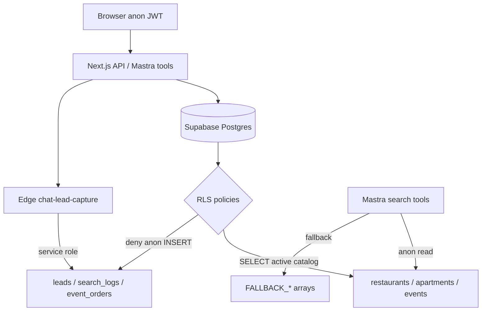

# UX-T-SB — Supabase MVP test matrix

**Real-world goal:**

```text
User asks for rentals/restaurants/events
→ Supabase returns real trusted data
→ RLS protects private rows
→ server writes happen only through approved APIs
→ no secrets or PII leak
```

## Disk truth (verify before writing assertions)

| User term | On disk (2026-05-31) | Test against |
|-----------|----------------------|--------------|
| `hybrid_search_rentals` | **Not deployed** | Live RPC is **`hybrid_search_listings`** |
| `hybrid_search_restaurants` | ✅ Live (VDB-01 via MCP) | RPC probe + optional integration test |
| Hybrid RPC SQL in repo | **Audit stub only** | `supabase/migrations/20260510000000_vdb01_hybrid_fts_search.sql` — use MCP/`verify-supabase-data.mjs` for live |
| `search_logs` app writer | **Not in `mdeapp/src` yet** | Migration RLS + DATA-047 spec; hash/truncate tests when `search-logs.ts` lands |
| Lead insert (anon direct) | **Blocked by RLS** | `leads_insert_own_user` requires `authenticated` + `user_id = auth.uid()` |
| Guest lead capture | **`POST /api/leads/schedule-viewing`** → edge `chat-lead-capture` | `scripts/smoke-lead-capture.mjs` |
| Env probe | ✅ | `scripts/verify-supabase-env.mjs` |
| Service role in browser | Hook + `check:mastra` | `service-role-client-guard.test.ts` |

**Live MCP verify (2026-05-31):** `hybrid_search_events`, `hybrid_search_listings`, `hybrid_search_restaurants` exist. Critical tables RLS enabled: `apartments` (3 policies), `restaurants` (6), `leads` (5), `event_orders` (2 SELECT only — no public INSERT/UPDATE), `search_logs` (3 — service_role insert/select).

**Data sample:** 43 active restaurants with lat/lng; 44 active/featured apartments with lat/lng.

---

## Priority matrix

### P0 — must have

| ID | Test | What it proves | Implementation |
|----|------|----------------|----------------|
| SB-P0-01 | Env connects | URL + anon + service keys load; alias keys match | ✅ `verify-supabase-env.mjs` |
| SB-P0-02 | RLS on critical tables | `leads`, `search_logs`, `event_orders`, `restaurants`, `apartments` have RLS + policies in migrations | `migration-contracts.test.ts` |
| SB-P0-03 | User reads own data | `leads` SELECT scoped to owner/agent/admin | Migration SQL + live test with two JWTs (P2) |
| SB-P0-04 | Search RPC exists | `hybrid_search_restaurants` (+ listings/events) deployed | `verify-supabase-data.mjs` + live Vitest |
| SB-P0-05 | Migrations match expectations | Schema contracts in repo SQL | `migration-contracts.test.ts` |
| SB-P0-06 | Lead capture safe path | API validates + proxies edge; not raw anon INSERT | Route schema test + `smoke-lead-capture.mjs` |
| SB-P0-07 | Search fallback | Tool returns curated rows if DB/RPC fails | [UX-T-MA](UX-T-MA-mastra-mvp-tests.md) `search-restaurants-tool-fallback.test.ts` |

### P1 — feature-specific

| ID | Area | Tests | Implementation |
|----|------|-------|----------------|
| SB-P1-01 | Restaurants | Active filter, lat/lng, anon SELECT | Live count + migration `anon_can_view_active_restaurants` |
| SB-P1-02 | Rentals | `apartments` active/featured + coords + price | Live query + `/api/rentals/search` smoke |
| SB-P1-03 | Events | Published-only list | `search-events` tool + `events.status` filter in migration |
| SB-P1-04 | Tickets | Checkout → webhook → QR | `smoke-ticket-checkout.mjs` + event_orders RPC-only writes |
| SB-P1-05 | Maps | Pin rows have valid coordinates | Live apartments/restaurants coord bounds (Medellín bbox) |
| SB-P1-06 | Logs | `search_logs` no unsafe raw PII | **Pending app writer** — migration: service_role-only INSERT |

### P2 — safety / production

| ID | Test | Implementation |
|----|------|----------------|
| SB-P2-01 | Service role never in browser | `service-role-client-guard.test.ts` + `npm run check:mastra` |
| SB-P2-02 | Edge functions require auth | `supabase/functions/tests/` + inventory doc |
| SB-P2-03 | Rate limits | `search-grounding-quota.ts` tests |
| SB-P2-04 | Webhook idempotency | Stripe/event finalize migrations + smoke scripts |
| SB-P2-05 | Indexes exist | MCP advisor + migration grep for FK indexes |
| SB-P2-06 | RLS audit full schema | `/supabase-rls-audit` via MCP (`source-command-supabase-rls-audit`) |

---

## Best first 7 Supabase tests

| # | Test | Target |
|---|------|--------|
| 1 | `hybrid_search_restaurants` RPC exists and returns rows | `verify-supabase-data.mjs` + `supabase-live.test.ts` |
| 2 | `restaurants` active rows with lat/lng | Live count ≥ 1 |
| 3 | `apartments` active rows with lat/lng | Live count ≥ 1 |
| 4 | Anonymous cannot INSERT into `leads` directly | Live anon client → RLS error |
| 5 | Lead capture API inserts via approved path | `smoke-lead-capture.mjs` (dev + edge) |
| 6 | `search_logs` service-only write policies | `migration-contracts.test.ts` (app hash/truncate when DATA-047 ships) |
| 7 | `event_orders` no public UPDATE policy | Migration grep + live anon UPDATE fails |

---

## Target files

### `supabase/__tests__/migration-contracts.test.ts`

Static guards — no network:

- Critical tables `ENABLE ROW LEVEL SECURITY`
- `search_logs`: `service_role` INSERT/SELECT policies; no anon INSERT
- `event_orders`: buyer/organizer SELECT only (no authenticated INSERT policy)
- `leads`: `leads_insert_own_user` requires `authenticated`
- VDB-01 audit file references three hybrid RPC names

### `src/lib/supabase/__tests__/supabase-live.test.ts`

Skipped unless `SUPABASE_INTEGRATION=1` and env keys present:

```typescript
describe.skipIf(!shouldRunLiveSupabaseTests())("supabase live", () => {
  it("SB-P0-04 hybrid_search_restaurants returns rows", async () => { ... });
  it("SB-P1-01 active restaurants have coordinates", async () => { ... });
  it("SB-P1-02 active apartments have coordinates", async () => { ... });
  it("SB-P0-04 anon cannot insert leads", async () => { ... });
  it("SB-P0-07 event_orders anon update blocked", async () => { ... });
});
```

### `scripts/verify-supabase-data.mjs`

```bash
node --env-file=.env.local scripts/verify-supabase-data.mjs
```

Checks: hybrid RPC existence (via `rpc()` call), restaurant/apartment active+coord counts, optional zero-result tolerance.

### `src/lib/supabase/__tests__/service-role-client-guard.test.ts`

Scan `src/app/**`, `src/components/**` for `SUPABASE_SERVICE_ROLE` / `createServiceRoleClient` in `"use client"` files.

---

## MCP verification checklist

Run before claiming SB-P0-04 green:

```text
execute_sql: hybrid_search_* routines
execute_sql: RLS + policy_count on leads, search_logs, event_orders, restaurants, apartments
get_advisors: security (function_search_path_mutable, etc.)
list_tables: public schema orientation
```

Skill: `.claude/skills/mde-supabase` + `.agents/skills/source-command-supabase-rls-audit`

---

## Suggested commands

```bash
cd mdeapp
npm run lint
npm run typecheck
npm test
npm run build

# Supabase-focused
node --env-file=.env.local scripts/verify-supabase-env.mjs
node --env-file=.env.local scripts/verify-supabase-data.mjs
SUPABASE_INTEGRATION=1 npm test -- supabase-live migration-contracts service-role-client-guard
node --env-file=.env.local scripts/smoke-lead-capture.mjs   # dev on :3001

# CLI (local stack)
npx supabase status
npx supabase db diff
npx supabase functions list
```

### `package.json` scripts to add

```json
{
  "verify:supabase:data": "node --env-file=.env.local scripts/verify-supabase-data.mjs",
  "test:supabase": "vitest run supabase/__tests__ src/lib/supabase/__tests__"
}
```

---

## Agent prompt — Supabase test implementation

```markdown
Implement Supabase MVP tests per `tasks/ux/tasks/tests/UX-T-SB-supabase-mvp-tests.md`.

Read first:
- `.claude/skills/mde-supabase/SKILL.md`
- `mdeapp/scripts/verify-supabase-env.mjs`
- `mdeapp/supabase/migrations/20260404120001_p1_leads.sql`
- `mdeapp/supabase/migrations/20260601120800_data047_search_logs_observability.sql`
- `mdeapp/supabase/migrations/20260503011925_event_phase1.sql` (event_orders RLS)

Rules:
- RPC name for rentals is `hybrid_search_listings`, NOT `hybrid_search_rentals`
- Live tests gated on `SUPABASE_INTEGRATION=1` — default `npm test` must pass offline
- Never log secret values — env var NAMES only in evidence
- Use Supabase MCP to verify RPC/RLS before asserting live behavior

Deliverables:
1. migration-contracts.test.ts (static)
2. supabase-live.test.ts (gated)
3. verify-supabase-data.mjs
4. service-role-client-guard.test.ts
5. `npm run test:supabase` green offline; live green with integration flag

Evidence → `tasks/testing/evidence/<date>/supabase-mvp/`
```

---

## Flow diagram



---

## Acceptance criteria

- [ ] P0 static migration tests pass in CI without secrets
- [ ] `verify-supabase-env.mjs` + `verify-supabase-data.mjs` pass locally with `.env.local`
- [ ] Live suite documents skip reason when `SUPABASE_INTEGRATION` unset
- [ ] INDEX UX-T-SB status 🟢 when offline + live probes green
- [ ] No false claims about `hybrid_search_rentals` or shipped `search_logs` app writer

## Verification (2026-05-31)

| Claim | Result |
|-------|--------|
| verify-supabase-env.mjs | ✅ exists |
| hybrid_search_restaurants live | ✅ MCP |
| hybrid_search_listings (not rentals) | ✅ MCP |
| migration-contracts Vitest | ✅ |
| supabase-live Vitest | ✅ gated |
| verify-supabase-data.mjs | ✅ |
| smoke-lead-capture.mjs | ✅ exists |
| search_logs app hash/truncate | ❌ pending DATA-047 app code |
| `npm run test:supabase` | ✅ 10 passed, 5 skipped |

## Related specs

- [UX-T-MA-mastra-mvp-tests.md](UX-T-MA-mastra-mvp-tests.md) — SB-P0-07 search fallback
- [UX-T-013-cafe-fallback-vitest.md](UX-T-013-cafe-fallback-vitest.md) — venue data path
- [UX-T-CK-copilotkit-mvp-tests.md](UX-T-CK-copilotkit-mvp-tests.md) — UI after data returns
