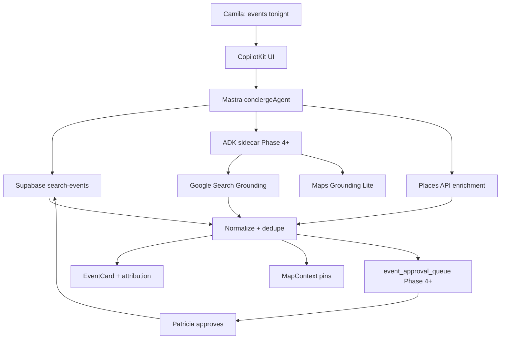

# EVP-017-mvp — Event web discovery architecture & phase placement

## Purpose

Turn [`F-39-prompt-search.md`](./docs/F-39-prompt-search.md) into an **approved architecture doc** and ordered build sequence — without implementing code.

**Core rule (non-negotiable):**

> Supabase owns truth. Web search **discovers**; human approval **writes**.

## User story

As **Sofía**, I need a phased plan so we don't bolt Google Search Grounding onto MVP and violate source-of-truth rules.

## Recommended build order (from source doc)

| Phase | Layer | Ship when |
|------:|-------|-----------|
| 1 | Supabase `search-events` + cards + pins | ✅ MVP (EVP-005-core, SCREEN-006) |
| 2 | Places venue enrichment on event rows | MAP + EVP-007-core |
| 3 | EVP-006-core clarify gate + category chips | W6 polish |
| 4 | Google Search Grounding via ADK | EVP-018-mvp EVP-023-mvp–D06 |
| 5 | Contest discovery + dedupe tables | EVP-018-mvp EVP-020-mvp–D03 |
| 6 | OpenClaw verification/outreach | EVP-018-mvp EVP-031-advanced (gated) |

## Architecture diagram (deliver in `plan/events/event-grounding-architecture.md`)

## Stack table (verified against CLAUDE.md)

| Layer | Role | Phase 1 |
|-------|------|---------|
| CopilotKit 1.55.2 | Chat UI, cards, HITL | ✅ |
| Mastra | Router + workflows | ✅ |
| Supabase | Source of truth | ✅ |
| Gemini 3.5 Flash | Agent model | ✅ |
| Google Search Grounding | Fresh web discovery | ❌ post-MVP |
| Maps Grounding Lite | Venue facts | partial |
| Places API New | place_id, photos | partial |
| ADK :8000 | Google tool orchestration | dev only |
| OpenClaw | Automation | ❌ never MVP |
| Stripe | Tickets only | ✅ |

## Acceptance criteria

- [ ] `plan/events/event-grounding-architecture.md` exists with diagram + phase table
- [ ] Explicit "MVP vs post-MVP" boundary documented
- [ ] Links to official docs (Gemini grounding, ADK, CopilotKit Mastra integration)
- [ ] EVP-018-mvp task pack referenced as implementation backlog
- [ ] No code changes in mdeapp/src

## Evidence

- [ ] `tasks/notes/EVP-017-mvp-evidence.md` — doc path + PRD cross-link

## Do not do

- No implementation
- No OpenClaw wiring
- No new tables without EVP-018-mvp EVP-020-mvp spec
