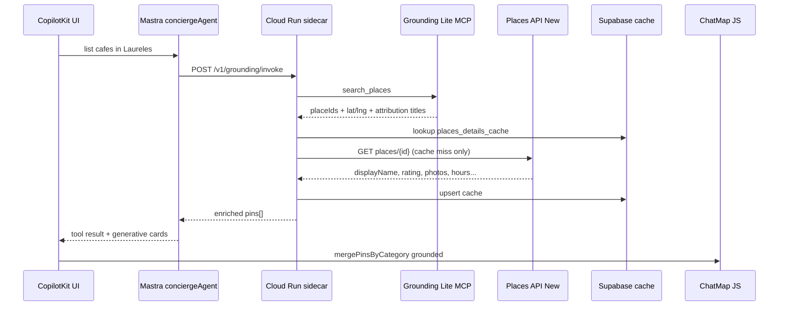

# MAP-018 — Mindtrip-style grounded place cards

**Design target:** Camila asks *"list cafés in Laureles"* → chat shows **photo + title + rating + short blurb + price/open labels + Maps link**; map shows **blue grounded pins** as the active category (rental history stays in chat, not dominating the map panel).

**Architecture invariant:** Grounding Lite MCP **discovers**; Places API (New) **enriches**; CopilotKit/Mastra **render**; browser Maps JS **only displays pins** (no Places server key).

---

## Executive audit (answers 1–10)

### 1. Are we using Places API New today? Where exactly?

| Location | Usage | Prod runtime? |
|----------|--------|---------------|
| `mdeapp/scripts/verify-maps-env.mjs` | `POST places.googleapis.com/v1/places:searchText` probe + `X-Goog-FieldMask: places.id,places.displayName` | **No** — env gate only |
| `mdeapp/src/mastra/tools/search-restaurants.ts` | Supabase inventory; `placeId`/`mapsUrl` nullable until MASTRA-048 enrich script | **No** live Places calls |
| Product chat/runtime | **None** | ❌ |

**GCP:** [Places API (New)](https://console.cloud.google.com/apis/library/places.googleapis.com?project=dev-inscriber-445714-k0) enabled — ready for MAP-004/018.

### 2. What do we use today?

| Layer | Product | Key | Role |
|-------|---------|-----|------|
| **Discovery** | Grounding Lite MCP `search_places` | `GOOGLE_MAPS_SERVER_API_KEY` on Cloud Run | Agent-driven café/POI search ([`grounding_mcp.py`](../../../services/adk-grounding/grounding_mcp.py)) |
| **Sidecar** | FastAPI ADK (`/v1/grounding/invoke`) | Bearer + secrets | Bridge Mastra ↔ MCP |
| **Chat runtime** | Mastra `search-grounded-places` | `ADK_GROUNDING_URL`, `ADK_INTERNAL_TOKEN` | Tool + quota |
| **Map display** | Maps JavaScript API + `@vis.gl/react-google-maps` | `NEXT_PUBLIC_GOOGLE_MAPS_API_KEY` + `mapId` | `AdvancedMarker` only — **no** Places JS library |
| **Places New REST** | Not in prod path | `GOOGLE_PLACES_API_KEY` / server key (probe) | Future enrichment |

### 3. What should remain Grounding Lite discovery?

Keep MCP for:

- Natural-language queries (*"quiet cafés near Laureles"*, *"coworking with wifi"*)
- Agent tool `search-grounded-places` (concierge routing already prefers this over `search-restaurants` for cafés)
- Lat/lng + `placeId` + `googleMapsLinks.placeUrl` candidates
- Gemini Maps fallback in sidecar when MCP 403

**Do not replace** with Places Text Search as the primary discovery path — different billing model, less aligned with agent grounding, duplicates MCP.

### 4. What should be upgraded with Places API New enrichment?

After MCP returns `placeId` (ChIJ…):

| Field gap today | Places New source |
|-----------------|-------------------|
| Thumbnail photo | Place Details → `photos[]` → [Place Photos (New)](https://developers.google.com/maps/documentation/places/web-service/place-photos) via **server proxy** |
| Rating + count | `rating`, `userRatingCount` |
| Address line | `formattedAddress` |
| Price tier | `priceLevel` |
| Open now | `currentOpeningHours.openNow` |
| Category chips | `types` / primary type |
| Summary blurb | `editorialSummary` → fallback Gemini one-liner (Colombia: `generativeSummary` often empty per mde-maps) |
| Canonical Maps URL | `googleMapsLinks.placeUri` (prefer over hand-built MCP URLs) |

### 5. Mindtrip-style card — minimum Places New fields

Per [Place Details data fields](https://developers.google.com/maps/documentation/places/web-service/data-fields):

**Place Details GET** field mask (top-level, no `places.` prefix):

```
id,displayName,formattedAddress,googleMapsLinks,location,rating,userRatingCount,priceLevel,currentOpeningHours,photos,types,editorialSummary
```

Optional Phase 2: `reviews` (1 snippet), `primaryTypeDisplayName`, `accessibilityOptions`.

**Photo display:** never put API key in `` — use `/api/places/photo?ref=…` edge route (MAP-018D).

### 6. Where should enrichment run?

| Option | Verdict |
|--------|---------|
| **Cloud Run sidecar** (batch Details after MCP) | ✅ **Preferred MVP** — key already there; one round-trip Mastra→ADK; keeps Vercel function lean |
| Mastra on Vercel (direct REST) | ✅ OK if sidecar deploy lag; duplicate key on Vercel |
| Browser `Place.fetchFields()` | ❌ Exposes usage to client key; N+1 calls; breaks server-key rule for photos |
| Places UI Kit web components | ❌ Experimental; fights CopilotKit generative UI; not Phase 1 |

**Recommendation:** **MAP-018B in Cloud Run** first; Mastra tool unchanged HTTP contract, richer JSON in `pins[]`.

### 7. Places JS `Place` class vs REST web service?

| | REST (New) | JS `Place` class |
|---|------------|------------------|
| Server enrichment | ✅ Native fit | ❌ Browser only |
| Field mask | `X-Goog-FieldMask` header | `fetchFields({ fields: [...] })` |
| Photos | Server Place Photos API | Client library — key exposure risk |
| CopilotKit cards | Server returns JSON → React | Would require client orchestration |

**Use REST** for enrichment ([overview](https://developers.google.com/maps/documentation/places/web-service/op-overview)). **Use Maps JS** only for map + markers ([place JS overview](https://developers.google.com/maps/documentation/javascript/place) is reference, not runtime for cards).

**Do not use** legacy Places API or `PlacesService`.

### 8. Cost / security risks

| Risk | Mitigation |
|------|------------|
| Details × 5 pins every chat turn | Cache by `place_id` (MAP-018E / MAP-005); TTL 7–14d for details |
| Photo media fetches | Proxy + cache; max 1 photo/pin in MVP |
| Over-broad field masks | Registry in MAP-004; CI asserts mask on every client method |
| Server key in browser | Never `NEXT_PUBLIC_*` for Places; photo route server-only |
| `generativeSummary` SKU | Skip in MVP; use `editorialSummary` + Gemini fallback |
| Quota bypass | Keep `grounding_quota_log`; add `places_enrichment_log` counter |
| Sidecar auth | Keep Bearer on `/v1/grounding/invoke` |

**Billing sketch (5 cafés/query):** 1× MCP search + up to 5× Place Details (+ up to 5× Photo if not cached) — cache cuts repeat sessions sharply.

### 9. Field masks (canonical)

**Text Search** (env probe / future fallback only):

```
X-Goog-FieldMask: places.id,places.displayName,places.location
```

**Place Details** (enrichment — one GET per uncached `places/{id}`):

```
X-Goog-FieldMask: id,displayName,formattedAddress,googleMapsUri,location,rating,userRatingCount,priceLevel,currentOpeningHours,photos,types,editorialSummary
```

**Place Photos** (media fetch):

```
GET /v1/places/{photo_reference}/media?maxWidthPx=400
```

**Never request:** `reviews` (all), `photos` unlimited, `liveMusic`, broad `*` masks.

### 10. What to cache in Supabase?

MVP table `places_details_cache` (MAP-018E; full proxy in MAP-005):

| Column | Notes |
|--------|--------|
| `place_id` PK | ChIJ… |
| `payload_json` | Masked Details response |
| `photo_ref_primary` | First photo resource name |
| `fetched_at` | TTL enforcement |
| `field_mask_version` | Invalidate on schema bump |
| `google_maps_uri` | Denormalized `googleMapsLinks.placeUri` |

Optional: `places_search_cache` (MAP-005) for Text Search — **not needed** if discovery stays MCP-only.

RLS: service-role write; anon read **denied** (server reads via Mastra/sidecar only).

---

## Current code snapshot (2026-05-25)

| Component | State |
|-----------|--------|
| `services/adk-grounding/grounding_mcp.py` | MCP discovery; `_place_title()` from attribution ✅ (rev 00004) |
| `search-grounded-places.ts` | Thin schema: title, lat/lng, placeId, mapsUrl |
| `place-result-card.tsx` | Text + Maps link only — no image/rating |
| `search-tool-renders.tsx` | `groundedRender` + `ToolPinsSync` |
| `active-map-category.ts` | Map panel focuses latest category ✅ |
| `verify-maps-env.mjs` | Places New probe only |

---

## Target data flow



---

## Task breakdown (rollout order)

> **Executable specs:** [`MAP-004`](./MAP-004-places-grounding-clients.md) (= **018A**), [`MAP-018B`](./MAP-018B-sidecar-places-enrichment.md) … [`MAP-018F`](./MAP-018F-grounded-place-card-ui.md).  
> **Do not create MAP-018A.md** — 018A is MAP-004 scoped to Details + masks.

### MAP-018A — Places New client + field-mask registry → **execute MAP-004**

| | |
|---|---|
| **Goal** | Server-only `google-places-client.ts` with `getPlaceDetails(placeId, mask)` |
| **Files** | `mdeapp/src/mastra/lib/google-places-client.ts`, `.test.ts`, `mdeapp/src/mastra/lib/places-field-masks.ts` |
| **Fields** | Details mask §9 above |
| **Env** | `GOOGLE_PLACES_API_KEY` or `GOOGLE_MAPS_SERVER_API_KEY` (server, IP-restricted) on Cloud Run + Vercel |
| **Security** | Vitest asserts `X-Goog-FieldMask` on every method; no `NEXT_PUBLIC_*` |
| **Tests** | Vitest: mask header, parse Details JSON, Colombia empty `editorialSummary` fallback |
| **Success** | `getPlaceDetails('ChIJ…')` returns rating + photo ref in unit test with mocked fetch |
| **Rollback** | Remove client; enrichment step no-ops |
| **Depends** | MAP-004 spec (can merge — 018A **is** MAP-004 scoped to Details-only for MVP) |

### MAP-018B — Sidecar batch enrichment after MCP

See [`MAP-018B-sidecar-places-enrichment.md`](./MAP-018B-sidecar-places-enrichment.md).

### MAP-018C — Mastra tool + Zod schema + normalize-tool-output

See [`MAP-018C-mastra-enriched-grounded-schema.md`](./MAP-018C-mastra-enriched-grounded-schema.md).

### MAP-018D — Photo proxy route (server)

See [`MAP-018D-places-photo-proxy.md`](./MAP-018D-places-photo-proxy.md).

### MAP-018E — Supabase `places_details_cache`

See [`MAP-018E-places-details-cache.md`](./MAP-018E-places-details-cache.md).

### MAP-018F — Rich UI: `GroundedPlaceCard` (Mindtrip-style)

See [`MAP-018F-grounded-place-card-ui.md`](./MAP-018F-grounded-place-card-ui.md).

<!-- Legacy inline tables removed — use linked spec files above -->

---

## Rollout order (recommended)

```
MAP-018A (Places client)
  → MAP-018B (sidecar enrich) + Cloud Run deploy
  → MAP-018C (Mastra schema)
  → MAP-018D (photo proxy) + MAP-018F (UI) — parallel OK
  → MAP-018E (cache) — before prod traffic spike
  → MAP-005 (full edge proxy) — scale path, not MVP blocker
```

**Do not start:** MAP-006 Nearby JS, Places UI Kit embed, browser `Place.fetchFields` in chat loop.

---

## Global rollback plan

1. `PLACES_ENRICHMENT_ENABLED=false` on Cloud Run → MCP-only pins (titles from attribution).
2. Revert Vercel deploy → thin cards + map focus still works (shipped 993c6e6).
3. Cache table safe to leave; ignored when enrichment off.

---

## Success criteria (MAP-018 Done)

| # | Criterion |
|---|-----------|
| 1 | Café query on www: cards show **real name + rating + (photo or styled placeholder)** |
| 2 | **Open in Google Maps** uses `googleMapsLinks.placeUri` from Places when enriched |
| 3 | Map: grounded pins active; rentals dimmed in panel |
| 4 | No `GOOGLE_PLACES_API_KEY` in client bundle or network URLs |
| 5 | Every Details call logged with field mask; cache hit rate visible |
| 6 | `npm run floor` + Playwright grounding spec green |
| 7 | ADK invoke latency p95 < 6s for 5 pins (with cache warm) |

### Post-ship follow-ons (checklist 2026-05-26)

| Track | Spec | Priority |
|-------|------|----------|
| Deep links | [**MAP-019**](./MAP-019-google-maps-link-ctas.md) (+ MAP-004 §12 mask) | P1 |
| Viewport bias | [**MAP-002 § G1**](./MAP-002-grounding-attribution.md) + **F50b** | P1 |
| Fallback ops | [**MAP-002E**](./MAP-002E-gemini-maps-fallback-runbook.md) | P2 |

---

## References

- [Places API (New) overview](https://developers.google.com/maps/documentation/places/web-service/op-overview)
- [Place Details (New) — Web Service](https://developers.google.com/maps/documentation/places/web-service/place-details)
- [Place Details — JS (reference only)](https://developers.google.com/maps/documentation/javascript/place-details)
- [Place class / data fields — JS](https://developers.google.com/maps/documentation/javascript/place-class-data-fields)
- [Places UI Kit (defer)](https://developers.google.com/maps/documentation/javascript/places-ui-kit/overview)
- Internal: [`MAP-004`](./MAP-004-places-grounding-clients.md), [`MAP-005`](./MAP-005-places-proxy-cache.md), [`MAP-015`](./MAP-015-place-card-pin-sync.md), [`tasks/ADK/adk-notes.md`](../ADK/adk-notes.md)
