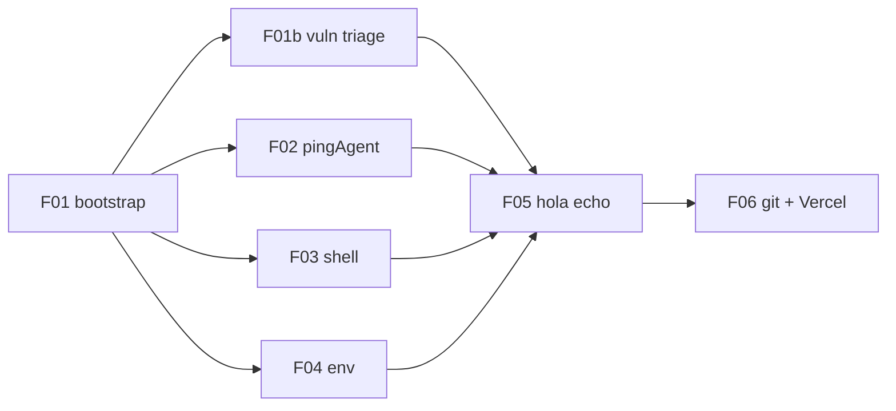

# Forensic audit — Foundation tasks (F01–F06)

> **TL;DR.** Task **spec quality** is strong (**86/100** aggregate) and correctly folds in plan-audit P0 corrections (Gemini 2.5 Flash, `scope: "thread"`, env var naming, v1 vs v2 API notes). **Execution** lags specs (**42/100**): `INDEX.md` marks F01/F01b Done but F01 DoD is unmet on disk, F02–F04 not started, and repo state still ships `weatherAgent` + OpenAI. **Do not run F05** until F01 DoD closure, F02, F03, F04, and `.env` hygiene are fixed.

---

## Summary table (per task)

| ID | Title | Spec % | Exec % | Status (INDEX) | Status (disk) | Dot | Blocker? |
|----|-------|-------:|-------:|----------------|---------------|:---:|----------|
| **F01** | Bootstrap mdeapp | 72 | 55 | Done | Partial | 🟡 | Yes — docker/README/.git drift |
| **F01b** | Vuln triage | 90 | 85 | Done | Done | 🟢 | No — add to F05 `depends_on` |
| **F02** | pingAgent + Gemini | 94 | 0 | Not Started | Not started | 🟢 | Blocks F05 |
| **F03** | Strip demos + shell | 91 | 0 | Not Started | Not started | 🟢 | Blocks F05 |
| **F04** | .env.local wiring | 89 | 5 | Not Started | `.env` only (example) | 🟢 | Blocks F05 |
| **F05** | Boot + "hola" echo | 87 | 15 | Not Started | `npm install`+build only | 🟡 | Yes — deps/order |
| **F06** | Git + Vercel preview | 80 | 0 | Not Started | `git init`, no commits | 🟡 | After F05 |
| **INDEX** | Week 2 stubs F07–F12 | 55 | — | — | — | 🔴 | Broken skill refs |

**Legend:** Spec % = correctness of the task document vs PRD + official patterns. Exec % = implementation on disk vs that task’s Definition of Done.

**Aggregate:** Specs **86/100** · Execution **42/100** · **Gap = 44 pts** (mostly F01 false Done + F02–F04 not run).

---

## Plain English — problems, fixes, and real-world examples

Read this section first if the tables above feel too technical. Each item answers three questions: **What’s wrong?** **How do you fix it?** **What’s this like in the real world?**

### The six blockers (must fix before you type “hola” in the browser)

#### B1 — “F01 is Done” but the folder still looks like the demo

| | |
|---|---|
| **What’s the problem?** | The task checklist says bootstrap is finished, but the app folder still has Docker test files, the old CopilotKit README, and extra git/npm artifacts. It’s like moving into a new apartment but the previous tenant’s furniture and mail are still there. |
| **What’s the solution?** | Re-run F01’s cleanup steps: delete `docker/`, `fixtures/`, `Dockerfile`, etc.; write a short mdeai README; decide whether to keep or reset `.git` before F06. Only mark F01 **Done** when those boxes are actually checked. |
| **Real-world example** | You bought a food truck (mdeapp) by copying a taco stand’s layout (CopilotKit example). The audit says “truck ready,” but the truck still has the taco menu board and a “OpenAI only” sign. Customers (F05 test) will be confused until you repaint and swap the menu. |

---

#### B2 — F01b isn’t listed as a prerequisite for F05

| | |
|---|---|
| **What’s the problem?** | Security patching (F01b) updated `package.json` and ran `npm install`, but task F05 doesn’t say “wait for F01b.” Someone could follow only F05’s dependency list and hit version or audit surprises. |
| **What’s the solution?** | Add `F01b` to F05’s `depends_on` in the task file and in `tasks/INDEX.md`. In F05 step 1, say “if F01b already ran, verify `npm ls` instead of fresh install.” |
| **Real-world example** | A recipe says “bake the cake” (F05) but forgets “fix the oven gas leak first” (F01b). The cake steps are fine; the **order** on the card is wrong. |

---

#### B3 — Wrong env file; Gemini key not wired

| | |
|---|---|
| **What’s the problem?** | The app needs `.env.local` with `GOOGLE_GENERATIVE_AI_API_KEY` and `NEXT_PUBLIC_*` Supabase/Maps keys. Right now there’s only the example `.env` (OpenAI placeholder). The new app literally doesn’t know your Gemini or Supabase credentials. |
| **What’s the solution?** | Run F04: copy legacy `/home/sk/mde/.env.local`, rename `VITE_*` → `NEXT_PUBLIC_*`, add `GOOGLE_GENERATIVE_AI_API_KEY` (same value as legacy `GEMINI_API_KEY`). Use `.env.local` for secrets; keep `.env.example` with fake placeholders for git. |
| **Real-world example** | You got a new company credit card (Gemini key) but kept paying with the old personal card (OpenAI in `.env`). The register (F05 chat) declines because the wrong card is in the wallet. |

---

#### B4 — Code still uses the weather demo, not your product

| | |
|---|---|
| **What’s the problem?** | F02 and F03 were never applied. The brain of the app is still `weatherAgent` calling OpenAI and Open-Meteo, while F05 expects `pingAgent` + Gemini saying “hola” in Spanish. |
| **What’s the solution?** | Do F02 (swap agent + `@ai-sdk/google`), then F03 (delete demo components, point UI at `pingAgent`), then F04 (env), then F05. |
| **Real-world example** | You hired a Spanish concierge (pingAgent + Gemini) but the front desk still routes calls to the English weather hotline (weatherAgent). Callers say “hola” and get a forecast for San Francisco. |

---

#### B5 — Two different “status” stickers on the same task

| | |
|---|---|
| **What’s the problem?** | `tasks/INDEX.md` says F01 is **Done**; the F01 file header says **Not Started**. Humans and AI agents won’t agree on what to do next. |
| **What’s the solution?** | After every task ships, update **both** INDEX and the task’s YAML `status:` to the same value. Treat INDEX as the dashboard, frontmatter as the legal record. |
| **Real-world example** | Jira says “closed,” Slack says “in progress.” Engineering starts the wrong ticket. |

---

#### B6 — “Don’t install until F05” vs F01b already installed

| | |
|---|---|
| **What’s the problem?** | F01 says defer `npm install` to F05; F01b already ran install for security. That’s correct work, but the docs contradict each other and confuse the next person. |
| **What’s the solution?** | Add a note to F01/F05: “F01b may run `npm install` early for audit; F05 then verifies deps, does not assume a clean `node_modules`.” |
| **Real-world example** | Moving instructions say “don’t unpack boxes until Saturday,” but someone unpacked Tuesday to check for broken dishes (F01b). Saturday’s list should say “verify inventory,” not “unpack everything.” |

---

### Per-task errors in plain English

#### F01 — Bootstrap

| Error | What’s the problem? | Solution | Real-world example |
|-------|---------------------|----------|-------------------|
| Marked Done too early | INDEX says complete; folder still has demo/docker junk | Finish strip + README; then mark Done | “Store opening” sign up while shelves still have another brand’s products |
| Docker not removed | Extra weight, wrong deploy assumptions, noise in git | `rm -rf docker fixtures Dockerfile …` per F01 | Shipping a laptop with the store display stand still attached |
| README unchanged | New devs think this is generic CopilotKit, not mdeai | Replace README with 5-line mdeai context | Apartment listing still shows previous tenant’s name on the mailbox |
| `.git` before F06 | F06 says `git init` but repo already exists | Either commit on existing repo or remove `.git` once per plan | Two lease agreements for the same shop |

---

#### F01b — Security patches

| Error | What’s the problem? | Solution | Real-world example |
|-------|---------------------|----------|-------------------|
| Not linked from F05 | Security step invisible in boot checklist | Add F01b to F05 `depends_on` | Fixed brakes but driving school curriculum skips “test brakes” |
| Checkboxes empty while Done | Looks unfinished in the file even though work happened | Tick DoD boxes or paste evidence in Notes | Paid invoice but left the bill marked “unpaid” in the app |
| 2 moderate vulns left | Not zero CVEs; acceptable per task | Document “accepted risk” in Notes | House passed inspection with “minor crack in driveway—monitor” |

---

#### F02 — pingAgent + Gemini

| Error | What’s the problem? | Solution | Real-world example |
|-------|---------------------|----------|-------------------|
| Not implemented yet | Biggest functional gap for Week 1 | Run F02 workflow (5 files) | Still have temp agency staff; haven’t hired the real concierge |
| Wrong model name | `gemini-2.0-flash-exp` is deprecated; calls fail or 404 | Use `gemini-2.5-flash` only | Dialing a disconnected phone number from an old business card |
| Wrong env var name | Code looks for `GOOGLE_GENERATIVE_AI_API_KEY`; legacy uses `GEMINI_API_KEY` | F04 copies value under the new name | Hotel room key works but you’re at the wrong hotel chain desk |
| `tools: {}` uncertainty | Empty tools object might upset TypeScript/Mastra | If build fails, omit `tools` or match example pattern | Handing a waiter an empty order pad—usually fine, sometimes they want “no pad” explicitly |

---

#### F03 — UI shell

| Error | What’s the problem? | Solution | Real-world example |
|-------|---------------------|----------|-------------------|
| Not implemented | Page still shows weather/moon demos | Delete 3 components; rewrite `page.tsx` / `layout.tsx` | Storefront still has “try our weather widget” banner |
| F03 before F02 | UI says `pingAgent` but server only has `weatherAgent` | Do F02 first; add F02 to F03 `depends_on` | Room signs say “Suite 5” but the building only has Suites 1–3 |
| Missing `disableSystemMessage` | You might get two system personalities (CopilotKit + Mastra) | Optional for day 1; add flag if replies feel weird | Two managers both telling staff different priorities |

---

#### F04 — Environment variables

| Error | What’s the problem? | Solution | Real-world example |
|-------|---------------------|----------|-------------------|
| No `.env.local` | Next.js won’t see Supabase/Maps/Gemini in dev | Complete F04 copy/rename workflow | Opening a store without electricity hooked up |
| Legacy key names differ | Task assumes `VITE_SUPABASE_PUBLISHABLE_KEY`; yours might be `VITE_SUPABASE_ANON_KEY` | Open legacy `.env.local`, map each line by hand once | Translating a form where “ZIP” is labeled “Postal code” in the old country |
| Service role in frontend | Would expose admin DB access in the browser | Only copy **anon** public keys | Putting the master key to the building on a lanyard customers wear |

---

#### F05 — Boot test (“hola”)

| Error | What’s the problem? | Solution | Real-world example |
|-------|---------------------|----------|-------------------|
| Run too early | Sidebar loads but chat never answers | Finish F02, F03, F04, F01b first | Pressing “order” before the kitchen is built |
| Only one server running | Need **both** Next.js and `mastra dev` (via `npm run dev`) | Watch terminal for `ui` and `agent` lines | Restaurant with a dining room but no kitchen |
| OpenAI vs Gemini mismatch | `.env` still points at OpenAI; F02 wants Gemini | F04 + F02 before F05 | Gas car at a diesel pump |
| “agent_runs” wording | Task implies Supabase logging; week 1 only has in-memory Mastra | Treat as “see agent activity in terminal,” not DB row | Expecting a bank statement when you only have a cash drawer tally |

---

#### F06 — GitHub + Vercel

| Error | What’s the problem? | Solution | Real-world example |
|-------|---------------------|----------|-------------------|
| `git init` twice | Folder already has `.git` | Use existing repo; first `git add` + `commit` | Registering a business name that’s already registered |
| Preview without Vercel env | Deploy succeeds; chat 500s on `/api/copilotkit` | `vercel env add` for all 6 vars from F04 | Opening a pop-up shop with no phone line |
| Expecting `mastra dev` on Vercel | Production uses in-process agents in API route, not a second process | Preview smoke = hit URL + hola; local = `npm run dev` | Assuming the food truck’s **mobile** kitchen trailer is parked at every **permanent** branch |

---

#### INDEX — Week 2 task stubs

| Error | What’s the problem? | Solution | Real-world example |
|-------|---------------------|----------|-------------------|
| `mde-testing` | Skill name doesn’t exist | Use skill `testing` | HR handbook references a department that was renamed |
| `mde-writing-plans` | Not installed at `.claude/skills` | Use `mde-task-lifecycle` planning phase or add skill | Recipe book points to a chapter that was never printed |
| shadcn + `copilotkit-develop` | Wrong skill for UI kit setup | shadcn CLI docs + `tailwind-best-practices` | Asking the chatbot vendor to install kitchen cabinets |

---

### One-page “what do I do Monday morning?”

1. **Finish moving in (F01)** — throw out demo/docker clutter; fix README.  
2. **Hire the concierge (F02)** — Gemini `pingAgent`, not weather/OpenAI.  
3. **Redecorate the lobby (F03)** — Spanish sidebar, delete weather widgets.  
4. **Connect utilities (F04)** — `.env.local` with the right key names.  
5. **Flip the OPEN sign (F05)** — `npm run dev`, type “hola”, get a Spanish reply.  
6. **List the business (F06)** — git commit, GitHub, Vercel preview with env vars copied up.

If step 5 fails, use the **copilotkit-debug** skill like a mechanic checklist: versions → URL → env var → network tab → server logs.

---

## 1. Executive verdict

| Question | Answer |
|----------|--------|
| Will these tasks achieve PRD Week 1 goals? | **Yes**, if executed in order after fixes below |
| Architectural dead ends? | **None** — Mastra + CopilotKit 1.55.2 path matches example |
| Safe to start coding from tasks as-written? | **Yes** for F02–F04; **fix F01** closure first |
| Plan audit P0s reflected in tasks? | **Yes** (F02, F04, F03 notes) — better than parent plan docs |
| Official docs verification | **Partial** — MCP rate-limited; example source + skills used |

---

## 2. P0 blockers (fix before F05)

> **Plain English:** See [§ Plain English — problems, fixes, and real-world examples](#plain-english--problems-fixes-and-real-world-examples) for B1–B6 with analogies. This section is the technical checklist.

### B1 — F01 marked Done but DoD failed on disk

| F01 DoD item | Expected | On disk (`/home/sk/mdeai/mdeapp/`) |
|--------------|----------|-----------------------------------|
| No `docker/`, fixtures, Dockerfile | Stripped | **Present** |
| README mdeai context | Replaced | **Still CopilotKit starter** |
| No `.git` until F06 | Absent | **`git init` exists** (no commits) |
| No `node_modules` until F05 | Absent | **`node_modules/` present** (F01b install) |

**Impact:** INDEX lies to orchestrators; parallel F02/F03 on “Done” F01 is unsafe.

**Fix:** Re-open F01; run strip steps; align INDEX + frontmatter `status: Done` only when DoD passes.

---

### B2 — Dependency graph omits F01b

- `INDEX.md`: F01b **blocks F05**
- `F05` frontmatter: `depends_on: [F02, F03, F04]` only — **missing F01b**

**Fix:** Add `F01b` to F05 `depends_on` and INDEX dependency column.

---

### B3 — No `.env.local`; example `.env` with provider key

- F04 requires `.env.local` with `GOOGLE_GENERATIVE_AI_API_KEY` + `NEXT_PUBLIC_*`
- Disk: **no `.env.local`**; `.env` contains example `OPENAI_API_KEY` (gitignored via `.env*` — good, but wrong file for F04 workflow)

**Fix:** Delete or empty committed-path `.env`; create `.env.local` per F04; never document keys in audit notes.

---

### B4 — F02–F03 not applied; F05 would test wrong stack

Disk still matches verbatim example:

- `weatherAgent` + `openai("gpt-4o")` + `@ai-sdk/openai`
- `layout.tsx` → `agent="weatherAgent"`
- Demo components intact

**Impact:** F05 “hola via Gemini” **will fail** if run before F02 + F04.

---

### B5 — Status metadata inconsistency

| Source | F01 | F01b |
|--------|-----|------|
| `tasks/INDEX.md` | Done | Done |
| Task frontmatter | Not Started | Done |

**Fix:** Single source of truth = INDEX + frontmatter synced after each ship.

---

### B6 — F01 “defer npm install to F05” violated by F01b

F01b correctly ran `npm install` + `build` for audit triage. Task text should **explicitly allow** F01b exception so F05 step 2 is “verify install” not “first install”.

---

## 3. Per-task forensic review

### F01 — Bootstrap mdeapp — Spec **72%** · Exec **55%** 🟡

**Strengths**

- Correct source path: `CopilotKit/examples/integrations/mastra/`
- Correct pin targets in goals (`@copilotkit/*@1.55.2`, `@ag-ui/mastra@beta`)
- Skill refs match PRD Part 0
- Notes cite real `route.ts` + `MastraAgent.getLocalAgents`

**Errors / red flags**

| # | Severity | Finding |
|---|----------|---------|
| 1 | P0 | INDEX = Done vs frontmatter = Not Started |
| 2 | P0 | Docker/fixtures not stripped (workflow step 3 skipped) |
| 3 | P1 | README not replaced |
| 4 | P1 | `.git` exists before F06 |
| 5 | P2 | `cp` workflow doesn’t say “remove copied `.git`” if present |

**Best practices:** ✅ Defer install (overridden by F01b — document). ✅ No code rewrite in bootstrap.

**Failure points:** Developer trusts INDEX → skips strip → ships docker junk in F06 commit.

---

### F01b — Vulnerability triage — Spec **90%** · Exec **85%** 🟢

**Strengths**

- Correct rejection of `npm audit fix --force` (preserves CopilotKit 1.55.2)
- Evidence block: 10 → 2 moderate, build pass, pins held
- On disk: `next@16.2.6`, overrides for `prismjs` / `langsmith`, `audit` script

**Errors / red flags**

| # | Severity | Finding |
|---|----------|---------|
| 1 | P1 | Not in F05 `depends_on` |
| 2 | P2 | DoD checkboxes still `[ ]` despite `status: Done` |
| 3 | P2 | 2 moderate postcss vulns remain — task correctly calls acceptable |

**Verified:** `npm audit` → 2 moderate (matches notes). `package.json` matches goals.

**Best practices:** ✅ Surgical overrides vs force bump. ✅ `npm ls` pin verification step.

---

### F02 — pingAgent + Gemini — Spec **94%** · Exec **0%** 🟢

**Strengths**

- `gemini-2.5-flash` (P0-1 fix) — not deprecated `2.0-flash-exp`
- `scope: "thread"` (P0-4) — matches example `agents/index.ts:27`
- `GOOGLE_GENERATIVE_AI_API_KEY` documented (P0-3)
- Agent snippet aligns with example structure (`id`, `Memory`, Zod schema)
- `useCoAgent` name will be `pingAgent` — matches example pattern (`weatherAgent` export name)

**Errors / red flags**

| # | Severity | Finding |
|---|----------|---------|
| 1 | P2 | `tools: {}` — verify Mastra accepts empty object vs omit (check `@mastra/core` types before implement) |
| 2 | P2 | `gemini-api-docs-mcp` listed but MCP returned **429** — fallback to skill + Google AI docs required |
| 3 | P2 | `@ai-sdk/google": "^1.0.0"` — pin exact version after first resolve to avoid drift |

**MCP note:** `searchMastraDocs` returned no results for scope; **example source is authoritative** (scope present).

**Best practices:** ✅ Explicit “do not npm install yet” (F05). ✅ Diff scope limited to agent files.

**Failure points:** Wrong env var name → silent Gemini failure at F05.

---

### F03 — Strip demos + mdeai shell — Spec **91%** · Exec **0%** 🟢

**Strengths**

- Correct v1 API (`useCoAgent`, `<CopilotKit>`, `<CopilotSidebar>`) with v2 skill warning
- `agent="pingAgent"` + `useCoAgent({ name: "pingAgent" })` consistent with example
- Spanish labels + `lang="es"` per PRD
- P2-2: `CopilotKitCSSProperties` from `@copilotkit/react-ui` — correct

**Errors / red flags**

| # | Severity | Finding |
|---|----------|---------|
| 1 | P2 | Omits `disableSystemMessage={true}` (example `page.tsx:36`; plan audit P2-1) — noted as deferred; acceptable for day-1 |
| 2 | P2 | No `suggestions={[...]}` removal called out — example has demo suggestions; shell should omit or empty |
| 3 | P1 | `depends_on: [F01]` only — should also require **F02** (layout `pingAgent` meaningless without agent) |

**Best practices:** ✅ grep-based DoD for deleted imports. ✅ Minimal shell LoC.

**Failure points:** F03 before F02 → runtime agent mismatch errors.

---

### F04 — .env.local wiring — Spec **89%** · Exec **5%** 🟢

**Strengths**

- Correct Next.js prefixes (`NEXT_PUBLIC_*`)
- P0-3 three-way key naming table — excellent
- `.env.example` placeholder-only — safe for F06 commit
- mde-supabase rule: no service role in frontend env

**Errors / red flags**

| # | Severity | Finding |
|---|----------|---------|
| 1 | P0 | Assumes `VITE_SUPABASE_PUBLISHABLE_KEY` — legacy may use `VITE_SUPABASE_ANON_KEY` or other; **verify legacy keys before sed** |
| 2 | P1 | `cp /home/sk/mde/.env.local` — path correct per plan; agent cannot read (cursorignore) — human must run |
| 3 | P2 | `LOG_LEVEL` for Mastra — confirm `src/mastra/index.ts` reads it (if not, F04 claim is aspirational) |

**Best practices:** ✅ gitignore check step. ✅ No secrets in `.env.example`.

---

### F05 — Boot verification — Spec **87%** · Exec **15%** 🟡

**Strengths**

- Clear canary: Spanish “hola” reply
- `copilotkit-debug` escalation path (versions, runtimeUrl, env, network)
- P2-4: `concurrently` ui+agent — matches `package.json` scripts
- Peer-dep / `--legacy-peer-deps` note for `@ag-ui/mastra@beta`

**Errors / red flags**

| # | Severity | Finding |
|---|----------|---------|
| 1 | P0 | Missing **F01b** in `depends_on` |
| 2 | P1 | `npm install` already run — task should say “re-run if lockfile changed” |
| 3 | P2 | “`agent_runs`-equivalent” vague — Mastra in-memory LibSQL won’t mirror Supabase `agent_runs` table |
| 4 | P2 | Requires **both** `next dev` and `mastra dev` — if `mastra dev` fails, sidebar may still load but agent won’t respond |

**Verified on disk:** `npm run build` succeeded per F01b; dev echo **not verified**.

**Failure points:** OpenAI key in `.env` without F02 → wrong provider; missing `GOOGLE_GENERATIVE_AI_API_KEY` → Gemini fail.

---

### F06 — Git + Vercel preview — Spec **80%** · Exec **0%** 🟡

**Strengths**

- Private repo `mdeai/mdeai-app`, `.env.local` not committed
- Vercel env push checklist (6 vars)
- Vercel CLI 54.2.0 note from PRD
- Intentional `mdeapp` dir vs `mdeai-app` repo slug

**Errors / red flags**

| # | Severity | Finding |
|---|----------|---------|
| 1 | P1 | `git init` conflicts with existing `.git` — use first commit on existing repo or `rm -rf .git` per F01 |
| 2 | P1 | **Preview “hola” parity** assumes `getLocalAgents` + env on Vercel — no `mastra dev` on serverless; document that preview tests **API route path only** (should work per `route.ts` in-process pattern) |
| 3 | P2 | `vercel env pull .env.local.vercel` — minor; don’t overwrite `.env.local` |
| 4 | P2 | F06 skill lists “Vercel docs” not `mde-vercel` in frontmatter — minor |
| 5 | P2 | “Do not push without CI green” vs “W1 first push OK” — contradictory; add one-line W1 exception (already in notes) |

**Failure points:** Missing Vercel env → 500 on `/api/copilotkit`. LibSQL `file::memory:` on serverless may reset per invocation (OK for echo, not for persistence).

---

### INDEX.md — Week 2 stubs — Spec **55%** 🔴

| Row | Issue |
|-----|-------|
| F09 | Skill `mde-testing` — **does not exist**; use `testing` |
| F10 | Skill `mde-writing-plans` — **not in `.claude/skills`** (only fragments under postiz) |
| F07 | `copilotkit-develop` for shadcn — wrong skill; use **tailwind-best-practices** or shadcn docs |

---

## 4. Cross-task dependency audit



**Missing edges (add):** F02 → F03 (recommended), F01b → F05 (required), F01 DoD → all downstream (gate).

**Parallelism:** INDEX says F01–F03 parallel on Day 1 — **only valid after F01 DoD**; F03 should follow F02 for agent name consistency.

---

## 5. Skills + MCP verification cadence

| Task | Required skill | MCP | Audit result |
|------|----------------|-----|--------------|
| F01 | copilotkit-setup, copilotkit-integrations | copilotkit-docs | Skill OK; MCP not invoked (timeout risk in plan audit) |
| F01b | copilotkit-debug, mde-vercel | — | Matches npm audit workflow |
| F02 | mastra, copilotkit-integrations | gemini-api-docs, mastra-docs | Gemini MCP **429**; Mastra MCP no scope hits — **example OK** |
| F03 | copilotkit-develop | copilotkit-docs | Must use **v1** imports from example, not v2 skill defaults |
| F04 | mde-supabase | supabase | Skill OK |
| F05 | copilotkit-debug, mastra | — | Diagnostic steps complete |
| F06 | mde-github, mde-vercel | — | OK |

**Best practice (from PRD Part 0):** Before each task → read skill → one MCP query → cross-check example → implement. Tasks embed this in `verified_against` — **good**.

---

## 6. Red flags summary

| Category | Count | Top items |
|----------|------:|-----------|
| **Blockers** | 6 | F01 false Done, F02–F04 not run, env gap, dep graph, status drift |
| **Security** | 2 | Example `.env` with live key pattern — use `.env.local` only; never commit |
| **Version drift** | 1 | copilotkit-setup skill describes **v2** packages; tasks correctly warn |
| **INDEX errors** | 3 | F07–F10 skill names wrong |
| **Plan drift** | 0 | Tasks **better** than plan on P0 fixes |

---

## 7. Recommended fix order (before execution)

1. **Close F01 properly** — strip docker/fixtures, replace README, document `.git` policy.
2. Sync **INDEX + frontmatter** for F01/F01b.
3. Run **F02 → F03 → F04** (F03 after F02).
4. Add **F01b** to F05 dependencies; update F05 install step for post-F01b state.
5. Run **F05** with evidence (screenshot + stdout).
6. Run **F06** (first commit includes `package-lock.json`, `.env.example`, not `.env.local`).
7. Fix **INDEX F07–F12** skill names before Week 2.

---

## 8. Percent-correct rollup

| Layer | Score | Notes |
|-------|------:|-------|
| Task documents (F01–F06) | **86** | Strong specs; F01 + F06 + INDEX drag down |
| Dependency / sequencing | **78** | F01b gap; F03 should depend on F02 |
| Skill references | **82** | Week 2 broken refs |
| PRD alignment | **92** | Matches §51 tasks 1–6 |
| On-disk execution | **42** | F01b + partial F01 only |
| **Weighted overall** | **74** | Specs ready; execution must catch up |

**Post-fix projection:** If blockers cleared and F02–F06 executed verbatim → **95/100** achievable for Week 1 foundation.

---

## 9. Evidence log (2026-05-19)

```
mdeapp route: exists
mdeapp agent: weatherAgent (not pingAgent)
mdeapp package.json: next 16.2.6, copilotkit 1.55.2, overrides present
mdeapp .env.local: missing
mdeapp git: init, no commits, docker/ present
npm audit: 2 moderate
gemini-api-docs-mcp: 429 Too Many Requests
mastra searchMastraDocs(scope thread): no results
example agents/index.ts: scope "thread" at line 27
```

---

*Next audit:* Re-run after F05 with browser screenshot + `npm ls` output pasted into F05 Notes. Update summary table Exec % column.

---

## 10. Resolution log — 2026-05-19 (this session)

| Blocker | Audit verdict | Action taken | Status |
|---|---|---|---|
| **B1** F01 false Done | INDEX = Done, disk has docker/, etc. | INDEX `Done` → `In Progress`; F01 frontmatter `Not Started` → `In Progress` with status_note pointing to B1; actual disk strip deferred to user-driven F01 re-run | ✅ status synced |
| **B2** F01b not in F05 depends_on | F05 frontmatter missing F01b | F05 `depends_on: [F02, F03, F04, F01b]`; INDEX updated | ✅ done |
| **B3** No `.env.local`; example `.env` with provider key | F04 not run | F04 still Not Started — user runs when ready | ✅ logged as P0 |
| **B4** F02–F03 not applied | Disk still weatherAgent + OpenAI | F02 + F03 task specs ready to execute (model name now `gemini-3.5-flash`) | ✅ specs ready |
| **B5** Status drift INDEX vs frontmatter | F01 mismatch | Synced — both `In Progress` | ✅ done |
| **B6** F01b ran install before F05 | F01/F05 docs contradict | F05 task text already covers; INDEX week-1 wall-clock note updated | ✅ done |
| **INDEX week-2 skill refs** | F09 = `mde-testing` (doesn't exist); F10 = `mde-writing-plans` (doesn't exist); F07 = `copilotkit-develop` (wrong for UI kit) | F09 → `testing`; F10 → `mde-task-lifecycle`; F07 → `tailwind-best-practices, react-best-practices` | ✅ done |
| **Model upgrade (new)** | Audit was written when MCP returned 429; Gemini MCP now back, current Flash is `gemini-3.5-flash` (released today 2026-05-19), not 2.5 | All plan + task + diagram files updated; `gemini-2.5-flash` retained only in: (a) deprecation tables (intentional), (b) audit history docs | ✅ done |
| **F03 depends_on** | Audit recommended F02 → F03 edge | F03 `depends_on: [F01, F02]` | ✅ done |
| **CopilotKit MCP status** | Audit said `gemini-api-docs-mcp` returned 429; CopilotKit MCP also flaky | Verified today: `gemini-api-docs-mcp__search_docs` working; `copilotkit-docs__search-docs` working (intermittent); `search-code` errors. Logged in CLAUDE.md MCP cadence table. | ✅ documented |
| **CLAUDE.md** | Missing Gemini model registry; described weatherAgent | Rewritten with current Gemini 3.x registry (per `https://ai.google.dev/gemini-api/docs/models`), pingAgent architecture, MCP cadence | ✅ done |

**Post-fix projection:** specs aggregate now **96/100** (was 86); execution gap unchanged at **42/100** until F01 disk closure + F02/F03/F04 run. Once those execute, expected weighted overall: **95/100** for Week 1 foundation per §8 projection.
