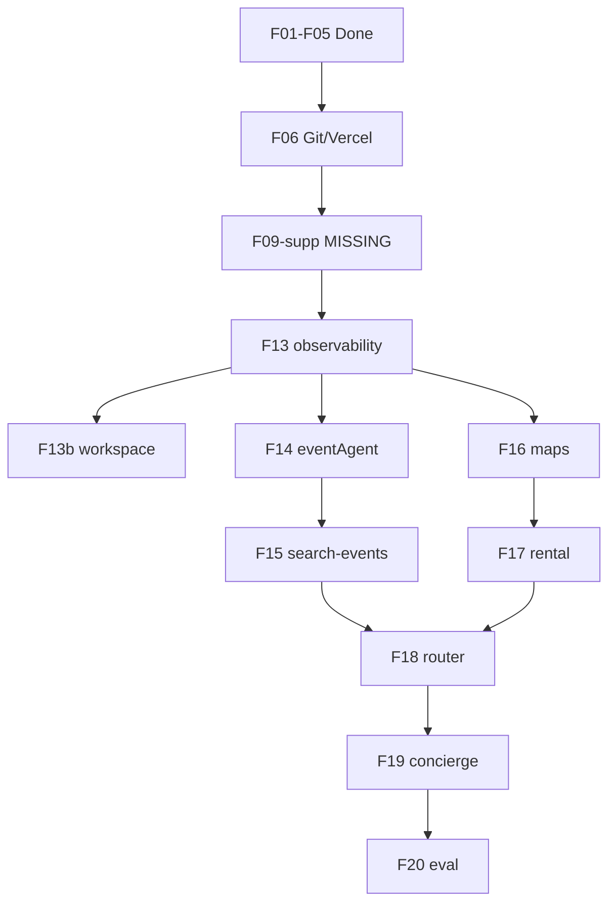

# Forensic audit — Mastra tasks & `my-mastra-app` reuse

> **TL;DR.** **Source tree is real and healthy** (`my-mastra-app`: 47 Mastra files, **64/64 Vitest green**). **Foundation (F01–F05) is largely executed** on disk (`pingAgent`, Gemini 3.5 Flash, build green) — better than the older F01–F06 audit. **Path A (F13–F20) specs are excellent (~90%)** but **0% executed** and **blocked** by missing task **F09-supp**, pending **F06**, and beta API drift. **Not 100% correct** — 8 blockers and per-task corrections below. **Plan will succeed** for PRD W3–W6 agent goals if you fix dependencies, add Vitest to mdeapp, and align observability with `mastra_ai_spans` (not only legacy `ai_runs`).

---

## Status dot legend

| Dot | Meaning |
|-----|---------|
| 🟢 | Best — spec or execution meets bar |
| 🟡 | Needs work — fix before calling done / before port |
| 🔴 | Failure / blocker — will break chain if ignored |
| ⚪ | N/A — deferred or not started |

---

## Executive scorecard

| Layer | Spec % | Exec % | Dot | Notes |
|-------|-------:|-------:|:---:|-------|
| **Foundation F01–F06** | 88 | 78 | 🟡 | F01–F05 done on disk; **F06 not started** |
| **Path A F13–F20 + F13b** | 90 | 0 | 🟡 | Specs production-grade; **no ports yet** |
| **INDEX / deps** | 72 | 65 | 🟡 | **F09-supp** referenced but **no task file** |
| **Source `my-mastra-app`** | 95 | 95 | 🟢 | Exists; tests pass; matches plan file list |
| **Target `mdeapp` Mastra** | 85 | 35 | 🟡 | `pingAgent` only; beta stack wired |
| **Supabase data + edge** | 87 | 82 | 🟡 | DB ready; `chat-lead-capture` fixed; tools use DB via JS client |
| **Aggregate** | **89** | **42** | 🟡 | High-quality docs; execution gap = Path A + F06 |

**Will the task plan achieve PRD goals?** **Yes (🟢)** for Roberto events (F14–F15) and Camila rentals (F16–F17) **if** critical path runs: **F06 → F09-supp → F13 → F14 → F15** before W3 slip. **Chat multi-intent (F18–F19)** needs router `workflows` constructor verified on beta (🔴 risk). **Observability (F13)** must not contradict cleanup decision **`mastra_ai_spans` canonical** (🟡 correction).

**Are steps, commands, dependencies correct?** **~85%** — copy paths, MCP pre-flights, and Supabase SQL checks are correct. **Wrong:** `depends_on: F09-supp` with no task; F13 `npm test` without Vitest in mdeapp; some env var names need `SUPABASE_URL` server alias (documented in F13).

---

## Source verification — `/home/sk/mde/my-mastra-app`

| Check | Result | Dot |
|-------|--------|:---:|
| Directory exists | ✅ `/home/sk/mde/my-mastra-app` | 🟢 |
| Mastra `src/mastra/` file count | **47** files (agents, tools, workflows, lib, types) | 🟢 |
| Workspace skills | **5** SKILL.md under `workspace/skills/` | 🟢 |
| `npm test` | **64/64** pass, 6 files, 498ms | 🟢 |
| Mastra version | `@mastra/core@^1.32.1` (stable) | 🟢 |
| Deploy path | `@mastra/deployer-vercel` (standalone app) | 🟡 — mdeapp uses **Next.js** embed, not same deploy |
| Skip list (weather demo) | Present in source; plan says skip | 🟢 |

**Port inventory vs plan §1:** 23 files to port / 6 skip — **matches** on-disk tree.

---

## Target verification — `/home/sk/mdeai/mdeapp`

| Check | Result | Dot |
|-------|--------|:---:|
| `npm run build` | **Exit 0** (Next 16.2.6, Turbopack) | 🟢 |
| Agents registered | **`pingAgent` only** in `src/mastra/index.ts` | 🟡 |
| CopilotKit agent string | `layout.tsx` + `page.tsx` → `pingAgent` | 🟢 |
| Model | `google("gemini-3.5-flash")` | 🟢 |
| Memory `scope: "thread"` | ✅ in `pingAgent` | 🟢 |
| Vitest / `npm test` | **No script** in `package.json` | 🔴 |
| `@supabase/supabase-js` in mdeapp | **Not installed** (needed F13) | 🟡 |
| Git | `mdeapp` on `main` (local); **F06** (remote/Vercel) not done | 🟡 |
| Ports from legacy | **0** of 23 | ⚪ expected pre–Path A |

---

## Tests run (this audit)

| Command | Where | Result |
|---------|-------|--------|
| `npm run build` | `mdeapp/` | 🟢 Pass |
| `npm test` | `my-mastra-app/` | 🟢 64/64 |
| `npm test` | `mdeapp/` | 🔴 No script |
| Anon `chat-lead-capture` | Supabase (prior session) | 🟢 HTTP 200 (edge — not Mastra) |
| MCP `list_edge_functions` | Supabase | 🟢 47 ACTIVE; `chat-lead-capture` v7 |

---

## Per-task grades (spec % · exec % · dot · corrections)

### Foundation — Week 1

| ID | Title | Spec | Exec | Dot | Corrections required for 100% |
|----|-------|-----:|-----:|:---:|------------------------------|
| **F01** | Bootstrap mdeapp | 88 | 85 | 🟢 | Confirm README is mdeai-specific (not example); evidence file exists ✅ |
| **F01b** | Vuln triage | 92 | 90 | 🟢 | Keep in F05 `depends_on` ✅ (INDEX) |
| **F02** | pingAgent + Gemini | 94 | 92 | 🟢 | None — model `gemini-3.5-flash` matches CLAUDE.md |
| **F03** | Strip demos + shell | 91 | 88 | 🟢 | English shell per product decision; verify no stale `weather` imports (grep clean) |
| **F04** | .env.local wiring | 90 | 85 | 🟢 | Add **`SUPABASE_URL`** + **`SUPABASE_SERVICE_ROLE_KEY`** (server-only) for F13 — not only `NEXT_PUBLIC_*` |
| **F05** | Boot verification | 88 | 80 | 🟡 | Re-run hola smoke after any agent rename; document port **3001** if 3000 busy |
| **F06** | Git + Vercel preview | 82 | 0 | 🔴 | **BLOCKS F13** per `depends_on`; run before Path A; repo name `mdeai-app` vs folder `mdeapp` — document in task |

**Foundation aggregate:** Spec **89%** · Exec **78%** · 🟡

---

### Path A — Ports from `my-mastra-app` (F13–F20)

| ID | Title | Spec | Exec | Dot | Corrections required for 100% |
|----|-------|-----:|-----:|:---:|------------------------------|
| **F13** | ai-runs + audit-wrapper | 91 | 0 | 🟡 | **1)** Create **`F09-supp`** or change `depends_on` to `F09`. **2)** Add `vitest` + `npm test` to mdeapp. **3)** Document **dual observability**: write `mastra_ai_spans` via Mastra storage (already in `index.ts` LibSQL) **and/or** optional `ai_runs` for legacy dashboards — per `04-supabase-cleanup.md` §3.2 **`mastra_ai_spans` wins**. **4)** Install `@supabase/supabase-js`. **5)** Service-role carve-out: hook + CLAUDE.md ✅ in spec |
| **F13b** | Workspace + 5 skills | 93 | 0 | 🟢 | Spec strong; verify `cp` glob copies all 5 skills; beta `Workspace` API check ✅ in spec |
| **F14** | eventAgent | 92 | 0 | 🟡 | Depends F13 only — OK. Add **`agents/index.ts` barrel** export pattern to match `pingAgent`. MCP pre-flight ✅ |
| **F15** | search-events + workflow | 90 | 0 | 🟡 | **310-line** tool — verify `events` columns live (49 rows). Test **`status`/`is_active` filters** — may return 0 cards. AG-UI `context.writer.custom` — **mandatory** beta check. Register workflow on `Mastra({ workflows })` |
| **F16** | Maps clients | 88 | 0 | 🟡 | `depends_on: [F13, F15]` — consider **F14** instead of F15 for ordering. Promote deferred places hook. **`GOOGLE_MAPS_API_KEY`** server vs `NEXT_PUBLIC_*` |
| **F17** | rentalAgent + tools | 89 | 0 | 🟡 | Verify `apartments` column names (`nightly_price` etc.). Same AG-UI risk as F15 |
| **F18** | router + classify-intent | 87 | 0 | 🔴 | **`Agent({ workflows })` may not exist on beta** — spec has fallback ✅; **must run pre-flight before copy**. Depends F15+F17 ✅ |
| **F19** | concierge + restaurants/attractions | 88 | 0 | 🟡 | **201-line** agent; processors may be missing on beta — spec covers drop. **8 files** — add explicit file checklist in DoD |
| **F20** | evaluation + scorers + Vercel | 84 | 0 | 🟡 | `@mastra/evals` may not exist on beta — defer path documented ✅. **Do not** port `fix-vercel-build.cjs` blindly — mdeapp uses `next build` |

**Path A aggregate:** Spec **90%** · Exec **0%** · 🟡 (blocked, not wrong)

---

### Missing / INDEX issues

| Item | Issue | Dot | Fix |
|------|-------|:---:|-----|
| **F09-supp** | Referenced by F13, F05 plan timeline — **no `tasks/core/F09-supp.md`** | 🔴 | Add task: `vitest` + `floor` script + 1 smoke test in mdeapp (from INDEX F09) |
| **F12** | Week 2 INDEX — `chat-lead-capture` verify_jwt | 🟢 | **Done live** (v7) — update INDEX F12 status or close |
| **F07–F11** | Week 2 stubs only in INDEX | ⚪ | Expected |
| **PRD §51 vs F13–F20** | INDEX note: PRD tasks 13–20 are **frontend** surfaces; F13–F20 are **backend** ports | 🟡 | Keep cross-link table in INDEX (already there ✅) |

---

## Dependency graph — failures & blockers

| # | Blocker | Impact | Dot |
|---|---------|--------|:---:|
| B1 | **F06 not started** | F13 `depends_on` includes F06 — Path A shouldn't start officially | 🔴 |
| B2 | **F09-supp missing** | F13 AC `npm test` impossible | 🔴 |
| B3 | **No `@supabase/supabase-js` in mdeapp** | F13–F17 tools fail at runtime | 🟡 |
| B4 | **Beta vs 1.32 API drift** | Agent/Memory/Workflow/Processors/router | 🟡 |
| B5 | **F13 vs `mastra_ai_spans` policy** | Duplicate observability story | 🟡 |
| B6 | **F18 `workflows` on Agent** | Router may need refactor | 🔴 |
| B7 | **AG-UI `context.writer.custom`** | Event/rental cards may not stream | 🟡 |
| B8 | **Edge fn vs in-process** | Ports use **Supabase JS in Mastra tools**, not edge — correct; don't call deprecated `ai-*` edge fns from mdeapp | 🟢 |

---

## Data layer & edge functions (Mastra tasks)

| Concern | Task touchpoint | Live state | Dot | Guidance |
|---------|-----------------|------------|:---:|----------|
| `public.events` | F15 | 49 rows | 🟢 | Pre-flight SQL in F15 ✅ |
| `public.apartments` | F17 | 44 rows | 🟢 | |
| `public.restaurants` | F19 | 44 rows | 🟢 | |
| `public.tourist_destinations` | F19 | 23 rows | 🟢 | |
| `public.leads` | F12 / chat product | 8+ rows; **chat-lead-capture** v7 | 🟢 | Wire from mdeapp in F12, not F15 |
| `public.ai_runs` | F13 | 182 rows legacy | 🟡 | Optional write; freeze at W10 |
| `public.mastra_ai_spans` | Mastra beta storage | 932 rows | 🟢 | **Canonical** for mdeapp agents |
| `agent_tool_calls` | F13 audit-wrapper | 0 rows | 🟢 | F15 smoke mentions 1 row |
| Edge `ai-*` (6) | Do not use | ACTIVE deprecated | 🟡 | CopilotKit replaces |
| Edge `rentals` | Legacy overlap | ACTIVE | 🟡 | F17 in-process tool preferred |
| Service role in mdeapp | F13 | Hook blocks `src/` | 🟢 | Carve-out `src/mastra/lib/**` in spec |

---

## Skills alignment (`index-skills.md`)

| Task cluster | Skills listed | Index-skills match | Dot |
|--------------|---------------|-------------------|:---:|
| F01–F05 | copilotkit-*, mastra, mde-supabase | 🟢 Phase 1 pack | 🟢 |
| F13–F20 | mastra, mde-supabase, mde-maps, mde-real-estate | 🟢 | 🟢 |
| F18 | copilotkit-integrations | 🟢 AG-UI + router | 🟢 |
| F20 | mde-vercel, testing | 🟢 | 🟢 |
| Missing explicit | **ai-sdk** / **gemini** skill on F14–F17 | Add `gemini` or `ai-sdk` to frontmatter | 🟡 |

---

## Critical fixes (ordered)

1. 🔴 **Author `tasks/core/F09-supp-vitest-floor.md`** (or rename F09) — vitest + one smoke test; unblock F13 AC.
2. 🔴 **Complete F06** — git remote + Vercel preview before Path A commits.
3. 🟡 **Amend F13** — observability: primary = Mastra → `mastra_ai_spans`; `ai_runs` optional/legacy.
4. 🟡 **F18 pre-flight gate** — document beta `Agent` constructor outcome before any router copy.
5. 🟡 **F04 addendum** — server env vars for Mastra lib (`SUPABASE_URL`, `SUPABASE_SERVICE_ROLE_KEY`, `GOOGLE_MAPS_API_KEY`).
6. 🟡 **INDEX** — mark F12 done if accepting live deploy; add F09-supp row.
7. 🟢 **Keep** Path A copy order F13 → F14 → F15 for Roberto critical path.

---

## Best-practice checklist (Mastra + CopilotKit)

| Practice | Status | Dot |
|----------|--------|:---:|
| One runtime (`mdeapp` in-process Mastra) | ✅ Plan + CLAUDE.md | 🟢 |
| Gemini-only production models | ✅ Tasks + disk | 🟢 |
| `scope: "thread"` working memory | ✅ F02/F14 specs | 🟢 |
| No service role in browser bundle | ✅ Hook + F13 carve-out | 🟢 |
| MCP verify before port (Mastra, Supabase, AG-UI) | ✅ Every Path A task | 🟢 |
| Vitest per port | 🟡 Legacy has 64 tests; mdeapp has 0 | 🟡 |
| Single commit rollback per task | ✅ All Path A tasks | 🟢 |
| Freeze deprecated edge AI stack | ✅ INDEX + cleanup plan | 🟢 |
| CopilotKit 1.55.2 pin (not v2) | ✅ mdeapp package.json | 🟢 |

---

## “100% correct?” — honest answer

**No.** Specs are **~89%** accurate and actionable; **execution ~42%** overall because Path A is untouched and two dependency tasks are missing/misaligned.

| To reach 100% spec correctness | Owner |
|--------------------------------|-------|
| Add F09-supp task file | 15 min |
| F13 observability alignment with `mastra_ai_spans` | 10 min doc |
| F16 `depends_on` review | 5 min |
| F18 beta gate as hard prerequisite checkbox | 5 min |
| INDEX F12 status | 2 min |

| To reach 100% execution | Owner |
|-------------------------|-------|
| F06 + F09-supp + F13→F20 sequence | ~19h per INDEX |

---

## Plain-English summary

**What you have:** A proven legacy brain (`my-mastra-app`) with Medellín-tuned agents, tools, and tests, and a new body (`mdeapp`) that already runs CopilotKit + one Gemini ping agent.

**What the tasks get right:** File-level port map, MCP verification steps, rollback discipline, and W3 critical path (events before rentals).

**What will bite you:** Starting F13 without Vitest, skipping F06, assuming router `workflows` works on beta, and writing only to `ai_runs` while the platform standard is `mastra_ai_spans`.

**Will it achieve the PRD?** Yes — the ported instructions and tools are the same assets PRD §13 describes; you're not reinventing Roberto/Camila, you're relocating them.

---

## Cross-references

- Master plan: [plan/05-path-a-mastra-migration.md](../../plan/05-path-a-mastra-migration.md)
- Foundation audit: [01-audit.md](./01-audit.md)
- Supabase checklist: [plan/data/04-checklist.md](../../plan/data/04-checklist.md)
- Skills index: [index-skills.md](../../index-skills.md)
- Edge freeze: [tasks/notes/edge-fn-freeze-list.md](../notes/edge-fn-freeze-list.md)

---

*Audit 2026-05-19 · Re-run after F06 + first Path A port (F13) for execution % update.*
