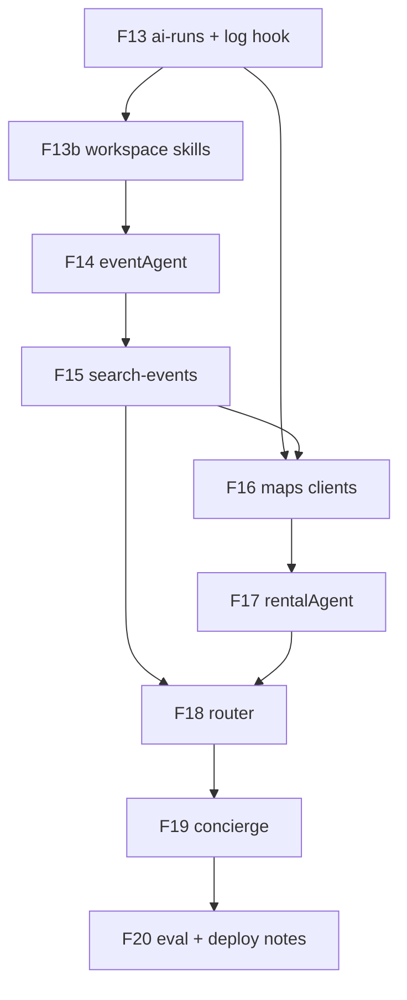

# 08 — Mastra port tasks audit (F13–F20)

> **TL;DR.** F13 had four execution blockers (CopilotKit vs `/chat` middleware, missing `log-agent-run.ts`, invalid `agent_type: ping`, anonymous DoD). All eight task specs were patched. **Critical path unchanged:** F13 → F14 → F15 (Roberto W3). F18 already documented beta `Agent({ workflows })` trap. Re-run this audit after each task flips Done.

---

## Verification report — 2026-05-20

| Task | Spec score (post-fix) | Execution readiness | Blockers | Safe to execute? |
|---|---:|---:|---:|---|
| **F13** | **94** | **92** | 0 | **Yes** (after `mdeapp/.env.local` server vars) |
| F13b | 82 | 70 | 0 | Yes (after F13) |
| F14 | 84 | 65 | 0 | Yes (after F13, F13b) |
| F15 | 83 | 60 | 0 | Yes (after F14) |
| F16 | 80 | 55 | 0 | Yes (after F13, F15) |
| F17 | 79 | 50 | 0 | Yes (after F16) |
| F18 | 86 | 55 | 0 | Yes (after F15, F17; fallback mandatory) |
| F19 | 85 | 50 | 0 | Yes (after F18) |
| F20 | 78 | 45 | 0 | Yes (after F19; evals may defer) |

**Rubric:** `.claude/skills/task-verifier/references/task-spec-rubric.md`

---

## CopilotKit + Mastra doc verification (2026-05-20)

| Source | Finding | mdeapp alignment |
|---|---|---|
| [Mastra: Using CopilotKit](https://mastra.ai/guides/build-your-ui/copilotkit) | Pattern 2: `registerCopilotKit({ path: '/chat' })`, frontend `runtimeUrl="http://localhost:4111/chat"` | **Not used** in mdeapp |
| [CopilotKit Mastra quickstart](https://docs.copilotkit.ai/mastra/quickstart) | In-process / Next API route; `npx copilotkit create` scaffolds Mastra + UI | **Matches** F01/F05 upstream starter |
| [Mastra blog](https://mastra.ai/blog/copilotkitmastra) | AG-UI standard; `npx create-ag-ui-app --mastra` | Reference only |
| `plan/audit/05-copilotkit-mastra-setup-checklist.md` | 33/38 match; Pattern 1 intentional | **Canonical** for hook names (`useCoAgent`, v1.55.2) |
| `@ag-ui/mastra` source | `MastraAgent.run()` → `agent.stream()` no `onFinish` | F13 `LoggingMastraAgent` required |

**Skills updated:** `copilotkit-integrations/references/integrations/mastra.md` (dual-pattern + doc index), `mastra/SKILL.md` routing table, `mastra/references/mdeai-concierge.md`.

---

## Cross-cutting fixes applied (2026-05-20)

| Issue | Was | Fix |
|---|---|---|
| CopilotKit vs Mastra HTTP | F13 wired `server.middleware` only | `LoggingMastraAgent` wraps `@ag-ui/mastra` `run()` — AG-UI does not pass `onFinish` to `agent.stream()` |
| `onFinish` on Agent ctor | Spec implied constructor hook | Mastra: `onFinish` is per `stream()`/`generate()` call; AG-UI omits it → wrapper required |
| `agent_type: ping` | Invalid Postgres enum | Map `pingAgent` → `general_concierge` |
| Anonymous DoD | Required JWT user | `user_id` null allowed for W1 smoke |
| `agent_tool_calls` | F15 referenced nonexistent table | `ai_runs` + `withAudit` console |
| `depends_on: F09-supp` | INDEX drift | Canonical `F09-floor-script-and-vitest.md`; specs use full slugs |
| CopilotKit agent keys | Underspecified | `eventAgent`, `rentalAgent`, `routerAgent`, `conciergeAgent` frontmatter |
| Dual observability | Undocumented | F13 = `ai_runs`; F20 note = `mastra_ai_spans` deferred |
| Env location | Repo root only | `mdeapp/.env.local` for `SUPABASE_*` |

---

## Claims verified (this run)

| Claim | Probe | Result |
|---|---|---|
| Legacy sources exist | `ls /home/sk/mde/my-mastra-app/src/mastra/lib/ai-runs*.ts` | Present |
| mdeapp targets absent | `ls mdeapp/src/mastra/lib/ai-runs.ts` | Missing (Not Started OK) |
| F06, F09 Done | `tasks/INDEX.md` | Done |
| `npm test` | `cd mdeapp && npm test` | Exit 0 |
| `ai_runs` schema | Supabase MCP | Columns match legacy insert + extras |
| `agent_type` enum | Supabase MCP | 15 labels; **no `ping`** |
| `mastra_ai_spans` | Supabase MCP | **932** rows |
| Beta `Agent({ workflows })` absent | task-verifier trap #4 / F18 | Documented |
| Processors renamed | `@mastra/core/dist/processors/processors/` | F19 table correct |
| CopilotKit agent | `layout.tsx` `agent="pingAgent"` | Matches agents map key |

---

## Dependency chain (canonical)



**Roberto unblocker:** F13 → F14 → F15 (F13b parallel after F13).

---

## Per-task notes

### F13 — observability foundation

- **Persona:** Sofía queries `ai_runs` when chat feels slow; Patricia compliance trail.
- **Must ship:** `log-agent-run.ts` + `logging-mastra-agent.ts` + `route.ts` uses `getLocalAgentsWithLogging`.
- **Mastra docs:** [Server middleware](https://mastra.ai/docs/server/middleware) applies to Mastra HTTP server, not Next.js `/api/copilotkit`. [CopilotKit integration](https://mastra.ai/docs/frameworks/agentic-uis/copilotkit) matches in-process `getLocalAgents`.
- **Pre-exec:** Copy `SUPABASE_URL` + `SUPABASE_SERVICE_ROLE_KEY` into `mdeapp/.env.local`.

### F13b — workspace

- Read-only governance skills; no `ai_runs` writes.
- If `Mastra({ workspace })` missing in beta, use `setWorkspace` per evidence.

### F14 — eventAgent

- `useCoAgent({ name: "eventAgent" })` / `<CopilotKit agent="eventAgent">`.
- `agent_type: event_curator` on log hook.

### F15 — search-events

- Wrap tool with `withAudit`.
- AG-UI `context.writer.custom` — verify via AG-UI MCP before copy.

### F16 — maps

- Promote `places-api-field-mask` hook when landing.
- Grounding calls log via `recordMastraRun` (`general_concierge` or `local_scout` per call site).

### F17 — rentals

- Camila hero; `agent_type: local_scout`.

### F18 — router

- **Mandatory** tool-wrapper dispatch; never `Agent({ workflows })`.
- Evidence file must capture `grep workflows agent.d.ts`.

### F19 — concierge

- `/chat` page + `conciergeAgent`; processor beta names only.
- Four tools + working memory across rental/event state.

### F20 — eval + deploy

- `@mastra/evals` likely deferred.
- `fix-vercel-build.cjs` reference only (`next build` path).
- `mastra_ai_spans` PgStore = W9+ follow-on.

---

## task-verifier skill improvements (shipped)

| Addition | Path |
|---|---|
| Spec rubric (weights + letter grades) | `references/task-spec-rubric.md` |
| Trap #11 CopilotKit vs `/chat` | `SKILL.md` |
| Trap #12 Postgres ENUM probe | `SKILL.md` |
| Trap #13 Dual observability | `SKILL.md` |
| Trap #14 `useCoAgent` key match | `SKILL.md` |
| Pushier skill description | `SKILL.md` frontmatter |

---

## Commands before starting F13

```bash
# Env names only
grep -E '^SUPABASE_URL=|^SUPABASE_SERVICE_ROLE_KEY=' /home/sk/mdeai/mdeapp/.env.local || echo "ADD TO mdeapp/.env.local"

cd /home/sk/mdeai/mdeapp && npm test && npm run build
```

## Commands after F13 Done

```bash
cd /home/sk/mdeai/mdeapp && npm run dev
# UI chat "hi" → then Supabase:
# SELECT agent_name, agent_type, user_id, status FROM ai_runs ORDER BY created_at DESC LIMIT 5;
```

---

## Stop condition

**Safe to execute F13** once `mdeapp/.env.local` has server Supabase vars. F14–F20 safe in dependency order after predecessors are Done with evidence files.

Re-audit trigger: any change to `@mastra/core` beta version, CopilotKit 1.55.2 → v2 migration, or `ai_runs` RLS policy change.
