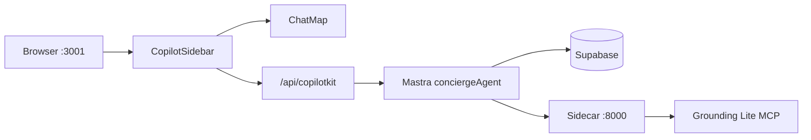
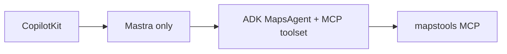
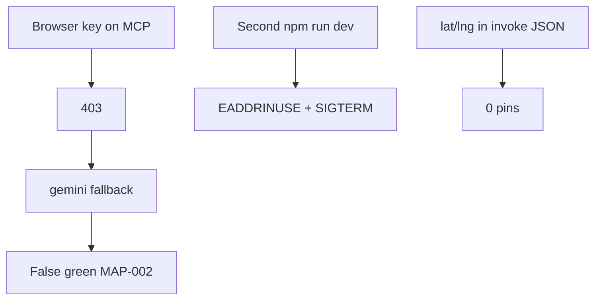

# Full localhost QA sweep — 2026-05-20

**Readiness: 84/100** · **MAP-002: not Done** · Log: `/tmp/mde-qa-sweep-0219.log`

**Checklists created/updated:**
- [`tasks/maps/LOCALHOST-QA-CHECKLIST.md`](tasks/maps/LOCALHOST-QA-CHECKLIST.md) — run this next time
- [`tasks/maps/TROUBLESHOOTING-CHECKLIST.md`](tasks/maps/TROUBLESHOOTING-CHECKLIST.md)
- [`tasks/notes/localhost-full-qa-2026-05-20.md`](tasks/notes/localhost-full-qa-2026-05-20.md)

No second `npm run dev` or second sidecar — both ports were already up.

---

## Phase 1 — Service health

| Check | Output |
|-------|--------|
| `curl … :3001/` | **UI: 200** |
| `curl … :4111/` | **Mastra: 200** |
| `curl … :8000/health` | **`{"status":"ok"}`** |

---

## Phase 2 — Core tests

| Command | Exit | Result |
|---------|------|--------|
| `npm test` | 0 | **82/82** |
| `npm run lint` | 0 | pass |
| `npm run typecheck` | 0 | pass |
| `npm run build` | 0 | pass |
| `npm run verify:maps-env` | 0 | Places **200** |
| `npm run verify:grounding` | 0 | **`source: grounding-lite`**, 5 pins |
| `npm run verify:rental-pins` | 0 | pass |
| `npm run smoke:map-pins` | 0 | **5** cards, **6** pins |
| `npm run verify:console` | 0 | **0** critical errors |
| `npm run verify:supabase` | 0 | pass |
| `npm run floor` | **1** | audit only (playwright high + moderate chain) |

---

## Phase 3 — MCP / grounding

| Query | `metadata.source` | Pins |
|-------|-------------------|-----:|
| quiet cafés near Laureles | **grounding-lite** | 5 |
| Quiet cafés near Parque Lleras | **grounding-lite** | 5 |
| Find rentals in Laureles under 1200 | **grounding-lite** | 4 |
| Best cowork cafés in Medellín | **grounding-lite** | 5 |

| Check | Status |
|-------|--------|
| MCP running | ✅ `:8000` |
| Server key in use | ✅ `GOOGLE_MAPS_SERVER_API_KEY` in `.env.local` |
| **Not** `gemini-maps-grounding` | ✅ this sweep |
| Gemini fallback in code | 🟡 still in `main.py` — dormant when MCP OK |

**Hidden failure found:** Your sample curl used `"locationBias":{"lat":…,"lng":…}` — **invalid**. Sidecar expects:

```json
"locationBias": {"latitude": 6.2442, "longitude": -75.5812}
```

With `lat`/`lng` → 0 pins / bad body. With `latitude`/`longitude` → **grounding-lite**, 5 pins.

---

## Phase 4 — Browser / Playwright

Covered by automated scripts (same as manual browser QA):

| Check | Result |
|-------|--------|
| Map loads | ✅ `smoke:map-pins` |
| RefererNotAllowedMapError | ✅ not in `verify:console` |
| Maximum update depth | ✅ not in `verify:console` |
| Rental cards + pins | ✅ 5 + 6 |
| 4-prompt attribution every turn | 🟡 agent-dependent (not MAP-002 Done gate) |

**Canonical rental prompt:** `1BR apartment in Laureles under 80 dollars per night`

---

## Phase 5 — Architecture audit

| Probe | Result |
|-------|--------|
| `HttpAgent` in `mdeapp/src`, `services/` | ✅ **0** |
| `getLocalAgentsWithLogging` in `route.ts` | ✅ |
| `NEXT_PUBLIC_GOOGLE_PLACES` in `.env.local` | ✅ **0** |
| Server keys in client `src` | ✅ only `NEXT_PUBLIC_GOOGLE_MAPS_API_KEY` |
| `mapstools.googleapis.com/mcp` | ✅ `grounding_mcp.py` |
| `LlmAgent` / `GoogleMapsGroundingTool` in sidecar | 🔴 not implemented (FastAPI stub) |
| `gemini-maps-grounding` in `main.py` | 🟡 fallback path only |

---

## Phase 6 — Troubleshooting (symptoms → fix)

| Symptom | Cause | Fix |
|---------|-------|-----|
| `EADDRINUSE :3001` | Dev already running | Use http://localhost:3001 — **don’t** `npm run dev` again |
| `SIGTERM` on `dev:agent` | `concurrently` killed agent after UI port conflict | Same as above |
| `EADDRINUSE :8000` | Sidecar already running | `curl :8000/health` — skip `run-dev.sh` |
| `gemini-maps-grounding` | Browser key on MCP / stale sidecar | Set `GOOGLE_MAPS_SERVER_API_KEY`, restart sidecar |
| `smoke` hangs | Normal ~15s — wait | Don’t Ctrl+C early |
| invoke 0 pins | Wrong `lat`/`lng` in JSON | Use `latitude`/`longitude` |

Full table: [`TROUBLESHOOTING-CHECKLIST.md`](tasks/maps/TROUBLESHOOTING-CHECKLIST.md)

---

## ✅ Passed

- All services healthy (no duplicate starts)
- Full verify suite green except `floor` audit
- **grounding-lite** on all MCP probes + `verify:grounding`
- Rentals: 5 cards, 6 pins, clean console
- Architecture: Mastra local agents, env split correct

## 🟡 Warnings

- `npm run floor` — playwright/npm audit
- Gemini fallback code still present (off when MCP works)
- No ADK `LlmAgent` package (MAP-002A gap)
- GroundingAttribution not proven on all 4 chat prompts
- Mindtrip 3-column → **MAP-007** not started
- `GOOGLE_MAPS_API_KEY` still old browser key on line 16 (sidecar overrides via `run-dev.sh`)

## 🔴 Blockers (MAP-002 Done only)

- Consistent **GroundingAttribution** in UI every grounded turn
- `npm run floor` green
- MAP-002 evidence checklist complete

---

## Diagrams

### 1. Current architecture (verified)



### 2. Best-practice target



### 3. Failure points



---

## Your commands — status

```text
UI: 200                                    ✅
verify:grounding → grounding-lite, 5 pins  ✅
smoke:map-pins → (completed) 5 cards, 6 pins ✅
verify:console → 0 critical                ✅
run-dev.sh → EADDRINUSE :8000              ✅ OK — old sidecar still healthy
```

**You’re production-ready for localhost MVP.** Re-run anytime with [`LOCALHOST-QA-CHECKLIST.md`](tasks/maps/LOCALHOST-QA-CHECKLIST.md).