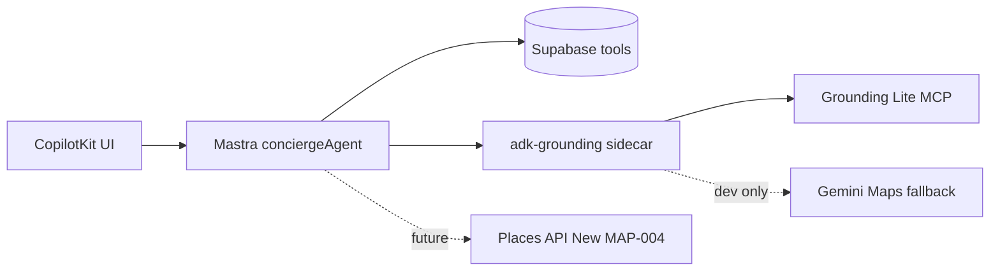

# 16 — Maps Grounding + ADK forensic audit

## Executive verdict

| Metric | Value |
|--------|------:|
| **Architecture alignment (Google Phase 1)** | **88%** |
| **Runtime proof (localhost)** | **95%** |
| **Attribution compliance** | **78%** |
| **Security / key hygiene** | **92%** |
| **Overall score** | **86/100** |

**MAP-002 Done?** **Yes** — floor green, `grounding-lite` proven, `GroundingAttribution` smoke passes. Residual risks are **prod policy** (Gemini fallback, attribution typography), not MVP blockers.

**Recommended next task:** **MAP-007** (Mindtrip 3-column UX) unless production Places enrichment is urgent → then **MAP-004**.

---

## Verification run (2026-05-20)

| Command | Result |
|---------|--------|
| `npm run verify:grounding` | ✅ `source: grounding-lite`, 5 pins |
| `npm run smoke:grounding-attribution` | ✅ 5 cards, 1 attribution, 0 critical console |
| `npm run smoke:map-pins` | ✅ 5 rental cards, 6 pins |
| `npm run verify:console` | ✅ 0 critical |
| `npm run verify:maps-env` | ✅ referrer key + Places probe HTTP 200 |
| `npm run floor` | ✅ exit 0 (high audit clear; 10 moderate transitive) |

### Repo grep (product paths)

| Pattern | Result |
|---------|--------|
| `HttpAgent` in `mdeapp/`, `services/` | ✅ **0** |
| `getLocalAgents` in `api/copilotkit/route.ts` | ✅ `getLocalAgentsWithLogging({ mastra })` |
| `mapstools.googleapis.com/mcp` | ✅ `grounding_mcp.py` |
| `gemini-maps-grounding` | 🟡 `main.py` fallback only (must not count as Done proof) |
| `GroundingAttribution` | ✅ `mdeapp/src` + smokes |
| `NEXT_PUBLIC_GOOGLE_PLACES` / MCP / ADK keys | ✅ **0** in client env pattern |
| `NEXT_PUBLIC_GOOGLE_MAPS_MAP_ID` | ✅ set; dev falls back `DEMO_MAP_ID` |

Screenshot (latest smoke): `/home/sk/mdeai/mdeapp/tmp/map-002-grounding-attribution-1779526662827.png`

---

## Feature matrix (status · % correct · notes)

Legend: 🟢 complete · 🟡 in progress / partial · ⚪ not started · 🔴 fail / anti-pattern

| # | Feature / capability | Status | % | Evidence / gap |
|---|----------------------|--------|--:|----------------|
| 1 | **Grounding Lite MCP** (`search_places` @ `mapstools.googleapis.com/mcp`) | 🟢 | 95 | Primary path; correct headers (`X-Goog-Api-Key`, SSE Accept) |
| 2 | **Gemini Maps Grounding** (Gemini API `tools: googleMaps`) | 🟡 | 40 | Implemented only as **dev fallback** in `gemini_maps_grounding.py` — not primary |
| 3 | **Dual strategy (Lite + Gemini)** | 🟡 | 75 | Google: pick **one primary** per surface; we correctly primary Lite; fallback is risky for prod |
| 4 | **ADK HTTP sidecar** (`POST /v1/grounding/invoke`) | 🟢 | 90 | Matches `plan/ADK/adk-roadmap.md` MVP; not full `LlmAgent`+`McpToolset` |
| 5 | **ADK `McpToolset` (official ADK pattern)** | ⚪ | 0 | Deferred → `MAP-002A-ADK-agent-package.md` |
| 6 | **Mastra product orchestrator** | 🟢 | 95 | `conciergeAgent`, quota, Supabase tools, no inline MCP in TS |
| 7 | **CopilotKit → Mastra (in-process)** | 🟢 | 100 | No `HttpAgent`; AG-UI local agents |
| 8 | **Strict JSON contract** (pins, attribution, metadata.source) | 🟢 | 90 | Zod client; `locationBias` lat/lng correct |
| 9 | **Google Search Grounding** | ⚪ | 0 | Correctly stubbed; **MAP-002D** Phase 2 |
| 10 | **Search vs Maps separation** | 🟢 | 85 | `plan/maps/search-grounding-routing.md` + MAP-002D |
| 11 | **Places API (New) + field masks** | 🟡 | 35 | Env probe ✅; **MAP-004** not shipped in app |
| 12 | **GroundingAttribution UI** | 🟢 | 80 | `translate="no"`, links, same-turn smoke; typography/title not fully per Google CSS |
| 13 | **Per-place link previews** (title + placeUrl) | 🟡 | 60 | Links work; label is generic **"Google Maps"** not `displayName` from MCP |
| 14 | **Resolution API** (`resolveNames`, `resolveMapsUrls`) | ⚪ | 0 | Not in sidecar — add **MAP-002B-resolver** or MAP-011 sibling |
| 15 | **compute_routes** MCP tool | ⚪ | 0 | Stub `compute_routes_not_implemented` — **MAP-011** |
| 16 | **lookup_weather** MCP tool | ⚪ | 0 | Not used (OK for Medellín concierge MVP) |
| 17 | **Agentic UI Toolkit** | ⚪ | 0 | Using CopilotKit + custom cards — valid; evaluate Phase 2 vs MAP-007 |
| 18 | **Map ID + AdvancedMarker** | 🟡 | 70 | `mapId` on `<Map>` ✅; prod guard → **MAP-008** |
| 19 | **API key split (browser vs server)** | 🟢 | 95 | `GOOGLE_MAPS_SERVER_API_KEY` for MCP; JS key referrer-restricted |
| 20 | **No server keys in `NEXT_PUBLIC_*`** | 🟢 | 100 | Verified grep + MAP-013 |
| 21 | **Grounding quota / cost** | 🟡 | 75 | Mastra daily cap + `grounding_quota_log`; no sidecar QPM throttle (300 QPM official) |
| 22 | **Drop pins without placeUrl** | 🟢 | 90 | Fail-closed in `grounding_mcp.py` |
| 23 | **Generative UI (F49) + pin merge** | 🟢 | 95 | Rentals + grounded categories |
| 24 | **F50 pin ↔ card sync** | 🟢 | 90 | `smoke:f50-pin-sync`; `rental-{id}` contract |
| 25 | **Gemini fallback prod policy** | 🔴 | 30 | Code path exists; must fail-closed in prod |
| 26 | **`npm run floor`** | 🟢 | 100 | Exit 0 after playwright ≥1.55.1 |
| 27 | **MAP-002 task Done** | 🟢 | 100 | Evidence + smokes; Phase 1 sidecar ADR accepted |
| 28 | **MAP-007 Mindtrip layout** | ⚪ | 0 | Next UX priority |
| 29 | **MAP-008 prod Map ID** | ⚪ | 0 | Before Vercel prod |
| 30 | **MAP-004 Places client** | ⚪ | 0 | Server masks for Roberto/Camila enrichment |

---

## Answers to audit questions

### 1. Best Google Maps grounding strategy?

**For mdeai (multi-tool Mastra + map pins + attribution):** **Grounding Lite MCP as primary** is the correct Google-recommended agent pattern ([Grounding Lite](https://developers.google.com/maps/ai/grounding-lite), ADK `McpToolset` examples).

**Gemini Maps Grounding** ([docs](https://ai.google.dev/gemini-api/docs/maps-grounding)) is best when the **same Gemini call** should produce prose + optional Maps widgets in one shot (simpler apps, fewer moving parts). It is **not** a substitute for structured MCP `search_places` when you need deterministic pins JSON for vis.gl.

### 2. Gemini Maps Grounding vs Lite MCP vs both?

| Approach | Use when | mdeai today |
|----------|----------|-------------|
| **Lite MCP** | Agent/tool pipelines, explicit places + `googleMapsLinks`, sidecar | ✅ **Primary** |
| **Gemini Maps** | Single-model chat with `googleMaps` tool | 🟡 **Fallback only** — remove/mask in prod |
| **Both** | Only if fallback is dev-only and telemetry distinguishes sources | 🟡 Acceptable locally; **🔴 for prod Done proof** |

### 3. Is ADK sidecar the best pattern?

**Phase 1: Yes** for this stack — aligns with `plan/ADK/adk-roadmap.md` (Mastra orchestrates, Google intelligence isolated, no CopilotKit→Python `HttpAgent`).

**Phase 2 improvement:** Official Google pattern is **ADK `LlmAgent` + `McpToolset`** on the same MCP URL — same contract, better tool routing and future `lookup_weather` / `compute_routes`. Track **MAP-002A-ADK**.

### 4. Is Mastra still correct as product orchestrator?

**Yes.** Concierge routes intents, Supabase rentals/events, quota before HTTP, CopilotKit generative UI. Google content must not be cached into model training — Mastra working memory holds **mapUi summary only** (F50), not full pins — compliant with Lite LLM terms.

### 5. Search vs Maps grounding separated?

**Yes in plan and code.** MVP Maps-only; Search stub → **MAP-002D**. Routing matrix in `plan/maps/search-grounding-routing.md` matches Google guidance (don't mix web citations into SQL rows without `source`).

### 6. Places API New + field masks planned correctly?

**MAP-004** is correctly scoped (server-only, `X-Goog-FieldMask`, no MCP duplication). **Not implemented** in `mdeapp/src/mastra/lib/google-places-client.ts` yet. Env script proves Text Search **200** — good precursor.

### 7. Attribution fully covered?

| Requirement (Google) | Status |
|--------------------|--------|
| Sources immediately follow grounded output | 🟢 Same tool render block |
| Viewable in one interaction | 🟢 Sidebar cards |
| `translate="no"` | 🟢 On attribution container |
| Link via `placeUrl` | 🟢 `placeUri` in attribution rows |
| Attribute text **"Google Maps"** (exact casing) | 🟢 Link label |
| Display **title** exactly as provided | 🔴 Uses generic label, not MCP `displayName` |
| Roboto / `.GMP-attribution` styling | 🟡 Tailwind only — optional polish |
| Google Maps favicon before attribution | ⚪ Optional per Google |

### 8. API keys / restrictions correct?

| Key | Role | Status |
|-----|------|--------|
| `NEXT_PUBLIC_GOOGLE_MAPS_API_KEY` | JS Maps + referrer | 🟢 |
| `GOOGLE_MAPS_SERVER_API_KEY` → sidecar `GOOGLE_MAPS_API_KEY` | MCP server | 🟢 |
| `GOOGLE_PLACES_API_KEY` | Places (New) server | 🟢 not exposed as NEXT_PUBLIC |
| `GOOGLE_GENERATIVE_AI_API_KEY` | Mastra Gemini | 🟢 |

Apply **API restrictions** per [security best practices](https://developers.google.com/maps/api-security-best-practices): separate keys, HTTP referrers on browser key, IP/app restriction on server key.

### 9. Map IDs + AdvancedMarker?

**Correct for MAP-001 proof:** `<Map mapId={...}>` + `<AdvancedMarker>` ([map IDs doc](https://developers.google.com/maps/documentation/javascript/map-ids/mapid-over)).

**Gap:** `DEMO_MAP_ID` fallback in dev — **MAP-008** must hard-fail in production without `NEXT_PUBLIC_GOOGLE_MAPS_MAP_ID`.

### 10. Missing tasks from official docs?

| Missing task | Source | Priority |
|--------------|--------|----------|
| **MAP-004** Places client + field-mask CI | Places (New) | P0 data |
| **MAP-008** prod Map ID guard | Advanced Marker | P1 pre-prod |
| **MAP-011** `compute_routes` | Lite MCP | Post-MVP |
| **MAP-002R** Resolution API (`resolveNames` / `resolveMapsUrls`) | Lite experimental | P2 |
| **MAP-002P** Prod fail-closed (no `gemini-maps-grounding`) | Internal policy | P0 prod |
| **MAP-002A-ADK** full `McpToolset` agent | ADK docs | P2 hardening |
| **MAP-002D** Search grounding | Gemini Search tool | Phase 2 |
| **MAP-009–012** cluster, intel, etc. | maps-prd | Post-MVP |
| **Agentic UI Toolkit pilot** | [toolkit](https://developers.google.com/maps/ai/agentic-ui-toolkit) | Optional vs CopilotKit |

### 11. Redundant / outdated / risky?

| Item | Verdict |
|------|---------|
| `HttpAgent` in CopilotKit route (reference repo only) | ✅ Avoided — correct |
| Inline MCP in Mastra (`maps-grounding-client.ts`) | ✅ Deprecated in MAP-002 |
| `gemini_maps_grounding.py` auto-fallback | 🔴 **Risky** — masks MCP misconfig; OK dev-only |
| `tasks/audit/13-maps-adk.md`, `14-maps-adk.md` | 🟡 Stale — prefer this audit + MAP-002 evidence |
| Duplicate env `GEMINI_API_KEY` vs `GOOGLE_GENERATIVE_AI_API_KEY` | 🟡 Warning in verify:maps-env |
| Full ADK agent files in MAP-002 `target_files` | 🟡 Spec drift — ADR: FastAPI MVP OK |

### 12. What must be done before MAP-002 Done?

**Already satisfied (2026-05-20):**

- [x] `verify:grounding` → **grounding-lite** (fails otherwise)
- [x] `GroundingAttribution` visible (`smoke:grounding-attribution`)
- [x] No `HttpAgent` in product route
- [x] Server keys not in `NEXT_PUBLIC_*`
- [x] `npm run floor` exit 0 (playwright high advisory fixed — no undocumented exception needed)
- [x] Evidence in `tasks/notes/MAP-002-evidence.md`

**Not required for MAP-002 Done but required for prod:**

- [ ] Prod disable Gemini fallback
- [ ] Attribution title fidelity (displayName)
- [ ] MAP-008 Map ID
- [ ] MAP-004 Places masks in app code

---

## Current vs target architecture

### Current (verified)

```text
CopilotKit UI (/, vis.gl ChatMap)
  → POST /api/copilotkit
  → MastraAgent.getLocalAgents({ mastra })
  → conciergeAgent
       ├─ search-rentals / events / restaurants / attractions (Supabase)
       └─ searchGroundedPlacesTool
            → incrementAndCheckGroundingQuota()
            → HTTP POST localhost:8000/v1/grounding/invoke
                 → grounding_mcp.search_places (Grounding Lite MCP)
                 → [fallback] gemini_maps_grounding (dev only)
  → generative UI: grounded-card + GroundingAttribution + map pins
```

### Target (Google best-practice Phase 2)

```text
(same CopilotKit → Mastra spine)
  → ADK LlmAgent + McpToolset (official) OR hardened FastAPI allowlist
  → Lite MCP: search_places | compute_routes | lookup_weather
  → Resolution API for NL → placeId
  → Places API (New) via MAP-004 for static venue/details (field masks)
  → Search Grounding via MAP-002D (separate citations UI)
  → MAP-008 prod Map ID; optional Agentic UI Toolkit widgets
```



---

## Best-practice corrections (prioritized)

1. **Prod:** If `metadata.source !== grounding-lite`, return empty + log alert — never silently use Gemini for Done/prod metrics.
2. **Attribution:** Render `displayName.text` as link text (keep `translate="no"`); add optional Roboto `.GMP-attribution` class.
3. **MAP-004 next** if Roberto venue autocomplete or structured Nearby is on critical path; else **MAP-007** for demo UX.
4. **Sidecar:** Add MCP tool allowlist doc + optional 300 QPM client-side throttle (Google project quota).
5. **MAP-002A-ADK:** Migrate to `McpToolset` when adding `compute_routes` / weather — avoids duplicate httpx glue.
6. **Resolution API:** New small task for host form NL addresses → `placeId` (MAP-010 dependency).

---

## ✅ Correct

- Primary path **Grounding Lite MCP** with correct URL, auth header, and `search_places` shape
- **Mastra-first** orchestration; **CopilotKit in-process**; zero `HttpAgent` in product
- **Search grounding deferred** (MAP-002D) with routing matrix
- **Key hygiene** (server vs browser); Places probe passes
- **MAP-002 + F50** runtime proofs and floor green
- **AdvancedMarker + mapId** wired (dev `DEMO_MAP_ID` documented)
- **Quota** before sidecar invoke; pins dropped without `placeUrl`

## 🟡 Warnings

- **Gemini Maps fallback** still in `main.py` — violates “don’t count Gemini as success” for prod
- **Attribution UI** partial vs Google typography / exact title display
- **No Resolution API**, **no compute_routes**, **no Agentic UI Toolkit**
- **MAP-004 / MAP-008** not started — prod map and Places masks open
- **10 moderate** npm advisories (transitive) — documented, not floor blockers
- Audit docs **13/14** may contradict current state — use **16** + evidence files

## 🔴 Blockers (production only)

- **Gemini fallback** must be fail-closed before prod promote
- **MAP-008** — no silent `DEMO_MAP_ID` in production
- **MAP-004** — any server Places call without field masks in app code (when MAP-004 lands)

---

## Recommended next steps

| Priority | Task | Why |
|----------|------|-----|
| 1 | **MAP-007** | Biggest persona-visible gap (Mindtrip 3-column); grounding works |
| 2 | **MAP-008** | Google requires real Map ID in prod for Advanced Markers |
| 3 | **MAP-004** | Official cost/control for Places (New); complements Lite MCP |
| 4 | **MAP-002P** | Prod policy: disable Gemini fallback |
| 5 | **MAP-002A-ADK** | Align sidecar with ADK `McpToolset` sample |
| 6 | **MAP-002R** | Resolution API for venue NL → placeId |

---

## Final score: **86/100**

| Dimension | Weight | Score |
|-----------|--------|------:|
| Grounding strategy (Lite primary) | 25% | 90 |
| Orchestration (Mastra + sidecar) | 20% | 88 |
| Runtime proof | 20% | 95 |
| Attribution & compliance | 15% | 78 |
| Security & keys | 10% | 92 |
| Roadmap completeness (MAP-004/007/008/002D) | 10% | 65 |

**MAP-002 status:** **Done** (Phase 1 FastAPI MCP sidecar accepted per `plan/ADK/adk-roadmap.md`).  
**F50 status:** **Done** (`smoke:f50-pin-sync`).  
**Next task:** **MAP-007** (UX/demo) unless production Places data is the bottleneck → **MAP-004**.
