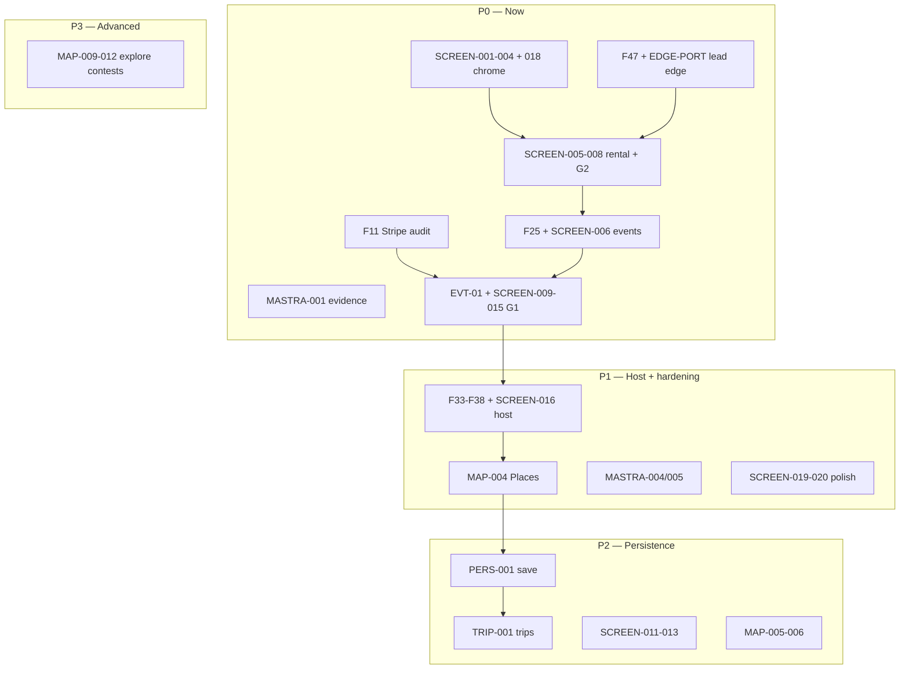

# 22 — Implementation Order Audit

**Score: 58/100 MVP 🟠** — foundation and maps MVP are real; **execution order intent is correct** but **indices disagree on host placement, MAP-007, and CK deps**.

**Follows:** [21 — Task · Progress · Wireframe Audit](./21-task-progress-wireframe-audit.md)

**Verified against:** task indices, [`screens/20-wireframe-to-build-roadmap.md`](../screens/20-wireframe-to-build-roadmap.md), `mdeapp/src/` (2026-05-24).

**Note:** `tasks/roadmap/20-wireframe-to-build-roadmap.md` was moved → [`screens/20-wireframe-to-build-roadmap.md`](../screens/20-wireframe-to-build-roadmap.md).

---

## 1. Executive verdict

### Is the order correct?

**Directionally yes, execution docs are not fully aligned.**

| Track | Verdict |
|-------|---------|
| **Screen-first after maps foundation** | ✅ Correct — foundation + MAP MVP + F48–F50 are Done; next work is visible chrome, not new agents |
| **Maps step table** | ✅ Fixed 2026-05-24 — `tasks/maps/INDEX.md` uses **MAP-007B Done**; MAP-007 superseded |
| **INDEX-SCREEN-FIRST host placement** | ✅ Fixed 2026-05-24 — SCREEN-016 at order **13** (before saved/trips 16–18) |
| **CK backlog deps** | ✅ Fixed 2026-05-24 — F19 on `/` replaces MASTRA-002 |
| **Path A F14–F19** | ✅ Fixed 2026-05-24 — F14/F15/F17/F46 marked Done + evidence |

### What should happen NEXT (P0)

```text
1. SCREEN-001 → 002 → 003 → 004 → 018   (chrome integration — stubs exist, finish them)
2. F11 (Stripe secret audit)              (before EVT-01)
3. F47 + port chat-lead-capture edge      (G2 backend — blocks SCREEN-008)
4. SCREEN-005 → 007 → 008                 (rental CTAs + lead modal)
5. F25 + SCREEN-006                       (EventCard polish)
6. EVT-01 + SCREEN-009 → 014 → 015        (G1 ticket path)
7. F33 → F34 → F36 → F37 → F38 + SCREEN-016  (Roberto — after commerce slice)
8. MASTRA-001 evidence + MASTRA-004         (hygiene, parallel)
9. MAP-004                                  (Places depth — before MAP-010 venue autocomplete)
```

### What should NOT be worked on yet

- `/explore`, `/contests`, `/nightlife`, `/creator`, notifications drawer, full trips OS
- MAP-005–012, MAP-002A/002D (post-MVP / Phase 2)
- Re-porting F14/F15/F17/F46 agents/workflows
- MASTRA-002 (superseded)
- New AI edge chat (`ai-chat`, `ai-router`)
- `hostEventAgent` before F33 types land
- SCREEN-011–013 (saved/trips) before G1+G2 proven

### Biggest blockers

| Blocker | Persona impact |
|---------|----------------|
| **G2** — no lead edge in `mdeapp`, F47 Not Started | Camila can’t schedule viewing |
| **G1** — EVT-01 not ported, no checkout modal | Andrés can’t buy in-app |
| **Chrome stubs** — nav/query/strip are placeholder copy | Product looks pre-alpha despite working map |
| **Stale task specs** — F14/F15/F17/F46 | Team may rebuild shipped code |
| **Host chain** — F33–F38 all Not Started | Roberto stuck at auth gate |

### Biggest risks

1. **Backend overbuilding** — agents/workflows exist; building more before SCREEN-001–004 wastes week
2. **Doc drift** — maps INDEX, CK backlog, ARCHITECTURE.md still describe pingAgent/`/chat` as primary
3. **Sequencing inversion** — host wizard ordered after trips in INDEX-SCREEN-FIRST
4. **Edge port gap** — `mdeapp/supabase/functions/` empty; commerce depends on legacy edge port
5. **Thread persistence** — SCREEN-002 wants threads; CK-008/MASTRA-003 only partial for reload UX

---

## 2. Correct implementation order (P0–P3)

### P0 — Required now (visible + commerce prerequisites)

| # | Work | Why |
|---|------|-----|
| 1 | SCREEN-001–004, 018 | Mindtrip chrome on `/` — grid exists, polish stubs |
| 2 | Revise F14/F15/F17/F46 → Done | Stop duplicate ports |
| 3 | MASTRA-001 evidence | Formalize 91 tests |
| 4 | F11 | Stripe webhook hygiene before EVT-01 |
| 5 | F47 + **EDGE-PORT-001** `chat-lead-capture` | G2 backend |
| 6 | SCREEN-005, 007, 008 | Rental CTAs + venue sheet + schedule modal |
| 7 | F25 + SCREEN-006 | Event cards in-thread |
| 8 | EVT-01 + SCREEN-014, 009, 015 | G1 ticket path |

### P1 — After shell + G1/G2 slice

| # | Work | Why |
|---|------|-----|
| 9 | F33 → F34 → F36 → F37 → F38 + SCREEN-016 | Roberto hero |
| 10 | MAP-004 | Places (New) — venue detail, host autocomplete prep |
| 11 | MASTRA-004, MASTRA-005 | `user_id` audit + `check:mastra` |
| 12 | SCREEN-019, 020 | Empty/error + a11y |
| 13 | CK-001, CK-007 | AG-UI stream proof (update deps: F19 not MASTRA-002) |

### P2 — After core workflows proven

| # | Work | Why |
|---|------|-----|
| 14 | MAP-005 → MAP-006 | Places proxy + nearby |
| 15 | MAP-010 | Venue autocomplete (Roberto polish) |
| 16 | **PERS-001** `save_place` tool + SCREEN-011 | Saved collections |
| 17 | **TRIP-001** trip tools + SCREEN-012, 013 | Itinerary (schema restored) |
| 18 | CK-008 thread hydration | Reload `/` with pins/cards |

### P3 — Advanced / frozen until MVP gates green

MAP-009–012, MAP-002D, notifications, `/explore`, contests, WhatsApp, rental Stripe Connect, full bookings inbox, evaluationAgent prod, F20 deploy prep.

---

## 3. Dependency audit

| Task | Depends on | Actually blocked? | Missing prerequisite? | Correct order? |
|------|------------|-------------------|----------------------|----------------|
| SCREEN-001 | F48, MAP-007B | No | — | ✅ P0 (🟡 ~40% on disk) |
| SCREEN-002 | SCREEN-001, F13 | Soft | Thread read API / stub OK first | ✅ P0 |
| SCREEN-003 | SCREEN-001, F50 | No | Chip → `useCoAgent` wiring | ✅ P0 |
| SCREEN-004 | F49, SCREEN-001 | No | **New component** — no strip exists | ✅ P0 |
| SCREEN-018 | SCREEN-001, F48 | No | Playwright mobile spec | ✅ P0 |
| SCREEN-005 | F49, F50 | No | CTAs on `rental-card.tsx` | ✅ P0 |
| SCREEN-008 | F47, F12 | **Yes** | Edge port + API route | ✅ after F47 |
| SCREEN-006 | F15, SCREEN-004 | No | F25 EventCard (generic render today) | ✅ P0 |
| SCREEN-009 | EVT-01, SCREEN-014 | **Yes** | Ticket edges not in mdeapp | ✅ after EVT-01 |
| F33 | MAP-001, F09 | No | — | ✅ before host |
| F34 | F13, F33 | **Yes** | hostEventAgent missing | ✅ P1 |
| MAP-004 | MAP-002, F13 | No | — | ✅ P1 (not before shell) |
| MAP-007 | MAP-001… | N/A | **Superseded by MAP-007B** | ❌ remove from active order |
| MASTRA-002 | MAP-001 | N/A | Superseded by F19 | ❌ do not execute |
| MASTRA-001 | F09, F13 | No | Evidence file only | ✅ parallel P0 |
| SCREEN-011–013 | SCREEN-005+ | Soft | `save_place` / trip tools missing | ✅ P2 (currently ordered too early vs host) |
| SCREEN-016 | F33–F38 | **Yes** | Full host chain | ⚠️ should be **before** 011–013 |

---

## 4. Overlap audit

| Area | Duplicate tasks/docs | Problem | Source of truth |
|------|---------------------|---------|-----------------|
| Map layout | MAP-007 vs MAP-007B vs F48 | Two “Mindtrip polish” specs | **MAP-007B + F48** — close MAP-007 |
| Router on chat | MASTRA-002 vs F18 vs F19 | Three docs for default agent | **F19 `conciergeAgent` on `/`** |
| Agent ports | F14/F15/F17/F46 vs shipped code | Specs say rebuild | **`mdeapp/src/mastra/`** + revise specs |
| Rental surface | F24 vs F49 vs SCREEN-005 | Three rental UI tracks | **F49 renders + SCREEN-005 CTAs**; F24 optional extract |
| `/rentals` page | F41 vs `/` 3-panel | Second surface too early | **`/` for MVP**; F41 P2+ |
| Screen numbering | `22-screen-first` vs INDEX-SCREEN-FIRST | SCREEN-004/006/007 swapped vs wireframe plan | **`INDEX-SCREEN-FIRST.md`** + fix host order |
| Roadmap path | `tasks/roadmap/20-*` vs `screens/20-*` | Broken links | **`screens/20-wireframe-to-build-roadmap.md`** |
| CK gaps | CK-002 vs F50 | Both claim MapUiState | **F50 Done**; CK-002 = formalize contract + CK-005 E2E |
| Persistence | MASTRA-003 vs CK-008 | Both thread memory | **MASTRA-003 Done** (Postgres when DATABASE_URL); CK-008 = UI hydration |
| Architecture doc | ARCHITECTURE.md vs disk | pingAgent, `/rentals` W5 | Update doc to concierge + `/` |

**No duplicate workflows on disk** — one each: `rental-search`, `event-discovery`, `concierge-routing`.

---

## 5. Missing task audit (proposed)

| Proposed ID | Title | Phase | Blocks |
|-------------|-------|-------|--------|
| **EDGE-PORT-001** | Port `chat-lead-capture` + `ticket-*` edges to mdeapp | P0 | G1, G2 |
| **STREAM-001** | Workflow progress strip + AG-UI step events | P0 | SCREEN-004 |
| **PERS-001** | `save_place` Mastra tool + RLS insert | P2 | SCREEN-011 |
| **TRIP-001** | `add_to_trip` tool + trip CRUD | P2 | SCREEN-012, 013 |
| **BOOK-001** | Internal booking confirmation card in-thread | P1 | post-Stripe |
| **THREAD-001** | Nav rail thread list from `mastra_threads` | P1 | SCREEN-002 |
| **NOTIF-001** | Notifications drawer + cron | P3 | frozen |
| **OPS-UX-001** | Operational AI UX (reasoning trace, tool status) | P2 | optional |

SCREEN-019/020 already cover loading/error/a11y. Mobile = SCREEN-018.

---

## 6. Backend readiness audit

| Surface | Schema | RLS | Wired in mdeapp | Status |
|---------|--------|-----|-----------------|--------|
| Rentals | `apartments` ✅ | ✅ | `search-rentals` ✅ | 🟢 |
| Events | `events`, `event_tickets` ✅ | ✅ | `search-events` ✅ | 🟡 no EventCard UI |
| Leads | `leads` ✅ | edge insert | ❌ no edge port | 🔴 G2 |
| Tickets | `event_orders` ✅ | ✅ | ❌ EVT-01 | 🔴 G1 |
| `ai_runs` | ✅ | ✅ | F13 Pattern-1 ✅ | 🟢 |
| Grounding quota | `grounding_quota_log` ✅ | server | `grounding-quota.ts` ✅ | 🟢 |
| Places cache | `places_search_cache` ✅ | server | ❌ MAP-005 | 🟡 |
| Saved | `saved_places`, `collections` ✅ restored | user | ❌ no tool | P2 |
| Trips | `trips`, `trip_items` ✅ restored | user | ❌ no tool | P2 |
| Approvals | `approval_*` ✅ | host | F38 not deployed | 🔴 G3 |
| Mastra memory | `mastra_*` ✅ | thread | Postgres if DATABASE_URL | 🟡 |
| Edge functions | 38 live (legacy) | — | **0 in mdeapp** | 🔴 port gap |

**DB tasks missing:** none for MVP slice — **edge port + wiring** missing, not schema redesign.

---

## 7. Maps/ADK audit

| Item | Status | Notes |
|------|--------|-------|
| MAP-001 pipeline | 🟢 Done | vis.gl + MapContext |
| MAP-002 grounding | 🟢 Done | sidecar `:8000`, attribution UI |
| MAP-013 keys | 🟢 Done | server vs browser split |
| MAP-008 mapId | 🟢 Done | AdvancedMarker guard |
| MAP-007B layout | 🟢 Done | 3-column grid on `/` |
| Grounding Lite | 🟢 | `verify:grounding` pass |
| F50 pin/card sync | 🟢 | `smoke:f50-pin-sync` |
| `focusMapPin` frontend tool | 🟢 | CK-003 partial |
| MAP-004 Places New | 🔴 | Next maps depth — **after shell** |
| MAP-005 cache | 🔴 | post-MVP |
| Clustering/routes | 🔴 | MAP-009–011 Phase 2+ |
| Sidecar architecture | 🟢 | Mastra → HTTP → ADK, not HttpAgent in route |

**Fix `tasks/maps/INDEX.md`:** replace step 6 MAP-007 with **MAP-007B ✅**; step 5 next = **MAP-004**.

---

## 8. CopilotKit/Mastra audit

| Pattern | Status | Gap |
|---------|--------|-----|
| Pattern 1 runtime | 🟢 | `getLocalAgentsWithLogging` |
| Default agent | 🟢 | `conciergeAgent` in `layout.tsx` |
| Generative UI | 🟢 | `search-tool-renders` + F49 |
| `useCoAgent` map sync | 🟢 | `map-ui-sync.tsx` |
| Frontend tools | 🟡 | `focusMapPin` only |
| HITL | 🔴 | `ApprovalPanel` exists, unwired (F37) |
| Workflow strip | 🔴 | no component |
| Streaming validator | 🔴 | CK-001/007 open |
| Memory | 🟡 | MASTRA-003 Done; thread UI missing |
| Orchestration | 🟢 | concierge → tools/workflows; no duplicate agents |

**Do not add** second orchestrator, HttpAgent, or custom SSE.

---

## 9. Screen-first audit

| Screen | Disk reality | Spec status | Priority OK? |
|--------|--------------|-------------|--------------|
| Home shell | 🟡 grid + stubs (`ChatNavRail`, `ChatQueryBar`) | Not Started | ✅ P0 — under-credited |
| Rental workflow | 🟡 cards + pins, no CTAs/modals | Not Started | ✅ P0 |
| Event workflow | 🟡 generic event render | Not Started | ✅ P0 |
| Booking modal | 🔴 | Not Started | ✅ after EVT-01 |
| Saved collections | 🔴 no route | Not Started | ⚠️ ordered before host — defer |
| Trips/itinerary | 🔴 | Not Started | P2 |
| Host wizard | 🔴 auth placeholder only | Not Started | ⚠️ should move **up** (order 12–13) |

**Screen-first priority is correct; INDEX-SCREEN-FIRST ordering needs one fix:** move **SCREEN-016 before 011–013**.

---

## 10. Final authoritative order



### Single execution list (40 items max, MVP-focused)

**Backend:** MASTRA-001 → F11 → F47/EDGE-PORT → EVT-01 → F33 → F34 → F38 → MASTRA-004 → MAP-004 → MAP-005  
**Frontend/screens:** SCREEN-001→004→018 → 005→008 → 006 → 014→009→015 → 016 → 019→020  
**Defer:** MAP-007, MASTRA-002, F14–F17 rebuild, F41, SCREEN-011–013 until G1+G2 green

---

## 11. Final scores

| Dimension | Score | Grade |
|-----------|------:|-------|
| Architecture correctness | 88 | 🟡 |
| Implementation order (intent) | 82 | 🟡 |
| Implementation order (docs aligned) | 95 | 🟢 |
| Screen readiness | 52 | 🟠 |
| Workflow readiness | 78 | 🟡 |
| Supabase readiness | 72 | 🟡 |
| Maps/ADK readiness | 84 | 🟡 |
| CopilotKit readiness | 76 | 🟡 |
| Mastra readiness | 80 | 🟡 |
| **MVP readiness** | **58** | 🟠 |

---

## What’s actually complete vs partial (code truth)

| 🟢 Complete | 🟡 Partial | 🔴 Missing |
|-------------|-----------|------------|
| F01–F13, F13b, F18–F19, F48–F50 | SCREEN-001–003 (stubs on disk) | All modals, event detail, tickets pages |
| MAP-001/002/013/008/007B | EventCard (generic only) | EVT-01, F47, F33–F38 |
| 6 agents + 3 workflows | CK-003 (`focusMapPin`) | hostEventAgent |
| Pin sync + grounding | MASTRA-001 (tests, no evidence) | Edge functions in mdeapp |
| conciergeAgent on `/` | Workflow strip | G1/G2 prod proof |

---

## Immediate doc fixes (no code)

1. ~~**`tasks/maps/INDEX.md`** — MAP-007B Done; MAP-007 superseded; MAP-004 = step 5~~ ✅ 2026-05-24  
2. ~~**`tasks/INDEX-SCREEN-FIRST.md`** + **`tasks/screens/INDEX.md`** — SCREEN-016 before 011–013~~ ✅ 2026-05-24  
3. ~~**`tasks/copilotkit/BACKLOG-ck-gaps.md`** — F19 on `/` replaces MASTRA-002 deps~~ ✅ 2026-05-24  
4. ~~**F14/F15/F17/F46** — Done + evidence in `tasks/notes/`~~ ✅ 2026-05-24  
5. ~~**`mdeapp/docs/ARCHITECTURE.md`** — concierge on `/`, 3-panel shell, ADK sidecar~~ ✅ 2026-05-24  

**Docs aligned score:** implementation order docs **~95/100** (was 68/100).

**Next (code):** SCREEN-001–004 → F47/EDGE-PORT → G2/G1 commerce slice.