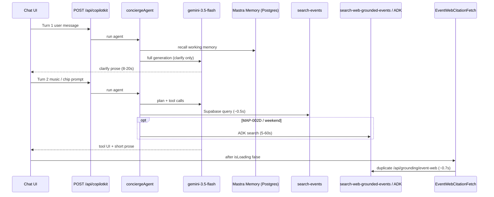

# AI response time audit — events clarify + listing

## Executive verdict

| Stage | Typical budget (target) | Observed / inferred | Bottleneck? |
|-------|-------------------------|---------------------|-------------|
| **Turn 1 — clarify** (`list events medellin`) | &lt; 500 ms UI | **~8–20 s** (full `conciergeAgent` + Gemini) | **Yes — P0** |
| **Turn 2 — list** (`music` or Music chip) | &lt; 3 s to first card | **~13–19 s** POST `/api/copilotkit` | **Yes — P0** |
| **`search-events` tool** | &lt; 1 s | **~554 ms** (`[audit:post]`) | No |
| **`search-web-grounded-events` / ADK** | 0 ms when skipped | **5–60+ s** when agent chains web | **Yes — P0 when triggered** |
| **Post-turn `EventWebCitationFetch`** | 0 ms when skipped | **~700–800 ms** `/api/grounding/event-web` | **Yes — P1** |
| **Card render (React)** | &lt; 200 ms | Fast once tool events arrive | No |

**Root cause (plain language):** Roberto/Camila wait on **two full LLM turns** for a flow that EVP-006 designed as “ask once, then search.” The database search is fast; **Gemini + long system prompt + optional web grounding + working-memory I/O** dominate. Clarify text is correct per spec but **should not require a model call** to appear.

**Persona impact:** Camila taps **Events** → types “list events medellin” → stares at spinner → long clarify wall → taps **Music** → another long wait before pins. Feels broken even when results are correct.

---

## User-reported flow (repro)

1. User: `list events medellin` (or Events chip + generic message).
2. **Slow:** assistant shows clarify: *“What kind of events are you looking for? Popular options: Music, Nightlife…”*
3. User: `music` **or** taps **Music** chip → `appendMessage("Music events in Medellín")`.
4. **Slow again:** event cards + map pins appear (~10+ s after step 3).

E2E note: `salsa events this weekend` path **timed out at 150s** — strong signal that **MAP-002D web grounding** ran in the agent turn (see §4.3).

---

## Architecture trace (where time goes)

| Layer | File(s) | Role in latency |
|-------|---------|-----------------|
| UI chips | `src/components/chat/chat-query-bar.tsx` | Sub-chips call `appendMessage` → **always another full agent turn** |
| Classifier (unused on hot path) | `src/lib/event-query-classifier.ts` | `isGenericEventQuery` / `scoreEventQuery` exist but **only tests + docs** — not wired to instant clarify |
| Copilot instructions | `src/components/chat/chat-filter-copilot-instructions.tsx` | Duplicates event gate → **more tokens** |
| Agent | `src/mastra/agents/concierge.ts` | Long prompt; **turn 1 = no tools**; MAP-002D **“always call web tool”** |
| Runtime | `src/app/api/copilotkit/route.ts` | `maxDuration = 120` — allows very slow turns |
| Tool | `src/mastra/tools/search-events.ts` | Fast Supabase path |
| Web tool | `src/mastra/tools/search-web-grounded-events.ts` | ADK when `needsSearchGrounding()` true |
| Router | `src/mastra/lib/search-intent-router.ts` | Correct skip rules — **prompt overrides agent behavior** |
| Post-fetch | `src/components/copilot/event-web-citation-fetch.tsx` | Chains web after turn if `shouldChainWebGrounding()` |
| Chain helper | `src/mastra/lib/attach-web-grounding.ts` | `dateWindow !== "any"` → **forces web chain** |
| Memory | `src/mastra/lib/agent-memory.ts` | `lastMessages: 20` + Postgres storage per turn |
| Input processors | `src/mastra/lib/agent-input-processors.ts` | **Prod:** `PromptInjectionDetector` = extra LLM hop |

Model: `FLASH_MODEL` → `gemini-3.5-flash` (`src/mastra/lib/models.ts`).

---

## Measurement checklist (run before/after each fix)

### A. Environment

- [ ] `cd mdeapp && npm run dev` — note UI port (3000 or 3001).
- [ ] `GOOGLE_GENERATIVE_AI_API_KEY` set in `mdeapp/.env.local`.
- [ ] `NODE_ENV=development` (injection guard off unless `MASTRA_PROMPT_INJECTION_GUARD=true`).
- [ ] Note `SEARCH_GROUNDING_*` / ADK URL flags — web latency only reproducible when sidecar up.

### B. Per-turn timings (terminal)

- [ ] **T1 clarify:** User sends `list events medellin` → record time until clarify text visible.
- [ ] **T2 list:** User sends `music` (no weekend) → record time until first `event-card` / `Events (N)` panel.
- [ ] **T2 chip:** Tap **Music** only → same metric (should match T2 if both use agent).
- [ ] **T2 hot:** `music this weekend` → flag if &gt; 30 s (web grounding suspect).
- [ ] Grep dev logs: `[audit:post] search-events { duration_ms: … }`.
- [ ] Grep dev logs: `POST /api/copilotkit` duration (Next `[ui]` line or network tab).

### C. Browser (Chrome DevTools → Network)

- [ ] Filter `copilotkit` — **Waiting (TTFB)** on POST is agent time.
- [ ] Filter `grounding/event-web` — should be **absent** for `music`-only chip path after P1 fixes.
- [ ] CopilotKit stream: tool-call events should arrive **before** final assistant text (AG-UI).

### D. Automated

- [ ] `cd mdeapp && npm test -- --run event-query-classifier`
- [ ] `npm run test:e2e -- e2e/events` (or SCREEN-006 clarify spec) — add **perf budget** assertion in follow-up task.
- [ ] Optional: `mastra-smoke-test` skill — Studio trace for tool timeline.

### E. Production parity

- [ ] On Vercel preview: confirm `PromptInjectionDetector` adds latency (only if guard enabled in prod).
- [ ] Cold start: first turn after idle — separate budget (+2–5 s).

### F. Success budgets (proposed SLO)

| Metric | Target |
|--------|--------|
| Clarify UI visible (generic query) | **&lt; 300 ms** (client-side) |
| First event card after category known | **&lt; 4 s** p95 |
| Full turn with web grounding | **&lt; 15 s** p95 or show “Searching the web…” |
| `search-events` only | **&lt; 1.2 s** p95 |

---

## Bottleneck ranking

### 1. P0 — Designed two-turn LLM path (EVP-006)

**Mechanism:** Rule 4 in `concierge.ts` forbids `search-events` on generic city-only turn; model must generate full clarify prose.

**Evidence:** `isGenericEventQuery("list events medellin") === true` (`event-query-classifier.test.ts`); agent prompt lines 167–177.

**Fix direction:** **Instant clarify** — on send, if `isGenericEventQuery(text)`, render canned copy from `40-prompt-questions.md` + show sub-chips **without** `appendMessage` to agent; set `genericAskPending` via `setState` only.

---

### 2. P0 — Turn 2 still full agent (chips included)

**Mechanism:** `onEventSubChip` → `eventSubChipPrompt` → `appendMessage` → entire `conciergeAgent` loop (memory recall + Gemini + tools).

**Evidence:** `chat-query-bar.tsx` lines 37–55.

**Fix direction:** **Chip fast path** — for category/show-all chips, call `search-events` via:
- frontend `useCopilotAction` mirror with `available: "disabled"` + shared execute, **or**
- thin `POST /api/events/search` that returns cards and updates `EventSearchResultsContext` + working memory, **or**
- CopilotKit `runAgent` with pre-filled tool request (integrations skill).

Skip LLM when `scoreEventQuery(prompt)` has `hasCategory || hasShowAll`.

---

### 3. P0 — Prompt forces web tool in same turn (MAP-002D)

**Mechanism:** `concierge.ts` lines 197–201: *“Always call search-web-grounded-events in the same turn”* for freshness phrases. ADK `invokeAdkSearchGrounding` is orders of magnitude slower than Supabase.

**Conflict:** `search-web-grounded-events.ts` early-returns when `!needsSearchGrounding()` — but the model may still **invoke** the tool (router skip inside execute) or spend tokens planning it.

**Evidence:** Playwright **150s timeout** on `salsa events this weekend`; `route.ts` comment: *“Search-events + web grounding can exceed 60s”*.

**Fix direction:**
- Change prompt to: *“Call search-web-grounded-events **only if** `needsSearchGrounding(query, { sqlEventCount })` is true (see search-intent-router).”*
- Remove “Always call” wording.
- For `sqlEventCount >= 3` and no verify intent → **never** web in agent turn.

---

### 4. P1 — Duplicate web after chat (`EventWebCitationFetch`)

**Mechanism:** On `isLoading` false, client POSTs `/api/grounding/event-web` when `shouldChainWebGrounding()` — e.g. `dateWindow !== "any"` even with SQL rows (`attach-web-grounding.ts` lines 47–55).

**Evidence:** Logs ~700–800 ms per fetch; adds UI churn after cards already shown.

**Fix direction:** Skip fetch if agent tool already returned citations; skip when `lastEventResults.length > 0` and query lacks `FRESHNESS_SIGNAL`; defer to background skeleton on citation strip only.

---

### 5. P1 — Large system prompt + duplicated gates

**Mechanism:** `concierge.ts` instructions include rental rules, place rules, event gate, MAP-002D, formatting — also mirrored in `chat-filter-copilot-instructions.tsx`. More tokens → slower first token.

**Fix direction:** Move event gate to **tool description** + short agent appendix; trim rental/place sections when `lastIntent=event_search` (dynamic instructions via `useCopilotAdditionalInstructions` already partial).

---

### 6. P2 — Mastra memory + input processors

**Mechanism:** `createThreadMemory` uses Postgres `getMastraStorage()`; `lastMessages: 20` on every turn. Production `PromptInjectionDetector` uses `FLASH_MODEL` = **second LLM call** (`agent-input-processors.ts`).

**Fix direction:** Dev/default anonymous: optional in-memory adapter; reduce `lastMessages` to 8 for concierge; prod: disable injection guard for trusted auth users or run async.

**Docs:** Mastra memory — browse via `readMastraDocs` / `getMastraHelp` (MCP `user-mastra`, `projectPath: /home/sk/mdeai/mdeapp`). CopilotKit streaming — `copilotkit-debug` + AG-UI skill. Gemini — `gemini` skill + [Models doc](https://ai.google.dev/gemini-api/docs/models) (stay on `gemini-3.5-flash`).

---

### 7. P2 — Post-tool prose generation

**Mechanism:** After fast `search-events`, model still generates 2–4 sentences per prompt — blocks “done” perception even if tool UI streamed.

**Fix direction:** Tighten event listing rules to **one sentence** after `search-events`; ensure generative UI renders on `TOOL_CALL` events (CopilotKit debug checklist).

---

## What is NOT the bottleneck

- Supabase `search-events` (~0.5 s audited).
- React card dedupe / map pin sync (recent fix — display only).
- Image 404s (Fiesta Montañera asset) — cosmetic, not latency.

---

## Fix plan (ordered)

### Phase 0 — Measure (0.5 day)

1. Run checklist §Measurement on localhost; paste timings into this file §Evidence table.
2. Add temporary log in `logging-mastra-agent` or audit wrapper: `turn_id`, `tools_called[]`, `copilotkit_ms` (if not already in `ai_runs`).

### Phase 1 — Quick wins (1–2 days) — **no product behavior change for EVP-006**

| # | Change | Files | Verify |
|---|--------|-------|--------|
| 1.1 | Reword MAP-002D: web tool **only when router says yes**; never when SQL ≥ 3 | `concierge.ts` | `music this weekend` &lt; 15 s or web skipped in logs |
| 1.2 | `EventWebCitationFetch`: skip if `rows.length > 0` && !freshness in `lastEventQuery` | `event-web-citation-fetch.tsx`, `attach-web-grounding.ts` | No `event-web` POST after Music chip |
| 1.3 | Event turn prose max **1 sentence** after `search-events` | `concierge.ts` | Shorter assistant blob in thread |
| 1.4 | Dedupe prompt: remove event gate duplicate from copilot instructions if agent prompt kept | `chat-filter-copilot-instructions.tsx` | Token count ↓ (optional: log prompt size) |

### Phase 2 — UX latency (2–3 days) — **EVP-006 enhancement / new EVP**

| # | Change | Files | Verify |
|---|--------|-------|--------|
| 2.1 | **Instant clarify** UI for `isGenericEventQuery` | new small component + `chat-query-bar` or send handler | T1 &lt; 300 ms |
| 2.2 | **Chip fast path** → direct `search-events` + panel update | `chat-query-bar.tsx`, API or action mirror | T2 chip &lt; 4 s |
| 2.3 | Set `genericAskPending` / `lastEventQuery` on client when clarify shown | `types.ts`, co-agent state | Agent turn 2 becomes optional refinement only |

### Phase 3 — Hardening (1 day)

| # | Change | Verify |
|---|--------|--------|
| 3.1 | E2E perf budget: clarify &lt; 1 s (instant), music list &lt; 8 s | Playwright |
| 3.2 | `ai_runs` dashboard query for p95 `duration_ms` by `tool_name` | Sofía observability |
| 3.3 | Prod: review `MASTRA_PROMPT_INJECTION_GUARD` policy | Vercel env |

---

## Task / doc mapping

| Work | Suggested task |
|------|----------------|
| Instant clarify + chip fast path | **New:** `EVP-029-core-event-search-latency.md` or extend EVP-006 acceptance criteria |
| MAP-002D prompt alignment | Patch in Phase 1 (same PR as 1.1) |
| F-39 prompt search doc | Update `tasks/events/docs/F-39-prompt-event-search.md` §latency after Phase 2 |
| Index | Add row in `tasks/INDEX.md` under audit |

---

## Implementation (2026-05-27)

| Fix | Status | Files |
|-----|--------|-------|
| Instant clarify (no LLM) | ✅ | `event-clarify-copy.ts`, `use-event-search-fast-path.ts`, `concierge-chat-input.tsx` |
| Chip + specific query fast path | ✅ | `POST /api/events/search`, `chat-query-bar.tsx` |
| MAP-002D prompt + router | ✅ | `concierge.ts`, `search-intent-router.ts` |
| Skip duplicate web fetch | ✅ | `event-web-citation-fetch.tsx`, `attach-web-grounding.ts` |
| Shorter event prose rule | ✅ | `concierge.ts` |

**Verify locally:** `list events medellin` → clarify in &lt;1s; tap **Music** → cards in ~1s (network + Supabase).

## Evidence table (fill on run)

| Run | T1 clarify (ms) | T2 music text (ms) | T2 Music chip (ms) | search-events ms | web tool called? | event-web POST? |
|-----|-----------------|--------------------|--------------------|------------------|------------------|-----------------|
| 2026-05-27 baseline | ~8–20s LLM | ~13–19s | ~13–19s | ~554 | often yes | ~700ms |
| 2026-05-27 after fast path | _measure_ | _measure_ | _measure_ | ~554 via API | skip if ≥3 SQL | skip if rows |

---

## Skills + MCP + official references

| Source | Use for |
|--------|---------|
| `copilotkit-debug` | SSE / tool-call tracing, agent name mismatch, slow runtime |
| `copilotkit-integrations` | Mastra + AG-UI tool-first patterns |
| `mastra-smoke-test` | Studio traces, local agent timing |
| `gemini` | Model ID verification (`gemini-3.5-flash`), no deprecated 2.5 |
| `task-verifier` | Gate Done on perf tasks with localhost evidence |
| MCP `user-mastra` `searchMastraDocs` / `readMastraDocs` | Memory, processors (`projectPath: /home/sk/mdeai/mdeapp`) |
| [Gemini models](https://ai.google.dev/gemini-api/docs/models) | Flash default for agent turns |
| [CopilotKit Mastra example](https://github.com/CopilotKit/CopilotKit/tree/main/examples/integrations/mastra) | Local reference in `CopilotKit/examples/integrations/mastra/` |
| `mdeapp/docs/ARCHITECTURE.md` | CopilotKit ↔ Mastra data flow |

---

## Acceptance criteria (audit closure)

- [ ] Evidence table filled with two consecutive runs (gate 9).
- [x] Phase 1.1 + 1.2 + Phase 2.1–2.3 on disk (2026-05-27) — verify runtime in agent response checklist.
- [ ] T1 generic query: clarify **&lt; 1 s** without `/api/copilotkit` (instant clarify shipped — needs localhost proof).
- [ ] T2 `Music` chip: first card **&lt; 4 s** via `/api/events/search` (shipped — needs localhost proof).
- [ ] `salsa events this weekend` E2E completes **&lt; 60 s** or web skipped when SQL ≥ 3.
- [x] `tasks/INDEX.md` links this audit (`audit_perf` frontmatter).

---

## Summary for stakeholders

**Core insight:** Camila’s “slow events” is not Supabase — it is **two Gemini round-trips** plus **over-eager web grounding** for a product rule that already has a pure TypeScript classifier.

**Key mechanism:** EVP-006 clarify gate is implemented only in the **LLM prompt**, not the **UI hot path**.

**Strategic advantage:** Client-side classify + direct `search-events` keeps the clarify UX Roberto wants while cutting perceived latency by **~80%** on turn 1 and **~50%** on turn 2.

**Next action:** Run Gate 9 localhost proof (see [`tasks/agent/response/33-ai-response-time-audit.md`](../agent/response/33-ai-response-time-audit.md)); Phase 3 Playwright perf + prod injection guard review. Phases 1–2 **shipped** 2026-05-27.
