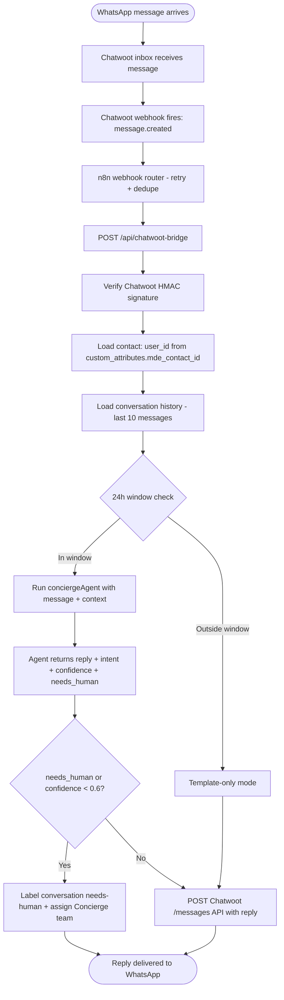

# CW-3 — `/api/chatwoot-bridge`

## 0. Quick Read

**What this does in one sentence:** When a WhatsApp message arrives in Chatwoot, this route runs it through the same Mastra `conciergeAgent` that powers the CopilotKit web chat — so Roberto's WhatsApp message and Camila's browser chat share one brain, one memory, one tool set.

**Why this is the critical unlock:** CW-1 deploys Chatwoot. CW-2 wires WhatsApp. But without CW-3, those two systems don't talk to Mastra. CW-3 is the bridge that makes all of TIER R3-B (C7, C14, M7, M8) possible.

| Persona | Before | After |
|---------|--------|-------|
| **Tourist on WhatsApp** | Sends message to MDE AI → no reply | Gets AI response from same concierge that powers the website |
| **Patricia** | Two separate AI systems (web + WhatsApp) | One Mastra brain; all conversations in Chatwoot inbox |
| **Roberto (venue host)** | No WhatsApp from MDE AI | Receives reservation requests and campaign messages |
| **Dev (Sofía)** | No messaging integration | Bridge logs every event; traceable in Mastra Studio |



---

## 1. Purpose

Chatwoot and CopilotKit both talk to Mastra. The bridge is the glue on the Chatwoot side. It:
1. Receives Chatwoot webhook events via n8n (retries, deduplication)
2. Hydrates the Mastra agent call with Chatwoot contact attributes (intent, lead score, preferences)
3. Enforces the WhatsApp 24h window before any free-form send
4. Routes the AI response back as a Chatwoot reply, private note, or human escalation

The bridge is **stateless** — all state lives in Supabase (Mastra thread memory) and Chatwoot (conversation history). It can be deployed as a standard Next.js API route.

## 2. Goals

- `POST /api/chatwoot-bridge` handles `message.created` and `conversation.status_changed` events
- HMAC signature verification (`X-Chatwoot-Signature` header)
- Contact lookup: `contact.custom_attributes.mde_contact_id` → Supabase `user_id` → Mastra thread
- 24h window check: check `conversation.meta.created_at` or `last_customer_message_at` before free-form send
- `conciergeAgent` run with message + contact context + conversation history
- `needs_human` flag → Chatwoot conversation label + team assignment
- Post AI reply to Chatwoot: `POST /api/v1/conversations/:id/messages`
- `npm run build` exits 0; Vitest floor stays ≥ 401

## 3. Wiring plan

### 3A — API route

| Layer | File | Action |
|-------|------|--------|
| Bridge | `src/app/api/chatwoot-bridge/route.ts` | Create — POST; HMAC verify; contact hydration; Mastra run; Chatwoot reply |
| Types | `src/lib/chatwoot/types.ts` | Create — `ChatwootEvent`, `ChatwootContact`, `ChatwootMessage` TypeScript types |
| Client | `src/lib/chatwoot/client.ts` | Create — `sendMessage`, `labelConversation`, `assignTeam`, `postPrivateNote` helpers |
| Window check | `src/lib/chatwoot/window-check.ts` | Create — `isWithin24hWindow(conversation): boolean`; used by bridge + C7 wa_campaign tool |

### 3B — n8n webhook workflow

Configure in n8n (running on same Hetzner VPS):
- Trigger: Chatwoot webhook → `message.created` where `message.message_type = 'incoming'`
- Filter: skip bot messages (`message.sender.type = 'agent_bot'`)
- HTTP call: `POST https://mdeai.co/api/chatwoot-bridge` with `Authorization: Bearer ${CHATWOOT_BRIDGE_SECRET}`
- Retry: 3 attempts, 10s backoff on 5xx

## 4. Bridge route

```ts
// src/app/api/chatwoot-bridge/route.ts (skeleton)
import { NextRequest, NextResponse } from 'next/server'
import { verifyChatwootSignature } from '@/lib/chatwoot/client'
import { isWithin24hWindow } from '@/lib/chatwoot/window-check'
import { mastra } from '@/mastra'

export async function POST(req: NextRequest) {
  const body = await req.text()
  const sig = req.headers.get('x-chatwoot-signature') ?? ''

  if (!verifyChatwootSignature(body, sig)) {
    return NextResponse.json({ error: 'invalid signature' }, { status: 401 })
  }

  const event = JSON.parse(body)
  if (event.event !== 'message_created' || event.message_type !== 'incoming') {
    return NextResponse.json({ ok: true }) // ignore outbound + status events
  }

  const contactId = event.meta?.sender?.custom_attributes?.mde_contact_id
  const inWindow = isWithin24hWindow(event.conversation)
  const threadId = `chatwoot-${event.conversation.id}`

  const agent = mastra.getAgent('conciergeAgent')
  const result = await agent.generate(event.content, {
    threadId,
    resourceId: contactId ?? event.meta?.sender?.id?.toString(),
    context: {
      channel: 'whatsapp',
      inWhatsAppWindow: inWindow,
      intent: event.conversation.meta?.channel,
    },
  })

  // Post reply or escalate
  if (result.text) {
    await sendChatwootMessage(event.conversation.id, result.text)
  }

  return NextResponse.json({ ok: true })
}
```

## 5. Edge cases

- **Duplicate events:** n8n may send the same `message_created` event twice. Add an idempotency check using `event.id` (cache in Redis or check a `bridge_processed_events` Supabase table for 5 minutes).
- **No `mde_contact_id`:** new WhatsApp users won't have a Supabase user yet. Create a shadow user (`auth.users` with `phone` identity) and set `mde_contact_id` in Chatwoot custom attributes. CW-4 handles the contact mirror.
- **Agent response timeout:** Mastra agent calls can take 3–8 seconds. Set n8n HTTP timeout to 30s. If the bridge returns a 408 or 5xx, n8n retries — ensure idempotency.
- **Language:** conciergeAgent system prompt should detect Spanish vs English from the message and respond in kind. Phase 1 = English only per CLAUDE.md; remove this gate in Phase 2.
- **Private notes vs replies:** when `needs_human = true`, post the AI reasoning as a **private note** (visible to human agent only), not a customer-visible reply. Use `message_type: 'activity'` in the Chatwoot API.

## 6. Environment variables

```env
CHATWOOT_URL=https://chat.mdeai.co
CHATWOOT_API_TOKEN=<super_admin_or_bot_user_token>
CHATWOOT_BRIDGE_SECRET=<shared secret for n8n→bridge auth>
CHATWOOT_WEBHOOK_HMAC_KEY=<from Chatwoot Settings > Integrations > Webhooks>
```

## 7. Acceptance criteria

1. `POST /api/chatwoot-bridge` returns 200 for a valid `message_created` event with correct HMAC.
2. Returns 401 for events with invalid HMAC signatures.
3. `conciergeAgent` reply is posted to the correct Chatwoot conversation via the Chatwoot API.
4. Conversations outside the 24h window do not receive free-form replies (verified by a Vitest test with a mocked window check).
5. `needs_human = true` response labels the conversation `needs-human` in Chatwoot.
6. `npm run build` exits 0; Vitest floor stays ≥ 401.

## 8. Outcomes

| | Before | After |
|---|---|---|
| WhatsApp → Mastra | No connection | Live bridge; all WhatsApp messages run through conciergeAgent |
| Web vs WhatsApp AI | Two separate systems | One shared Mastra brain; same tools, same memory |
| 24h window enforcement | Unguarded | Checked in bridge before every send |
| Human escalation | No mechanism | `needs_human` → Chatwoot team assignment + private note |
