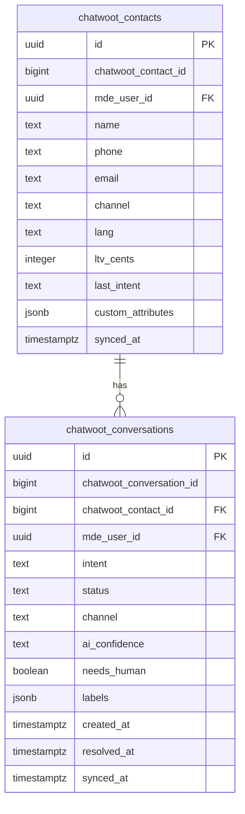

# CW-4 — Contact & Conversation Mirror

## 0. Quick Read

**What this does in one sentence:** Every Chatwoot contact and conversation is mirrored into two Supabase tables so Patricia can `SELECT count(*) FROM chatwoot_conversations WHERE intent='rental' AND created_at > now()-7d` instead of clicking through the Chatwoot UI, and so Mastra agents can query lead history without hitting the Chatwoot API.

**Why mirror instead of query Chatwoot directly:** Chatwoot's API is rate-limited and introduces latency into every agent call. Supabase is already the source of truth for business objects. The mirror makes Chatwoot conversations first-class query targets alongside `leads`, `reservations`, and `subscriptions`.

| Source (Chatwoot) | Mirror (Supabase) | Why |
|-------------------|-------------------|-----|
| Contact profile + custom attrs | `chatwoot_contacts` | Mastra context hydration |
| Conversation + labels + status | `chatwoot_conversations` | Patricia analytics + M9 dashboards |



---

## 1. Purpose

The CW-3 bridge already maps `chatwoot_contact.custom_attributes.mde_contact_id` to a Supabase `user_id`. CW-4 completes that mapping by creating the mirror tables and the upsert logic that keeps them current.

Two use cases:
1. **Mastra context:** agents read `chatwoot_contacts` to hydrate `last_intent`, `ltv_cents`, `lang` into the system prompt — no Chatwoot API call needed.
2. **Patricia's analytics:** `chatwoot_conversations` is queryable with SQL for conversation volume, intent distribution, resolution rate, and human handoff rate.

**Source-of-truth rule (from Chatwoot PRD §3):** Chatwoot owns the *conversation*; Supabase owns the *business object*. The mirror is a read-optimized copy — never write business data to the mirror and sync back to Chatwoot. Data flows one way: Chatwoot → Supabase.

## 2. Goals

- `chatwoot_contacts` table: upserted on `contact.created` and `contact.updated` Chatwoot webhook events
- `chatwoot_conversations` table: upserted on `conversation.created`, `message.created`, `conversation.status_changed`
- `mde_contact_id` custom attribute set in Chatwoot when a new contact maps to a Supabase auth user (phone match or email match)
- `npm run build` exits 0; Vitest floor stays ≥ 401

## 3. Wiring plan

### 3A — Schema

| Layer | File | Action |
|-------|------|--------|
| Migration | `supabase/migrations/YYYYMMDD_chatwoot_mirror.sql` | Create — see §4 |

### 3B — Bridge extension

| Layer | File | Action |
|-------|------|--------|
| Bridge | `src/app/api/chatwoot-bridge/route.ts` | Modify (CW-3) — add contact + conversation upsert on relevant events |
| Mirror util | `src/lib/chatwoot/mirror.ts` | Create — `upsertContact(event)`, `upsertConversation(event)` |

## 4. Schema

```sql
-- supabase/migrations/YYYYMMDD_chatwoot_mirror.sql

CREATE TABLE public.chatwoot_contacts (
  id                      uuid PRIMARY KEY DEFAULT gen_random_uuid(),
  chatwoot_contact_id     bigint UNIQUE NOT NULL,
  mde_user_id             uuid REFERENCES auth.users(id),
  name                    text,
  phone                   text,
  email                   text,
  channel                 text,
  lang                    text DEFAULT 'en',
  ltv_cents               integer DEFAULT 0,
  last_intent             text,
  custom_attributes       jsonb NOT NULL DEFAULT '{}',
  synced_at               timestamptz NOT NULL DEFAULT now()
);
ALTER TABLE public.chatwoot_contacts ENABLE ROW LEVEL SECURITY;
CREATE POLICY "service_role_only" ON public.chatwoot_contacts USING (false);
-- Patricia reads via admin API route with service role

CREATE TABLE public.chatwoot_conversations (
  id                          uuid PRIMARY KEY DEFAULT gen_random_uuid(),
  chatwoot_conversation_id    bigint UNIQUE NOT NULL,
  chatwoot_contact_id         bigint NOT NULL,
  mde_user_id                 uuid REFERENCES auth.users(id),
  intent                      text,
  status                      text,
  channel                     text,
  ai_confidence               numeric(3,2),
  needs_human                 boolean DEFAULT false,
  labels                      jsonb NOT NULL DEFAULT '[]',
  created_at                  timestamptz NOT NULL DEFAULT now(),
  resolved_at                 timestamptz,
  synced_at                   timestamptz NOT NULL DEFAULT now()
);
ALTER TABLE public.chatwoot_conversations ENABLE ROW LEVEL SECURITY;
CREATE POLICY "service_role_only" ON public.chatwoot_conversations USING (false);
```

## 5. Edge cases

- **Phone number matching:** When a new Chatwoot contact arrives with a phone number that matches an `auth.users` entry, set `mde_user_id` and write `mde_contact_id` back to Chatwoot via the API. This connects the WhatsApp identity to the web identity.
- **No match:** Contacts with no Supabase match get `mde_user_id = NULL`. Mastra agents handle null gracefully (no personalization; still reply).
- **`service_role_only` RLS:** the mirror tables are never read by end users. Use service role key in bridge + admin API routes only — consistent with CLAUDE.md F13 carve-out rules.
- **Sync lag:** the mirror may be 1–5 seconds behind Chatwoot. Never use the mirror as the authoritative source for Chatwoot conversation state — that is always the Chatwoot API. Use the mirror for analytics and agent context only.

## 6. Acceptance criteria

1. `chatwoot_contacts` table exists with RLS `service_role_only` policy.
2. `chatwoot_conversations` table exists with RLS `service_role_only` policy.
3. A new Chatwoot conversation triggers a `chatwoot_conversations` upsert via the bridge.
4. `mde_user_id` is populated when the contact phone matches a Supabase auth user.
5. Patricia can `SELECT intent, count(*) FROM chatwoot_conversations GROUP BY intent` and get accurate results.
6. `npm run build` exits 0; Vitest floor stays ≥ 401.
