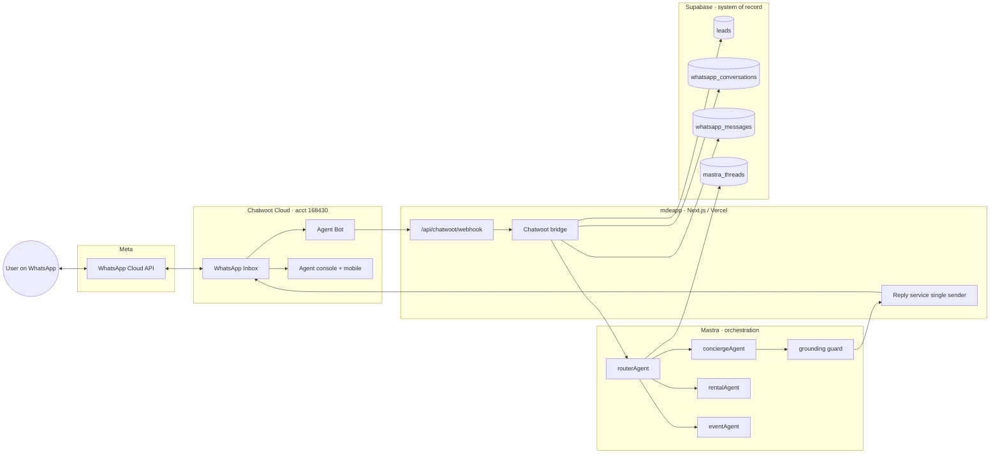
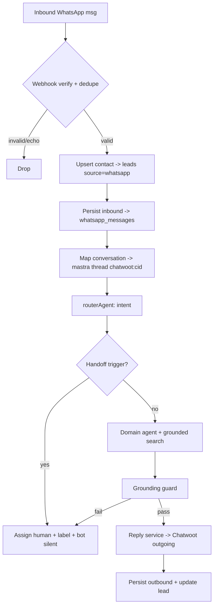
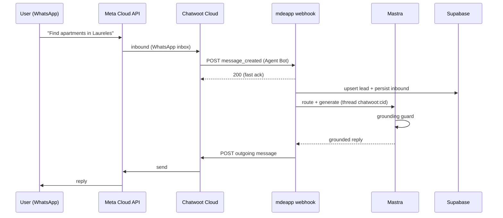
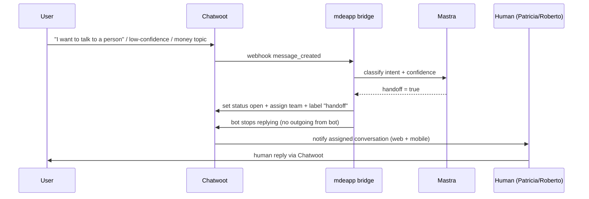
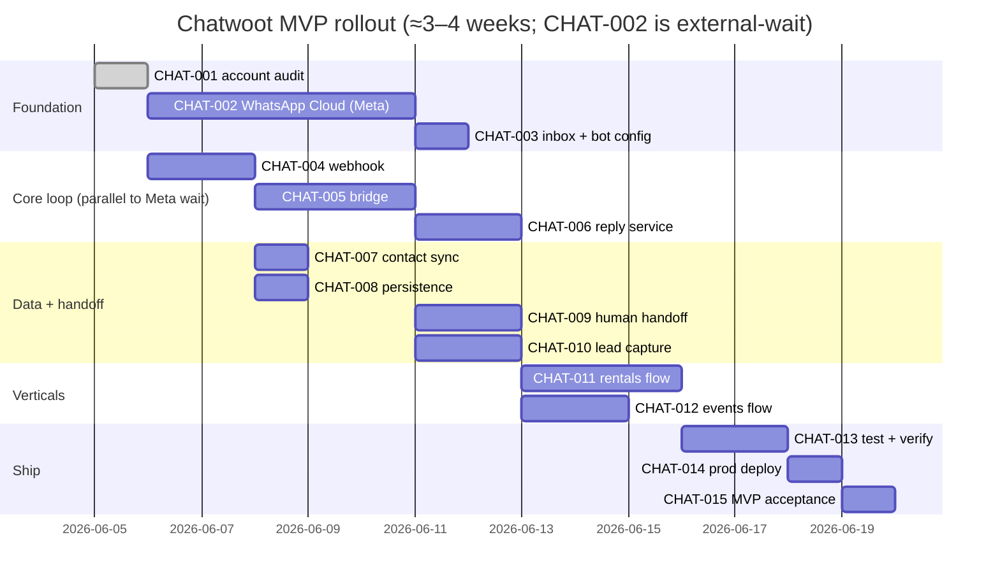
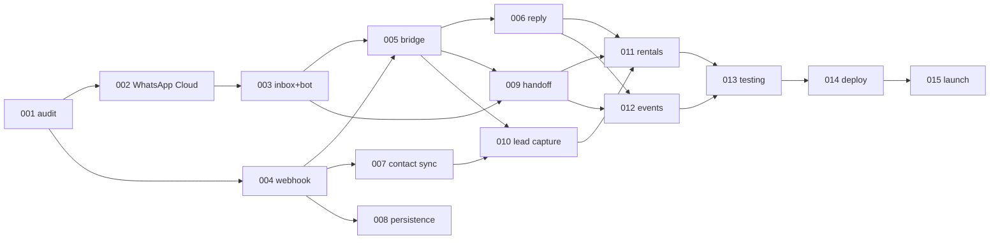

# Chatwoot + WhatsApp + Mastra — Production MVP Implementation Plan

> **One-line verdict:** The hard part already exists (Mastra brain + 7 Gemini agents + grounded search + Supabase as system-of-record). What's missing is the *channel plumbing* — a WhatsApp number on Meta, a Chatwoot inbox, and a ~6-file webhook→bridge→reply loop in `mdeapp`. Smallest MVP = **receive → answer (grounded) → capture lead → hand to human**, nothing more.
>
> **Scope guardrails (honored):** no advanced WhatsApp automation, no campaign system, no RAG/vector search, no multi-agent orchestration, no second AI framework. Mastra stays the brain; Chatwoot is the channel + human layer; Supabase is the record.
>
> **Companion docs:** architecture decision + responsibility split → [`prd-chatwoot.md`](prd-chatwoot.md); full WA-*/AGT-* sequencing → [`roadmap-chatwoot.md`](roadmap-chatwoot.md). **This doc is the MVP execution track (`CHAT-001…015`)** that maps to the Linear `chatwoot` project.

---

## 0. Readiness scorecard + next action

| Metric | Score | Why |
|---|---|---|
| **Production readiness** | **2 / 10** | Only the Chatwoot Cloud account + a valid admin token exist. 0 inboxes, 0 WhatsApp number, 0 webhook, 0 bridge code, not deployed. |
| **MVP readiness** | **3 / 10** | The reusable foundation is strong (brain, agents, grounded search, Supabase SoR, dormant `whatsapp_*` tables). Channel loop is greenfield but small and well-scoped. |
| **Critical-path blocker** | — | **Meta WhatsApp Cloud API provisioning** (CHAT-002): Business verification + phone number + WABA + permanent token. Multi-day external lead time. |

**Recommended next action (do today):** Start **CHAT-002 Meta provisioning immediately** — it is the only multi-day, externally-gated dependency. In parallel (no Meta dependency), build **CHAT-004 webhook** + **CHAT-005 bridge** against a Chatwoot *test* inbox so code is ready the moment the WhatsApp number lands. Decision to confirm first: **use Chatwoot Cloud for MVP** (already provisioned) and defer self-hosting to a post-revenue cost-optimization.

---

## 1. Connectivity verification (live, 2026-06-05)

Ran against `mdeapp/.env.local` creds (token never printed; responses filtered to non-secret fields).

| Check | Result | Evidence |
|---|---|---|
| **API token valid** | ✅ PASS | `GET /api/v1/profile` → **HTTP 200**; user "Sanjiv Khullar" (`it@socialmediaville.ca`), token len 24 |
| **Account ID valid** | ✅ PASS | `CHATWOOT_ACCOUNT_ID=168430`; role **administrator** on account "socialmediaville", status active |
| **Chatwoot Cloud confirmed** | ✅ PASS | `CHATWOOT_BASE_URL=https://app.chatwoot.com` → hosted **Cloud** (not self-host) |
| **Inbox access** | ⚠️ EMPTY | `GET …/inboxes` → **HTTP 200, count 0** — no inboxes provisioned at all |
| **WhatsApp integration** | ❌ NOT CONNECTED | 0 inboxes ⇒ no WhatsApp channel; no Meta/WABA creds in env |
| **Agents / handoff queue** | ⚠️ 1, OFFLINE | Only the admin (Sanjiv), `availability_status: offline` — no staffed human queue |
| **Conversation volume** | 0 | `all_count: 0` — blank account |

### Credentials present vs missing

| Present (`.env.local` + Infisical) | Missing — **blockers to ticket** |
|---|---|
| `CHATWOOT_BASE_URL` ✅ | `WHATSAPP_PHONE_NUMBER_ID` (Meta) |
| `CHATWOOT_API_URL` ✅ | `WHATSAPP_BUSINESS_ACCOUNT_ID` / WABA ID |
| `CHATWOOT_ACCOUNT_ID` ✅ | `WHATSAPP_PERMANENT_TOKEN` (Meta system-user) |
| `CHATWOOT_API_TOKEN` ✅ (admin) | `WHATSAPP_VERIFY_TOKEN` (webhook handshake) |
| | `CHATWOOT_WEBHOOK_SECRET` / Agent-Bot token (HMAC) |
| | `CHATWOOT_INBOX_ID` (none yet — set after CHAT-002) |

> **Correction to prior PRD:** `prd-chatwoot.md` assumed **self-hosting on Hetzner/Coolify**. Reality: **Chatwoot Cloud is already in use** (admin access confirmed). For MVP, use Cloud — self-host becomes a later cost lever, not a launch task. CHAT-001 is therefore an **audit**, not a deploy.

---

## 2. Architecture-fit audit

**Responsibility split (one brain, no duplication):**

| Concern | Owner | Verified today |
|---|---|---|
| Channel transport (WhatsApp/IG/web), inbox, agent console, mobile, CSAT, routing | **Chatwoot Cloud** | Account live; inbox/bot net-new |
| Reasoning, routing, tools, grounded search, formatting | **Mastra** | 7 agents incl. `routerAgent` + `conciergeAgent`, all `gemini-3.5-flash` ✅ |
| Web chat UI (CopilotKit) | **CopilotKit 1.55.2** | Live at `/api/copilotkit`; **unchanged** — WhatsApp is a parallel channel, not a replacement |
| System of record (leads, contacts, messages, threads) | **Supabase** | `leads`, `whatsapp_conversations`, `whatsapp_messages`, `mastra_threads` exist ✅ |
| Inbound/outbound transport API + AI orchestration glue | **mdeapp (Next.js/Vercel)** | `/api/chatwoot/**` route **does not exist** — net-new |

**Component-by-component verdict:**

| Component | Role in MVP | Status today | Fit |
|---|---|---|---|
| **Chatwoot** | Channel + human handoff + conversation CRM | Cloud acct `168430`, admin, **0 inboxes** | ✅ Right tool; needs config (CHAT-002/003) |
| **WhatsApp Cloud API** | The revenue channel | Not connected; no Meta creds | ❌ **Blocker** (CHAT-002) |
| **Mastra** | Orchestration brain | `routerAgent`+`conciergeAgent`+5 more, Gemini | ✅ Reuse as-is |
| **conciergeAgent / routerAgent** | Intent routing + grounded answers | Registered in `src/mastra/index.ts` | ✅ Reuse; no new agents |
| **Gemini** | The only production model | `gemini-3.5-flash` via `src/mastra/lib/models.ts` | ✅ No Anthropic/OpenAI |
| **CopilotKit** | Web concierge | Live, pinned 1.55.2 | ✅ Untouched |
| **Supabase** | Record of leads/contacts/messages | `leads` (source free-text) + dormant `whatsapp_*` | ✅ Reuse; minor columns only |
| **Grounding/observability** | Anti-hallucination gate before reply | 0 scorers today (`SAN-588`/AGT-00A/B) | ⚠️ Reply guard needed before broad rollout |

**Reuse, don't rebuild:** `leads` (contact sync, `source='whatsapp'` needs **no migration**), `whatsapp_conversations` + `whatsapp_messages` (dormant — repurpose for persistence), `mastra_threads` (agent memory), `approval_requests`/`approval_decisions` (handoff/escalation audit), edge fn `chat-lead-capture` (G2 pattern for CHAT-010).

---

## 3. Target MVP architecture

### 3.1 Architecture diagram

### 3.2 Data flow

### 3.3 Webhook flow

### 3.4 Human handoff flow

### 3.5 MVP rollout sequence

**Recommended implementation order (dependency-true):**
`001 → (002 ∥ 004) → 003 → 005 → {006, 007, 008} → {009, 010} → {011, 012} → 013 → 014 → 015`.
The unlock: **004/005 don't wait on Meta** — build the loop against a Chatwoot test inbox, then swap the WhatsApp inbox in once CHAT-002 clears.

---

## 4. Task specifications — CHAT-001 … CHAT-015

Each maps to a Linear issue in project `chatwoot` (label **CHATW**, team **SAN**).
Effort scale: **XS** ≤0.5d · **S** ~1d · **M** 2–3d · **L** 4–5d. Priority: P0 critical path · P1 needed for MVP · P2 fast-follow.

### CHAT-001 — Chatwoot account audit & credential verification — P0 · XS
- **Objective:** Confirm the Chatwoot Cloud account, token, and access are usable, and enumerate missing creds.
- **Scope:** Validate `CHATWOOT_*` creds; record account/role/inbox/agent state; list Meta/webhook creds still needed. **No self-host.**
- **Dependencies:** none.
- **Acceptance criteria:** `/profile` 200; account `168430` admin confirmed; inbox count recorded (0); missing-creds list produced; creds live in Infisical.
- **Technical notes:** Done 2026-06-05 — see §1. Creds already in Infisical (`md-eapp-hn-nz/dev`). Keep token server-side only.
- **Risks:** Token is a *personal admin* token — plan rotation + a scoped bot token (CHAT-003) for runtime.
- **DoD:** §1 table signed off; Meta-creds gap captured as CHAT-002 inputs.

### CHAT-002 — WhatsApp Cloud API connection — P0 · M (external-gated)
- **Objective:** Connect a live WhatsApp number to Chatwoot via Meta WhatsApp Cloud API.
- **Scope:** Meta Business verification, WABA, phone number, system-user permanent token; create the Chatwoot **WhatsApp (Cloud)** inbox.
- **Dependencies:** CHAT-001.
- **Acceptance criteria:** Inbound test message lands in Chatwoot; outbound session reply delivered; inbox id captured to `CHATWOOT_INBOX_ID`.
- **Technical notes:** Chatwoot → Inboxes → Add → WhatsApp → *WhatsApp Cloud*. Needs Phone Number ID, WABA ID, permanent token, verify token. Pre-register ≥1 utility template for outside-24h replies.
- **Risks:** Meta Business verification can take days; template approval latency; 24-hour customer-care window; number provisioning.
- **DoD:** WhatsApp inbox live in acct 168430 with a verified number; inbound+outbound smoke pass.

### CHAT-003 — Chatwoot inbox configuration — P0 · S
- **Objective:** Configure the WhatsApp inbox + an Agent Bot + routing primitives so messages hit the bot first.
- **Scope:** Inbox settings (greeting, working hours, auto-assignment); create Agent Bot → mdeapp webhook URL; teams + labels (`rentals`, `events`, `handoff`).
- **Dependencies:** CHAT-002.
- **Acceptance criteria:** Agent Bot assigned to the WhatsApp inbox; a test message reaches the bot webhook (not a human); labels exist; a scoped bot/HMAC token issued.
- **Technical notes:** Agent Bot via Platform API `POST /platform/api/v1/agent_bots` then `…/inboxes/{id}/set_agent_bot`, or dashboard. Capture the bot's webhook signing token → `CHATWOOT_WEBHOOK_SECRET`.
- **Risks:** Agent-Bot creation on **Cloud** may require Platform/superadmin access or a plan tier — verify early; if gated, fall back to inbox webhooks + Application API.
- **DoD:** Bot connected; test message routed to bot; tokens in Infisical.

### CHAT-004 — Webhook endpoint setup in mdeapp — P0 · S–M
- **Objective:** Receive + verify Chatwoot events in Next.js.
- **Scope:** `src/app/api/chatwoot/webhook/route.ts`; signature/secret verify; parse `message_created`/`conversation_created`; fast 200 ack; filter bot/self echoes; dedupe by message id.
- **Dependencies:** CHAT-003 (buildable in parallel vs a test inbox).
- **Acceptance criteria:** Live Chatwoot event received + verified + 200 within budget; `message_type=outgoing`/bot echoes ignored; duplicate ids dropped; floor green.
- **Technical notes:** Server-only route; per F13 carve-out may use service-role for `mastra_*`/`leads` if user identity not applicable (webhook is machine-to-machine). Verify shared secret; respond 200 fast, process async.
- **Risks:** Signature scheme differences (HMAC vs bot token); Chatwoot retries → idempotency; fast-ack vs sync agent latency (don't block the 200 on the model).
- **DoD:** Real test event logged + verified; unit tests for parse+verify+dedupe; floor green.

### CHAT-005 — Chatwoot → Mastra bridge — P0 · M
- **Objective:** Turn an inbound message into a grounded agent reply.
- **Scope:** Map Chatwoot conversation → Mastra thread/resource; invoke `routerAgent` (intent) → domain agent; collect reply; apply grounding guard before returning.
- **Dependencies:** CHAT-004.
- **Acceptance criteria:** "Find apartments in Laureles" → rental intent → grounded draft reply (no fabricated listings) in logs.
- **Technical notes:** Reuse `getLocalAgents`/Mastra core; `threadId = chatwoot:{conversation_id}`, `resourceId = contact`. Call `agent.generate`. Gate output on grounding (AGT-00A/B); on low confidence → handoff (CHAT-009).
- **Risks:** Latency UX; **0 scorers today** → hallucination risk under mdeai's name; thread mapping correctness.
- **DoD:** End-to-end inbound→agent→grounded draft demonstrated; thread persists across turns.

### CHAT-006 — Mastra → Chatwoot reply service — P0 · S–M
- **Objective:** Send the agent reply back into the conversation — as the **single sender**.
- **Scope:** `POST …/conversations/{cid}/messages` (`message_type=outgoing`); message splitting/formatting; mark bot-handled; retries.
- **Dependencies:** CHAT-005.
- **Acceptance criteria:** Agent reply appears in the WhatsApp thread via Chatwoot; **no direct Meta Graph send** anywhere (one sender only).
- **Technical notes:** Chatwoot is the only egress to Meta. Reuse a WA-003-style formatter (split long answers, strip markdown). Backoff on 429.
- **Risks:** **Double-send → WhatsApp ban** if any code also calls Graph directly — forbid it; rate limits.
- **DoD:** Round-trip reply delivered to the test number; single-sender invariant asserted in tests.

### CHAT-007 — Contact sync to Supabase — P1 · S
- **Objective:** Upsert each Chatwoot contact into `leads` (system of record).
- **Scope:** On contact/conversation created → upsert `leads` with phone, name, `source='whatsapp'`, `chatwoot_contact_id`, `chatwoot_conversation_id`.
- **Dependencies:** CHAT-004.
- **Acceptance criteria:** New WhatsApp contact → exactly one `leads` row (idempotent by phone) with `source='whatsapp'` + Chatwoot ids.
- **Technical notes:** `leads.source` is free-text → **no migration** for the value. Adding `chatwoot_*` columns: new columns need nothing RLS-wise (table already has policies) but re-confirm RLS coverage.
- **Risks:** Dedupe by phone; PII handling/consent; RLS regressions.
- **DoD:** Upsert verified idempotent; lead visible to ops.

### CHAT-008 — Conversation persistence — P2 · S
- **Objective:** Persist message history for analytics + Supabase-as-SoR (without re-storing what Chatwoot already keeps).
- **Scope:** Write inbound+outbound to dormant `whatsapp_conversations` + `whatsapp_messages` with direction, ts, conversation link.
- **Dependencies:** CHAT-004 (inbound), CHAT-006 (outbound).
- **Acceptance criteria:** Every message persisted with direction + conversation FK; queryable in Supabase.
- **Technical notes:** Repurpose the dormant tables (already RLS service-role). **Don't duplicate** Chatwoot's transcript — persist only fields analytics/lead-scoring need. `mastra_threads` already covers agent memory.
- **Risks:** Over-persistence/duplication; RLS; storage growth.
- **DoD:** Messages queryable; no duplicate source-of-truth confusion documented.

### CHAT-009 — Human handoff workflow — P1 · S–M
- **Objective:** Escalate bot → human inside Chatwoot, cleanly.
- **Scope:** Handoff triggers (explicit "talk to a person", low confidence, money/trust, grounding-fail); set conversation `open`, unassign bot, assign team/agent, label `handoff`; **bot goes silent**.
- **Dependencies:** CHAT-005, CHAT-003.
- **Acceptance criteria:** Trigger → conversation leaves bot, enters human queue, agent notified; bot sends nothing further.
- **Technical notes:** `toggle_status` (open) + assignment API + label. Gate bot replies on `assignee_type`/status so a human-owned convo never gets a bot message.
- **Risks:** **Only 1 agent, offline today** → define staffed hours + fallback ("we'll reply soon"); race where bot replies after handoff.
- **DoD:** Live handoff demo; post-handoff bot-silence asserted.

### CHAT-010 — Lead capture workflow — P1 · S–M
- **Objective:** Qualify + capture a structured lead from the conversation.
- **Scope:** Extract intent/budget/neighborhood/contact → update `leads`; notify ops.
- **Dependencies:** CHAT-005, CHAT-007.
- **Acceptance criteria:** A rental inquiry yields a qualified `leads` row (intent, budget, area) visible to Patricia.
- **Technical notes:** Reuse the G2 `chat-lead-capture` edge-fn pattern; a Mastra tool writes structured fields. Capture consent.
- **Risks:** Extraction accuracy; consent/PII; over-qualification friction.
- **DoD:** Qualified lead persisted + visible in ops view.

### CHAT-011 — Rentals concierge flow — P1 · M
- **Objective:** First revenue vertical, end-to-end on WhatsApp.
- **Scope:** Rental intent → `routerAgent` → `rentalAgent` + `search_rentals` → grounded results → offer viewing / handoff / lead.
- **Dependencies:** CHAT-006, CHAT-009, CHAT-010.
- **Acceptance criteria:** "Find apartments in Laureles" → real grounded listings + next step (viewing or human).
- **Technical notes:** Reuse `rentalAgent` + `search_rentals`; no new agent. Grounding guard mandatory.
- **Risks:** Grounding; live inventory availability; expectations on response time.
- **DoD:** Full rental conversation demoed on the test WhatsApp number.

### CHAT-012 — Events concierge flow — P2 · M
- **Objective:** Second vertical — event discovery + ticket support.
- **Scope:** Events intent → `eventAgent`/`conciergeAgent` + `search_events`; ticket resend/support; handoff for edge cases.
- **Dependencies:** CHAT-006, CHAT-009.
- **Acceptance criteria:** "What's on this weekend?" answered grounded; "resend my ticket" handled after identity check.
- **Technical notes:** Reuse `eventAgent` + `search_events`; ticket lookup must **verify identity before resend**.
- **Risks:** Ticket-resend auth (impersonation); event data freshness.
- **DoD:** Events conversation demoed; resend gated on identity.

### CHAT-013 — Testing & verification — P1 · M
- **Objective:** Prove the loop + guard against regressions.
- **Scope:** Unit (webhook parse/verify/dedupe, bridge mapping, single-sender), integration (mocked Chatwoot), one **live** smoke on the test number; floor green.
- **Dependencies:** CHAT-011, CHAT-012 (and CHAT-008).
- **Acceptance criteria:** Vitest + Playwright green; localhost runtime proof; a recorded inbound→reply→lead→handoff demo.
- **Technical notes:** Mock external (Meta/Chatwoot) for CI; 1 gated live smoke. Use `mastra-smoke-test` + `/verify-floor`.
- **Risks:** External flakiness → mock + single live smoke; secrets in CI.
- **DoD:** Floor + smoke + demo evidence attached.

### CHAT-014 — Production deployment — P1 · S–M
- **Objective:** Ship webhook + bridge to prod and point Chatwoot at it.
- **Scope:** Prod env (Vercel/Infisical), deploy, set Chatwoot Agent-Bot/webhook URL to prod, verify round-trip; rollback plan.
- **Dependencies:** CHAT-013.
- **Acceptance criteria:** Prod webhook receives a real WhatsApp message + replies; monitoring/alerts on.
- **Technical notes:** Infisical prod path supplies secrets (build/start stay raw per repo convention); watch cold-start latency; document rollback (revert bot URL to test).
- **Risks:** Secret management; cold starts; no rollback path.
- **DoD:** Prod round-trip verified; alerting live.

### CHAT-015 — MVP acceptance & launch checklist — P2 · S
- **Objective:** Go/no-go gate for first real users.
- **Scope:** Acceptance checklist (receive / answer-grounded / capture-lead / handoff), readiness re-score, runbook + on-call, staffed-hours plan.
- **Dependencies:** CHAT-014.
- **Acceptance criteria:** All 4 MVP capabilities demoed **in prod**; handoff queue staffed; runbook signed; first real user conversation logged.
- **Technical notes:** Lightweight CSAT/SLA defaults in Chatwoot; define escalation owner.
- **Risks:** Unstaffed handoff queue at launch; Meta policy/quality rating.
- **DoD:** Signed launch checklist; first real conversation handled end-to-end.

### Dependency map

---

## 5. Risks, security, cost

### Critical blockers
| # | Blocker | Impact | Mitigation |
|---|---|---|---|
| B1 | **No Meta WhatsApp Cloud API** (no number/WABA/token) | No channel = no MVP | Start CHAT-002 today; build 004/005 against test inbox meanwhile |
| B2 | **0 inboxes in Chatwoot** | Nothing to receive on | CHAT-002/003 |
| B3 | **0 scorers / grounding guard** | Hallucination under mdeai's name on a high-stakes channel | Gate replies on AGT-00A/B before broad rollout (CHAT-005) |
| B4 | **Handoff queue unstaffed** (1 agent, offline) | Escalations go nowhere | Staffed-hours + fallback message (CHAT-009/015) |
| B5 | **Agent-Bot on Cloud may be plan/Platform-gated** | Bridge can't intercept pre-human | Verify in CHAT-003; fallback to inbox webhook + App API |

### Security concerns
- **Single admin token in env** → rotate; issue a **scoped bot token** for runtime (CHAT-003). Never expose `CHATWOOT_API_TOKEN` client-side.
- **Webhook authenticity** → verify HMAC/shared secret; reject unsigned; idempotent by message id (CHAT-004).
- **Service-role usage** → only in server-only routes per F13 carve-out; never in `src/**` client code; `no-service-role-in-src` hook must pass.
- **PII** (phone numbers, names) in `leads`/`whatsapp_*` → confirm RLS + ≥1 policy on any new column/table; consent capture (CHAT-010).
- **Single-sender invariant** → no direct Meta Graph send; Chatwoot is the only egress (prevents double-send + token sprawl).
- **Ticket resend** → verify identity before sending QR/ticket (CHAT-012) to prevent impersonation.

### Cost considerations
| Item | Driver | Note |
|---|---|---|
| **Chatwoot Cloud plan** | per-agent/mo | MVP fits a small plan; self-host (Hetzner ~€10–40/mo) is a *post-revenue* lever, not launch |
| **Meta WhatsApp conversations** | per-conversation by category (service/utility/marketing) | New WABA ~250 conv/day tier-1; budget by volume; templates for outside-24h |
| **Gemini tokens** | `gemini-3.5-flash` per message | Cheap tier; one round-trip per reply (avoid multi-hop) |
| **Vercel** | already paid | Webhook = serverless; watch cold-start latency |

---

## 6. CHAT-* ↔ existing CW-*/WA-* mapping

`CHAT-*` is the **consolidated MVP execution track** (what gets Linear issues). It supersedes the earlier planning-only `CW-*` numbering and pulls in the relevant `WA-*` brain work:

| CHAT | Supersedes / relates | Note |
|---|---|---|
| 001 | CW-1 | **Audit Cloud**, not self-host deploy (correction) |
| 002 | CW-2 | WhatsApp Cloud API inbox |
| 003 | CW-2/CW-3 | inbox + Agent Bot |
| 004–005 | CW-3 / WA-001 | webhook + bridge (transport port: receive) |
| 006 | WA-002 | reply service (transport port: send, single sender) |
| 007–008 | CW-4 | contact + conversation mirror |
| 009 | CW-8 | human handoff |
| 010 | CW-5 / G2 | lead capture |
| 011 | WA-004 area | rentals vertical |
| 012 | WA-006 | events vertical |
| 013–015 | new | test / deploy / launch |

> **Final recommendation:** Confirm **Chatwoot Cloud for MVP**, fire **CHAT-002** immediately (external lead time), and build the **004→006 loop against a test inbox** in parallel. Keep the brain in Mastra, the channel in Chatwoot, the record in Supabase — and ship the smallest loop that can *receive, answer (grounded), capture a lead, and hand off to a human*. Everything else waits for first revenue.
