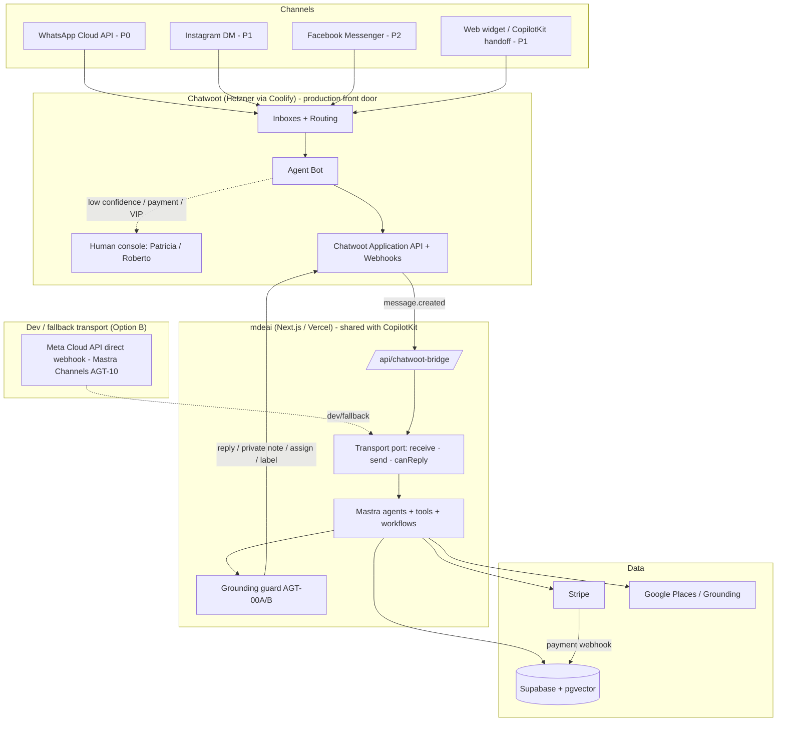

# Chatwoot Omnichannel Concierge for mdeai — PRD

> **One-line thesis:** Chatwoot is the channel + human layer; **Mastra is the brain**; Supabase is the memory; Stripe is the till. Don't rebuild the channel layer — own it via Chatwoot and point it at the agents that already exist.
>
> **MVP scope (build first):** Chatwoot + WhatsApp Cloud API + Agent Bot → Mastra bridge + Supabase lead storage + human handoff. **One vertical: Rentals.** Everything else is sequenced after first revenue.
>
> **Companion roadmap:** the WhatsApp brain-layer workflows (WA-001…WA-010) and how they ride on the `SAN-588` Mastra primitives live in [`roadmap-chatwoot.md`](roadmap-chatwoot.md). This PRD owns the **architecture decision + responsibility split**; the roadmap owns **sequencing**.

---

## Verification note (forensic — read before trusting any claim)

This is **Draft v2**. Draft v1 carried several optimistic claims that are **false against the current codebase**. Everything below was re-checked on **2026-06-05** against `mdeapp/src/mastra/**`, `mdeapp/supabase/**`, and Linear epic **SAN-588 (AGT-00, 24 children)**. Corrections applied:

| Draft-v1 claim | Reality (verified 2026-06-05) | Where corrected |
|---|---|---|
| "Deprecate the legacy `wa_outbox` **cron** — two senders double-send" | `wa_outbox` is a **dormant stub** (migration `20260524024118_…sponsor_whatsapp.sql`, RLS service-role only, **zero application code, no cron running**). No double-send exists *today*; the risk is *future*. | NFR3, CW-9, Risks |
| "Featured listings — reuse existing `sponsor.*` tables" | The tables are **`event_sponsors` + `event_sponsor_placements`**, and they are **event-scoped**. There is **no rental-featured table** — featuring a *rental* is net-new schema or a generalization. | Revenue MVP, CW-7 |
| Mastra "Suspend/Resume — Partial / exists" | **Not implemented.** Only a type exists. The only working HITL is CopilotKit `renderAndWaitForResponse` (web, `host-event-copilot-bridge.tsx`). Server-side approval = **AGT-01/SAN-595** (backlog); durable suspend/resume = **AGT-14/SAN-608** (backlog). | Mastra audit, Feature table |
| Mastra "Resource Memory — Partial / exists" | **Not implemented.** Only **thread-scoped** working memory (`createThreadMemory`, `scope:"thread"`). Resource-scoped durable prefs = **AGT-02/SAN-597** (backlog). | Mastra audit, Feature table |
| Mastra "Observability — Required ✅ (have it)" | **Empty.** 0 scorers, 0 trace spans, 0 output processors. `@mastra/observability` is **not installed** (separate package). Tracing = **AGT-00C/SAN-589** (in progress, re-scoped). | Mastra audit, Feature table |
| `venueAgent` referenced as if buildable cheaply | Confirmed **does not exist**; only **7** agents are registered. It's a genuine gap (nightlife). Framing kept as a gap. | Workflow 3, Phase 4 |
| `leads.source` needs a migration for `'whatsapp'` | `source` is **free-text** (no enum check constraint). `source='whatsapp'` needs **no migration**. | FR4, CW-5 |

> **One number that frames everything:** today the concierge core is decent but the **quality + observability layers are empty** (SAN-588's own one-liner: *0 scorers, 0 trace spans, 0 output processors* on a live AI-search product). Putting that brain on WhatsApp **amplifies** that gap to a higher-stakes channel. The roadmap therefore sequences the **SAN-588 safety primitives (AGT-00A/B/C/D)** ahead of broad WhatsApp automation.

---

# Executive Summary

## Why Chatwoot

mdeai has `whatsapp_*` tables but **no live send/receive loop, no human handoff, no agent console, no omnichannel inbox, no CSAT/SLA/routing** — the `whatsapp_*`/`wa_outbox` tables are dormant stubs with zero code behind them. Building that channel layer in-house is months of undifferentiated plumbing. Chatwoot ships all of it: inbox, agent apps (web + mobile), routing, labels, macros, CSAT, campaigns, audit logs, and a clean **Agent-Bot + webhook** seam that points straight at Mastra.

Chatwoot becomes the **omnichannel front door + human-handoff + conversation CRM**. It receives WhatsApp / Instagram / Facebook / web messages, runs them through an **Agent Bot** (→ Mastra `conciergeAgent`), and escalates to a **human** (Patricia's ops, Roberto's host inbox) when AI confidence is low or money/trust is on the line.

## Build vs Buy

**Buy — self-host.** Chatwoot Community Edition is MIT-licensed and self-hostable on Hetzner via Coolify: no per-seat SaaS fees, full data ownership, full API access.

| Path | Time to working inbox | Ongoing cost | Verdict |
|---|---|---|---|
| Build channel layer in-house | 3–6 months | Eng time forever | ❌ Undifferentiated |
| Chatwoot Cloud (SaaS) | Hours | Per-agent/mo | ⚠️ Recurring + data off-box |
| **Chatwoot self-host (Hetzner/Coolify)** | **Days** | **~€10–40/mo VPS** | ✅ **Recommended** |

> WhatsApp software is free; **Meta conversations are not** — priced per conversation/message by category (service/utility/marketing). Budget by volume; new WABAs start ~250 conv/day (tier 1).

## Strategic fit

mdeai's wedge is **GuideGeek's WhatsApp-first distribution without GuideGeek's shallowness.** GuideGeek informs but cannot transact, has weak grounding, tells users to "open Google Maps yourself," and has no human fallback (it once quoted "$107/night" for a listing that was ~$1,009 on Airbnb — a hallucination that kills trust). mdeai already owns the three things GuideGeek lacks: **grounded local supply** (Places + pgvector), **in-surface booking** (Stripe G1), and a path to **human handoff** (Chatwoot). Chatwoot is the missing distribution + trust layer that turns the existing brain into a WhatsApp concierge.

It also keeps a **clean separation of concerns** and a **shared brain**: the same Mastra agents/tools serve both CopilotKit (web) and the Chatwoot bridge (messaging). No duplicated AI logic. CopilotKit stays the rich web concierge; Chatwoot's web inbox is its **human-handoff destination**, not a replacement.

> ⚠️ **Honest caveat:** the GuideGeek hallucination is exactly the failure mode our *own* concierge is currently **unguarded** against (0 scorers / 0 grounding-assertion processors — SAN-588). Shipping it to WhatsApp without the **AGT-00A/00B faithfulness + grounding scorers** repeats GuideGeek's mistake under our own name. Trust is a *built* feature here, not a free inheritance.

## MVP recommendation

```text
WhatsApp → Chatwoot inbox → Agent Bot → /api/chatwoot-bridge → Mastra (rentalAgent + grounding)
  → 3 listings → schedule viewing → G2 lead capture → Supabase leads → human broker handoff (Roberto)
  → bill qualified lead
```

**Why this slice:** it reuses the **strongest existing assets** (`rentalAgent`, grounding tools, `leads`, `chat-lead-capture` G2 edge function), generates **real revenue immediately** (qualified-lead fees + broker subscriptions) with **no payment rail beyond a Stripe invoice**, and proves the **bot → human handoff** loop that differentiates mdeai from pure bots. One channel, one vertical = fastest to production. Then clone the pattern to restaurants, nightlife, and events.

**Explicitly out of MVP:** Instagram/Facebook, in-chat card payments, Stripe Connect, trip bundles, relocation packages, custom dashboards, Chatwoot's native "Captain" AI, and the WA-007…WA-010 automation tier (host approval, venue outreach, resource memory, broadcast campaigns).

---

# Architecture Decision — Option A / B / C

Prompt-03 asks for an explicit decision. Here it is, with the trade-offs and the verified fact that **decides it**.

| Option | Shape | Pros | Cons |
|---|---|---|---|
| **A — Chatwoot front door** | WhatsApp → **Chatwoot** → Agent Bot → bridge → Mastra → Supabase | Human console/handoff/mobile/CSAT/routing **for free**; single WABA sender; compliance-friendly; omnichannel | Extra infra (self-host Chatwoot); Chatwoot owns the 24h window; one more hop |
| **B — Mastra direct** (the *official* Mastra WhatsApp guide) | WhatsApp → **Mastra workflow** (Meta Cloud API webhook) → sender | Simplest; fewest moving parts; **this is the documented Mastra pattern**; maps to **Mastra `Channels`** | **Zero human layer** — you rebuild inbox/handoff/mobile/CSAT/routing yourself; you alone own WABA window discipline in code |
| **C — Hybrid** ✅ | Chatwoot owns **channel + human**; Mastra owns the **brain**; the **Option-B direct webhook is the pre-WABA dev path + fallback transport** | Strongest half of each; transport-agnostic brain; can develop before WABA verification; not 100% coupled to Chatwoot uptime | Two transports to keep behind one interface (small, contained cost) |

## Decision: **Option C (Hybrid).**

**The deciding fact:** Mastra's own roadmap **already anticipates this**. Linear **AGT-10 / SAN-604** ("Phase-2 interop spike: **Channels (WhatsApp)**") explicitly maps Mastra's `Channels` (`@mastra/core/channels`) to the planned WhatsApp chatbot under `tasks/mastra/whatsapp/`. So Option B isn't a competing architecture — it's the **brain's native channel adapter**, already scoped. Option A is the **production front door**. Hybrid uses both for what each is best at:

- **Chatwoot = channel + human layer (production):** front door, inbox, routing, labels, CSAT, mobile, **single WABA sender**, compliance/opt-in ledger, and the **human handoff** that is mdeai's trust differentiator.
- **Mastra = the brain (both surfaces):** the same agents/tools/workflows that power CopilotKit on the web. The WA-001…WA-010 roadmap is written here, transport-agnostic.
- **Official Mastra direct-webhook (Option B / `Channels`) = dev + fallback:** build and test the WA-* workflows against the **Meta test number** *before* Chatwoot/WABA verification lands, and keep it as a degraded-mode transport if Chatwoot is down. Tracked as **AGT-10/SAN-604**.

**Implementation rule that makes Hybrid cheap:** the WA-* workflows talk to a thin **transport port** — `receive(message)` / `send(reply)` / `canReply(window)` — with **two adapters**: `ChatwootTransport` (prod) and `MetaDirectTransport` (dev/fallback). One brain, two pipes, swapped by config. No agent logic is duplicated.

> **Gemini deviation (must-know):** the official Mastra WhatsApp guide uses Anthropic/OpenAI models. mdeai is **Gemini-only** (`gemini-3.5-flash`, per CLAUDE.md). Every WA-* formatter/agent uses `google("gemini-3.5-flash")`, **not** the guide's models. We adopt the guide's *structure* (webhook → workflow → formatter → sender), not its model choices.

---

# Capability Audit (verified 2026-06-05)

> Prompt-03 rule: *"Do not assume anything exists. Verify."* Three tables — channel, brain, data. **Exists** = in the codebase today; **Reusable** = usable as-is for WhatsApp; **Missing** = the gap to close.

## A. WhatsApp / Chatwoot channel capability

| Capability | Exists | Reusable | Missing (the gap) |
|---|---|---|---|
| WhatsApp send/receive loop | ❌ (stub tables only) | — | Cloud API inbox (CW-2) **or** Mastra `Channels` direct (AGT-10) |
| Omnichannel inbox / agent console | ❌ | — | Chatwoot self-host (CW-1) |
| Human handoff / routing / teams | ❌ | — | Chatwoot Agent Bot + assignment (CW-3/CW-8) |
| Mobile agent app | ❌ | — | Chatwoot native apps (free with CW-1) |
| CSAT / SLA | ❌ | — | Chatwoot CSAT on resolve (CW-10) |
| 24h-window enforcement | ❌ | — | Window check in bridge **and/or** Chatwoot `can_reply?` (NFR1, CW-3) |
| Opt-in / STOP ledger | ⚠️ table only (`whatsapp_subscriptions`, dormant) | ⚠️ schema reusable | Wire STOP handling (CW-2) |
| `wa_outbox` outbound | ⚠️ **dormant stub, zero code** | ❌ (do not revive) | Formally supersede by Chatwoot as single sender (CW-9) |

## B. Mastra brain capability (the corrections live here)

| Capability | Exists | Reusable | Missing (the gap) |
|---|---|---|---|
| `conciergeAgent` (web concierge) | ✅ `gemini-3.5-flash` | ✅ | WhatsApp entrypoint (bridge) |
| `rentalAgent` + grounding tools | ✅ | ✅ | Nothing — drives the MVP slice |
| `hostEventAgent` | ✅ | ✅ | Server tools (0 today; AGT-12/SAN-602) |
| `routerAgent` + 7-agent registry | ✅ (7 registered) | ✅ | Runtime allowlist — all 7 exposed (AGT-00D/SAN-591) |
| Workflows (`createWorkflow`/`createStep`) | ✅ primitive available `@mastra/core@1.35.0` | ✅ | Business workflows (checkout AGT-11, publish AGT-12) |
| **HITL / approval** | ⚠️ **CopilotKit `renderAndWaitForResponse` only (web)** + `approval-commit` edge fn (`request_approval` RPC, `approval_decisions`) | ⚠️ web commit reusable | **Server-side pause** (AGT-01/SAN-595); WhatsApp APPROVE/EDIT/REJECT has no gate yet |
| **Suspend / Resume** | ❌ **type only — not implemented** | — | Durable suspend/resume (AGT-14/SAN-608) |
| **Resource-scoped memory** | ❌ **thread-scoped only** (`createThreadMemory`, `scope:"thread"`, `lastMessages:20`) | ⚠️ thread memory reusable | Durable prefs (AGT-02/SAN-597) |
| Scheduled / background tasks | ❌ | — | `backgroundTasks`/`streamUntilIdle` (AGT-09/SAN-600) |
| Streaming (progressive) | ❌ (0 `context.writer` hits) | — | `context.writer`/`ToolStream` (AGT-16/SAN-609) |
| **Observability / scorers** | ❌ **0 scorers · 0 trace spans · 0 output processors** | — | Faithfulness/grounding scorers + tracing (AGT-00A/B/C, SAN-590/605/589) |
| `ai_runs` audit logging | ✅ | ✅ | WhatsApp-channel run tagging |
| Mastra `Channels` (WhatsApp adapter) | ❌ (planned) | — | Scope + spike (AGT-10/SAN-604) |

## C. Supabase / data capability

| Capability | Exists | Reusable | Missing (the gap) |
|---|---|---|---|
| `leads` table | ✅ | ✅ `source` is **free-text** → `'whatsapp'` valid, **no migration** | Nothing for capture |
| `chat-lead-capture` (G2) edge fn | ✅ | ✅ channel-agnostic | Call it from the WhatsApp path (CW-5) |
| Ticket checkout (G1) + webhook | ✅ | ✅ | Reuse for in-chat tickets (WA-006) |
| `event_sponsors` + `event_sponsor_placements` | ✅ **event-scoped only** | ⚠️ pattern reusable | **Rental-featured is net-new** schema/generalization (CW-7) |
| `chatwoot_contacts` / `chatwoot_conversations` mirror | ❌ | — | One-way mirror tables + RLS (CW-4) |
| Lead-billing meter | ❌ | — | Net-new meter (CW-6) |
| `whatsapp_conversations`/`_messages`/`_subscriptions` | ⚠️ **dormant stubs (RLS service-role, zero code)** | ⚠️ schema only | Decide: reuse vs let Chatwoot own conversation truth |

---

# Responsibility Matrix

Who owns what. The rule that prevents the classic two-writers bug: **Chatwoot owns the *conversation*; Supabase owns the *business object*; Mastra owns *reasoning*; Stripe owns *money truth*.**

| Responsibility | Chatwoot | Mastra | Supabase | Stripe |
|---|---|---|---|---|
| Inbound/outbound transport (WhatsApp/IG/FB) | ✅ (single sender) | — | — | — |
| Agent console / mobile / human handoff | ✅ | — | — | — |
| Routing, teams, labels, CSAT, SLA | ✅ | — | — | — |
| 24h-window + template discipline | ✅ (`can_reply?`) + bridge guard | — | — | — |
| Reasoning, intent, tool calls | — | ✅ | — | — |
| Workflows (checkout/publish/follow-up) | — | ✅ | — | — |
| Approvals / HITL gate | trigger (human) | ✅ gate (AGT-01) | record (`approval_decisions`) | — |
| Lead / reservation / booking record | — | writes via tools | ✅ owns row | — |
| Conversation/contact mirror (read model) | source | — | ✅ (one-way) | — |
| Payment state (truth) | link in thread | initiates | reflects | ✅ webhook = truth |
| Memory (prefs across sessions) | — | ✅ (AGT-02, later) | stores vectors (pgvector, AGT-08) | — |
| Audit / observability | conv. audit log | ✅ `ai_runs` + scorers (AGT-00*) | stores | — |

> **Source-of-truth rule:** data flows **one way** (Chatwoot → Supabase mirror). Never write business data into the mirror and sync back. Business objects (`leads`, `reservations`) are written by **Mastra tools**, keyed by `mde_contact_id ↔ chatwoot_contact_id`.

---

# Mastra Feature Adoption (tied to SAN-588)

Both prompts demand an explicit "use which Mastra features, and why" table. This is it — **honestly scored against what's built**, with the SAN-588 child that delivers each. *Status legend: ✅ available/in-use · 🔶 primitive available, not wired · ❌ net-new.*

| Feature | Use? | Status today | Why (for WhatsApp) | Delivered by |
|---|---|---|---|---|
| **Workflows** | ✅ Required | 🔶 primitive in `@mastra/core@1.35.0` | WhatsApp is event-driven; deterministic > prompt for state changes | AGT-11/12 (SAN-601/602) |
| **Scheduled / background tasks** | ✅ Required (Phase 3+) | ❌ | Viewing reminders, follow-ups, re-engagement | AGT-09 (SAN-600) |
| **Human-in-the-loop** | ✅ Required | ⚠️ web-only (CopilotKit) | Host publish, venue outreach must gate before send | AGT-01 (SAN-595) |
| **Suspend / Resume** | ✅ Required (Phase 4) | ❌ type only | Durable host approval across sessions on WhatsApp | AGT-14 (SAN-608) |
| **Resource memory** | ✅ Useful (Phase 4) | ❌ thread-only | Remember budget/neighborhood across WA sessions | AGT-02 (SAN-597) → AGT-13/08 |
| **Streaming** | ⚠️ Limited | ❌ | WhatsApp is message-based; only "searching…" nudges add value | AGT-16 (SAN-609) |
| **Observability / scorers** | ✅ Required **first** | ❌ empty | A higher-stakes channel **needs** the faithfulness/grounding guard before scale | AGT-00A/B/C (SAN-590/605/589) |
| **`Channels` (WhatsApp adapter)** | ✅ (dev/fallback transport) | ❌ planned | The Option-B direct path; pre-WABA dev + degraded-mode | AGT-10 (SAN-604) |
| **MCP in runtime** | ❌ Avoid | — | SAN-588 hard "do NOT"; dev-time only | — |
| **`@mastra/rag` / RAG** | ❌ Avoid | — | Use Supabase pgvector (AGT-08), not `@mastra/rag` | — |
| **Multi-agent / supervisor graph** | ❌ Avoid | — | One `routerAgent` + workflows; SAN-588 hard "do NOT" | — |

> **Sequencing consequence:** the only WhatsApp features that are *pure reuse* today are **agents + grounding tools + `ai_runs` + G2 lead capture**. Everything in the "approval/suspend/memory/scheduled/observability" column is **net-new SAN-588 work** — which is why the [roadmap](roadmap-chatwoot.md) puts the **safety scorers (AGT-00A/B) and the hardened transport before the automation tier (WA-007…WA-010)**, not after.

---

# PRD

## Goals

1. A **live WhatsApp-first concierge** with human fallback — one identity ("MDE") reachable on WhatsApp.
2. Every conversation becomes a **tracked lead/contact** in Supabase.
3. **Monetize** conversations the bot already handles (lead fees, retainers, featured) — no marketplace rail required.
4. Give hosts/brokers/ops a **console** (Chatwoot web + mobile) to step in.
5. Keep **AI and channel layers decoupled** — Chatwoot owns the conversation, Supabase owns the business object, Mastra owns reasoning.

## Personas

| Persona | Role | What they need from Chatwoot |
|---|---|---|
| **Camila** | Apartment seeker / tourist (customer) | Fast recommendations + viewing booked, on WhatsApp |
| **Tourist** | Restaurant / attraction seeker (customer) | A grounded "best coffee near me, open now" answer |
| **Andrés** | Local — nightlife + events (customer) | VIP table / tickets with QR delivered in chat |
| **Roberto** | Host / broker (supply side) | Qualified leads + reservation requests in an inbox he can answer |
| **Patricia** | Admin / ops | One console, full context, easy handoff, SQL-able analytics |
| **Sofía** | Dev | A thin, typed, testable bridge — not a second AI stack to maintain |

## User stories

- **Camila:** *As an apartment seeker, I want to message MDE on WhatsApp and get 3 real listings that match my budget and neighborhood, so I can book a viewing without downloading an app.*
- **Tourist:** *As a visitor, I want a grounded restaurant recommendation that's actually open now, so I don't get sent to a closed venue (GuideGeek's failure).*
- **Andrés:** *As a local, I want to buy salsa tickets in the same WhatsApp thread and get my QR there, so I never leave the conversation.*
- **Roberto:** *As a broker, I want qualified rental leads (budget + area captured) in my inbox with an AI summary, so I only spend time on real prospects.*
- **Patricia:** *As ops, I want low-confidence or payment/complaint conversations escalated to me with a private note of the AI's reasoning, so I can take over mid-thread with full context.*
- **Sofía:** *As a dev, I want the WhatsApp brain to be the same Mastra agents that power web chat, so there's one place to fix a bug.*

## Success metrics / KPIs

| KPI | Target | Why it matters |
|---|---|---|
| Bot containment (no human needed) | > 60% | Proves the AI layer carries load |
| Median first response | < 5s bot · < 5min human (business hrs) | WhatsApp expectation is instant |
| Lead conversion (chat → qualified) | > 25% | Quality of bot qualification |
| Booking conversion (qualified → paid) | > 15% | Revenue proof |
| **Grounding faithfulness (AGT-00A/B)** | **> 95%** | The anti-GuideGeek metric — no invented listings/prices |
| CSAT | > 4.4 / 5 | Concierge quality from day one |
| Re-engagement campaign CTR | > 10% | Marketing viability (Phase 3) |
| Webhook delivery success | > 99% | Bridge health (silent drops = lost leads) |

## Requirements

**Functional**

- **FR1** — Inbound from WhatsApp lands in Chatwoot and triggers the bot in < 3s.
- **FR2** — Bot calls Mastra with contact attributes + last-N messages; replies in the user's language (Phase 1 = English; Spanish deferred to Phase 2 per CLAUDE.md language scope).
- **FR3** — `needs_human` / low-confidence / sensitive intent escalates with a **private-note** context summary and a team assignment.
- **FR4** — Rental intent with sufficient preferences writes a `leads` row (`source='whatsapp'` — **free-text, no migration**) via the existing G2 edge function; lead billing meters it.
- **FR5** — All PII handling is Ley-1581 compliant; documented opt-in + STOP honored via `whatsapp_subscriptions`.
- **FR6** — Every WhatsApp AI reply passes the **grounding/faithfulness guard (AGT-00A/00B)** before send; a reply citing an ID not in that turn's tool results is flagged/blocked (anti-hallucination contract).

**Non-functional / hardening** (the 20% where Chatwoot+WhatsApp launches fail — see `docs/chatwoot-setup-review.md`)

- **NFR1 — WhatsApp 24h window:** the bridge MUST check window state before any free-form reply; outside the window → approved template or suppress. *(Violating this is a top cause of WABA bans.)*
- **NFR2 — Bridge security:** HMAC-verify `X-Chatwoot-Signature`; self-loop guard (skip `sender.type='agent_bot'`); idempotency on `message.id`; timeout fallback to "a human will help."
- **NFR3 — Single sender:** Chatwoot is the **only** WhatsApp sender. `wa_outbox` is a **dormant stub** (no live cron) — keep it retired; **never** wire a second sender. Running two would double-send and risk a ban.
- **NFR4 — Source of truth:** Chatwoot owns the conversation; Supabase owns the business object. Mirror is one-way (Chatwoot → Supabase).
- **NFR5 — Security baseline:** `ENABLE_ACCOUNT_SIGNUP=false`; scoped bot token in secrets (never client; never in `mdeapp/src/**`); RLS + ≥1 policy on every new mirror table; audit logs on.
- **NFR6 — Transport-agnostic brain:** WA-* workflows talk to a `Transport` port (`receive`/`send`/`canReply`) with `ChatwootTransport` (prod) + `MetaDirectTransport` (dev/fallback, AGT-10). No agent logic duplicated per channel.

## Acceptance criteria (MVP exit)

1. A WhatsApp message to the MDE number gets an AI reply from the same `conciergeAgent` that powers web chat, in < 5s.
2. A rental conversation with budget + neighborhood creates a `leads` row with `source='whatsapp'`, visible in Roberto's inbox with an AI private note.
3. A low-confidence or payment/complaint message is labeled `needs-human`, assigned to a team, and **not** auto-answered.
4. No free-form WhatsApp message is ever sent outside the 24h window (covered by a Vitest test with a mocked window check).
5. STOP unsubscribes the contact and suppresses further proactive messaging.
6. A reply that would cite a listing/event ID **not** present in that turn's tool results is blocked by the grounding guard (Vitest).
7. `npm run build` exits 0; Vitest floor stays ≥ 401.

---

# Chatwoot Architecture



**How Chatwoot integrates with each system:**

| System | Integration | Explanation |
|---|---|---|
| **WhatsApp** | Native Cloud API inbox | Meta WABA → Chatwoot inbox. Every inbound becomes a conversation; every outbound goes via the official Cloud API. Chatwoot enforces the 24h window (`can_reply?`) and template sends. **P0.** |
| **Instagram** | Native IG inbox | Professional IG account linked to a FB Page. Story/post replies → bot → recommend → **funnel to WhatsApp** for booking. Own 24h window. **P1.** |
| **Facebook** | Native Messenger inbox | Same bot pipeline; expat-group reach. Message tags + 24h window discipline. **P2.** |
| **Mastra** | Agent Bot → `/api/chatwoot-bridge` | The bot's `outgoing_url` points at a stateless Next.js route that runs the shared Mastra agents via the **transport port** and posts the reply back through the Chatwoot API. **This is the core seam.** |
| **Mastra `Channels` (direct)** | Meta Cloud API webhook → Mastra | The **Option-B** path (AGT-10/SAN-604): a direct webhook for **dev before WABA verification** and **fallback** if Chatwoot is down. Same workflows, different adapter. |
| **Supabase** | One-way mirror + business objects | Webhooks upsert `chatwoot_contacts`/`chatwoot_conversations` (read model, RLS `service_role_only`). Business objects (`leads`, `reservations`) written by Mastra tools. Join: `mde_contact_id ↔ chatwoot_contact_id`. |
| **Stripe** | Payment links in-thread; webhook = truth | Mastra posts a Checkout/payment link into the thread; the Stripe webhook (not the chat) flips booking state. (G1 ticket checkout already exists.) |
| **n8n** | **Optional** webhook router | *Only if already running.* Retry/dedupe/fan-out can live in the bridge itself (idempotency on `message.id`). Per the "small team can operate" rule, **do not add n8n as a new dependency** unless volume demands it. |
| **OpenClaw** | **Deferred (Phase 4+)** discovery | Browser automation to aggregate rentals where no API exists — compliant, rate-limited, attributed. Not MVP; prefer official APIs. |

> **Source-of-truth rule:** Chatwoot owns the *conversation*; Supabase owns the *business object*. Data flows **one way** (Chatwoot → Supabase). Never write business data to the mirror and sync back.

---

# Core MVP (Build First)

The building blocks of the MVP. Each is the minimum needed for the rental slice to generate revenue.

| Block | Purpose | Real-world example | Business value |
|---|---|---|---|
| **WhatsApp channel** | The one P0 distribution surface | Camila messages the MDE number from an Instagram bio link | 90%+ open rates; default channel in Colombia = highest-intent funnel |
| **Teams** | Route handoffs by intent | A qualified rental lead auto-assigns to the Brokers team | Right human, right conversation = faster close |
| **Agents (seats)** | Humans who answer when AI can't | Roberto confirms a Saturday viewing from the mobile app | Human trust layer — the differentiator vs pure bots |
| **Labels** | Drive routing + analytics | Bot labels a thread `intent:rental` + `stage:qualified` | Queryable, routable conversations; powers KPIs |
| **Custom attributes** | Feed Mastra context | Bot writes `budget=1500`, `neighborhood=Laureles` to the contact | Attributes hydrate the agent prompt with no API call |
| **Contacts** | Unified cross-channel CRM | Camila's WhatsApp identity links to her web `mde_user_id` via phone | One contact = no duplicate leads, accurate LTV |
| **Agent Bot** | Default responder | Bot triages, calls Mastra, replies or escalates | Automation that scales the concierge to thousands of threads |
| **Webhooks** | Event stream to the bridge | Inbound `message.created` → AI reply | The integration backbone |
| **Mastra bridge** | The shared brain seam | WhatsApp + web chat hit the *same* agent + memory | One brain, one tool set, one bugfix site |
| **Grounding guard** | Anti-hallucination gate (AGT-00A/B) | A reply inventing a listing ID is blocked before send | The trust contract — the thing GuideGeek lacks |
| **Supabase lead storage** | Persist the business object | `INSERT leads {source:'whatsapp', …}` + qualification score | The billable asset; the CRM the broker works |
| **Human handoff** | Escalate trust/complex/high-value | Payment dispute → `needs-human`, assigned to Patricia + AI private note | Trust + conversion on the conversations that matter |

---

# MVP Workflows

Four, each across the five layers the bridge touches. Legend: **U**ser · **CW** Chatwoot · **AI** Mastra · **DB** Supabase · **H** human.

## Workflow 1 — Rental lead (the MVP hero)

| Layer | What happens |
|---|---|
| **User flow** | Camila: *"2BR in Laureles under $1,500, move-in August"* → picks a listing → *"can I see it Saturday?"* |
| **Chatwoot flow** | Inbox → Agent Bot; create contact; label `intent:rental`; on qualify `stage:qualified`; automation assigns Brokers team |
| **Mastra flow** | `conciergeAgent` → `rentalAgent`; `search-rentals` + grounding → **grounding guard** → 3 cards; `hasMinRentalPreferences` gate (`neighborhoods` + `max_rent`) before capture |
| **Supabase flow** | `chat-lead-capture` (G2) with `source='whatsapp'` → `leads` row + qualification score; 24h duplicate guard |
| **Human handoff** | Broker (Roberto) gets the lead + AI private note (budget, score); confirms viewing; `pending` → `resolved` → CSAT. **$$ qualified-lead fee billed.** |

## Workflow 2 — Restaurant booking request

| Layer | What happens |
|---|---|
| **User flow** | Tourist: *"table for 4 tonight 8pm, steak"* |
| **Chatwoot flow** | Bot; label `intent:restaurant`; conversation attr `listing_id` |
| **Mastra flow** | `conciergeAgent` → restaurant search (grounded, **open-now** verified — fixes GuideGeek's stale-data failure); proposes 2; `book_request` |
| **Supabase flow** | Reservation-request row; attribution recorded for the fee |
| **Human handoff** | If the venue has no booking API → Sales/Ops confirms with the venue; confirmation via WhatsApp template. **$$ reservation fee / retainer attribution.** |

## Workflow 3 — Nightlife concierge *(Phase 4 — needs `venueAgent`)*

| Layer | What happens |
|---|---|
| **User flow** | Andrés: *"rooftop bottle service tonight"* → pays deposit |
| **Chatwoot flow** | Bot; label `intent:nightlife`; on spend over threshold `vip` → senior concierge note |
| **Mastra flow** | Nightlife intent (**`venueAgent` — does not exist, gap**) proposes venues + min spend; Stripe deposit link posted into the thread |
| **Supabase flow** | `reservations` / booking row; Stripe webhook (not chat) flips to `booked` |
| **Human handoff** | Large groups / VIP → senior concierge (Patricia) white-glove. **$$ 10–15% table fee.** |

> Nightlife is **Phase 4**: it needs the **net-new `venueAgent`** *and* in-chat Stripe deposit. Shown for completeness; not in the first revenue slice.

## Workflow 4 — Event inquiry

| Layer | What happens |
|---|---|
| **User flow** | Andrés: *"salsa tickets this weekend"* → pays → gets QR in chat |
| **Chatwoot flow** | Bot; label `intent:event`; on purchase `stage:booked` |
| **Mastra flow** | Event intent; `search-events`; `create_checkout` reuses **G1 ticket checkout** (exists) |
| **Supabase flow** | `ticket-payment-webhook` (exists) finalizes; QR generated |
| **Human handoff** | Group bookings / refunds → Sales/Ops. **$$ 5% + $0.40 commission**; VIP upsell. |

---

# Revenue MVP

Five streams, ranked. Recommendation: **start with the three that monetize conversations the bot already handles, with no payment rail beyond a Stripe invoice.**

| Stream | Ease | Speed | ROI | How it's wired |
|---|---|---|---|---|
| **Broker lead fees** | 🟢 Easy | 🟢 Fastest | 🟢 Highest | G2 lead → `leads` → **lead-billing meter (net-new — CW-6)** → invoice. $30–$200 / qualified lead |
| **Featured listings** | 🟡 **Net-new schema** | 🟢 Fast | 🟢 High (~90% margin) | **No rental-featured table exists** — `event_sponsors`/`event_sponsor_placements` are event-scoped. Build a rental-featured model (CW-7), then surface featured first in bot results |
| **Restaurant commissions / retainers** | 🟢 Easy | 🟡 Med | 🟢 High | Attribution on `book_request`; monthly retainer ($300–$1,200/mo) — no payment rail |
| **Concierge services (premium)** | 🟡 Med | 🟡 Med | 🟡 Med | Subscription ($19–$29/mo); relocation ($300–$1,500) — high-touch, later |
| **Nightclub commissions** | 🔴 Harder | 🔴 Slower | 🟢 High (10–15% table) | Needs `venueAgent` + in-chat Stripe deposit (Connect) — **Phase 4** |

**Ranked recommendation:**

1. **Broker lead fees** — easiest + fastest + highest ROI. The MVP rental flow produces the billable asset directly. Missing piece: a **lead-billing meter** (CW-6, net-new).
2. **Restaurant retainers** — fixed monthly income, no payment rail, clone of the rental pattern. *(Promoted above featured because featured now requires net-new schema.)*
3. **Featured listings** — high margin, but **build a rental-featured model first** (the event sponsor tables don't cover rentals).
4. *(Later)* Concierge subscriptions / relocation — high-touch, needs human capacity.
5. *(Phase 4)* Nightclub commissions — highest unit value but needs new agent + in-chat payments.

> **Fastest cash through Chatwoot:** rental lead fees + restaurant retainers — both monetize existing conversations with **no marketplace rail and no new schema**. Featured is close behind once the rental-featured model exists.

---

# Roadmap

| Phase | Objectives | Deliverables | Dependencies | Risks |
|---|---|---|---|---|
| **Phase 1 — Foundation** | Stand up Chatwoot + WhatsApp + the bridge | CW-1 deploy, CW-2 WhatsApp Cloud API inbox + templates, CW-3 `/api/chatwoot-bridge` (HMAC, window check, self-loop, idempotency, transport port), audit logs, signup off | Meta WABA verification (1–3 days); **AGT-00A/B grounding guard** | WA approval delay; open/looping bridge if hardening skipped; **ungrounded replies if guard skipped** |
| **Phase 2 — Core MVP** | Real rental leads + human handoff + quality | CW-4 mirror, CW-5 G2 lead capture (`source='whatsapp'`), CW-8 confidence handoff, required `intent` attr, CW-10 CSAT, mobile seats | Phase 1 | Handoff UX; identity-merge correctness |
| **Phase 3 — Revenue MVP** | Turn conversations into cash | CW-6 lead-billing meter (**net-new**), CW-7 rental-featured model (**net-new**), restaurant retainers, WhatsApp re-engagement campaigns (opt-in), payment links (reuse G1), CW-9 confirm single-sender | Phase 2 + Stripe Billing | Pricing/packaging; spam/opt-out |
| **Phase 4 — Advanced** | Multi-vertical + intelligence | `venueAgent` + in-chat deposits (Connect), IG/FB inboxes, **resource memory AGT-02/SAN-597 → semantic recall AGT-08/SAN-603**, **host approval AGT-14/SAN-608 on WhatsApp**, trips, dashboards | Phase 3 + SAN-588 Phase 2/3 | Marketplace complexity; over-automation; memory quality |

*(Expanded phase-by-phase plan + the WA-001…WA-010 brain-layer roadmap live in [`roadmap-chatwoot.md`](roadmap-chatwoot.md).)*

---

# Implementation Tasks

Linear-ready. **CW-\*** in **Growth & Operations** (prefix `GRW`); they consume **WA-\*/AGT-\*** brain primitives from **AI & Intelligence** (epic `SAN-588`). CW-1→CW-5 already exist as task files; revenue/hardening tasks are new.

| ID | Title | Description | Depends on | Acceptance | Effort | Priority |
|---|---|---|---|---|---|---|
| **CW-1** | Deploy Chatwoot | Hetzner CPX31 + Coolify; Postgres 15, Redis 7, S3 storage, Traefik TLS at `chat.mdeai.co`; `ENABLE_ACCOUNT_SIGNUP=false` | MVP-exit | Reachable; admin login; backups on; signup off | 3–5 d | P0 |
| **CW-2** | WhatsApp Cloud API inbox | Meta App + WABA, permanent System User token, Phone Number ID; 4 templates; STOP handling → `whatsapp_subscriptions` | CW-1 | Inbox `Connected`; round-trips; templates submitted | 3–5 d | P0 |
| **CW-3** | `/api/chatwoot-bridge` | Stateless route: HMAC, contact hydration via `custom_attributes.mde_contact_id`, 24h window check, **transport port** (Chatwoot + Meta-direct adapters), `conciergeAgent` run, **grounding guard**, reply/escalate; inline retry/dedupe/idempotency | CW-2, AGT-00A/B | 200 on valid HMAC, 401 invalid; no free-form outside 24h (Vitest); ungrounded reply blocked; `needs_human` labels+assigns; build 0, floor ≥ 401 | 1–2 wk | P0 |
| **CW-4** | Contact & conversation mirror | `chatwoot_contacts` + `chatwoot_conversations` (RLS `service_role_only`); `src/lib/chatwoot/mirror.ts`; one-way upsert; phone-match sets `mde_user_id` + writes `mde_contact_id` back | CW-3 | Tables w/ RLS; upsert works; `mde_user_id` on phone match; build 0, floor ≥ 401 | 3–5 d | P0 |
| **CW-5** | G2 lead capture hook | Rental intent calls `chat-lead-capture` with `source='whatsapp'` (**free-text, no migration**); `hasMinRentalPreferences` gate; 24h dup guard; label `stage:lead` | CW-4 | WhatsApp rental convo creates `leads` row `source='whatsapp'`; billed same as web; no dup in 24h | 3–5 d | P0 |
| **CW-6** | Lead-billing meter | **Net-new.** Build the `lead_billing` meter; bill qualified leads channel-agnostically (web + whatsapp) | CW-5 | Qualified lead → metered row; web + whatsapp equal; reconciles to `leads` | 3–5 d | P1 |
| **CW-7** | Rental-featured model + bot surfacing | **Net-new schema** (event sponsor tables are event-scoped). Build a rental-featured model; surface featured first in bot rental results | CW-5 | Featured listing ranked first; impression attributed | 3–5 d | P1 |
| **CW-8** | Confidence handoff model | Centralize `needs_human \|\| confidence<0.6 \|\| intent∈{payment,complaint,vip,complex}` → label + assign + private note | CW-3 | Sensitive intents never auto-answered; Vitest covers thresholds | 2–3 d | P1 |
| **CW-9** | Confirm single sender | `wa_outbox` is a dormant stub — assert it stays retired; Chatwoot is the only sender; doc the rule | CW-2 | No second sender wired; `wa_outbox` archived/read-only | 1 d | P1 |
| **CW-10** | CSAT + business hours | CSAT on resolve; after-hours bot-only message; SLA-lite | CW-3 | CSAT fires; after-hours shown; SLA timers visible | 2–3 d | P2 |

> **Cross-track dependency:** CW-3's **grounding guard** is **AGT-00A/00B (SAN-590/605)** in the AI & Intelligence project. CW-3 should not flip Done until that guard exists, or the WhatsApp concierge ships unguarded against the exact failure (hallucinated listings/prices) that defines the GuideGeek anti-pattern.

---

# GitHub Repository Review

| Repo | What it is | Use it? | Priority |
|---|---|---|---|
| **chatwoot/chatwoot** | Core product (Rails + Vue, MIT CE, ~30k★, v4.x). Inbox, Agent Bot, webhooks, Application API, channels. | ✅ **ADOPT NOW** — this *is* the platform. Self-host CE via Docker/Coolify. | **P0** (CW-1) |
| **chatwoot/ai-agents** (Captain) | Chatwoot's native AI agent framework. | ❌ **AVOID.** Ruby; overlaps Mastra; Enterprise-gated; OpenAI-default (mdeai is **Gemini-only**); can't run our tools. | Skip |
| **chatwoot/chatwoot-sdk-python** | Python client. | ❌ **AVOID.** Wrong language (TypeScript shop). | Skip |
| **chatwoot/implementation-examples** | Reference snippets. | 🟡 **Read-only.** Crib webhook + Agent Bot patterns. | Reference |
| **fazer-ai/chatwoot-skills** | Claude Code skills for Chatwoot ops. | 🟡 **Optional dev tooling.** | Optional |
| **fazer-ai/chatwoot** (fork) | Adds a **Baileys** (unofficial WhatsApp) channel — no Meta approval. | ⚠️ **Demo/sandbox only.** Unofficial transport = **ban risk**; compliance is part of mdeai's differentiation. | Optional |
| **REST API direct** (no SDK) | Thin `fetch` client (~4 endpoints: send, label, assign, private note). | ✅ **ADOPT.** No maintained TS SDK; a thin typed client (`src/lib/chatwoot/client.ts`, CW-3) is simpler + version-stable. | **P0** (CW-3) |
| **chatwoot-mcp** (hugoblanc) | MCP server for Chatwoot. | 🟡 **Dev-time only** once `CHATWOOT_URL` + token exist. Not a runtime dependency (SAN-588: no MCP in runtime). | Optional |

> **Net:** adopt **chatwoot/chatwoot** (self-host) + **REST API direct**. Everything else is reference, optional dev tooling, or avoid. Do **not** adopt Captain or any SDK.

---

# Final Recommendations

**Build now (Phase 1–2):**
- Chatwoot self-host (CW-1) + WhatsApp Cloud API inbox (CW-2) + the hardened bridge (CW-3) with the **transport port** and the **grounding guard (AGT-00A/B)**.
- Rental lead MVP with human handoff: mirror (CW-4) + G2 capture (CW-5).
- One channel (WhatsApp), one vertical (rentals), one shared Mastra brain.

**Build later (Phase 3–4):**
- Lead-billing meter (CW-6), **rental-featured model** (CW-7, net-new), restaurant retainers, re-engagement campaigns.
- `venueAgent` + in-chat Stripe deposits, IG/FB inboxes, **resource memory (AGT-02) → semantic recall (AGT-08)**, **WhatsApp host approval (AGT-14)**, trips/relocation, dashboards.

**Avoid:**
- ❌ Rebuilding a channel layer instead of using Chatwoot.
- ❌ Duplicating AI logic between web (CopilotKit) and messaging — **one Mastra brain**, transport-agnostic.
- ❌ Letting Chatwoot become the business-data source of truth — **Supabase owns business objects**.
- ❌ Wiring a second WhatsApp sender (reviving `wa_outbox`) — double-send + ban risk.
- ❌ Shipping the WhatsApp concierge **without the grounding guard** — it's the GuideGeek failure under our name.
- ❌ Cold WhatsApp blasts / scraped contacts — instant ban + Ley 1581 liability.
- ❌ Chatwoot Captain / any non-TS SDK; MCP/RAG/multi-agent in runtime (SAN-588 hard "do NOT").
- ❌ Adding n8n as a *new* dependency for MVP — the bridge handles retry/dedupe/idempotency.
- ❌ Building all channels/verticals at once — ship **WhatsApp + Rentals** first.

**Biggest risks:**
1. **Meta WABA ban** — 24h-window violation or double-send. *Mitigation: window check (NFR1), single sender (NFR3, CW-9), opt-in/STOP ledger.*
2. **Ungrounded AI reply** — hallucinated listing/price (the GuideGeek failure), currently unguarded (0 scorers). *Mitigation: AGT-00A/00B grounding guard is a CW-3 gate (FR6).*
3. **Open / looping bridge** — missing HMAC + self-loop guard. *Mitigation: NFR2 (CW-3).*
4. **WhatsApp business-verification delay** — 1–3 days. *Mitigation: develop against the Meta test number via the Option-B direct transport (AGT-10) in parallel with CW-1.*
5. **Data drift** — two writers to one conversation. *Mitigation: one-way mirror (NFR4).*

**Quickest path to production:**

```text
Week 1–2: CW-1 deploy + CW-2 WhatsApp inbox (verification in parallel via Meta-direct) + CW-3 bridge skeleton + AGT-00A/B scorers
Week 3–4: CW-3 hardening (HMAC, window, idempotency, grounding guard) + wire conciergeAgent/rentalAgent + CW-4 mirror
Week 5–6: CW-5 G2 lead capture + human handoff to Brokers + CSAT → FIRST BILLED LEAD
```

> Ship **WhatsApp + Rentals** first, on a **guarded** brain. Everything else clones the proven pattern.
