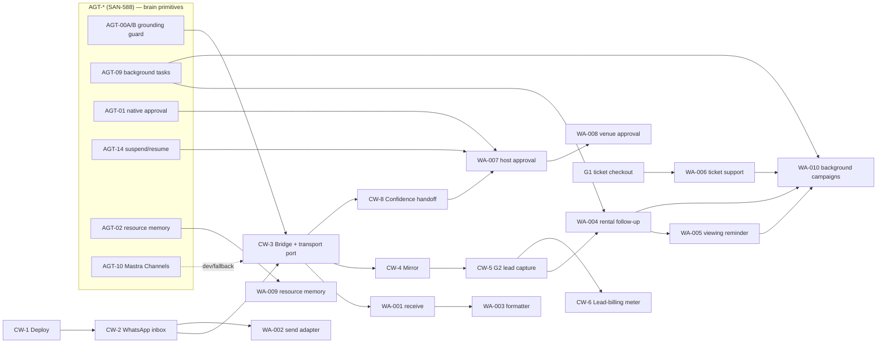

# Chatwoot Concierge + WhatsApp/Mastra — Roadmap

> Execution companion to [`prd-chatwoot.md`](prd-chatwoot.md). The PRD owns the **architecture decision** (Option C — Hybrid) and the **responsibility split**; this doc owns **sequencing**. **Ship WhatsApp + Rentals before anything else.**
>
> **Guiding constraint:** don't over-engineer. Phase 1–2 reuse the agents, edge functions, and tables that already exist. New code is built only where a *verified* gap blocks revenue — and every "uses a Mastra feature" claim is scored against what's actually built (most of it is **net-new SAN-588 work**, not a free inheritance).

---

## Two tracks, one brain

This roadmap braids **three** numbering systems. Keeping them straight is the whole game:

| Track | Prefix | Linear project | Owns | Example |
|---|---|---|---|---|
| **Channel + human + ops** | `CW-*` | Growth & Operations | Transport, inbox, handoff, CSAT, single WABA sender | CW-3 bridge, CW-8 handoff |
| **Brain (WhatsApp workflows)** | `WA-*` | AI & Intelligence | The Mastra workflows that *answer* on WhatsApp | WA-004 rental follow-up |
| **Brain primitives** | `AGT-*` (epic `SAN-588`) | AI & Intelligence | The Mastra features WA-* depend on | AGT-09 background tasks |

**The rule:** `WA-*` workflows are **transport-agnostic** — they run the *same* agents that power CopilotKit on the web, behind a `Transport` port (`receive` / `send` / `canReply`). In **production** that port is fed by **Chatwoot** (`CW-2`/`CW-3`); in **dev / fallback** by the **official Mastra direct webhook** (Mastra `Channels`, `AGT-10`/`SAN-604`). So `WA-001` (webhook) and `WA-002` (sender) are **not** a second WhatsApp stack — they are the two halves of that port. Wiring a standalone second sender is the **double-send ban risk** (NFR3); don't.

> **Official-guide alignment + the one deviation.** The `WA-*` brain follows the official Mastra WhatsApp pattern — `registerApiRoute('/whatsapp')` → workflow (`respondToMessage` → `breakIntoMessages` → `sendMessages`) → formatter agent → Graph-API sender. **Deviation:** mdeai is **Gemini-only**, so every responder/formatter uses `google("gemini-3.5-flash")`, **not** the guide's Anthropic/OpenAI. We adopt the *structure*, not the model choice.

## Phase map at a glance

| Phase | Theme | Milestone (proof it worked) | Timeline | Gate to next |
|---|---|---|---|---|
| **1 — Foundation** | Stand up the pipes + the guard | First **grounded** AI reply on WhatsApp from `conciergeAgent` | Week 1–3 | Bridge 200 on real inbound; grounding guard blocks a fake ID; build 0 |
| **2 — Core MVP** | Real leads + human handoff | First WhatsApp rental lead in Roberto's inbox | Week 3–6 | `leads` row `source='whatsapp'` + handoff works |
| **3 — Revenue MVP** | Turn convos into cash | First billed lead + scheduled follow-up/reminder | Week 6–10 | A real dollar attributed to a chat |
| **4 — Advanced** | Multi-vertical + automation tier | WhatsApp host approval (suspend/resume); nightlife deposit; IG inbox | Post-MVP | — |

---

## Phase 1 — Foundation (Week 1–3)

**Objective:** an inbound WhatsApp message gets a **grounded** AI reply from the same `conciergeAgent` that powers the web. No revenue yet — this is the pipe + the safety guard.

**Deliverables**

- **CW-1** — Chatwoot self-hosted on Hetzner (CPX31) via Coolify: Postgres 15, Redis 7, S3 storage, Traefik TLS at `chat.mdeai.co`, backups, `ENABLE_ACCOUNT_SIGNUP=false`.
- **CW-2** — WhatsApp Cloud API inbox: Meta App + WABA, permanent System User token, Phone Number ID; 4 templates (`cart_recovery_v1`, `lead_followup_v1`, `reservation_confirmed_v1`, `venue_new_request_v1`); STOP → `whatsapp_subscriptions`.
- **CW-3** — `/api/chatwoot-bridge` (stateless route) with the **transport port** (`ChatwootTransport` + `MetaDirectTransport`). Hardening from day one: HMAC verify, self-loop guard, idempotency on `message.id`, 24h window check, timeout fallback. **Inline** retry/dedupe (no n8n dependency for MVP).
- **WA-001 / WA-002** — the `receive()` / `send()` halves of the transport port (official-guide structure; Chatwoot-fronted in prod, Meta-direct in dev).
- **WA-003** — message formatter (Mastra step, `gemini-3.5-flash`, structured-output 3–5 WhatsApp messages, markdown stripped). *Net-new; leans on AGT-03 structured output.*
- **AGT-00A / AGT-00B** (SAN-590/605) — **grounding/faithfulness guard.** Hard cross-track dependency: the WhatsApp concierge must not ship unguarded against hallucinated listings/prices (the GuideGeek failure).
- Teams (`Concierge`, `Rentals/Brokers`, `Events`, `Sales/Ops`), labels, required `intent` attribute, audit logs.

**Dependencies**

- Meta WABA **business verification** (1–3 days) — **start in parallel with CW-1**; develop against the Meta test number via `MetaDirectTransport` (AGT-10) so verification never blocks bridge code.
- Secrets (server-only, never `mdeapp/src/**`): `CHATWOOT_URL`, `CHATWOOT_API_TOKEN`, `CHATWOOT_BRIDGE_SECRET`, `CHATWOOT_WEBHOOK_HMAC_KEY`, `WHATSAPP_PHONE_NUMBER_ID`, `WHATSAPP_WABA_ID`, `WHATSAPP_API_TOKEN`, `CHATWOOT_WEBHOOK_VERIFY_TOKEN`.

**Risks & mitigations**

| Risk | Likelihood | Mitigation |
|---|---|---|
| WA verification delay blocks launch | Med | Parallelize with CW-1; develop via Meta test number (Option-B transport) |
| Open/looping bridge (missing HMAC/self-loop) | High if skipped | Build NFR2 hardening into CW-3 from the first commit |
| 24h-window violation → WABA ban | High if skipped | Window check is a CW-3 acceptance criterion (Vitest, mocked window) |
| **Ungrounded reply (hallucinated listing)** | **High — 0 scorers today** | **AGT-00A/B grounding guard is a CW-3 gate (FR6)** |

**Exit milestone:** a message to the MDE test number returns a `conciergeAgent` reply in Chatwoot; a reply citing an ID **not** in that turn's tool results is **blocked**. Bridge 200/401. `npm run build` exits 0; Vitest floor ≥ 401.

---

## Phase 2 — Core MVP (Week 3–6)

**Objective:** real rental leads with human handoff. The revenue-generating slice — one channel (WhatsApp), one vertical (Rentals).

**Deliverables**

- **CW-4** — Contact & conversation mirror: `chatwoot_contacts` + `chatwoot_conversations` (RLS `service_role_only`), `src/lib/chatwoot/mirror.ts`, one-way upsert. Phone-match sets `mde_user_id` and writes `mde_contact_id` back (cross-channel identity).
- **CW-5** — G2 lead capture: rental intent calls the existing `chat-lead-capture` edge function with `source='whatsapp'` (**free-text — no migration**). `hasMinRentalPreferences` gate (`neighborhoods` + `max_rent`), 24h dup guard, label `stage:lead`.
- **CW-8** — Confidence handoff: centralize `needs_human || confidence<0.6 || intent∈{payment,complaint,vip,complex}` → label + assign + AI-reasoning private note.
- **CW-10** — CSAT on resolve + business hours + SLA-lite.
- **WA-004 (capture half)** — rental lead created on WhatsApp (synchronous part; the *delayed* nudge waits on AGT-09 in Phase 3).
- Wire `conciergeAgent` + `rentalAgent` (both exist) through the bridge; English-only per Phase 1 language scope.

**Dependencies**

- Phase 1 complete (guarded bridge live).
- Confirmed present: `rentalAgent`, grounding tools, `leads` (`source` free-text), `chat-lead-capture` (G2). **No new agent for rentals.**

**Risks & mitigations**

| Risk | Likelihood | Mitigation |
|---|---|---|
| Identity merge wrong (dup contacts) | Med | Phone/email join key; Chatwoot contact-merge; one Supabase contact |
| Handoff UX rough | Med | AI private note (budget + score) before assigning |
| Low-quality leads billed | Med | `hasMinRentalPreferences` floor; required `intent` attr |
| Mirror drift | Low | Mirror is read-model only; Chatwoot API authoritative for live state |

**Exit milestone:** a WhatsApp rental conversation with budget + neighborhood creates a `leads` row `source='whatsapp'`, lands in Roberto's inbox with an AI private note, and a payment/complaint message escalates to `needs-human` instead of being auto-answered.

---

## Phase 3 — Revenue MVP (Week 6–10)

**Objective:** turn the conversations Phase 2 produces into income — and add the first *proactive* (scheduled) outreach, opt-in only.

**Deliverables**

- **CW-6** — Lead-billing meter (**net-new** — the codebase has no `lead_billing`). Bill qualified leads channel-agnostically (web + whatsapp, same rate).
- **CW-7** — **Rental-featured model (net-new schema)** + bot surfacing. ⚠️ The `event_sponsors`/`event_sponsor_placements` tables are **event-scoped**; there is **no rental-featured table**. Build one (or generalize the sponsor model), then surface featured first in rental replies.
- **WA-004 (scheduled half)** + **WA-005** — rental follow-up ("schedule a viewing?" 30 min later) and viewing reminder (24h before). **Both depend on background/scheduled tasks (AGT-09/SAN-600)** + opt-in + template (outside 24h window).
- **WA-006** — event ticket support ("resend my ticket" → lookup → QR). Reuses **G1** ticket checkout + `ticket-payment-webhook` (both exist).
- **CW-9** — confirm single sender (`wa_outbox` is a dormant stub — assert it stays retired; Chatwoot is the only sender).
- Restaurant retainer attribution on `book_request` (clone of the rental pattern).

**Dependencies**

- Phase 2 leads flowing; Stripe Billing for the meter/retainers.
- **AGT-09 (SAN-600) background tasks** for WA-004/005 scheduling. *(This is SAN-588 Phase 2 work — sequence it with this phase.)*

**Risks & mitigations**

| Risk | Likelihood | Mitigation |
|---|---|---|
| Double-send if a second sender is wired | High | CW-9: single-sender rule; `wa_outbox` stays a zero-code stub |
| Pricing/packaging wrong | Med | Start with one flat qualified-lead fee; iterate with broker feedback |
| Scheduled-message spam → opt-out/ban | Med | Opt-in ledger + STOP + template-only outside 24h + rate-tier awareness (250/day tier 1) |
| Featured underestimated as "reuse" | Med→resolved | CW-7 budgeted as **net-new schema**, not a sponsor-table reuse |

**Exit milestone:** a qualified WhatsApp lead is **billed**, a scheduled viewing reminder fires (opt-in, within policy), and `wa_outbox` remains retired.

---

## Phase 4 — Advanced / Automation tier (Post-MVP)

**Objective:** multi-vertical depth + the automation tier — only after the rental loop is proven and earning. **This is where the heavy net-new Mastra primitives land.**

**Deliverables**

- **WA-007 — Host approval on WhatsApp** (APPROVE / EDIT / REJECT). Needs **native approval (AGT-01/SAN-595)** + **durable suspend/resume (AGT-14/SAN-608)**. Today HITL is **web-only** (CopilotKit `renderAndWaitForResponse`); the `approval-commit` edge fn + `request_approval` RPC exist but are web-triggered. WhatsApp approval is **net-new**.
- **WA-008 — Venue contact approval** (AI drafts outreach, human approves before send). Same approval/suspend primitives + natural fit with **Chatwoot human handoff (CW-8)**.
- **WA-009 — Resource memory** (remember Laureles / budget / salsa / specialty coffee across sessions). Needs **resource-scoped memory (AGT-02/SAN-597)** → memory processors (AGT-13/SAN-610) → semantic recall (AGT-08/SAN-603). Today memory is **thread-scoped only**.
- **WA-010 — Background follow-up campaigns** (abandoned booking / lead / ticket recovery) via Chatwoot Campaigns + **AGT-09** background tasks, opt-in only.
- **`venueAgent`** (nightlife — **net-new agent**, does not exist) + in-chat Stripe **deposit** links; Stripe **Connect** for take-rate.
- **Instagram** + **Facebook** inboxes — discovery channels that funnel to WhatsApp.
- Custom ops/revenue **dashboards** for Patricia; confidence-model tuning from Phase 2–3 data.

**Dependencies**

- Phase 3 revenue proven; human concierge capacity for high-touch flows.
- **SAN-588 Phase 2/3 primitives**: AGT-01, AGT-14, AGT-02 → AGT-13 → AGT-08, AGT-09.
- Stripe Connect onboarding for venues.

**Risks & mitigations**

| Risk | Likelihood | Mitigation |
|---|---|---|
| Marketplace complexity (Connect, payouts) | High | Defer until rental cash funds it; one vertical at a time |
| Over-automation kills the human trust differentiator | Med | Keep handoff for VIP/complex; automate nudges, not relationships |
| Autonomous outreach (WA-007/008) sends without a gate | High | Approval gate is **mandatory** — AGT-01 server pause + human confirm |
| Memory quality (bad recall → wrong recs) | Med | Scope AGT-02 to explicit, user-stated prefs first |

**Exit milestone:** Roberto approves a publish from WhatsApp (suspend → resume), a nightlife deposit is paid in-thread, and an Instagram DM produces a lead that funnels to WhatsApp.

---

# WhatsApp brain roadmap (WA-001 … WA-010)

The Mastra-side detail for each WhatsApp workflow, reconciled with the CW-* channel track and the AGT-* primitives it needs. **Project: AI & Intelligence.** *Status: ✅ reuse · 🔶 primitive exists, wire it · ❌ net-new.*

| ID | Workflow | Business value | Phase | Status | CW-* tie | AGT-* primitive |
|---|---|---|---|---|---|---|
| **WA-001** | Webhook / receive port | Inbound conversations | 1 | 🔶 | CW-2/CW-3 | AGT-10 (Channels, dev/fallback) |
| **WA-002** | Send adapter | Outbound replies | 1 | 🔶 | **CW-2 (Chatwoot = prod sender)** | AGT-10 (Meta-direct = dev sender) |
| **WA-003** | Message formatter | Readable 3–5-msg replies | 1 | ❌ | — | AGT-03 structured output |
| **WA-004** | Rental lead follow-up | Lead conversion ↑ | 2 (capture) / 3 (nudge) | 🔶 | CW-5 | AGT-09 background tasks |
| **WA-005** | Viewing reminder | No-shows ↓ | 3 | ❌ | CW-2 templates | AGT-09 background tasks |
| **WA-006** | Event ticket support | Support burden ↓ | 3 | ✅ | — | reuses G1 + webhook |
| **WA-007** | Host approval (WhatsApp) | Safe AI publishing | 4 | ❌ | CW-8 handoff | AGT-01 + AGT-14 |
| **WA-008** | Venue contact approval | Protect relationships | 4 | ❌ | CW-8 handoff | AGT-01 + AGT-14 |
| **WA-009** | Resource memory | Personalization | 4 | ❌ | — | AGT-02 → AGT-13 → AGT-08 |
| **WA-010** | Background campaigns | Recover abandoned opps | 4 | ❌ | Chatwoot Campaigns | AGT-09 |

> **The honest read:** only **WA-006** is pure reuse today. **WA-001/002** are wiring (transport port). **WA-003** is net-new but cheap. **WA-004/005/007/008/009/010** all block on **net-new SAN-588 primitives** (background tasks, native approval, suspend/resume, resource memory). That's why the automation tier (WA-007…010) is **Phase 4**, not MVP.

## Mastra feature adoption (per the official-guide review table)

Prompt-01 asks: which Mastra features, used where, why. Scored against what's built (full version + SAN-588 ties in [`prd-chatwoot.md`](prd-chatwoot.md#mastra-feature-adoption-tied-to-san-588)).

| Feature | Use? | Why | Where (WA-*) |
|---|---|---|---|
| **Workflows** | ✅ Required | WhatsApp is event-driven; deterministic > prompt for state changes | WA-001…010 |
| **Scheduled / background tasks** | ✅ Required (P3+) | Reminders, follow-ups, campaigns | WA-004/005/010 (AGT-09) |
| **Human-in-the-loop** | ✅ Required | Publishing + venue outreach must gate before send | WA-007/008 (AGT-01) |
| **Suspend / Resume** | ✅ Required (P4) | Durable host approval across sessions | WA-007 (AGT-14) |
| **Resource memory** | ✅ Useful (P4) | Cross-session prefs | WA-009 (AGT-02) |
| **Streaming** | ⚠️ Limited | WhatsApp is message-based; only "searching…" nudges help | WA-001 (AGT-16) |
| **Observability / scorers** | ✅ Required **first** | Higher-stakes channel needs the grounding guard before scale | all (AGT-00A/B/C) |
| **MCP / RAG / multi-agent** | ❌ Avoid | SAN-588 hard "do NOT"; one `routerAgent` + workflows; pgvector not `@mastra/rag` | — |

## Revenue impact (highest-ROI order)

| Workflow | Revenue impact | Notes |
|---|---|---|
| Rental follow-up (WA-004) | **High** | Directly lifts the billable lead asset |
| Viewing reminder (WA-005) | **High** | Cuts no-shows on booked viewings |
| Ticket support (WA-006) | Medium | Reuse G1; deflects support cost |
| Host approval (WA-007) | **High** | Unlocks safe host publishing at scale |
| Venue approval (WA-008) | Medium | Protects supply relationships |
| Resource memory (WA-009) | Medium | Retention / repeat-conversion |
| Campaigns (WA-010) | **High** | Recovers abandoned opportunities |

**Highest-ROI build order:** `WA-004 → WA-005 → WA-006 → WA-007 → WA-009`. (Camila's rental loop first, Andrés's tickets next, Roberto's publishing after — the three MVP revenue personas.)

---

## Linear-ready task tables

### CW-* — Growth & Operations (channel + ops)

| ID | Title | Phase | Depends on | Blocks | Effort | Priority |
|---|---|---|---|---|---|---|
| **CW-1** | Deploy Chatwoot (Hetzner/Coolify) | 1 | MVP-exit | CW-2 | 3–5 d | P0 |
| **CW-2** | WhatsApp Cloud API inbox + templates | 1 | CW-1 | CW-3, CW-9 | 3–5 d | P0 |
| **CW-3** | `/api/chatwoot-bridge` (hardened + transport port + grounding guard) | 1 | CW-2, AGT-00A/B | CW-4, CW-8, CW-10, WA-001/002 | 1–2 wk | P0 |
| **CW-4** | Contact & conversation mirror | 2 | CW-3 | CW-5 | 3–5 d | P0 |
| **CW-5** | G2 lead capture hook (`source='whatsapp'`) | 2 | CW-4 | CW-6, CW-7, WA-004 | 3–5 d | P0 |
| **CW-8** | Confidence handoff model | 2 | CW-3 | WA-007/008 | 2–3 d | P1 |
| **CW-10** | CSAT + business hours + SLA-lite | 2 | CW-3 | — | 2–3 d | P2 |
| **CW-6** | Lead-billing meter (**net-new**) | 3 | CW-5 | — | 3–5 d | P1 |
| **CW-7** | Rental-featured model + surfacing (**net-new schema**) | 3 | CW-5 | — | 3–5 d | P1 |
| **CW-9** | Confirm single sender (`wa_outbox` stays retired) | 3 | CW-2 | campaigns | 1 d | P1 |
| **CW-11** | `venueAgent` + in-chat deposit (Connect) | 4 | CW-6 | — | 1–2 wk | P2 |
| **CW-12** | Instagram + Facebook inboxes | 4 | CW-3 | — | 1 wk | P2 |

### WA-* — AI & Intelligence (brain) · epic SAN-588

| ID | Title | Phase | Depends on (AGT/CW) | Effort | Priority |
|---|---|---|---|---|---|
| **WA-001** | Webhook / receive port | 1 | CW-3, AGT-10 | 2 d | P0 |
| **WA-002** | Send adapter (Chatwoot prod / Meta dev) | 1 | CW-2, AGT-10 | 2 d | P0 |
| **WA-003** | Message formatter (Gemini, structured) | 1 | WA-002, AGT-03 | 1 d | P1 |
| **WA-004** | Rental lead follow-up | 2→3 | CW-5, AGT-09 | 3 d | P1 |
| **WA-005** | Viewing reminder | 3 | WA-004, AGT-09 | 2 d | P1 |
| **WA-006** | Event ticket support | 3 | G1, WA-002 | 3 d | P1 |
| **WA-007** | Host approval (WhatsApp) | 4 | AGT-01, AGT-14, CW-8 | 4 d | P2 |
| **WA-008** | Venue contact approval | 4 | WA-007 | 3 d | P2 |
| **WA-009** | Resource memory integration | 4 | AGT-02 | 3 d | P2 |
| **WA-010** | Background follow-up campaigns | 4 | WA-004/005/006, AGT-09 | 4 d | P2 |

> **Linear note:** these tables describe **proposed** structure — no issues were created (not requested). When created: WA-* are children of (or siblings under) the WhatsApp epic in **AI & Intelligence**; their AGT-* deps are existing children of **SAN-588**. CW-* live in **Growth & Operations**.

---

## MVP vs Post-MVP

| | Workflows |
|---|---|
| **MVP (Phase 1–3)** | CW-1…CW-10 · WA-001, WA-002, WA-003, WA-004, WA-005, WA-006 |
| **Post-MVP (Phase 4)** | CW-11, CW-12 · WA-007, WA-008, WA-009, WA-010 · `venueAgent` · IG/FB · resource memory · dashboards |

---

## What NOT to build yet

- **WA-007…WA-010 automation tier** — Phase 4. All block on net-new SAN-588 primitives (approval, suspend/resume, resource memory, background tasks).
- **A standalone WhatsApp sender** — never. Chatwoot is the single sender; a second one is the double-send ban risk.
- **Instagram / Facebook** — Phase 4. WhatsApp first; IG/FB only funnel to it.
- **In-chat card payments / Stripe Connect** — Phase 4 (rentals bill via invoice, no rail).
- **`venueAgent` / nightlife deposits** — Phase 4 (net-new agent + Connect).
- **Trip bundles / relocation** — Phase 4 (high-touch).
- **Chatwoot Captain / native AI; MCP/RAG/multi-agent in runtime** — never (Mastra is the brain; SAN-588 hard "do NOT").
- **n8n as a new dependency** — the bridge handles retry/dedupe/idempotency inline; add n8n only if you already run it and volume demands it.
- **Custom dashboards** — Phase 4 (SQL on the mirror covers Phase 2–3).

> **Bottom line:** Phases 1–2 are pure reuse + glue **plus the grounding guard** (AGT-00A/B — the one non-negotiable net-new). The first net-new *business* logic is the lead-billing meter (CW-6) and the scheduled nudges (WA-004/005 on AGT-09) in Phase 3. The automation tier (WA-007…010) is Phase 4. **Ship WhatsApp + Rentals on a guarded brain, bill a lead, then clone the pattern.**
