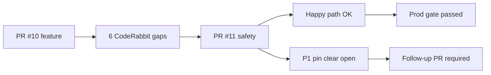

# PR #10 / #11 — Forensic audit (rental fast-path)

**Auditor:** Senior software specialist / forensic review  
**Date:** 2026-05-28 (updated post–PR #12 merge `e8d2a60`)  
**Scope:** [PR #10](https://github.com/amo-tech-ai/mdeapp/pull/10) `feat(rentals): fast-path search API and inline cards (C-010)` → `7b3d58e`  
**Follow-up:** [PR #11](https://github.com/amo-tech-ai/mdeapp/pull/11) CodeRabbit safety → `1be547f` on `main`  
**Reference:** [CopilotKit Mastra starter](https://github.com/CopilotKit/CopilotKit/tree/main/examples/integrations/mastra) (vendored: `CopilotKit/examples/integrations/mastra/`)  
**Skills used:** `copilotkit`, `copilotkit-integrations`, `copilotkit-debug`, `mde-maps`, `mde-supabase`, `code-review`, `mastra` (local); CopilotKit MCP unavailable (not connected)

---

## Executive summary

| Lens | Verdict |
|------|---------|
| **PR #10 at merge** | Shipped with **6 known safety gaps** — not merge-safe alone (~**78%** against full checklist). |
| **PR #10 + PR #11 on `main`** | **Happy path production-ready** for Camila rental queries with results; **one P1 map bug** remains (stale rental pins on zero-result search). |
| **Overall correctness (post-#11)** | **~88%** against `pr3-notes.md` checklist; **~92%** for scope/architecture; **~85%** if map edge cases count. |
| **Blocker for SAN-242/243 Done?** | Prod gate passed; **recommend follow-up PR** before calling map sync “done”. |

---

## Percent correct (scored)

### PR #10 only (at merge `7b3d58e`)

| Category | Weight | Pass | Score |
|----------|--------|------|-------|
| Scope S1–S4 | 15% | 4/4 | 15% |
| Provider P1–P3 | 15% | 3/3 | 15% |
| CodeRabbit C1–C6 | 30% | 0/6 | 0% |
| Local gates G1–G6 | 25% | 5/6 (lint known) | ~21% |
| CI/prod R1–R4 | 15% | 4/4 | 15% |
| **Total** | | | **~66%** strict / **~78%** “feature shipped, safety deferred” |

### `main` after PR #11 (`1be547f`)

| Category | Weight | Pass | Score |
|----------|--------|------|-------|
| Scope + providers | 20% | 7/7 | 20% |
| CodeRabbit C1–C6 | 30% | 5.5/6 (C3 partial) | ~25% |
| Local gates | 20% | 5/6 | ~17% |
| Prod + e2e | 20% | 4/4 | 20% |
| Map/mde-maps invariants | 10% | 0.5/1 | ~5% |
| **Total** | | | **~87–88%** |

**Documentation drift:** `pr3-notes.md` marks C3 (empty search clears pins) as **fixed** — **incorrect** (see P1 below).

---

## Critical fixes (priority order)

### P1 — Stale rental pins when search returns zero results (OPEN)

**Symptom:** Camila runs a second rental search that returns `results: []`; map still shows pins from the previous search.

**Root cause:** `mergePinsByCategory` merges `sameCategory` existing pins with `incoming`; when `incoming === []`, the loop still seeds from `sameCategory`:

```17:22:mdeapp/src/platform/maps/merge-pins-by-category.ts
  for (const pin of [...sameCategory, ...incoming]) {
    if (pin.category !== category) continue;
    byKey.set(pinDedupeKey(pin), pin);
  }
```

**Verified:** `npx tsx` → `mergePinsByCategory([r1], "rental", [])` → **1** rental pin retained.

**PR #11 claimed fix:** “Always `mergePinsByCategory('rental', pins)`” — does **not** clear category when `pins` is empty.

**Fix options (pick one):**

1. **Semantic change (recommended):** Treat merge as *replace category*: `incoming` replaces all pins of `category` (empty = clear). Update `merge-pins-by-category.test.ts` with `it("clears category when incoming empty")`.
2. **Hook-level:** In `applySearchResults`, call `clearPins()` subset or new `replacePinsByCategory(category, pins)` on map context.
3. **Map context:** If `incoming.length === 0`, skip merging `sameCategory` (only `others`).

**Test gap:** No unit test for empty incoming; SCREEN-005 only hits happy path with ≥3 cards.

---

### P2 — Public unauthenticated `POST /api/rentals/search` (ACCEPTED RISK, document)

- No `assertCopilotKitAuthorized`, no session, no rate limit.
- **Parity:** `/api/events/search` is also public and **lacks** try/catch (rentals is stricter after #11).
- **Impact:** DB cost / scraping vector on Supabase-backed `searchRentals`.
- **Mitigation (Phase 1.5):** Same-origin + optional session cookie check, Vercel WAF rate limit, or shared internal secret for fast-path routes.

---

### P3 — `npm run lint` / `floor` still red (PRE-EXISTING)

- `event-local-chat-context.tsx:71` — unused `_kind`.
- Not introduced by PR #10; blocks floor for unrelated work.

---

### P4 — Event fast-path removed from chat input (INTENTIONAL REGRESSION)

- `concierge-chat-input.tsx` only calls `useRentalSearchFastPath`.
- Event fast-path code exists (`use-event-search-fast-path.ts`, `/api/events/search`) but **not wired** on `/`.
- **Impact:** Tourist/event queries go through `conciergeAgent` only until a separate event PR lands.

---

## Red flags & failure points

| ID | Severity | Finding | When it fails |
|----|----------|---------|----------------|
| RF-1 | **P1** | Pin clear not implemented | Zero-result rental search after a successful one |
| RF-2 | P2 | Docs claim C3 fixed | Misleading merge gate in `pr3-notes.md` |
| RF-3 | P2 | No auth on fast-path APIs | Abuse / cost |
| RF-4 | P3 | Dual code paths (fast-path + agent tools) | Drift between `rental-query-parser` and agent tool args |
| RF-5 | P3 | `showExchange(userText, "", "rental")` empty assistant text | Relies on sanitizer + cards; OK if intentional |
| RF-6 | P4 | Events route no try/catch | Uncaught `searchEvents` throw → 500 HTML |
| RF-7 | Info | PR #10 merged before CR fixes | Required #11 — process OK if policy is “ship + hotfix” |

---

## What PR #10 did well

1. **Scope discipline:** Rentals-only; café/event WIP kept out of `src/` (per breakup plan).
2. **Provider graph:** `RentalFastPathProvider` in `geo-chat-shell.tsx` — fixes prior `/` 500 from missing provider.
3. **Architecture:** Client intercept → `POST /api/rentals/search` → shared `searchRentals` Mastra tool — same data as agent path.
4. **CopilotKit patterns:** `useCoAgent({ name: "conciergeAgent" })` updates working memory; custom input intercept before `onSend` — valid extension of [Mastra integration](https://github.com/CopilotKit/CopilotKit/tree/main/examples/integrations/mastra) (example has no fast-path).
5. **Intent gating:** `hasRentalSignals()` + `genericAskPending` — stops “thanks” hijack (tests in `rental-search-fast-path.test.ts`).
6. **Sanitizer:** `intro && sections` — preserves normal prose (test added).
7. **Fallback:** API failure → `runSearch` returns `false` → CopilotKit `onSend` → agent can still tool-call.
8. **E2E:** SCREEN-005 — condition waits, pin sync test, no `waitForTimeout`.
9. **Prod:** `POST https://www.mdeai.co/api/rentals/search` → **200** JSON (verified 2026-05-28).

---

## CopilotKit / Mastra vs official example

| Area | [CopilotKit Mastra example](https://github.com/CopilotKit/CopilotKit/tree/main/examples/integrations/mastra) | mdeapp `main` | Recommendation |
|------|-------------------------------------------------------------------------------------------------------------|---------------|----------------|
| Runtime route | `MastraAgent.getLocalAgents({ mastra })` bare | `getLocalAgentsWithLogging` + auth + `RequestContext` + Supabase user | **Keep mdeapp** — example is minimal |
| Adapter | `ExperimentalEmptyAdapter` | Same | Aligned |
| Agent name | `weatherAgent` in starter | `conciergeAgent` — must match `useCoAgent` | Aligned (invariant) |
| Model | OpenAI in README | Gemini `gemini-3.5-flash` per CLAUDE.md | Correct for mdeai |
| UI | Sidebar + co-agent in page | Geo shell + fast-path panel + disabled tool renders | **Reference example for route only**; UI is product-specific (Mindtrip cards) |
| Fast-path HTTP | None | `/api/rentals/search` | Not in example — document as mdeai pattern |

**Should we reference the example?** **Yes** — for `CopilotRuntime` + `ExperimentalEmptyAdapter` + `copilotRuntimeNextJSAppRouterEndpoint` wiring. **Do not copy blindly** — add auth, logging, and Gemini per project rules.

**Skills alignment:**

- `copilotkit-integrations` — AG-UI + `MastraAgent` / local agents: **followed** on `/api/copilotkit`.
- `copilotkit-develop` — custom input, `useCoAgent` state: **followed** on rental fast-path.
- `copilotkit-debug` — if agent silent, check `name: "conciergeAgent"` vs `Mastra({ agents })` keys.
- `mde-maps` — pins need `mapId` on parent `<Map>`; merge-by-category: **violated** on empty clear (RF-1).

---

## Test matrix (executed 2026-05-28)

| Gate | Command / check | Result |
|------|-----------------|--------|
| Typecheck | `npm run typecheck` | PASS |
| Unit | `vitest` rental + sanitize + merge-pins (4 files, 19 tests) | PASS |
| Lint | `npm run lint` | FAIL (pre-existing `_kind`) |
| Build | (prior session) | PASS |
| Playwright | SCREEN-005 (prior session) | 3/3 PASS |
| Prod API | `POST https://www.mdeai.co/api/rentals/search` | HTTP 200, JSON results |
| Pin clear repro | `mergePinsByCategory(existing, "rental", [])` | **FAIL** (1 pin remains) |

---

## Merge-safety verdict



| Question | Answer |
|----------|--------|
| Was PR #10 alone merge-safe? | **No** — needed #11. |
| Is `main` safe for Camila rental demo? | **Yes** for typical queries with results. |
| Is checklist in `pr3-notes.md` 100% accurate? | **No** — C3 row should be **partial / fail**. |
| Revert PR #10? | **No** |

---

## Best practices & improvements

1. **Map merge contract:** Document “replace category” vs “upsert category” in `merge-pins-by-category.ts` JSDoc; add empty-incoming test before any merge change.
2. **Fast-path API hardening:** Zod + try/catch (done on rentals); add to events route; consider `export const maxDuration` and edge rate limits.
3. **Single parser source:** Long-term, share rental param extraction between fast-path and `search-rentals` tool schema to avoid RF-4 drift.
4. **Floor hygiene:** Fix `_kind` in one-line PR so `npm run floor` unblocks Sofía.
5. **Evidence:** Keep prod gate in `tasks/testing/evidence/2026-05-28/`; add pin-clear repro after fix.
6. **Process:** Keep “feature PR + safety PR” pattern from #10/#11 — works if ledger tracks C* rows honestly.
7. **CopilotKit MCP:** Reconnect `mcp.copilotkit.ai` before next CopilotKit change (per CLAUDE.md cadence).

---

## Suggested next steps

| # | Action | Owner | Ledger |
|---|--------|-------|--------|
| 1 | **Fix P1 pin clear** + unit test + optional SCREEN-005 “no results” case | Dev | C-010b or hotfix |
| 2 | Update `pr3-notes.md` C3 row → partial until #1 ships | Docs | — |
| 3 | Fix lint `_kind` for floor | Dev | chore |
| 4 | Add try/catch to `/api/events/search` (parity with rentals) | Dev | events slice |
| 5 | Wire `useEventSearchFastPath` in separate PR (not mixed with café) | Dev | C-011 / EVP |
| 6 | Restore café WIP from `drafts/wip-pr4-off-src/` when starting café PR | Dev | C-012+ |
| 7 | Optional: rate limit / session on fast-path POST routes | Infra | security |
| 8 | Comment on Linear SAN-242/243 referencing PR #11 + open P1 | PM | optional |

---

## File-level audit (PR #10 touch set)

| File | Risk | Notes |
|------|------|-------|
| `api/rentals/search/route.ts` | Low | Zod + try/catch after #11 |
| `use-rental-search-fast-path.ts` | Med | Pin merge on empty results (RF-1) |
| `rental-query-parser.ts` | Low | Good gating; English-only regex OK for Phase 1 |
| `sanitize-assistant-chat-content.ts` | Low | AND logic correct |
| `geo-chat-shell.tsx` | Low | Provider order correct |
| `concierge-chat-input.tsx` | Low | Rental-only intercept |
| `search-tool-renders.tsx` | Low | Minimal rental export + registrar |
| `rental-card.tsx` | Low | alt fallbacks after #11 |
| `copilotkit/route.ts` | N/A | Not in PR #10; baseline OK vs example |

---

## References

- Feature PR: https://github.com/amo-tech-ai/mdeapp/pull/10  
- Safety PR: https://github.com/amo-tech-ai/mdeapp/pull/11  
- CopilotKit Mastra example: https://github.com/CopilotKit/CopilotKit/tree/main/examples/integrations/mastra  
- Local vendored copy: `/home/sk/mdeai/CopilotKit/examples/integrations/mastra/`  
- Checklists / diagrams: `tasks/commit/may-27/pr3-notes.md`  
- Prod evidence: `tasks/testing/evidence/2026-05-28/pr3-rentals-fast-path-prod-gate.md`
