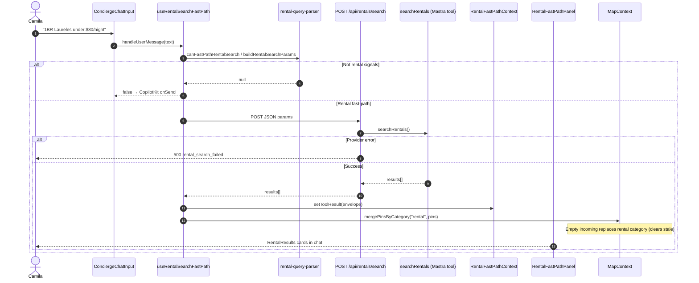
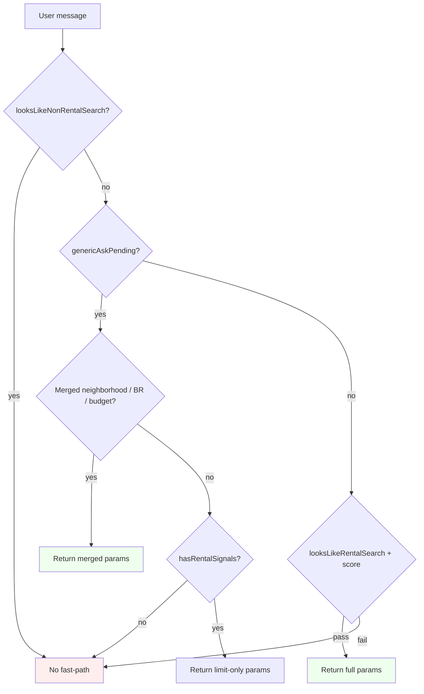
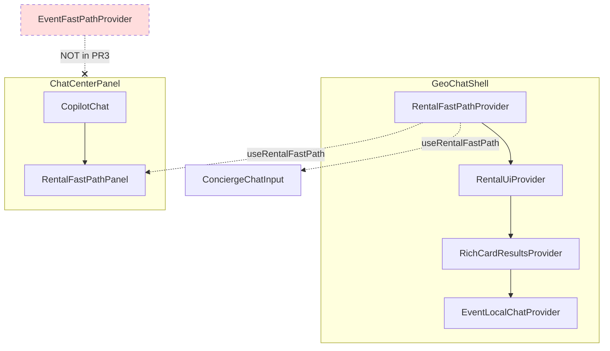
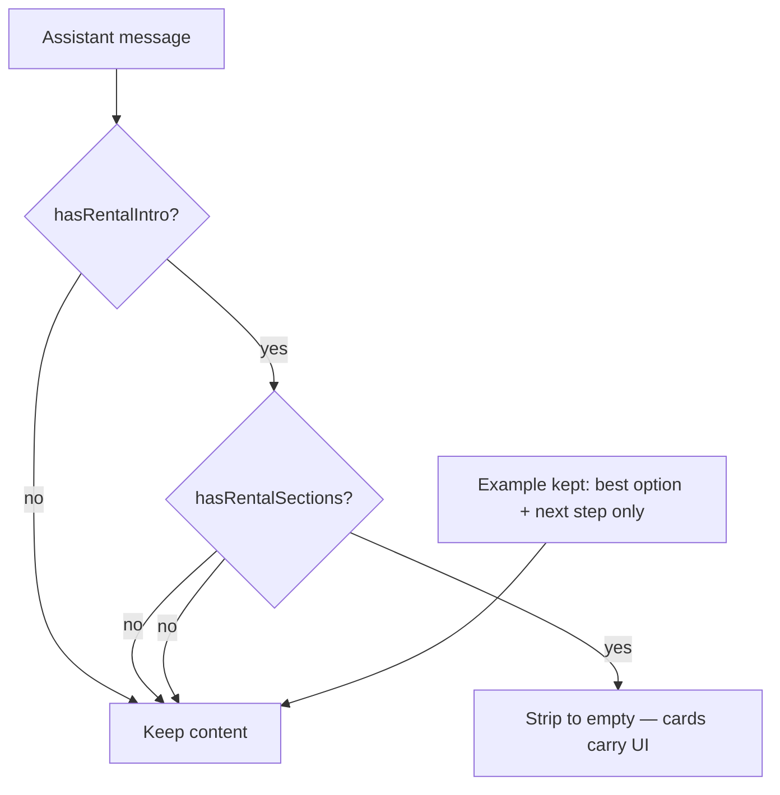

CodeRabbit fixes — done and merged
PR #10 was already on production; all 6 CodeRabbit issues are fixed in PR #11 → merge 1be547f on main.

Fixes applied
#	Issue	Change
1
API try/catch
route.ts — stable { error: "rental_search_failed", message: "..." }, HTTP 500
2
genericAskPending hijack
hasRentalSignals() before limit-only fallback; tests for "thanks"
3
Stale pins
Always mergePinsByCategory("rental", pins); requestFitBounds only if ≥2 pins
4
Sanitizer too broad
Strip only when intro AND sections; new test keeps normal “best option / next step” prose
5
Playwright sleep
Removed waitForTimeout(1500); wait for data-pin-id + map pin visible
6
Image alt
photoAlt with title/neighborhood fallbacks
8 files changed (+58 / −19). No café/event/docs in the commit.

Verification
Gate	Result
typecheck
pass
build
pass
Unit tests
16/16 pass
SCREEN-005 Playwright
3/3 pass
lint
Pre-existing _kind in event-local-chat-context.tsx (unchanged)
PR #11 CI
Vercel pass, CodeRabbit pass
Prod POST /api/rentals/search
HTTP 200 JSON, 5 results
Merge-safety
Item	Verdict
PR #10 (feature)
Shipped — had C1–C6 gaps
PR #11 (safety)
Merge-safe — all CodeRabbit items addressed
Production readiness
Yes for rental fast-path after 1be547f
Docs (checklist + Mermaid)
tasks/commit/may-27/pr3-notes.md includes:

100% success-criteria tables (scope, providers, CodeRabbit, gates, prod)
Sequence: Camila → fast-path → API → pins → panel
Flowcharts: intent gating, provider graph, sanitizer logic
Plain-language context stays in tasks/commit/may-27/notes-2.md.

Links
Feature PR: https://github.com/amo-tech-ai/mdeapp/pull/10 (7b3d58e)
Safety PR: https://github.com/amo-tech-ai/mdeapp/pull/11 (1be547f)
Production: https://www.mdeai.co/
SAN-242 / SAN-243 remain Done from the earlier prod gate; no Linear change needed unless you want a comment referencing PR #11.

# PR3 — Rental fast-path (C-010) + CodeRabbit follow-up

**Shipped:** [PR #10](https://github.com/amo-tech-ai/mdeapp/pull/10) → merge `7b3d58e` on `main`  
**Review fixes:** branch `fix/rentals-pr3-coderabbit` (post-merge safety PR)

---

## Merge-safety checklist (100% criteria)

Use this before merging any rental fast-path PR. Every row must be **pass** or **N/A (documented)**.

### Scope (rentals-only)

| # | Criterion | How to verify | PR3 #10 | CR fixes |
|---|-----------|---------------|---------|----------|
| S1 | Staged diff has no `src/components/cafe/**` | `git diff --cached --name-only \| rg cafe` → empty | pass | pass |
| S2 | No `event-fast-path-*` in diff | `rg event-fast-path` on staged names → empty | pass | pass |
| S3 | No `git add .` | Manual file list in commit | pass | pass |
| S4 | ≤21 files / single domain (rentals) | `git diff --stat` | pass (21) | pass (8) |

### Provider graph (Camila `/`)

| # | Criterion | How to verify | PR3 #10 | CR fixes |
|---|-----------|---------------|---------|----------|
| P1 | `RentalFastPathProvider` wraps consumers of `useRentalFastPath` | `geo-chat-shell.tsx` nests provider above chat | pass | N/A |
| P2 | No `EventFastPathPanel` / `useEventFastPath` in PR | `rg EventFastPath` in PR diff → empty | pass | N/A |
| P3 | `GET /` returns 200 (no prerender 500) | `curl -I localhost:3001/` or Vercel build log | pass | pass |

### CodeRabbit / safety (post-merge PR)

| # | Criterion | File | PR3 #10 | CR fixes |
|---|-----------|------|---------|----------|
| C1 | API `searchRentals` try/catch, stable JSON 500 | `api/rentals/search/route.ts` | fail | **fixed** |
| C2 | `genericAskPending` does not fast-path "thanks" / unrelated | `rental-query-parser.ts` | fail | **fixed** |
| C3 | Empty search clears rental pins | `merge-pins-by-category.ts` + hook | fail (PR #11 partial) | **fixed** PR #12 → `e8d2a60` |
| C4 | Sanitizer: AND intro+sections; keeps normal "best option" prose | `sanitize-assistant-chat-content.ts` | fail | **fixed** |
| C5 | No `waitForTimeout` in SCREEN-005 | `SCREEN-005-rental-card.spec.ts` | fail | **fixed** |
| C6 | Listing photo has non-empty `alt` | `rental-card.tsx` | fail | **fixed** |

### Local gates

| # | Command | Expected | PR3 #10 | CR fixes |
|---|---------|----------|---------|----------|
| G1 | `npm run typecheck` | exit 0 | pass | pass |
| G2 | `npm run build` | exit 0, `/` in route table | pass | pass |
| G3 | Rental unit tests (3 files) | all pass | 14/14 | 16/16 |
| G4 | `SCREEN-005` Playwright | 3/3 | pass | pass |
| G5 | `POST /api/rentals/search` local | HTTP 200 + `results[]` | pass | pass |
| G6 | `npm run lint` | note pre-existing `_kind` in `event-local-chat-context` | known fail | known fail |

### CI / production

| # | Criterion | PR3 #10 | CR fixes |
|---|-----------|---------|----------|
| R1 | Vercel preview/production build green | pass | pending PR |
| R2 | `POST https://www.mdeai.co/api/rentals/search` → 200 JSON | pass (after deploy) | re-verify after merge |
| R3 | Prod SCREEN-005 or manual: cards + pins + no duplicate `results-column` | pass | re-verify after merge |
| R4 | SAN-242 / SAN-243 → Done only after R2+R3 | Done (2026-05-28) | keep Done after R2+R3 |

**Merge-safe score:** PR #10 shipped with known C1–C6 gaps; **follow-up PR required** for production hardening. After CR PR merges, all C* rows should be pass.

---

## Architecture — rental fast-path (sequence)

Camila on `/` sends a rental-shaped message; chat intercepts before `conciergeAgent` when `canFastPathRentalSearch` is true.

---

## Intent gating (flowchart)

Prevents `genericAskPending` from hijacking unrelated replies.

**Must NOT fast-path:** `thanks`, `salsa events`, `best cafes`  
**SHOULD fast-path:** `1BR Laureles under $80`, `studio in Poblado`, clarify follow-up with `$1000` budget

---

## Provider graph (flowchart)

---

## Sanitizer decision (flowchart)

---

## CodeRabbit fix map

| Comment | Fix | Test |
|---------|-----|------|
| API try/catch | `rental_search_failed` + message, 500 | manual curl |
| genericAskPending hijack | `hasRentalSignals()` gate | `rental-search-fast-path.test.ts` |
| Stale pins | `mergePinsByCategory` replaces category; `[]` clears rentals | merge-pins unit test + SCREEN-005 |
| Sanitizer too broad | `intro && sections` only | sanitize test added |
| Playwright sleep | `toHaveAttribute` + pin visible | SCREEN-005 |
| Image alt | `photoAlt` fallback chain | a11y review |

---

## Evidence paths

- Pre-merge local/prod: `tasks/testing/evidence/2026-05-28/pr3-rentals-fast-path-prod-gate.md`
- Plain-language problems: `tasks/commit/may-27/notes-2.md`
- PR breakup plan: `tasks/commit/may-27/forensic-pr-breakup-2026-05-27.md`
