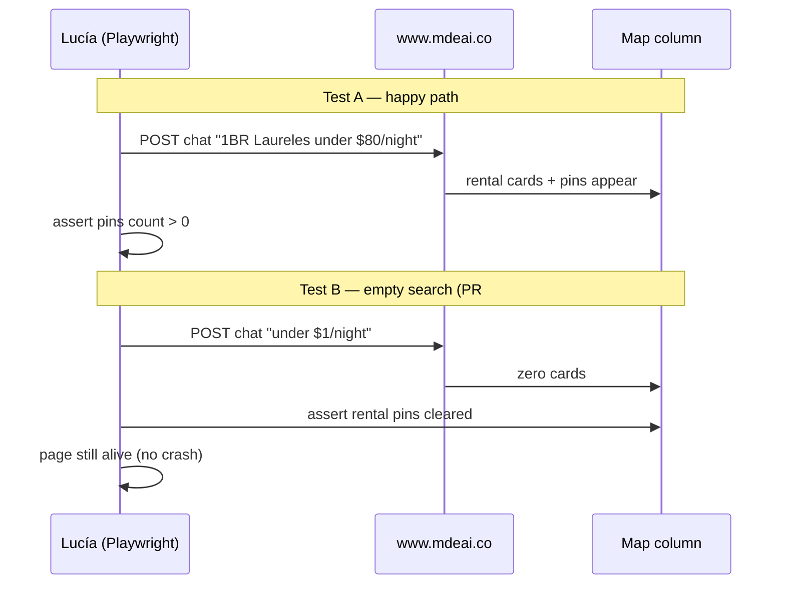

# C-010d — prod Playwright gate for rental pin clear

## In plain English

**Camila** already got the fix on production (PR #12): when a rental search returns zero results, old pins disappear instead of lying on the map.

**C-010d** adds a **robot check** that runs against **https://www.mdeai.co** so Sofía and Lucía can prove that behavior stays true after every deploy — without manually re-typing the same two queries.

This is **test hardening only**. It is **not** an MVP blocker. Skip it if you want C-012 to be the next PR.

## Real-world goal

| Stakeholder | Goal |
|-------------|------|
| **Camila** | Never see ghost rental pins after “nothing found” on prod |
| **Sofía** | CI/local `floor` stays green; prod gate runs only when env is set |
| **Lucía** | Repeatable Playwright proof tied to `01-rentals-prompt.md` Tests A/B |

## User journey



## What ships vs what does not

| In scope | Out of scope |
|----------|----------------|
| `e2e/prod/pr12-pin-clear-prod-gate.spec.ts` | Café UI (C-012) |
| Evidence under `tasks/testing/evidence/YYYY-MM-DD/` | Event panel (C-013) |
| `test.skip` unless `SMOKE_BASE_URL=https://www.mdeai.co` | Rental parser fix (separate PR) |

## PR slot

| If you ship C-010d? | Next product PR |
|---------------------|-----------------|
| Yes | C-012 becomes the following PR |
| Skip | C-012 is next after PR #12 |

## Success criteria (Done gate)

| # | Criterion | How to verify |
|---|-----------|----------------|
| 1 | Lint + floor green with spec tracked | `npm run floor` |
| 2 | Spec skips locally/CI without prod URL | Run without `SMOKE_BASE_URL` → skipped |
| 3 | Test A passes on prod | Cards + pins for Laureles query |
| 4 | Test B passes on prod | Zero results → zero rental pins |
| 5 | Evidence file exists | `tasks/testing/evidence/YYYY-MM-DD/C-010d-RESULTS.md` |

## Commands

```bash
cd /home/sk/mdeai/mdeapp
git checkout test/c010d-prod-pin-clear-e2e
npm run lint && npm run floor

# Prod only (manual once before merge):
PW_SKIP_WEBSERVER=1 SMOKE_BASE_URL=https://www.mdeai.co \
  npx playwright test e2e/prod/pr12-pin-clear-prod-gate.spec.ts --project=chromium

# Or:
npm run test:prod-gate   # same skip unless prod URL set
```

## Commit message

```text
test(e2e): prod gate for rental pin clear on empty search (C-010d)

- Skips unless SMOKE_BASE_URL=https://www.mdeai.co
- Refs tasks/commit/may-27/tasks/C-010d-prod-pin-clear-e2e.md
```

## Go / no-go

| Verdict | When |
|---------|------|
| **GO** | Floor green + one manual prod run recorded in evidence |
| **SKIP OK** | Team prioritizes C-012 first; no MVP harm |

## Related

- Testing prompt: [`tasks/testing/prompts/C-010d-prod-pin-clear.md`](../../../testing/prompts/C-010d-prod-pin-clear.md)
- Manual rental checks: [`tasks/testing/prompts/01-rentals-prompt.md`](../../../testing/prompts/01-rentals-prompt.md)
