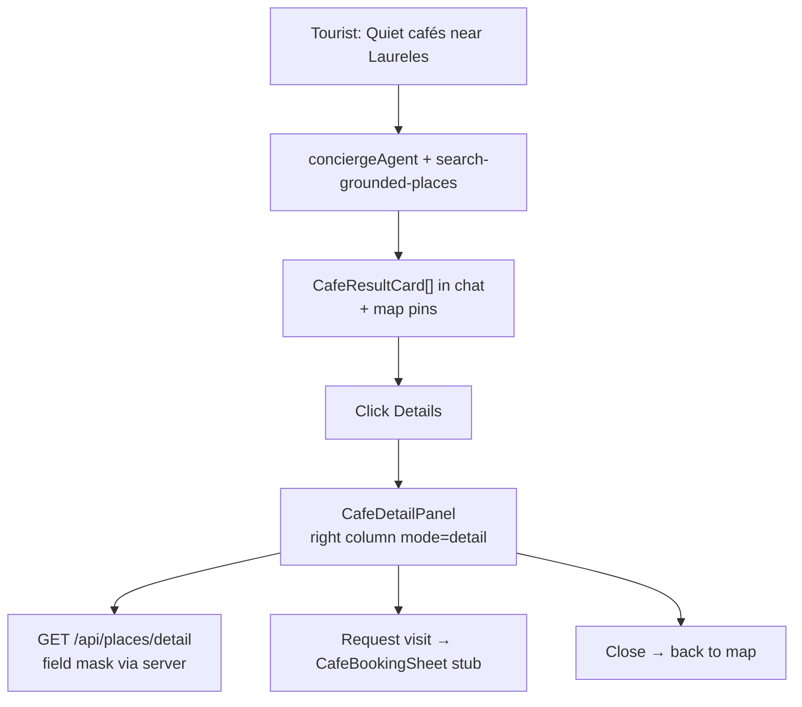
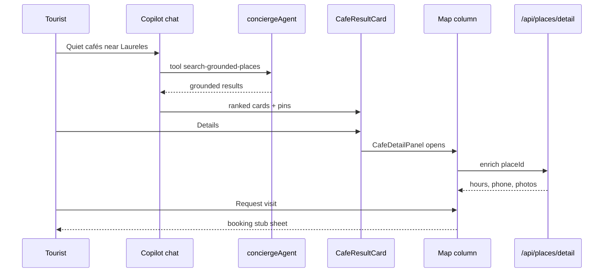

# C-012 — café Places detail + booking sheet

## In plain English

**Tourist** asks in `/chat`: *“Quiet cafés near Laureles.”* Today they might get thin map links. **C-012** gives them **photo-rich café cards in chat**, a **detail panel in the map column** (hours, rating, Google links), and a **booking stub sheet** (no real reservation DB yet).

All Places data goes through the **server** with **`X-Goog-FieldMask`** — never a browser API key.

## Real-world goal

| Stakeholder | Goal |
|-------------|------|
| **Tourist** | Pick a café from ranked cards, open detail, optionally “request visit” stub |
| **Camila** | Same `/chat` shell — rentals/events unchanged |
| **Sofía** | Small commits, field-mask grep, no `git add .` |
| **Lucía** | SCREEN-021 + maps-grounding pass with **Mastra dev running** |

## User journey (Tourist on `/chat`)





## What this PR is NOT

- Not Camila’s rental API changes  
- Not Andrés’s inline **event** cards (that is **C-013**)  
- Not a real booking database (Phase A stub only)

## Execution order

```text
C-009 🟢 → (optional C-010d) → C-012 → C-013
```

**Branch:** `feat/c012-cafe-places-detail` — **7 small commits** (see [`../COMMIT-SLICES.md`](../COMMIT-SLICES.md)).

## Seven-commit map (for PR reviewers)

| # | Commit theme | Tourist-visible effect |
|---|----------------|------------------------|
| 1 | Scripts | Restore/guard helpers for safe staging |
| 2 | place-details + API | Server can answer “what are the hours?” |
| 3 | CafeResultCard + hook | Cards look like real listings, not one-line links |
| 4 | Detail panel + sheet | Map column becomes Mindtrip-style detail |
| 5 | Chat wiring | Cards + panel actually show in `/chat` |
| 6 | Mastra filter + SCREEN-021 | Better café results + automated journey test |
| 7 | npm scripts | `test:prod-gate`, staged-path guards |

## Success criteria (merge gate)

| # | Criterion | Command / signal |
|---|-----------|-------------------|
| 1 | Field mask on every Places (New) call | `rg 'X-Goog-FieldMask|validatePlacesFieldMask' src/mastra/lib/google-places-client.ts src/app/api/places/` |
| 2 | No API key in client café code | `rg 'GOOGLE.*API_KEY|places.googleapis.com' src/components/cafe/ src/hooks/use-place-details.ts` → empty |
| 3 | No rental/event files staged | `npm run commit:staged-guard:c012` |
| 4 | Unit tests pass | `npm test -- --run src/lib/place-details.test.ts src/components/copilot/__tests__/cafe-result-card.test.ts src/mastra/tools/__tests__/search-grounded-places-quality.test.ts` |
| 5 | maps-grounding e2e | `PW_SKIP_WEBSERVER=1 npx playwright test e2e/maps-grounding.spec.ts --project=chromium` |
| 6 | **SCREEN-021** (blocking) | Dev + Mastra up, then SCREEN-021 spec |
| 7 | Floor green | `npm run floor` |
| 8 | Preview + prod smoke | Separate Vercel env checks after deploy |

### SCREEN-021 — must run before merge

```bash
# Terminal 1
cd /home/sk/mdeai/mdeapp && git checkout feat/c012-cafe-places-detail && npm run dev

# Terminal 2 (wait for [ui] + [agent] healthy)
PW_SKIP_WEBSERVER=1 npx playwright test e2e/screens/SCREEN-021-cafe-listings.spec.ts --project=chromium
PW_SKIP_WEBSERVER=1 npx playwright test e2e/maps-grounding.spec.ts --project=chromium
npm run floor
```

**Do not merge** if SCREEN-021 fails twice with agent up — log flake in evidence; do not fake Done.

## Hard gates (technical)

### Places API (New)

Google: omit field mask → API error.  
Ref: [Place Details (New)](https://developers.google.com/maps/documentation/places/web-service/place-details)

### Staging isolation

```bash
git diff --cached --name-only | rg 'rentals|event-fast-path' && echo FAIL || echo OK
bash scripts/restore-wip-c012.sh   # copy only — then wire + add -p
```

### Mixed files — `git add -p` only

| File | Café hunks only |
|------|-----------------|
| `geo-chat-shell.tsx` | `CafeBookingSheet` mount |
| `search-tool-renders.tsx` | `GroundedCafeResults` + registrar |

## WIP note

`drafts/wip-pr4-off-src/` had **15 files** but **not** full shell wiring. Branch `feat/c012-cafe-places-detail` adds `rental-ui-context`, `chat-map-panel`, `search-tool-renders`, `geo-chat-shell` integration — verify manually once.

## PR body template

```markdown
## Summary
- Tourist gets ranked café cards in `/chat` (CafeResultCard), not plain map links.
- Map column shows CafeDetailPanel + booking stub; Places detail via server field masks.
- Seven small commits; no rental or event fast-path mixed in.

## Commit slices
1. chore: restore/guard scripts
2. feat: place-details lib + GET /api/places/detail
3. feat: CafeResultCard + usePlaceDetails
4. feat: detail panel + booking sheet
5. feat: chat/map wiring
6. feat: café quality filter + SCREEN-021
7. chore: npm test:prod-gate + staged guards

## Test plan
- [x] npm run floor
- [ ] SCREEN-021 with `npm run dev` + Mastra
- [ ] maps-grounding e2e
- [ ] Preview + prod café smoke after deploy

Refs tasks/commit/may-27/tasks/C-012-cafe-places-detail.md
```

## Go / no-go (2026-05-28)

| Verdict | Reason |
|---------|--------|
| **NO-GO merge** | SCREEN-021 **3/4** — mobile `cafe-detail-mobile-sheet` missing; maps-grounding spec drift |
| **GO open draft PR** | Desktop journey works; floor green — see evidence |

Evidence: [`tasks/testing/evidence/2026-05-28/C-012-RESULTS.md`](../../../testing/evidence/2026-05-28/C-012-RESULTS.md)

## Done criteria

- [ ] Field-mask grep passes
- [ ] SCREEN-021 recorded in evidence
- [ ] localhost + preview + prod café path verified
- [ ] `npm run floor` green on merged `main`
- [ ] COMMIT-LEDGER row updated

## Related

- [`tasks/testing/prompts/C-012-cafe-places.md`](../../../testing/prompts/C-012-cafe-places.md)
- [`tasks/testing/evidence/2026-05-28/C-012-EXECUTION-REPORT.md`](../../../testing/evidence/2026-05-28/C-012-EXECUTION-REPORT.md)
- Post-merge audit: [`../../audits/C-012-cafe.md`](../../audits/C-012-cafe.md)
