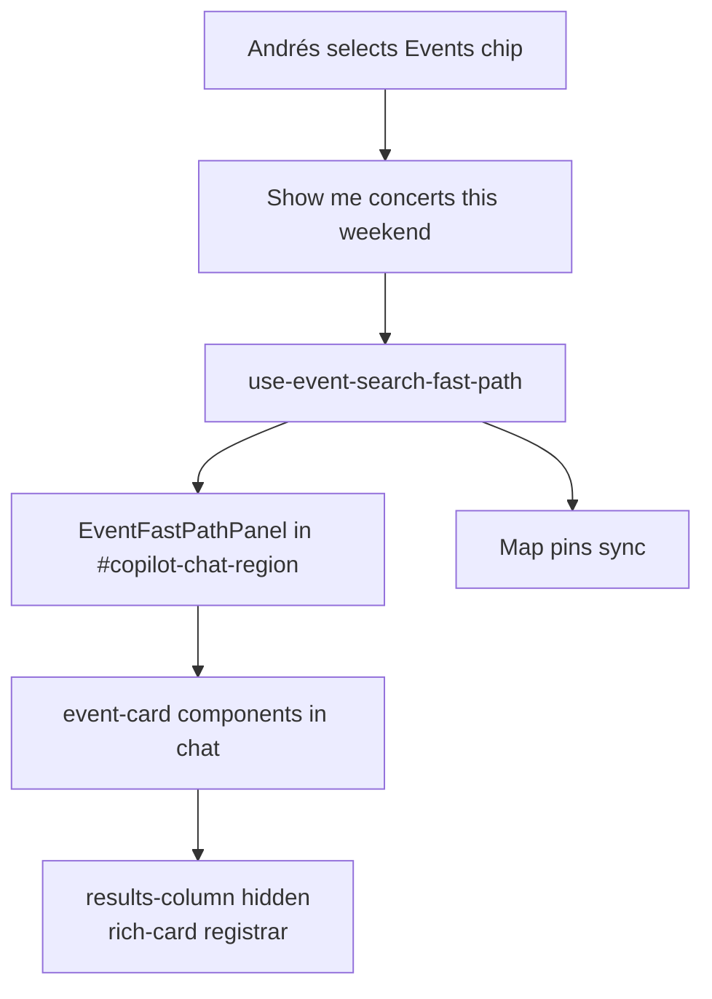
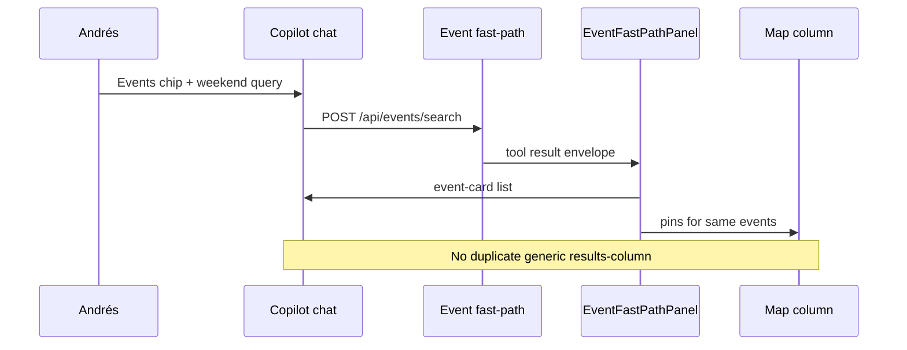
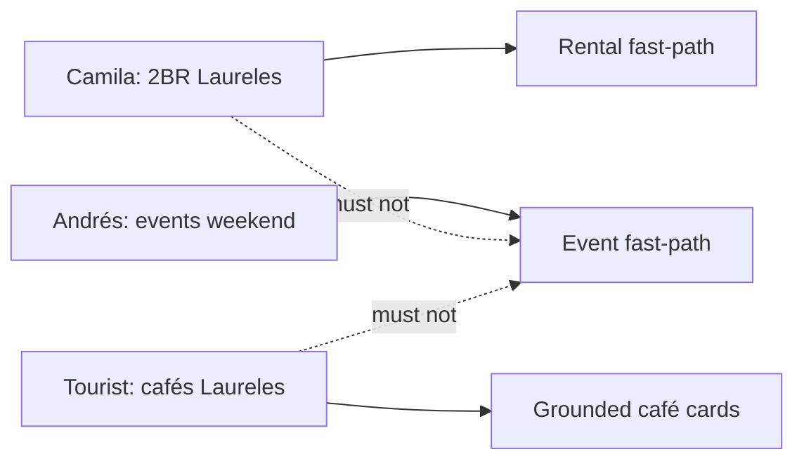

# C-013 — inline event cards on fast-path search

## In plain English

**Andrés** taps the **Events** chip and asks *“concerts this weekend.”* Rentals already show **EventCard**-style results **inside the chat column**. Events fast-path today can fill the **map** but leave chat feeling empty.

**C-013** mirrors the rental pattern: **`EventFastPathPanel`** renders **`event-card`** components in chat so discovery feels consistent across verticals.

**Do not start until C-012 is merged** — both touch `geo-chat-shell` and `search-tool-renders`.

## Real-world goal

| Stakeholder | Goal |
|-------------|------|
| **Andrés / Tourist** | See ticket-style cards in chat, not only pins |
| **Camila** | “2BR Laureles” still routes to rentals, not events |
| **Tourist** | “Quiet cafés” still routes to grounded places, not events |
| **Sofía** | Rebase on `main` after C-012; `git add -p` only |

## User journey (Andrés)





## Anti-journey (must NOT happen)



Classifier tests (PR #7) guard this — re-run after C-013.

## Execution order (strict)

```text
C-012 merged on main
  → git checkout main && git pull
  → git checkout -b feat/c013-event-fast-path-panel
  → copy event panel files from WIP
  → git add -p on mixed files only
  → SCREEN-006 + floor
  → PR
```

**No-go if C-012 is still open on a parallel branch** — rebase conflicts on `geo-chat-shell` are likely.

## What ships

| File | Role |
|------|------|
| `event-fast-path-panel.tsx` | Inline `EventCard` list |
| `event-fast-path-context.tsx` | Tool envelope + provider |
| `git add -p` on `chat-center-panel`, `concierge-chat-input`, `geo-chat-shell`, `search-tool-renders` | Wire panel without café/rental hunks |
| `SCREEN-006-event-card.spec.ts` | Blocking e2e |
| `rich-card-dedup.spec.ts` | Events row only |

## Exclude (never stage)

```
src/components/cafe/**
src/app/api/places/**
src/app/api/rentals/**
```

## Success criteria (merge gate)

| # | Criterion | Command |
|---|-----------|---------|
| 1 | C-012 on `main` | `git merge-base --is-ancestor <c012-sha> HEAD` |
| 2 | **SCREEN-006** 3/3 | Playwright with dev up |
| 3 | Event dedup e2e | `npx playwright test e2e/rich-card-dedup.spec.ts -g event` |
| 4 | Classifier tests | `npm test -- --run src/lib/__tests__/event-query-classifier.test.ts` |
| 5 | ≥1 `event-card` in chat | Manual or SCREEN-006 |
| 6 | No duplicate `results-column` | Dedup spec + manual |
| 7 | Floor green | `npm run floor` |
| 8 | Preview + prod events smoke | After deploy |

## Commands

```bash
cd /home/sk/mdeai/mdeapp
git checkout main && git pull
git checkout -b feat/c013-event-fast-path-panel

# Copy from drafts/wip-pr4-off-src/:
#   event-fast-path-panel.tsx, event-fast-path-context.tsx

npm run commit:staged-guard:c013

PW_SKIP_WEBSERVER=1 npx playwright test e2e/screens/SCREEN-006-event-card.spec.ts --project=chromium
PW_SKIP_WEBSERVER=1 npx playwright test e2e/rich-card-dedup.spec.ts -g event --project=chromium
npm run floor
```

## Commit message

```text
feat(events): inline event cards on fast-path search (C-013)

EventFastPathPanel mirrors rental panel; dedup registrar unchanged.
Refs tasks/commit/may-27/tasks/C-013-event-fast-path-panel.md
```

## Go / no-go

| Verdict | When |
|---------|------|
| **NO-GO** | C-012 not merged; or SCREEN-006 red |
| **GO** | Rebased on main with C-012; SCREEN-006 3/3; floor green |

## Related

- [`tasks/testing/prompts/C-013-event-fast-path-panel.md`](../../../testing/prompts/C-013-event-fast-path-panel.md)
- [`tasks/testing/01-event-discovery-smoke.md`](../../../testing/01-event-discovery-smoke.md)
- Depends on: [C-012](./C-012-cafe-places-detail.md)
