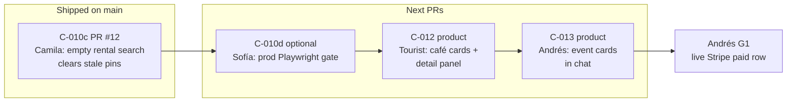

# Remaining commit tasks (May 27 breakup extension)

> **Shipped on `main` @ `e8d2a60`:** C-000…C-006, C-008…C-010c (PR #1–#12).

## What this folder is

Each file below is a **small, reviewable PR slice** — not a mega-commit. Read the **real-world goal** first, then the journey diagram, then the success criteria.

## Strict execution order

```text
1. C-010d — optional prod e2e (TEST hardening, not MVP blocker)
2. C-012 — café / Places detail (next product PR)
3. C-013 — event inline panel (after C-012 merged + rebase)
4. Andrés G1 — live Stripe paid proof (ops)
5. EVP-003 / EVP-013 / G3 / EVP-001
```

**Never run C-012 and C-013 in parallel** — they touch the same chat shell files.

## Program journey (personas)



## Who cares about what

| Persona | Surface | Next slice | What they notice |
|---------|---------|------------|------------------|
| **Camila** | `/chat` rentals | C-010d (optional) | Prod test proves empty search clears pins on www.mdeai.co |
| **Tourist** | `/chat` concierge | **C-012** | Rich café cards, map detail panel, booking stub — not markdown blobs |
| **Andrés** | `/chat` events chip | **C-013** | Event cards in the chat column, not only pins on the map |
| **Sofía** | CI + localhost | All | `npm run floor`, field masks, `git add -p`, evidence files |
| **Lucía** | Playwright | C-012, C-013 | SCREEN-021 + SCREEN-006 must pass before merge |

## Task index

| Order | ID | Dot | % | PR slot | Spec |
|------:|----|:---:|:---:|---------|------|
| 1 | **C-010d** | 🟡 | 95 | optional test PR after #12 | [C-010d](./C-010d-prod-pin-clear-e2e.md) |
| 2 | **C-012** | 🟡 | 85 | **next product PR** | [C-012](./C-012-cafe-places-detail.md) |
| 3 | **C-013** | 🟡 | 35 | **after C-012** | [C-013](./C-013-event-fast-path-panel.md) |

Branch notes (2026-05-28):

- `test/c010d-prod-pin-clear-e2e` — cherry-pick of prod e2e spec
- `feat/c012-cafe-places-detail` — **7 small commits**; SCREEN-021 still required before merge
- C-013 — **no-go** until C-012 is on `main`

## Skills

| Task | Load | MCP |
|------|------|-----|
| C-010d | `testing`, `mde-worktree-pr-flow`, `task-verifier` | — |
| C-012 | `mde-maps`, `copilotkit-develop`, `mastra`, `testing` | google-maps-code-assist |
| C-013 | `copilotkit-integrations`, `testing` | copilotkit |

## Testing prompts

| Task | Prompt |
|------|--------|
| C-010d | [`C-010d-prod-pin-clear.md`](../../../testing/prompts/C-010d-prod-pin-clear.md) |
| C-012 | [`C-012-cafe-places.md`](../../../testing/prompts/C-012-cafe-places.md) |
| C-013 | [`C-013-event-fast-path-panel.md`](../../../testing/prompts/C-013-event-fast-path-panel.md) |

## Slice plan + audit

- Commits: [`../COMMIT-SLICES.md`](../COMMIT-SLICES.md)
- Audit v2: [`../AUDIT-2026-05-28-remaining-commits.md`](../AUDIT-2026-05-28-remaining-commits.md) — **94/100**
- C-012 execution: [`../../../testing/evidence/2026-05-28/C-012-EXECUTION-REPORT.md`](../../../testing/evidence/2026-05-28/C-012-EXECUTION-REPORT.md)
