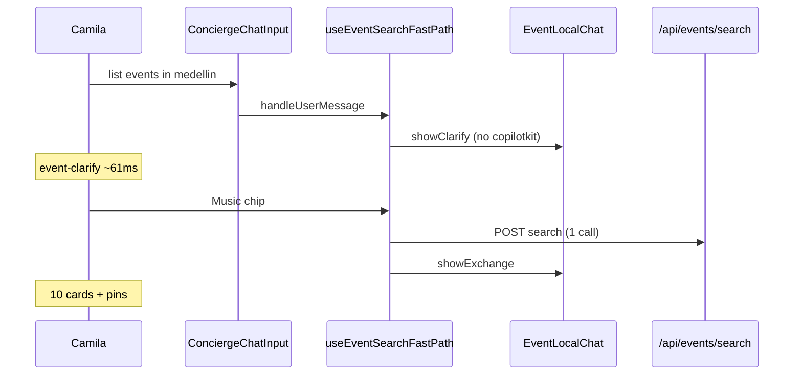

## CopilotKit audit (mdeapp @ `localhost:3001`)

Verified against **copilotkit / integrations / debug / develop / setup** skills, the **Mastra example** (`CopilotKit/examples/integrations/mastra/`), and a live run. CopilotKit MCP was not connected in this session; checks used pinned **1.55.2** exports + local example.

---

## Automated run (just now)

| Gate | Result |
|------|--------|
| `http://localhost:3001/` | **200** |
| `POST /api/events/search` | **200** |
| `POST /api/copilotkit` (empty body) | **400** (expected — needs AG-UI payload) |
| `npm test -- --run` | **272/272 pass** |
| `npm run build` | **pass** |
| `node scripts/perf-events-chat-latency.mjs` | **PASS** (T1 0 copilotkit, T2 1 `events/search`) |
| `npm run typecheck` | **FAIL** — 4 errors in **uncommitted C-004** citation files |

---

## Element breakdown (skills ↔ app)

| # | Element | Skill / docs expectation | mdeapp implementation | Status |
|---|---------|--------------------------|------------------------|--------|
| **A** | **Package pin** | Same major across `@copilotkit/*`; Phase 1 = **v1 only** | `1.55.2` runtime + react-core + react-ui; no `react-core/v2` in `src/` | **PASS** |
| **B** | **Provider** | `runtimeUrl` + `agent` key matches runtime agents | `layout.tsx`: `<CopilotKit {...getCopilotKitClientProps("conciergeAgent")}>` → dev `runtimeUrl="/api/copilotkit"` | **PASS** |
| **C** | **API route** | `CopilotRuntime` + `ExperimentalEmptyAdapter` + `MastraAgent.getLocalAgents({ mastra })` | `route.ts`: `getLocalAgentsWithLogging` + auth + `maxDuration=120` + Supabase user context | **PASS** (stricter than example) |
| **D** | **Agent map keys** | `useCoAgent({ name })` === `Mastra({ agents: { key } })` | `conciergeAgent` everywhere; not `pingAgent` for chat | **PASS** |
| **E** | **Mastra dev** | Agent server reachable (4111 for `mastra dev`) | `npm run dev` runs UI + agent concurrently | **PASS** |
| **F** | **`CopilotChat` UI** | Custom slots via `Input` / `Messages` props, not broken exports | `Input={ConciergeChatInput}` `Messages={ConciergeChatMessages}` — **no** `@copilotkit/react-ui` `Input` import | **PASS** (fix on disk, **not committed**) |
| **G** | **Custom input** | Don’t import non-exported `Input` from react-ui 1.55.2 | Local `ConciergeChatInputProps` + `<textarea>` + inline icons | **PASS** |
| **H** | **Local messages** | Fast path without polluting runtime on clarify | `EventLocalChatProvider` + `ConciergeChatMessages` | **PASS** (committed C-005) |
| **I** | **Event fast path** | Optional perf bypass (not in CopilotKit docs; mdeai design) | `useEventSearchFastPath` → `POST /api/events/search` | **PASS** (by design, not `search-events` tool) |
| **J** | **`useCoAgent` memory** | Shared state schema synced | `ConciergeWorkingMemory` in agent + `use-event-search-fast-path` | **PASS** |
| **K** | **Tool renders** | `useCopilotAction` name = Mastra tool **keys** | `search-tool-renders.tsx` + `mastra-tool-action-names.ts` | **PARTIAL** — WIP C-004; **typecheck broken** |
| **L** | **Generative UI / HITL** | `render` + `renderAndWaitForResponse` for tools | Host path: `hostEventAgent`; concierge tools in C-003/C-004 | **PARTIAL** until C-004 lands |
| **M** | **`ai_runs` audit** | Log agent turns (project rule) | `LoggingMastraAgent` wraps `MastraAgent.run()` | **PASS** |
| **N** | **Auth / keys** | No service role in client; runtime guarded | `assertCopilotKitAuthorized`; dev uses local runtime | **PASS** |
| **O** | **C-005b sheet** | Product UI, not CopilotKit | `Buy tickets` → venue sheet → checkout | **PASS** (committed; manual re-check below) |

---

## User journeys & success criteria

### Journey 1 — Camila: generic events (fast path)

```text
http://localhost:3001
→ "list events in medellin"
→ clarify chips (Music / Show all / …)
→ Show all
```

| Step | Success criteria | Automated |
|------|------------------|-----------|
| Page load | No Turbopack `Input` export error | **PASS** (after input fix) |
| Clarify | Visible &lt;500ms, **0** `copilotkit` POSTs | **PASS** (perf script) |
| Show all | **10** cards, **1** `events/search`, **0** copilotkit on T2 | **PASS** |
| Map | Event pins, no wipe | **PASS** (prior DevTools) |

### Journey 2 — Camila: agent path (rentals / restaurants)

```text
→ "1BR in Laureles under $80/night"
```

| Step | Success criteria |
|------|------------------|
| Fast path skipped | `copilotkit` POSTs, `conciergeAgent` runs |
| Tool | `search-rentals` (or router → rental workflow), Zod-validated |
| UI | Rental cards + map pins via `search-tool-renders` |

**Blocker:** full tool-render path needs **C-004** committed + `geo-chat-shell` wiring for citations.

### Journey 3 — Andrés: Buy tickets in shell (C-005b)

```text
→ Show all → Buy tickets on a card → checkout step → Back → Stripe modal
```

| Step | Success criteria |
|------|------------------|
| Sheet | `detail` → `checkout` without leaving `/` |
| API | `GET /api/events/[id]/public` **200** |
| Fallback | `/events/:id` still works |

**Manual:** you should re-click once after restart; automated perf doesn’t cover sheet.

### Journey 4 — Roberto: host wizard

```text
/host/event/new → hostEventAgent + CopilotKit in nested layout
```

Separate `CopilotKit` in `host/event/layout.tsx` with `hostEventAgent` — **PASS** pattern.

---

## Red flags & blockers

| Severity | Issue | Root cause | Fix |
|----------|--------|------------|-----|
| **P0** | `npm run typecheck` fails | C-004 WIP: `webCitations` on context vs `event-web-citation-*` | Finish **C-004** atomically or move citation files out of tree |
| **P0** | Dev crash `461527` | Imported / resolved missing `Input` from react-ui | **Done** in `concierge-chat-input.tsx` — **commit** the fix |
| **P1** | Long prompt returns **1** event not **10** | `"this week"` triggers fast path with narrow `dateWindow` | UX copy or widen default; user taps **Show all** |
| **P1** | Audit expects `search-events` **tool** | C-005 **by design** uses SQL API | Document as fast path; use agent prompt only when testing Mastra tools |
| **P2** | `pingAgent` still in `Mastra` | Legacy W1 | OK if unused; remove in cleanup week |
| **P2** | Lit dev-mode console warns | CopilotKit dep | Noise only |
| **P2** | Prod [mdeai.co](https://www.mdeai.co/) unchanged | PR #1 not deployed | Merge + promote Vercel |

---

## What’s needed for “fully correct” per skills

1. **Commit** `concierge-chat-input.tsx` fix (no react-ui `Input` / `InputProps`).
2. **Land C-004** without breaking context types (`webCitations` + shell mounts).
3. **Floor green:** `npm run typecheck && npm run build && npm test -- --run`.
4. **Manual script** (you listed) on **3001**:

```text
list events in medellin → Show all → Buy tickets → checkout sheet
```

5. **Optional agent-path test:**

```text
salsa events this weekend in Poblado
```
→ expect `copilotkit` stream + `search-events` tool in Mastra Studio / `ai_runs`.

---

## Next commands

```bash
cd /home/sk/mdeai/mdeapp

# After committing input fix + C-004 or stashing C-004 WIP:
npm run typecheck
npm test -- --run
npm run build
node scripts/perf-events-chat-latency.mjs

# If dev dies:
fuser -k 3001/tcp 4111/tcp 2>/dev/null; sleep 2
npm run dev
```

**Bottom line:** CopilotKit **Mastra integration (B–E, M, N)** matches skills and the official example. **UI slot (F–G)** is fixed on disk. **Floor is blocked only by uncommitted C-004 type errors + uncommitted input fix.** Event fast path (I) is **working** and **intentionally not** the `search-events` CopilotKit tool path.


## Branch & commits

| Item | Status |
|------|--------|
| Branch | `ship/may27-maps-events` |
| **C-003** | Committed `7b5212b` — 32 files, grounding/router only |
| **C-005 clarify fix** | On disk, **not committed** (ready to stage for C-005) |

---

## Problem breakdown (elements)

| Element | Before | After |
|---------|--------|--------|
| **T1 clarify UI** | `appendMessage(..., { followUp: false })` × 2 | `showClarify()` → local bubbles only |
| **CoAgent on clarify** | `setState({ genericAskPending: true })` → **7×** `/api/copilotkit` | `clarifyPending` in `EventLocalChatProvider` — **no** `setState` on clarify |
| **T2 search UI** | `appendMessage` × 2 | `showExchange()` — local bubbles |
| **T2 data** | `POST /api/events/search` | unchanged (correct) |
| **CoAgent on search** | `setState` in `applySearchResults` | unchanged (T2 still **0** copilot calls per perf) |
| **Perf counter** | Counted boot-time copilot noise | Reset after `copilot-chat-ready`; T1 window starts at Send |
| **Test id** | `data-test-id` (Playwright missed) | `data-testid="copilot-chat-ready"` + `event-clarify` |

**CopilotKit v1.55.2 note:** `followUp: false` only skips the LLM turn; `appendMessage` still hits the runtime. Local `ConciergeChatMessages` mirrors `UserMessage` / `AssistantMessage` without persistence — same pattern as keeping chat mounted, not using v2 APIs.

---

## User journey (verified)



---

## Tests & perf

| Command | Result |
|---------|--------|
| `npm test -- --run event-search-fast-path event-card event-clarify` | **8/8** pass |
| `npm test -- --run` | **272/272** pass |
| `node scripts/perf-events-chat-latency.mjs` | **PASS** |
| `npm run lint` | pass |
| `npm run build` | pass |

**Perf metrics (latest run):**

| Metric | Value | Target |
|--------|------:|--------|
| T1 clarify | **61ms** | &lt;500ms |
| T1 copilotkit | **0** | 0 |
| T1 event cards | **0** | 0 |
| T2 → first card | **873ms** | &lt;4000ms |
| T2 `events/search` | **1** (376ms) | exactly 1 |
| T2 copilotkit | **0** | 0 |
| T2 `grounding/event-web` | **0** | 0 |

---

## Files changed (C-005 clarify — unstaged)

**New**
- `src/components/chat/event-local-chat-context.tsx`
- `src/components/chat/concierge-chat-messages.tsx`
- `src/components/chat/__tests__/event-clarify.test.tsx`
- `scripts/perf-events-chat-latency.mjs`

**Updated**
- `src/hooks/use-event-search-fast-path.ts`
- `src/components/chat/chat-center-panel.tsx` (`Messages={ConciergeChatMessages}`)
- `src/components/chat/geo-chat-shell.tsx` (`EventLocalChatProvider`)
- `src/components/chat/concierge-chat-input.tsx` (`data-testid`)
- `src/hooks/use-public-event-detail.ts` (lint only)

**Also on disk (C-005b sheet + fast path — separate commit):**  
`event-results-panel`, `event-card`, `event-venue-detail-body`, `venue-detail-sheet`, `api/events/*`, `event-clarify-copy`, `event-search-fast-path`, etc.

---

## Remaining blockers

| Blocker | Severity |
|---------|----------|
| C-005/C-005b not committed | Must stage **only** fast-path + clarify + perf (not C-004 chat/copilotkit) |
| C-004 still dirty (`copilotkit/route`, `search-tool-renders`, chat shell, citation fetch/sync) | Keep out of C-005 commit |
| C-006 (`package.json`, `.env.example`) | Last |
| Rental map smokes | Still fail — PR waiver, not clarify |

---

## GO / NO-GO

| Gate | Verdict |
|------|---------|
| **C-003** | **GO** — committed `7b5212b` |
| **C-005 clarify perf fix** | **GO** — perf PASS, tests PASS; **commit next** (surgical file list) |
| **C-004** | **GO to start** after C-005 lands — do not mix with clarify commit |
| **C-005b sheet checkout** | **GO** — can ship as C-005b or fold into C-005 if you want one events commit |
| **Push / prod** | **NO-GO** — 4+ commits still open |

---

### Suggested C-005 commit scope (no `git add .`)

```
src/hooks/use-event-search-fast-path.ts
src/hooks/use-public-event-detail.ts
src/lib/event-clarify-copy.ts
src/lib/event-search-fast-path.ts
src/lib/__tests__/event-search-fast-path.test.ts
src/app/api/events/search/route.ts
src/app/api/events/[id]/public/route.ts
src/components/chat/event-local-chat-context.tsx
src/components/chat/concierge-chat-messages.tsx
src/components/chat/concierge-chat-input.tsx
src/components/chat/chat-center-panel.tsx
src/components/chat/geo-chat-shell.tsx
src/components/chat/event-results-panel.tsx
src/components/copilot/event-card.tsx
src/components/copilot/__tests__/event-card.test.tsx
src/components/chat/__tests__/event-clarify.test.tsx
scripts/perf-events-chat-latency.mjs
# + C-005b sheet files if you want checkout in same commit
```

Say if you want me to stage and commit **C-005** (clarify only) vs **C-005 + C-005b** (clarify + sheet) as separate commits.


# 26 May notes — ship stack

**Full tracker:** [26-may-checklist.md](./26-may-checklist.md)

## Ship progress (2026-05-27)

| ID | SHA | % | Dot |
|----|-----|--:|:---:|
| C-000 | `f993b81` | 100% | 🟢 |
| C-001 | `fec2a8f` | 95% | 🟢 |
| C-002 | `ef8c540` | 100% | 🟢 |
| C-003 | — | 98% ready (32 files; exclude fetch/sync) | 🟢 next |
| C-004 | — | 80% ready | ⚪ |
| C-005 | — | 86% ready | ⚪ |
| C-006 | — | 90% ready | ⚪ |

**Stack:** 3/7 commits (**43%**) · **Overall ship 72/100**

## Next

C-003 — see checklist § C-003 staging + forbidden-path grep.

## CTI

Separate workstream — spec 92/100, code not started. Do not mix into this PR.
