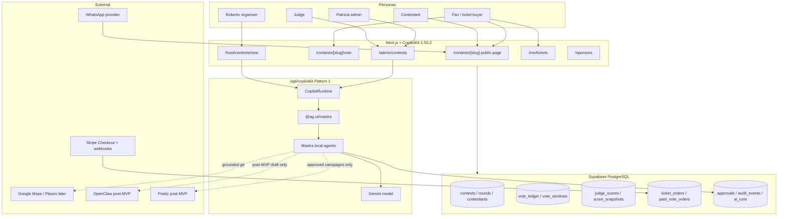
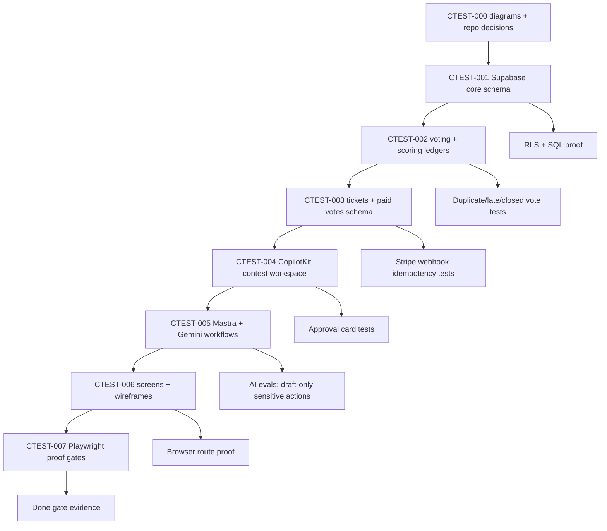
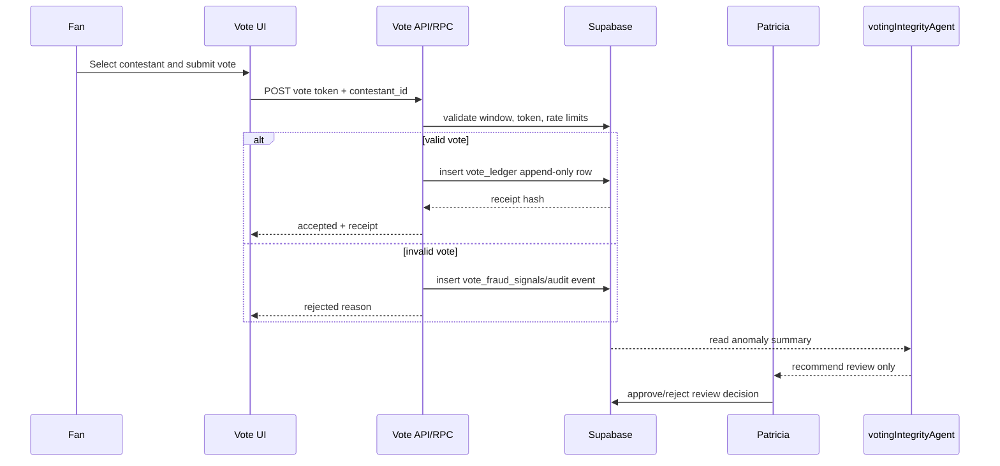
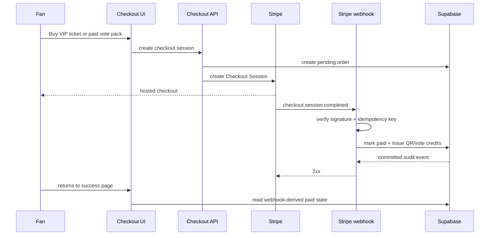
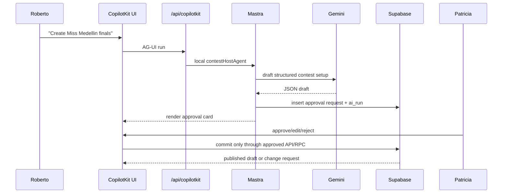
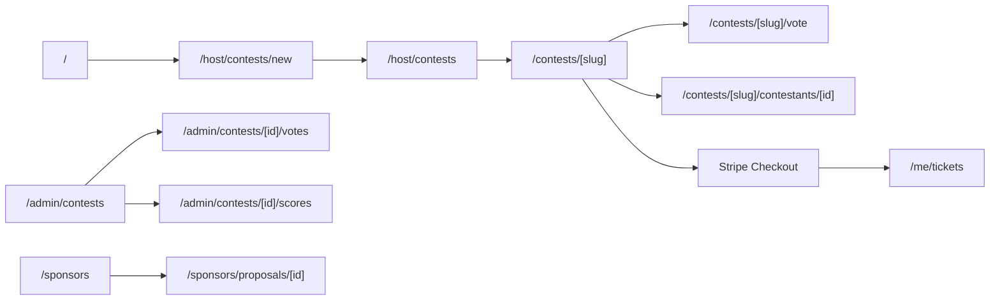
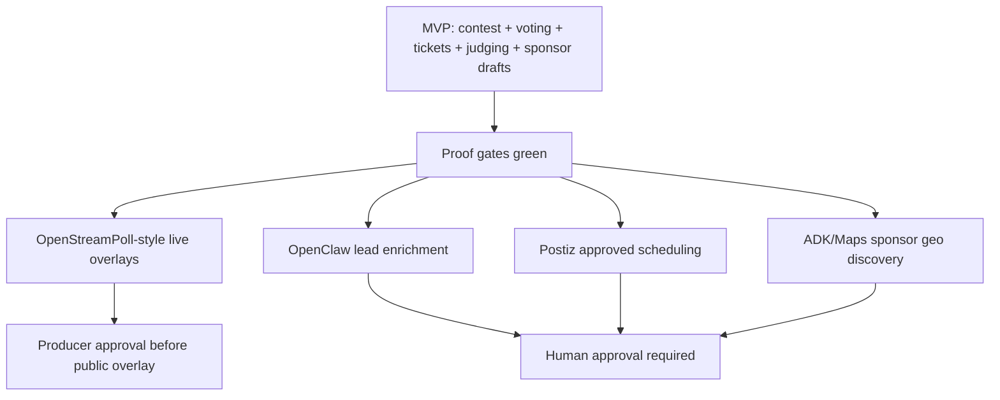

# Contest Mermaid Diagrams

These diagrams are the first implementation reference for the Miss Medellin Beauty Contest vertical. They keep the build order clear: diagrams, database truth, Supabase/RLS, then CopilotKit/Mastra/Gemini UI workflows.

## 1. MVP Platform Architecture

## 2. Correct Task Sequence

## 3. Vote Truth Flow

## 4. Stripe Paid Vote / Ticket Fulfillment

## 5. CopilotKit + Mastra Approval Flow

## 6. Screen Map

## 7. Post-MVP Boundaries

