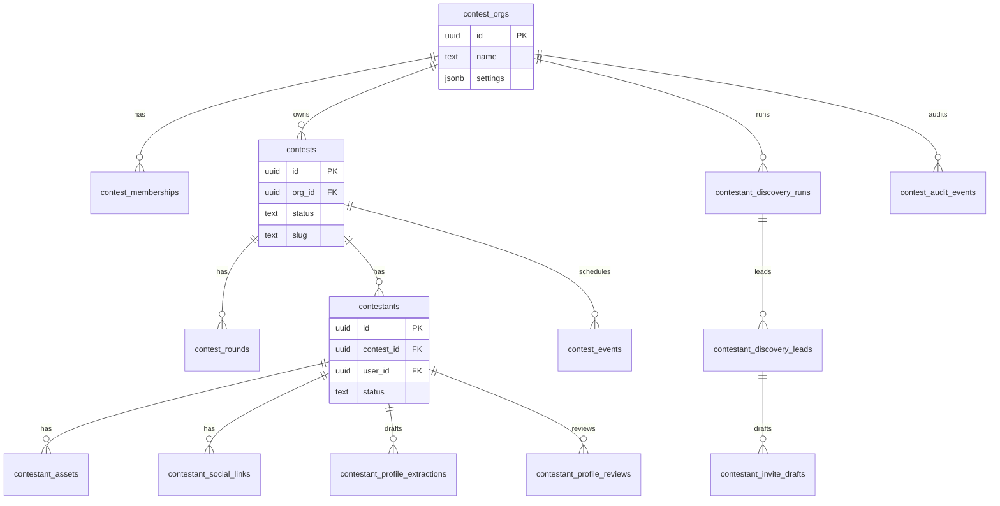
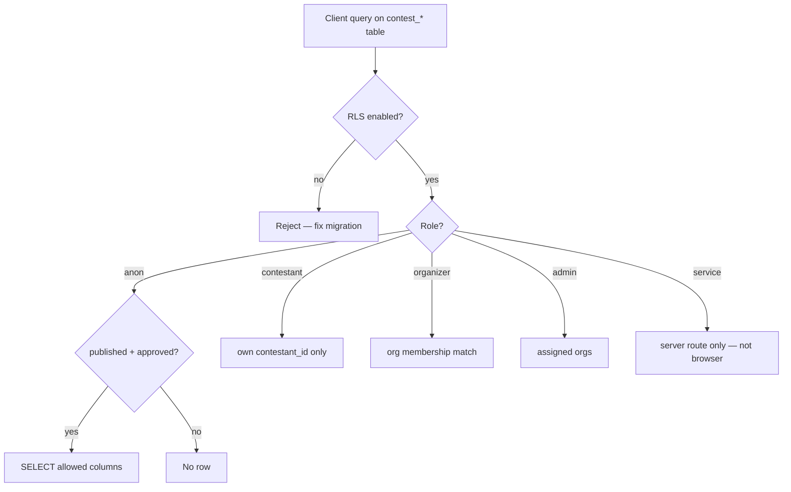
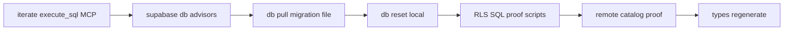

# Contest core schema (CTEST-001)

Source of truth for **MVP-A** tables before `vote_ledger` (CTEST-002) and Stripe objects (CTEST-003). Follow [`mde-supabase`](../../../.agents/skills/mde-supabase/SKILL.md) migration + RLS rules.

## Entity relationship (core pack)

## RLS decision flow (read path)

## Migration workflow (mde-supabase)

## Storage buckets

| Bucket | Visibility | RLS on storage.objects |
|--------|------------|-------------------------|
| `contestant-photos` | public read when asset approved | contestant write own; org approve |
| `contestant-docs` | private | contestant + staff only |

Use `(SELECT auth.uid())` in policies; index `org_id`, `contest_id`, `user_id`, `status` on every policy predicate column.
