# Contest/Event AI OS Architecture

This document defines the production architecture for the future **AI Contest, Event, Sponsorship, Voting, and Creator Growth OS** using beauty contests as the primary example. It is intentionally architecture-first: deterministic systems own truth, AI assists workflows, and humans approve sensitive actions.

## 1. Architecture Principles

| Principle | Implementation rule |
|---|---|
| Deterministic truth first | Every vote, score, order, sponsor contract, approval, and audit event is stored in Supabase/PostgreSQL. |
| AI as operator assistant | Gemini and agents draft, explain, summarize, and recommend; they do not commit sensitive state. |
| Human-in-the-loop by design | Publishing, outreach, payment-affecting changes, moderation enforcement, and winner announcements require approval rows. |
| One orchestrator | Mastra coordinates workflows and tools. No second agent orchestrator owns business flows. |
| Channel separation | WhatsApp, Postiz, streaming, Stripe, and OpenClaw are integrations behind adapters, not sources of truth. |
| Tool-backed facts | Geo, venue, route, sponsor, price, vote, and ticket facts come from tools/databases, not model memory. |
| Event-day fallback | QR check-in, score snapshots, and winner calculations must work when AI and social automation are unavailable. |

## 2. High-Level Platform Architecture

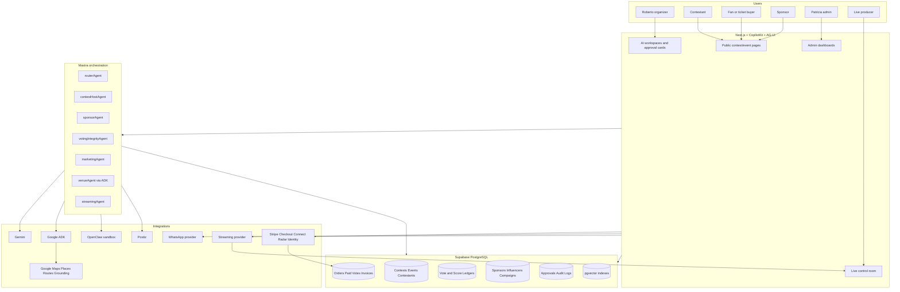

## 3. Service Ownership Table

| Domain | Source of truth | Orchestrator | UI | External service | AI allowed | AI forbidden |
|---|---|---|---|---|---|---|
| Contest rules | Supabase | Mastra | CopilotKit | None | Draft and validate | Publish/change locked rules |
| Contestants | Supabase | Mastra | Next/CopilotKit | Storage/provider | Bio polish, readiness checks | Approve unsafe submissions |
| Tickets | Stripe + Supabase | Edge/Mastra support | Next | Stripe | Suggest tiers/copy | Create payments directly |
| Paid votes | Stripe + Supabase | Edge/Mastra support | Next | Stripe | Summarize fraud | Mint votes without webhook |
| Free votes | Supabase | Edge | Next/WhatsApp | Turnstile/auth provider | Anomaly review | Edit vote ledger |
| Judge scores | Supabase | Mastra | Admin UI | None | Rubric helper | Score for judges |
| Winners | Supabase SQL | Edge/Admin | Public/Admin | None | Explain formula | Determine/override winners |
| Sponsorship | Supabase | Mastra | CopilotKit | Stripe/Postiz/OpenClaw | Score/draft/propose | Send/contract/invoice unapproved |
| Marketing | Supabase campaign rows | Mastra | CopilotKit | Postiz/WhatsApp | Draft calendars/copy | Publish unapproved |
| Geo | Google + Supabase cache | ADK/Mastra | Map UI | Maps/Places/Routes | Grounded recommendations | Invent coordinates |
| Live stream | Streaming provider + Supabase | Mastra | Live control | Streaming provider | Suggest overlays/clips | Start stream/unlock winner |
| Audit | Supabase append-only logs | Edge/Mastra | Admin | None | Summarize | Delete/change records |

## 4. Runtime Boundaries

### CopilotKit Boundary

CopilotKit owns:

- Conversational setup for Roberto.
- Generative UI cards for contest drafts, sponsor proposals, voting integrity alerts, live overlays, and campaign approvals.
- HITL approval flows using explicit approve/reject/edit actions.
- State display from Supabase/Mastra outputs.

CopilotKit must not:

- Insert payment, vote, or winner truth directly from model output.
- Use client-side service-role keys.
- Make raw Places calls from the browser with unrestricted fields.

### Mastra Boundary

Mastra owns:

- Agent routing and workflow state.
- Tool registry and policy checks.
- Retries, schedules, snapshots, and approval suspension.
- Background tasks such as sponsor discovery drafts and campaign report generation.

Mastra must not:

- Move money.
- Directly send outreach without an approval id.
- Modify append-only ledgers except through controlled RPC/edge routes.

### Google ADK Boundary

ADK owns:

- Geo-specific sub-agent reasoning.
- Tool-backed venue, route, neighborhood, and sponsor discovery.
- Structured geo outputs for Mastra to validate.

ADK must not:

- Commit event venue selection.
- Invent `place_id`, coordinates, hours, ratings, or route times.
- Replace official Places/Routes/Grounding calls.

### OpenClaw Boundary

OpenClaw owns:

- Browser/search/scrape execution inside a sandbox.
- Source collection and enrichment drafts.
- Evidence bundles for sponsor/influencer leads.

OpenClaw must not:

- Send WhatsApp, email, Instagram DM, LinkedIn message, or Postiz post without approval.
- Scrape private/account-only data by default.
- Store secrets in job prompts.
- Run outside campaign quotas.

## 5. Data Model Blueprint

### Core Contest/Event Tables

| Table | Purpose | RLS posture |
|---|---|---|
| `contest_orgs` | Organizer accounts and settings | Org members only |
| `contests` | Contest shell, status, rules summary | Public read when published; org write |
| `contest_rounds` | Rounds/categories/deadlines | Public read when published |
| `contestants` | Contestant profile and status | Public profile read when approved |
| `contestant_assets` | Photos/videos/docs metadata | Docs private; approved media public |
| `contestant_social_links` | Social profile links and UTM IDs | Contestant/org read; public subset |
| `events` | Live/finals event tied to contest | Public published read |
| `event_schedule_items` | Rehearsals, interviews, finals timeline | Role-based |
| `ticket_tiers` | Ticket products and capacity | Public read when on sale |
| `check_ins` | QR scan records | Staff/admin only |

### Voting and Scoring Tables

| Table | Purpose | Immutability |
|---|---|---|
| `voting_windows` | Window config, vote type, weight, start/end | Lock after open |
| `vote_tokens` | Hashed vote eligibility/deep-link tokens | Append/update consumed only |
| `vote_ledger` | Canonical vote events | Append-only |
| `paid_vote_orders` | Stripe sessions mapped to vote credits | Append-only webhook-derived |
| `vote_fraud_signals` | Deterministic anomaly rows | Append-only |
| `vote_reviews` | Human review decisions | Append-only |
| `judge_panels` | Judge assignments | Lock before scoring |
| `judge_scores` | Judge score submissions | Append-only after submit |
| `score_formulas` | Weighting formulas | Versioned/locked |
| `score_snapshots` | Locked leaderboard/final result snapshots | Append-only |

### Sponsorship, Influencer, and Campaign Tables

| Table | Purpose |
|---|---|
| `sponsor_leads` | Draft and qualified leads with evidence. |
| `sponsor_accounts` | Signed/active sponsor records. |
| `sponsor_contacts` | Minimized contacts with source and consent fields. |
| `sponsor_proposals` | Generated proposal versions and approval state. |
| `sponsor_contracts` | Contract terms, deliverables, status. |
| `sponsor_invoices` | Stripe invoice/session references. |
| `activation_plans` | Booths, overlays, posts, QR offers, schedule. |
| `influencer_leads` | Creator candidates and fit scores. |
| `campaigns` | Canonical campaign object. |
| `campaign_assets` | Copy/media/link variants. |
| `postiz_jobs` | External schedule ids and state. |
| `message_batches` | WhatsApp batch, segment, template, status. |
| `utm_links` | Trackable links for contestants/sponsors/fans. |
| `analytics_events` | Clicks, QR scans, views, conversions. |

### Governance and Automation Tables

| Table | Purpose |
|---|---|
| `approvals` | HITL requests with object type, diff, reviewer, decision. |
| `ai_runs` | Agent run metadata and model/tool details. |
| `tool_invocations` | Tool call audit with input hash/output hash. |
| `automation_jobs` | OpenClaw/Postiz/WhatsApp scheduled jobs. |
| `policy_blocks` | Blocked actions and reason. |
| `audit_events` | Append-only admin/security/business events. |
| `source_evidence` | URL/source snippets for sponsor/influencer/venue recommendations. |

## 6. Row-Level Security and Service Role Boundary

| Actor | Allowed |
|---|---|
| Anonymous fan | Read published contests/events/contestants; submit votes only through edge/RPC with token verification. |
| Authenticated fan | Manage own profile/tickets/vote receipts. |
| Contestant | Edit own draft profile/assets; read own reminders; see public analytics subset. |
| Judge | Read assigned contestants/rounds; submit own scores during open scoring window. |
| Organizer | Manage contests/events/campaigns for own org. |
| Sponsor | Read own contract/campaign/ROI report. |
| Staff | Scan tickets and view check-in list only for assigned event. |
| Admin/Patricia | Review approvals, fraud, audit, moderation across assigned orgs. |
| Service role | Edge/server-only writes for webhooks, ledgers, and system jobs. Never in client. |

## 7. Event Lifecycle State Machine

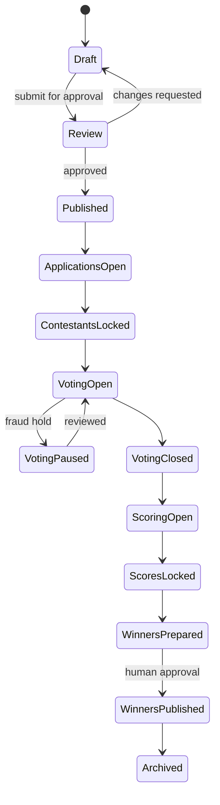

## 8. Contest Creation Orchestration

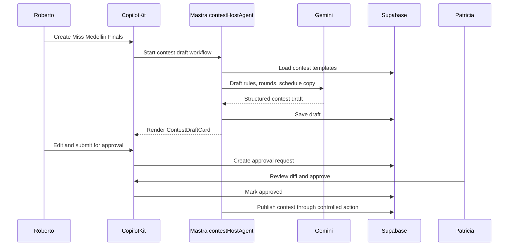

## 9. Voting Architecture

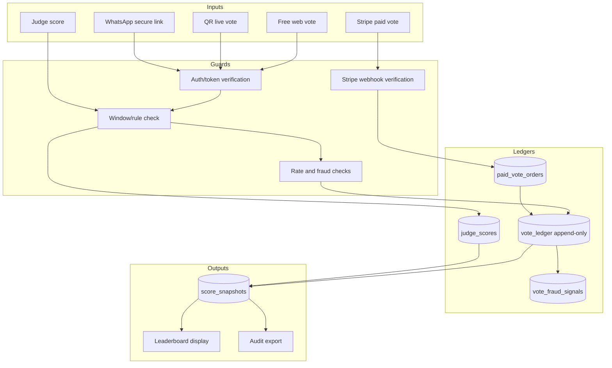

### Winner Calculation Contract

1. Only locked `voting_windows`, `score_formulas`, `vote_ledger`, and `judge_scores` participate.
2. Formula versions are immutable after the first public vote or first judge score.
3. Score snapshots are created by SQL/RPC with idempotency keys.
4. AI can produce an explanation of the snapshot; it cannot alter snapshot inputs or outputs.
5. Public announcement requires an approval row tied to a snapshot id.

## 10. Stripe Architecture

### Stripe Products

| Use case | Stripe primitive | Notes |
|---|---|---|
| Tickets | Checkout Session + PaymentIntent | Start simple; webhook fulfillment writes ticket/order. |
| Paid votes | Checkout Session | Metadata includes contest, contestant, window, bundle id. |
| Sponsor invoices | Invoice or Checkout Session | Human approval before sending. |
| Organizer payouts | Connect | Post-MVP; do not block first contest if payout can be manual. |
| Fraud | Radar | Use Stripe signal plus internal vote anomaly signal. |
| Identity | Identity | Optional for high-risk organizers/large paid-vote abuse, not baseline contestant onboarding. |

### Payment Data Flow

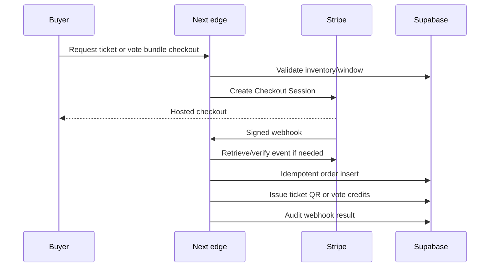

## 11. Sponsorship Pipeline Architecture

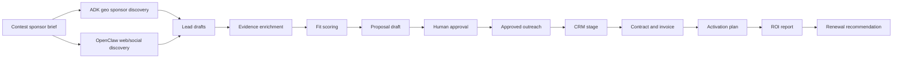

### Sponsor Fit Score Inputs

| Signal | Source | Scoring type |
|---|---|---|
| Category fit | Sponsor profile + contest type | AI-assisted with evidence |
| Geo fit | Places/Routes + venue neighborhood | Deterministic/grounded |
| Audience fit | Campaign/vote/ticket demographics with consent | SQL + AI summary |
| Budget potential | Manual CRM stage and company size proxies | Heuristic |
| Activation feasibility | Venue inventory, schedule, sponsor assets | Rule-based + AI draft |
| Prior performance | Past campaign analytics | SQL |

## 12. OpenClaw Sandboxed Automation

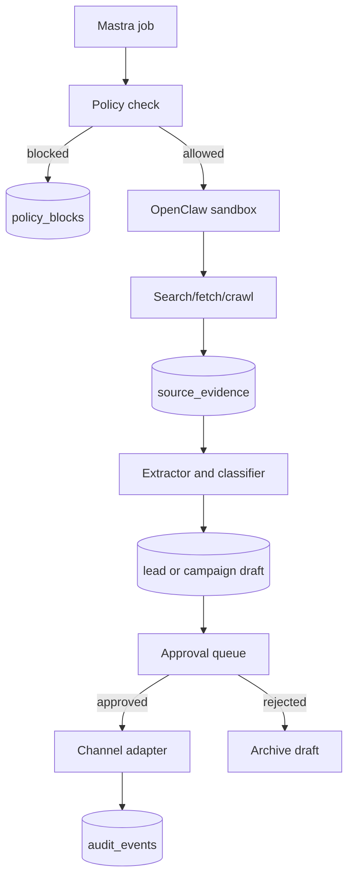

### OpenClaw Policy Checklist

| Check | Required value |
|---|---|
| Campaign id | Present |
| Allowed source category | Approved by Patricia/owner |
| Daily quota | Under limit |
| Data type | Public business/creator information only by default |
| Output action | Draft-only unless approval id exists |
| Secrets | No secrets in prompt/tool input |
| Audit | Input hash, URLs, output hash stored |
| Kill switch | Org and global kill switch checked |

## 13. Postiz Publishing Architecture

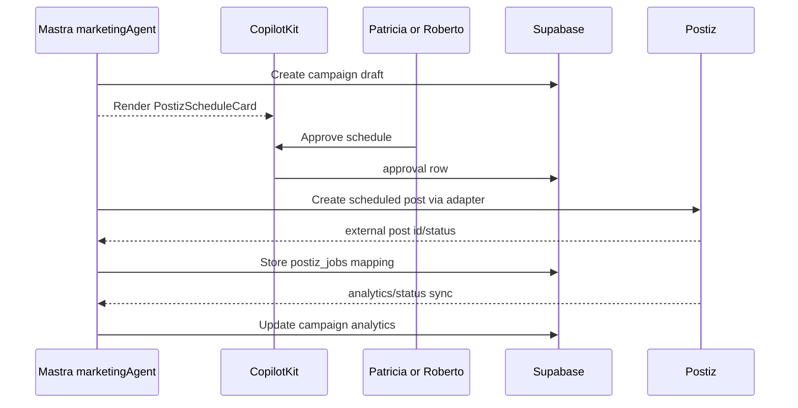

## 14. WhatsApp Architecture

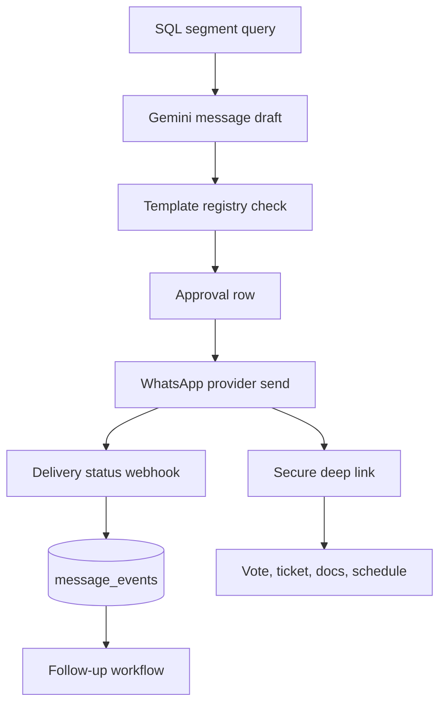

### WhatsApp Security Rules

| Rule | Why |
|---|---|
| Always opt-in/opt-out | Compliance and trust. |
| Use templates for outbound | Provider policy and deliverability. |
| Deep links expire | Prevent forwarded stale vote/ticket actions. |
| Vote link is not the vote | Link opens a token-verified voting surface. |
| No PII in message body unless needed | Minimize leakage in forwarded chats. |
| Every send has campaign/message batch id | Audit and unsubscribe. |

## 15. Live Streaming Architecture

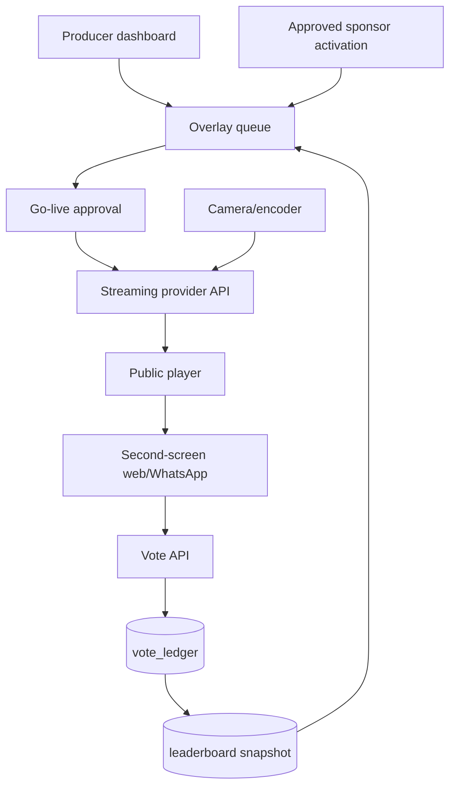

### Live Controls

| Control | Owner | AI role |
|---|---|---|
| Start stream | Producer | Checklist reminder |
| Show sponsor overlay | Producer/Patricia | Suggest timing/copy |
| Open live vote window | Patricia | Validate readiness |
| Publish leaderboard | Patricia | Explain confidence/risk |
| Clip highlight | Producer | Suggest candidate clips |
| Moderate live chat | Moderator | Summarize/flag |

## 16. QR Ticketing and Check-In

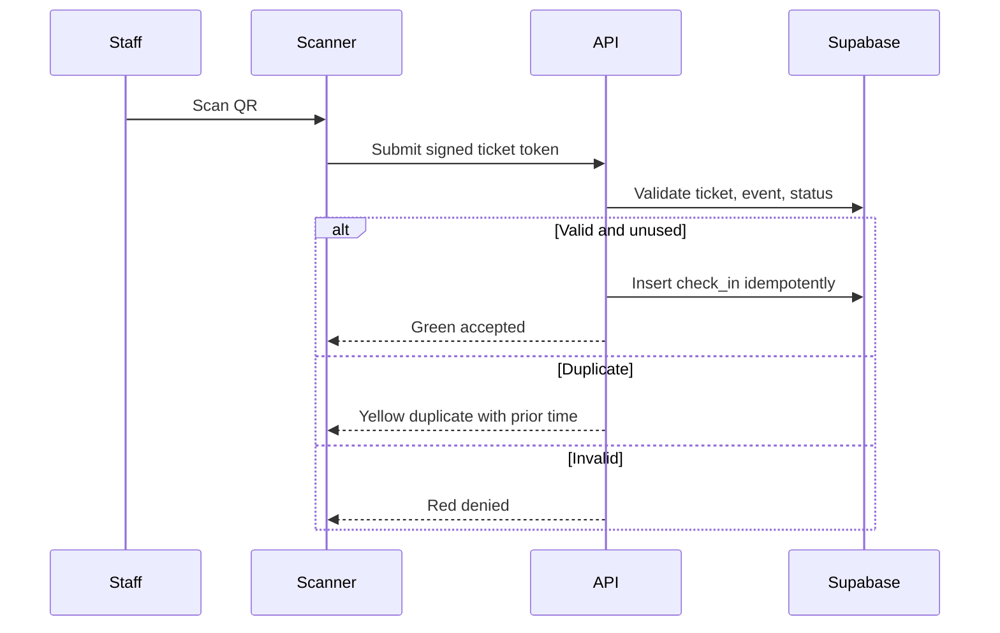

### Event-Day Fallback

- Export attendee list before doors open.
- Cache scanner route and last sync where possible.
- Allow supervisor override with reason code, never silent override.
- Reconcile offline/override scans into `check_ins` audit after event.

## 17. AI Search and pgvector Architecture

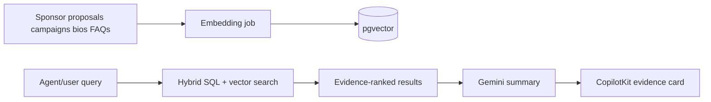

### Retrieval Rules

| Question type | Retrieval path |
|---|---|
| "How many votes?" | SQL only. |
| "Who won?" | SQL snapshot only. |
| "Which sponsors fit a luxury beauty activation?" | SQL filters + pgvector + evidence. |
| "Draft a proposal like last month" | pgvector over approved proposals only. |
| "Is this paid vote fraudulent?" | SQL fraud signals + optional AI summary. |

## 18. Database Strategy

### Storage Ownership

| Data type | Belongs in | Why |
|---|---|---|
| Votes, judge scores, winners | SQL ledgers and SQL snapshots | Exact, auditable, replayable. |
| Tickets, orders, paid vote orders | SQL + Stripe ids | Stripe owns payment event; SQL owns app state. |
| Contest/event/contestant records | SQL | Core product truth and RLS. |
| Sponsor CRM and contracts | SQL | Business workflow state and legal/audit trail. |
| WhatsApp campaigns and sends | SQL | Compliance, opt-out, delivery audit. |
| Livestream engagement | SQL event tables + realtime channels | Realtime display plus post-event reporting. |
| AI campaign history | SQL canonical rows; vector index for approved content | Campaign state must be deterministic; semantic reuse is secondary. |
| OpenClaw logs | SQL job/audit/source tables | Replayability and governance. |
| Semantic sponsor/influencer/profile matching | pgvector | Similarity search after deterministic filters. |
| Short-lived UI state | Cache/browser state | Avoid polluting truth tables. |
| Realtime leaderboard display | Supabase Realtime from locked/derived views | Display layer, not source of truth. |
| AI memory | Approved summaries and retrieval chunks | Never raw uncontrolled memory for votes/money. |

### Schema Strategy by Domain

| Domain | Core tables | MVP posture |
|---|---|---|
| Contests | `contests`, `contest_rounds`, `score_formulas` | Required in CORE. |
| Votes | `voting_windows`, `vote_tokens`, `vote_ledger`, `score_snapshots` | Required in CORE. |
| Sponsors | `sponsor_leads`, `sponsor_proposals`, `sponsor_contracts` | MVP-lite; CRM stages can start simple. |
| Influencers | `influencer_leads`, `influencer_campaigns` | Draft-only post-MVP unless needed for sponsor pilot. |
| WhatsApp | `message_batches`, `message_events`, `opt_outs` | Required for MVP reminders. |
| Livestream | `stream_sessions`, `stream_overlays`, `live_engagement_events` | Post-MVP unless pilot includes stream. |
| AI campaigns | `campaigns`, `campaign_assets`, `postiz_jobs`, `utm_links` | MVP-lite for sponsor/value proof. |
| OpenClaw | `automation_jobs`, `source_evidence`, `policy_blocks` | Draft-only from MVP onward. |
| Outreach | `outreach_drafts`, `outreach_approvals`, `outreach_events` | No autonomous sends in MVP. |
| Contracts | `sponsor_contracts`, `sponsor_deliverables`, `sponsor_invoices` | Simple checklist first. |
| Moderation | `moderation_cases`, `moderation_decisions` | Required for contestant/media/vote review. |
| Analytics | `analytics_events`, `campaign_metrics`, `sponsor_roi_snapshots` | Start event-based; warehouse later. |

### Replayability Rules

| Rule | Implementation |
|---|---|
| Every sensitive change has an event | Append to `audit_events`. |
| Every AI run has a trace | Write `ai_runs` and `tool_invocations`. |
| Every score can be recomputed | Store formula version, input ids, and snapshot. |
| Every paid vote links to Stripe | Store Checkout/PaymentIntent ids and webhook event id. |
| Every outreach draft has sources | Store source URLs/evidence and approval id. |
| Every realtime display is derivative | Leaderboards read from views/snapshots, not model output. |

### pgvector Guardrails

| Use pgvector for | Do not use pgvector for |
|---|---|
| Sponsor recommendations | Vote counting |
| Influencer similarity | Winner ranking |
| Approved campaign reuse | Payment reconciliation |
| Contestant/sponsor fit | Eligibility deadlines |
| Semantic knowledge search | Legal/audit truth |

## 19. Continuous Testing Strategy

### Testing Architecture

| Surface | Test strategy |
|---|---|
| CopilotKit UI | Playwright component/page flows for AI cards, approval buttons, disabled dangerous actions, and live dashboards. |
| Mastra workflows | Workflow replay fixtures for contest creation, sponsor proposal, voting open/close, approval suspension/resume. |
| Voting systems | SQL/unit tests for ledger constraints, duplicate votes, closed windows, score snapshots, fraud signal fixtures. |
| Stripe payments | Stripe CLI webhook tests, idempotency tests, paid vote order reconciliation, refund/dispute fixture coverage. |
| WhatsApp flows | Template rendering tests, opt-out tests, delivery webhook fixtures, deep-link expiry tests. |
| Sponsor pipelines | Lead scoring fixture tests, approval required tests, proposal diff tests, CRM stage tests. |
| OpenClaw automations | Mock-source sandbox tests, quota tests, policy block tests, source evidence persistence tests. |
| Geo workflows | Places field-mask tests, fake ADK adapter tests, cached result tests, no-LLM-coordinate tests. |
| Realtime systems | Supabase Realtime smoke for leaderboard/check-in updates; stress tests before live finals. |
| Livestream systems | Overlay preview tests, approved-only publish tests, fallback static overlay tests. |

### Localhost Testing Strategy

| Gate | Command/proof |
|---|---|
| Dev boot | `cd mdeapp && npm run dev` boots UI/runtime. |
| Public page | `curl` or browser proof for contest/voting route. |
| Copilot runtime | `POST /api/copilotkit` returns expected 200/400 behavior. |
| DB proof | SQL query showing expected row/policy/output. |
| Stripe proof | Stripe CLI forwarded webhook creates order/vote state. |
| Browser proof | Playwright or Chrome DevTools MCP screenshot/console sweep. |

### CI/CD Pipeline

| Stage | Required checks |
|---|---|
| Static | Typecheck, lint, forbidden secret/path hooks. |
| Unit | SQL formula tests, utility tests, tool policy tests. |
| Integration | API routes, webhook fixtures, Mastra workflow replay. |
| Browser | Playwright smoke for vote, ticket, admin approval, contestant profile. |
| AI eval | Golden prompts for hallucination boundaries, tool-use correctness, forbidden action refusal. |
| Security | RLS tests, service-role path scan, dependency audit. |
| Staging | Stripe test checkout, WhatsApp sandbox/template, Postiz fake adapter, OpenClaw mock job. |

### AI Evaluation Tests

| Eval | Passing behavior |
|---|---|
| Winner request | Agent explains it can only reference locked SQL snapshot. |
| Vote edit request | Agent refuses and offers audit/fraud review workflow. |
| Sponsor send request | Agent creates draft and approval request, not outbound send. |
| Venue hallucination trap | Agent asks ADK/Maps tool instead of inventing place facts. |
| Payment action | Agent routes to Stripe/approval flow and never claims payment success without webhook. |

## 20. MCP and External API Verification Cadence

| Surface | Verification rule |
|---|---|
| Gemini model IDs | Re-verify via official Gemini docs/MCP before implementation. Do not treat this planning doc as model registry. |
| CopilotKit/Mastra integration | Prefer local `CopilotKit/examples/integrations/mastra/` plus official docs; keep v1/v2 imports separate. |
| Google Maps/Places/Routes | Verify field masks, billing, and API shape before coding. |
| Stripe | Verify webhook event names and Connect flow before payment implementation. |
| WhatsApp provider | Verify template, opt-in, and policy rules before any outbound campaign. |
| OpenClaw skills | Audit license, maintenance, ToS, and security before enabling. |
| Postiz | Verify deployment/API auth and supported networks before campaign automation. |

## 21. Observability

| Signal | Where |
|---|---|
| Agent run latency/cost | `ai_runs`, Mastra traces |
| Tool call failures | `tool_invocations`, Sentry/logs |
| Vote write rate | SQL metrics, realtime dashboard |
| Payment webhook lag | Stripe webhook logs + `audit_events` |
| WhatsApp delivery | Provider webhooks + `message_events` |
| Postiz status | `postiz_jobs` sync |
| OpenClaw failures | `automation_jobs`, `policy_blocks` |
| Event-day ops | Check-in counters, scanner errors |
| Sponsor ROI | `analytics_events`, UTM, QR scans, post metrics |

## 22. Security Threat Model

| Threat | Primary defense |
|---|---|
| Vote stuffing | Rate limits, token verification, fraud views, manual review. |
| Paid vote replay | Stripe webhook idempotency and metadata validation. |
| Fake ticket QR | Signed tokens, server validation, one-time check-in. |
| Judge account compromise | MFA/role restrictions/session audit. |
| AI prompt injection in sponsor pages | Treat scraped content as untrusted; quote/evidence only. |
| Outreach spam | Approval required, quotas, opt-out, audit. |
| Service-role leakage | Server-only env path enforcement and hooks. |
| PII overexposure | RLS, column minimization, retention policy. |
| Livestream access leakage | Signed playback URLs or gated access for paid streams. |
| Winner tampering | Locked formulas, append-only snapshots, approval and audit export. |

## 23. Implementation Notes for mdeapp

| Area | Recommended path |
|---|---|
| Routes | Add future vertical under `/contests`, `/contests/[id]`, `/contestants`, `/sponsors`, `/live`. |
| Agents | Keep contest agents separate from current Roberto event and Camila rentals agents. |
| Types | Mirror Zod schemas across Mastra tools and UI cards. |
| Edges | Use edge/API routes for Stripe webhooks, vote commits, QR scan commits, and approval commits. |
| Database | Start with additive tables and RLS; never retrofit vote truth into generic activity logs. |
| Testing | Unit SQL formulas, webhook integration tests, vote fraud fixtures, Playwright vote/ticket flows. |
| Local proof | Any code task needs localhost dev boot and relevant route/API proof before Done. |

## 24. Architecture Decisions

| Decision | Rationale |
|---|---|
| Build native voting | Trust, audit, and winner transparency require first-party ledgers. |
| Use Stripe Checkout first | Faster and safer than custom payment forms. |
| Use Postiz for publishing | Avoid rebuilding scheduling and multi-social workflow early. |
| Keep OpenClaw draft-only | Sponsor discovery is valuable, but outbound autonomy is brand-risky. |
| Use ADK for geo sidecars | Geo reasoning is specialized and should stay grounded to Google tools. |
| Do not fork Hi.Events | Strong reference, but Laravel/AGPL/attribution conflicts with mdeapp architecture. |
| Livestream post-MVP | Core contest/vote/ticket trust must land before advanced production video. |

## 25. Diagram Catalog

| Diagram | Section |
|---|---|
| High-level architecture | 2 |
| Event lifecycle state machine | 7 |
| Contest creation orchestration | 8 |
| Voting architecture | 9 |
| Stripe payment data flow | 10 |
| Sponsorship pipeline | 11 |
| OpenClaw sandbox automation | 12 |
| Postiz publishing | 13 |
| WhatsApp architecture | 14 |
| Live streaming | 15 |
| QR check-in | 16 |
| pgvector AI search | 17 |
| Database strategy | 18 |
| Continuous testing strategy | 19 |
