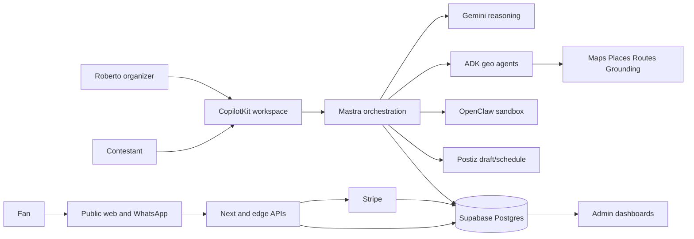
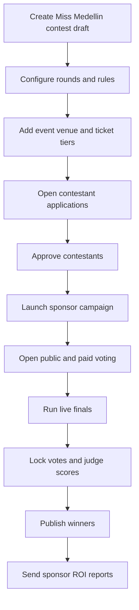
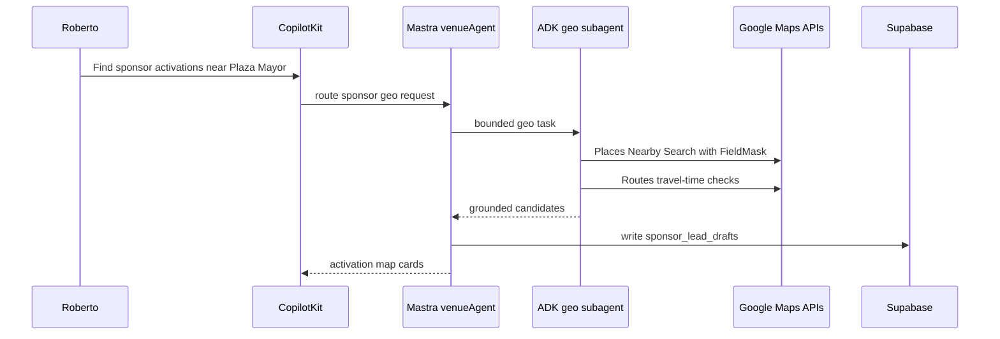
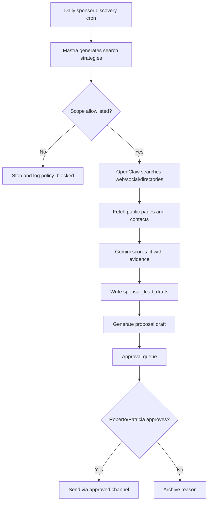
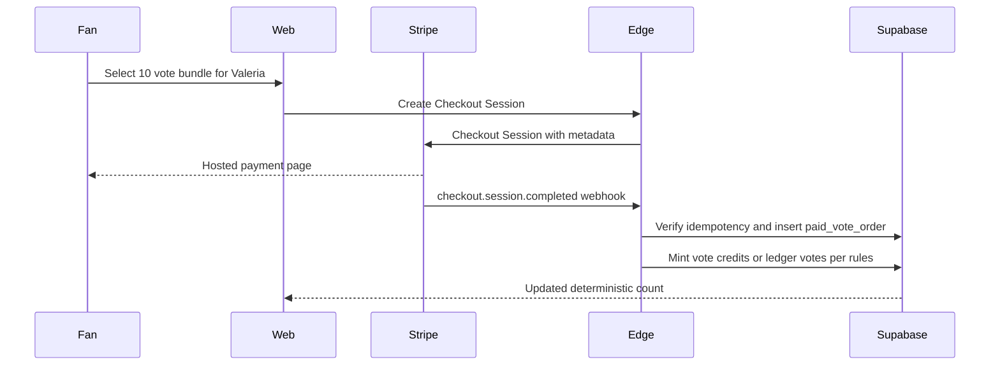
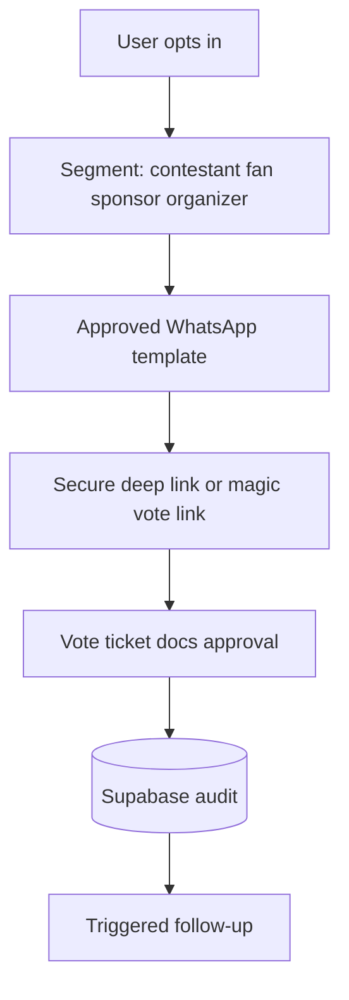
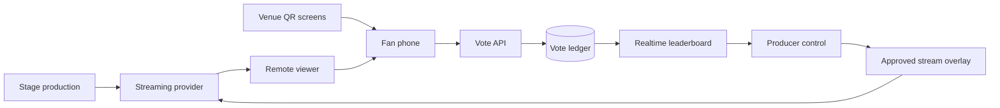
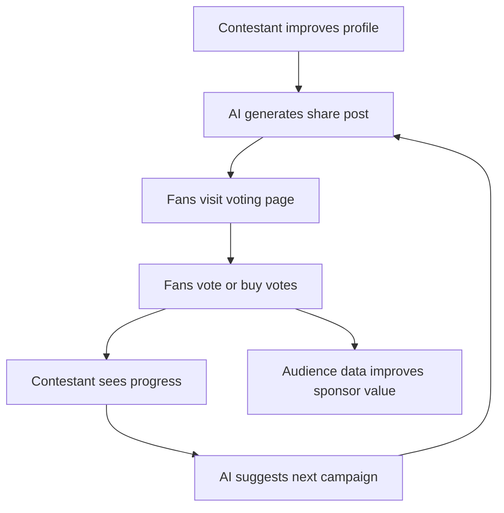
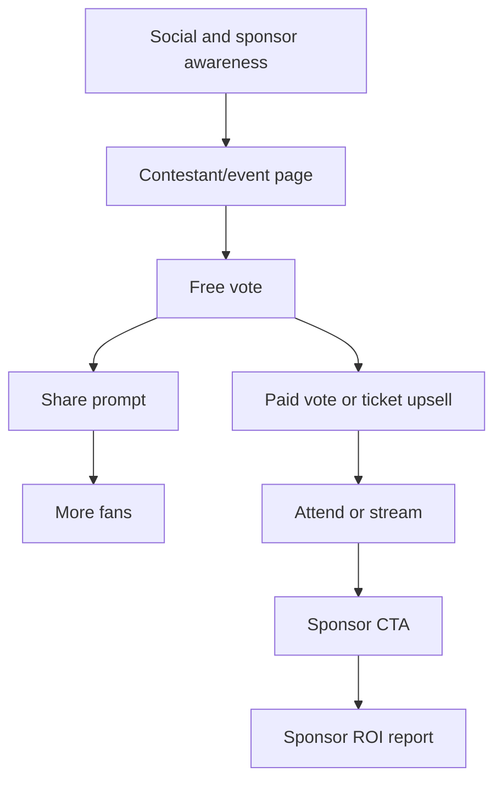

# AI Contest, Event, Sponsorship, Voting, and Creator Growth OS

## 2026-06-02 Task Verification Update

The contest pack is **not yet 100% implementation-correct** under the repo-local `task-verifier` rubric. It is a strong planning pack, but current proof shows:

| Area | Current proof | Verdict |
|---|---|---|
| Linear | Events Platform project exists. Before sync, issue list was empty; `prefix:EVT` existed and `prefix:CONT` was missing. This pass created `prefix:CONT` and CTEST issues SAN-532 through SAN-544. | Synced; re-check before execution to avoid duplicates. |
| App routes | `mdeapp/src/app` has event, ticket, rental, restaurant, auth, and CopilotKit routes; no `/contests` or contestant profile routes exist yet. | Contest routes not implemented. |
| Supabase | `mdeapp/supabase/migrations` has event/sponsor/realtime foundations; no contest core schema migration exists yet. | Contest DB not set up. |
| Shadcn | Project is Next.js 16, Tailwind v4, shadcn base-nova, lucide, and only core UI components installed. | Contest forms must add/use Field, Input Group, Select, Tabs, Table, Sheet/Drawer as needed. |
| Screens | Existing wireframe doc covered only a subset of MVP screens. | Added missing contestant signup/profile/coach/discovery surfaces. |
| Task spec quality | Existing CTEST-000..007 specs are useful but do not all follow the full ten-section task template. | Added CTEST-012 to normalize specs before execution. |

Immediate additions from this pass:

- `CTEST-008` for contestant signup, Instagram/public URL intake, and profile extraction.
- `CTEST-009` for contestant profile editing, photo uploads, casting/event preparation, and CopilotKit coaching.
- `CTEST-010` for public contestant voting/share pages and growth loops.
- `CTEST-011` for governed OpenClaw/Firecrawl discovery and approved invite drafts.
- `CTEST-012` for task template normalization, Linear sync, labels, and verification evidence.

Updated product rule: a contestant can paste an Instagram or public portfolio URL to draft a profile, but the system must never bypass platform terms, scrape private content, or auto-contact anyone. URL extraction is draft-only, source-attributed, and approval-gated.

> Product thesis: **mdeai becomes the AI operating system for contests, live events, sponsorships, influencers, and experiential marketing.** Beauty contests are the primary wedge because they combine identity, stage production, ticketing, voting, sponsors, live audiences, creators, local businesses, and high-emotion fan participation.

## Non-Negotiable System Rules

| Rule | Production meaning |
|---|---|
| Supabase owns deterministic truth | Contestants, events, votes, judge scores, ticket orders, approvals, sponsor CRM rows, audit logs, and winner calculations live in PostgreSQL with RLS and immutable ledgers. |
| Stripe owns money | Tickets, paid voting, sponsor invoices, refunds, payouts, and disputes are reconciled from Stripe webhooks, not AI output. |
| AI never controls vote truth | AI can detect anomalies, summarize sentiment, and recommend review; it cannot insert, edit, delete, recalculate, or override canonical votes. |
| AI never controls winners | Winners are deterministic SQL/materialized calculations from approved scoring rules and locked ledgers. |
| AI never controls money | Gemini/Mastra can draft package pricing and invoice copy; Stripe plus human approval commits money movement. |
| Humans approve sensitive actions | Publishing a contest, sending sponsor outreach, starting paid votes, disqualifying contestants, refunding payments, and announcing winners require HITL approval. |
| Mastra orchestrates | Mastra owns workflows, tools, retries, state transitions, and background jobs. |
| CopilotKit renders AI UI | CopilotKit owns assistant panels, generative cards, approval surfaces, live dashboards, and AI workspaces. |
| ADK handles grounded geo intelligence | ADK + Google Maps/Places/Routes/Grounding power venue and sponsor discovery, but do not invent lat/lng or place facts. |
| OpenClaw executes only approved automations | OpenClaw performs sandboxed scraping/browser work and queues drafts; it never sends outreach or mutates CRM without an approval record. |

## MVP Simplicity Rules

IMPORTANT: do not overengineer the MVP.

| Prefer in MVP | Avoid in MVP |
|---|---|
| Modular monolith inside `mdeapp/` | Excessive microservices |
| Supabase-first architecture | Complex distributed truth |
| Edge/API routes for sensitive commits | Direct client writes for votes/payments |
| Queue-based workflows | Autonomous multi-agent swarms |
| Approval-driven AI | Autonomous outbound messaging |
| Minimal agent count | Dozens of specialist agents before product proof |
| Deterministic workflows | AI-controlled winner, vote, or money logic |
| CopilotKit Cloud for speed | Early self-hosted Kubernetes burden |
| Simple pgvector search after SQL works | Overbuilt vector memory architecture |
| Localhost/runtime proof for Done | Markdown-only completion claims |

The MVP goal is already large enough:

- Beauty contest setup.
- Contestant onboarding.
- Voting and paid voting.
- Event management and ticketing.
- Sponsorship workflows.
- AI marketing drafts.
- WhatsApp engagement.
- Basic influencer workflows.
- Geo sponsor discovery.

Focus on shipping quickly, operational usability, growth loops, sponsor monetization, and audience engagement.

## AI Governance Rules

| AI may | AI must never |
|---|---|
| Recommend contest rules, sponsor packages, campaigns, and moderation actions | Determine winners |
| Summarize vote, payment, campaign, sponsor, and livestream activity | Modify vote truth |
| Classify leads, comments, media, and fraud signals | Autonomously spend money |
| Enrich sponsor and influencer records with source evidence | Autonomously send contracts |
| Automate repetitive drafts and reminders | Autonomously publish campaigns |
| Generate CopilotKit cards and approval diffs | Autonomously send sponsor/influencer outreach |
| Explain locked score snapshots | Override judges or Patricia |

Humans must approve payments, contracts, outbound sponsor outreach, major campaign launches, moderation bans, livestream overlays that affect sponsors/winners, and winner announcements.

## Best MVP Stack Recommendation

| Layer | MVP recommendation | Enterprise/post-MVP note |
|---|---|---|
| Frontend | Next.js + CopilotKit Cloud | Self-host CopilotKit Intelligence only when compliance/tenant isolation demands it. |
| AI workflows | Mastra | Keep one orchestration layer. |
| Core AI | Gemini 3.5 Flash where still current at implementation time | Use Pro/Live only for specific workloads. |
| Geo intelligence | ADK + Google Maps/Places/Routes/Grounding | Cache and audit grounded results. |
| Database | Supabase PostgreSQL | Add warehouse later, not in MVP. |
| Search | SQL first, pgvector second | Use vector only for semantic recommendations and approved memory. |
| Payments | Stripe Checkout + webhooks | Add Connect when payout complexity is real. |
| Social automation | Postiz for approved scheduled posts | Keep campaign source of truth in Supabase. |
| Browser automation | OpenClaw draft-only | Add autonomous research only after quotas, audit, and legal review. |
| Realtime | Supabase Realtime | Add dedicated event bus only after stress proof. |
| Testing | Playwright + Chrome DevTools MCP + workflow tests | Add load labs for large televised finals. |

## Source Links Used

| Source | Use in this plan |
|---|---|
| [Photography_Contest_ReactJS](https://github.com/atharva-narkhede/Photography_Contest_ReactJS) | Photo upload, contest gallery, voting, admin CRUD pattern; low production score. |
| [nak-sued-webmasters/photo-contest](https://github.com/nak-sued-webmasters/photo-contest) | Lightweight Airtable-backed contest pattern; useful for low-code admin inspiration only. |
| [Photography-Competitions](https://github.com/tapaswenipathak/Photography-Competitions) | Directory/discovery pattern for competitions and grants. |
| [GitHub photo-contest topic](https://github.com/topics/photo-contest) | Broad UI/feature inspiration scan. |
| [GitHub contest-website topic](https://github.com/topics/contest-website) | Contest landing/gallery/leaderboard inspiration scan. |
| [Hi.Events](https://github.com/HiEventsDev/hi.events) | Open-source ticketing, QR check-in, promo, affiliate, order audit inspiration; do not fork because stack/license mismatch. |
| [libreevent](https://libreevent.janishutz.com/) | Self-hosted event ticketing and entry-control inspiration. |
| [React Bracket](https://madewithreactjs.com/bracket) | Leaderboard/bracket UI reference, not core contest logic. |
| [contestant-management topic](https://repos.ecosyste.ms/topics/contestant-management) | Pageant/tabulation/contestant-management repo discovery. |
| [CopilotKit Mastra starter](https://github.com/CopilotKit/CopilotKit/tree/main/examples/integrations/mastra) | Next.js + CopilotKit + Mastra runtime shape; replace OpenAI defaults with Gemini. |
| [Google ADK docs](https://adk.dev/) and [ADK samples](https://github.com/google/adk-samples) | Agent/tool/grounded geo architecture reference; samples are demo, not production. |
| [Gemini 3.5 Flash docs](https://ai.google.dev/gemini-api/docs/models/gemini-3.5-flash) and [Gemini deprecations](https://ai.google.dev/gemini-api/docs/deprecations) | Model strategy and implementation-time re-verification requirement. |
| [Google Places field masks](https://developers.google.com/maps/documentation/places/web-service/choose-fields) | Cost and response-shaping rule for Places API New. |
| [Grounding with Google Maps](https://ai.google.dev/gemini-api/docs/maps-grounding) | Gemini + Maps factual grounding boundary. |
| [CopilotKit provider docs](https://docs.copilotkit.ai/reference/components/CopilotKit), [Copilot Runtime docs](https://docs.copilotkit.ai/llamaindex/copilot-runtime), and [CopilotKit Intelligence](https://www.copilotkit.ai/copilotkit-intelligence) | Cloud vs self-hosted CopilotKit strategy. |
| [Postiz](https://github.com/gitroomhq/postiz-app) | Social scheduling, analytics, API automation, team workflow inspiration. |
| [OpenClaw web scraper plugin](https://github.com/hvkeyn/openclaw-plugin-web-scraper) | Web search/fetch/crawl skill pattern. |
| [Decodo OpenClaw skill](https://github.com/Decodo/decodo-openclaw-skill) | Scraping API skill pattern for governed enrichment. |
| [OpenClaw Ultra Scraping](https://github.com/LeoYeAI/openclaw-ultra-scraping) | Adaptive scraping pattern; use cautiously due anti-bot risk. |
| [Stripe Checkout](https://stripe.com/payments/checkout), [Stripe Connect](https://stripe.com/connect), [Stripe Radar](https://stripe.com/radar), [Stripe Identity](https://stripe.com/identity) | Payment, payout, fraud, and identity verification strategy. |

## Section 1: Executive Summary

### Product Vision

Build an **AI-native event and contest operating system** where an organizer can launch a beauty contest, sell tickets, onboard contestants, manage judges, activate sponsors, grow audiences, run live voting, stream the finals, and prove sponsor ROI from one governed platform.

Primary example:

```text
Miss Medellin Beauty Contest Finals
```

The platform should let Roberto, as an event host, say:

```text
Create the Miss Medellin Finals at Plaza Mayor, 800 seats, three sponsor tiers,
public voting, VIP tickets, WhatsApp reminders, and a live-stream sponsor overlay.
```

CopilotKit renders the planning workspace, Mastra decomposes the work, ADK grounds venue/sponsor geography, Gemini drafts content and recommendations, Supabase stores truth, Stripe handles money, Postiz schedules social publishing, OpenClaw discovers leads in a sandbox, and WhatsApp drives LatAm distribution.

### Mission

Turn fragmented contest/event operations into a measurable growth engine:

- Contestants grow audiences and personal brands.
- Fans vote, buy, share, and participate live.
- Sponsors get campaign assets, activations, and ROI reports.
- Organizers replace spreadsheets, WhatsApp chaos, and manual sponsor prospecting with governed AI workflows.
- Patricia can audit every vote, payment, outreach action, moderation decision, and winner calculation.

### Market Opportunity

Beauty contests, creator events, fashion shows, influencer competitions, nightlife activations, and local cultural festivals share the same operating pattern:

| Operating need | Current fragmentation | mdeai opportunity |
|---|---|---|
| Contest setup | Spreadsheets, PDFs, manual forms | AI-assisted contest builder with deterministic schema |
| Ticketing | Eventbrite-style checkout + separate scanner | Native/Stripe ticketing with QR and sponsor context |
| Voting | Standalone voting apps | Public, paid, WhatsApp, QR, and live voting with immutable ledger |
| Contestants | Manual onboarding and reminders | AI contestant concierge + growth dashboard |
| Sponsors | Cold email, decks, guesswork | AI sponsor discovery, proposal generation, activation planning, ROI tracking |
| Marketing | Ad hoc Instagram/WhatsApp work | Postiz + AI campaigns + tracked referral loops |
| Live event | Separate stream, overlays, leaderboards | Real-time second-screen experience with sponsor inventory |
| Audit | Manual tabulation risk | Deterministic SQL, locked scoring rounds, audit logs |

### Why Contests and Events Are Broken Today

1. Organizers run the contest in one tool, tickets in another, voting in another, WhatsApp in another, and sponsor sales in spreadsheets.
2. Contestant profiles are static, but contestants need daily guidance, content, schedule reminders, and campaign help.
3. Paid voting monetizes attention, but without transparent ledgers and fraud controls it becomes trust-sensitive.
4. Sponsors buy logo space without reliable ROI proof.
5. Live streams are usually disconnected from voting, tickets, sponsor overlays, and second-screen engagement.
6. Local sponsor discovery is manual and especially inefficient in dense districts like Provenza, Laureles, Poblado, Plaza Mayor, and Comuna 13.

### Why AI Changes the Industry

AI helps where the work is high-volume and judgment-heavy:

- Draft contest structures, schedules, judging rubrics, and public copy.
- Convert sponsor goals into proposals, packages, and activation concepts.
- Analyze contestant profiles and suggest campaign improvements.
- Summarize voting anomalies without changing vote truth.
- Generate WhatsApp reminders and fan updates.
- Turn venue, business, and map context into grounded activation plans.
- Create social calendars that Postiz can schedule after approval.

AI should **not** replace deterministic systems. It should reduce operational drag while keeping truth in audited ledgers.

### Why This Platform Is Different

| Alternative | Strength | Gap mdeai fills |
|---|---|---|
| Choicely | Strong pageant apps, voting, mobile engagement | Less AI-native sponsor discovery, contestant growth coaching, and operational orchestration. |
| Eventbrite | Mature tickets and event pages | Not contest-native, weak contestant/judge/vote/sponsor OS. |
| Photography contest apps | Gallery + voting pattern | Usually hobby-grade, weak fraud, payments, live event, and sponsor workflow. |
| Pageant systems | Judge scoring/tabulation | Often old-stack, admin-heavy, not creator-growth or AI-native. |
| Event apps | Schedules, tickets, maps | Not built around competitions, paid voting, contestants, and sponsor ROI. |
| Creator economy apps | Social growth, audience tools | Not tied to venue, ticketing, voting, judges, and live operations. |

### The AI-Native Combination

| Stack piece | What it unlocks for Miss Medellin Finals |
|---|---|
| CopilotKit | Roberto sees AI-generated event cards, sponsor proposals, approval panels, contestant dashboards, and live leaderboards inside the app. |
| Mastra | Workflows coordinate contest creation, voting windows, sponsor outreach drafts, WhatsApp reminders, QR check-in, moderation queues, and live operations. |
| Google ADK | Geo agents reason over venues, routes, neighborhoods, sponsor clusters, nearby hotels, nightlife, restaurants, and activation logistics. |
| Gemini | Drafts copy, proposals, messages, summaries, and recommendations from tool-backed facts. Exact model IDs must be re-verified at implementation time. |
| Supabase/PostgreSQL | Contest, vote, money, score, and audit truth. |
| pgvector | Semantic sponsor matching, contestant profile search, influencer discovery, and AI memory retrieval. |
| Stripe | Tickets, paid votes, sponsor invoices, Connect payouts, fraud tooling, identity verification where needed. |
| Postiz | Approved social campaigns, contestant content calendars, sponsor posts, and analytics. |
| OpenClaw | Sandboxed sponsor/influencer/venue discovery and enrichment; drafts only until approved. |
| WhatsApp | Contestant reminders, fan voting links, sponsor updates, organizer alerts, viral sharing in Colombia. |
| Live streaming | Finals broadcast, overlays, second-screen engagement, sponsor placements, live leaderboard moments. |

## Section 2: GitHub Repos and Open Source Foundations

### Repo Comparison Summary

| Repo/platform | Strengths | Weaknesses | Production readiness | Best reuse | Do not copy | mdeai score |
|---|---|---|---|---|---|---:|
| Photography_Contest_ReactJS | MERN gallery, registration, photo uploads, one-vote flow, admin CRUD | Tiny repo, little maintenance signal, split backend, weak security/fraud/payment design | Low | Contest gallery and simple admin flow inspiration | Vote logic, auth model, production architecture | 48 |
| nak photo-contest | Lightweight web app, Airtable topic, MIT | Minimal public detail, small community, likely demo-grade | Low | Low-code admin/content inspiration | Data model for production truth | 35 |
| Photography-Competitions | Competition/grant directory idea | Directory, not contest platform; old/minimal | Low | Discovery/listing taxonomy | Any operational flow | 28 |
| GitHub photo-contest topic | Broad examples of galleries, leaderboards, upload flows | Mixed quality and stale repos | Research-only | UI pattern discovery | Direct code reuse without audit | 45 |
| GitHub contest-website topic | Landing pages, contest websites, public profile pages | Usually shallow frontend examples | Research-only | Marketing page inspiration | Business logic | 40 |
| Hi.Events | Ticketing, QR check-in, promo codes, affiliate tracking, audit-rich event operations | Laravel/PHP, AGPL + attribution, not AI-first | High as product; low as fork target | Ticketing/check-in/affiliate/product modeling | Forking into mdeapp | 80 as reference, 45 as fork |
| libreevent | Self-hosted event tickets, seat plans, entry-control mobile apps, plugins | Different stack; not contest-native | Medium | Entry control and seat plan concepts | Direct operational dependency for MVP | 62 |
| React Bracket | Visual ranking/bracket component inspiration | UI-only; not pageant scoring | Medium as UI component | Leaderboard/bracket visuals | Winner/scoring logic | 55 |
| contestant-management topic | Pageant management discovery | Mixed old stacks, often insecure demos | Research-only | Tabulation concepts and anti-pattern examples | Credentials, PHP5-style patterns, weak auth | 40 |
| CopilotKit Mastra starter | Next.js + CopilotKit + Mastra dev shape | Example uses OpenAI env in README; mdeai must use Gemini | Medium as starter | Runtime wiring, AG-UI pattern, dev scripts | Provider defaults, demo-grade assumptions | 88 |
| Google ADK samples | Multi-agent/tool examples | Google notes samples are demo, not production | Low as production; high as learning | Tool/agent design patterns | Production claims from samples | 70 |
| Postiz | Social scheduling, analytics, team collaboration, API automation | Separate app, self-host ops, social API compliance | Medium-high | Publishing calendar and analytics patterns | Unauthorized posting or spam loops | 82 |
| OpenClaw web scraper | Search/fetch/crawl tools, DuckDuckGo, batch fetch | Small repo, scraping governance required | Low-medium | Discovery sandbox pattern | Direct unsupervised scraping/sending | 68 |
| Decodo OpenClaw skill | Scraping API skill, Python, documented prerequisites | Vendor dependency, paid account, legal review needed | Medium | Managed scraping provider pattern | Bypassing consent/compliance | 70 |
| OpenClaw Ultra Scraping | Adaptive scraping, concurrent crawling, anti-bot capabilities | Anti-bot risk, small repo, compliance-sensitive | Low-medium | Use only in sandboxed research | Anything that violates platform ToS | 55 |

### Feature Matrix

| Capability | Photo repos | Hi.Events/libreevent | CopilotKit/Mastra | ADK/Maps | OpenClaw | Postiz | Needed for mdeai |
|---|---:|---:|---:|---:|---:|---:|---:|
| Contestant profiles | Medium | Low | High UI/workflow | Low | Medium enrichment | Medium promo | High |
| Public voting | Medium | Low | Workflow only | Low | Low | Campaign support | High |
| Paid voting | Low | Payment patterns | Workflow only | Low | Low | Campaign support | High |
| Ticketing | Low | High | Approval UI | Venue context | Low | Promo support | High |
| QR check-in | Low | High | Dashboard UI | Venue routing | Low | Low | High |
| Sponsor CRM | Low | Affiliate patterns | High | High geo fit | High discovery | High activation | High |
| Influencer discovery | Low | Low | High orchestration | Medium geo | High | High publishing | High |
| Live streaming | Low | Low | Dashboard/overlay approval | Low | Low | Promo support | Medium |
| Audit logs | Low | High | Workflow logs | Tool calls | Required | Publishing logs | Critical |
| AI-native UX | Low | Low | High | High | Medium | Medium | Critical |

### Best-Use Recommendations

1. Use **Hi.Events as a reference**, not a fork. Borrow feature shape: ticket tiers, QR scan logs, promo codes, affiliate links, order audit, check-in lists.
2. Use **Photography_Contest_ReactJS** only for simple gallery/admin UX inspiration. Rebuild vote logic from scratch with PostgreSQL ledgers.
3. Use **Postiz** as the campaign publishing system or API integration, not as the system of record for campaigns.
4. Use **OpenClaw skills** only behind sandbox policies, allowlists, quotas, and approval queues.
5. Use **ADK** for geo intelligence and tool-backed reasoning; keep final write actions in Mastra/Supabase.
6. Use **CopilotKit + Mastra** as the mdeai-native interaction/orchestration layer, replacing generic CRUD admin work with guided AI workspaces.

## Section 3: Core Product Modules

### Module Scorecard

| # | Module | MVP? | Business value | AI leverage | Deterministic owner |
|---:|---|---|---|---|---|
| 1 | Contest | Yes, slim | Core product object | Setup assistant, rules drafts | Supabase |
| 2 | Event | Yes | Ticket and audience anchor | Event builder, ops planning | Supabase |
| 3 | Ticketing | Yes | Revenue | Checkout copy, pricing suggestions | Stripe + Supabase |
| 4 | Sponsorship | MVP-lite | High-margin revenue | Lead scoring, proposals | Supabase approvals |
| 5 | Influencer | Post-MVP | Growth engine | Discovery, matching | Supabase |
| 6 | Marketing | MVP-lite | Demand generation | Campaign generation | Postiz + Supabase |
| 7 | Contestant | Yes | Supply side | Coach, onboarding, profile polish | Supabase |
| 8 | Voting | Yes | Engagement + revenue | Anomaly summaries | Supabase + Stripe |
| 9 | Judge | Yes | Legitimacy | Rubric assistant | Supabase |
| 10 | Fan Engagement | Yes | Retention | Personalized nudges | Supabase |
| 11 | WhatsApp | Yes | LatAm distribution | Concierge, reminders | Provider + Supabase |
| 12 | Live Streaming | Post-MVP | Premium experience | Overlay suggestions | Streaming provider |
| 13 | Geo/Maps | MVP-lite | Venue/sponsor intelligence | Grounded discovery | Google + Supabase |
| 14 | AI Coaching | Post-MVP | Contestant growth | Coach agent | Supabase memory |
| 15 | Analytics + ROI | MVP-lite | Sponsor retention | Insight summaries | Supabase |
| 16 | Admin + Moderation | Yes | Safety/trust | Triage and summaries | Supabase |
| 17 | Automation | Post-MVP | Scale | Draft workflows | Mastra/OpenClaw |

### 1. Contest Module

| Field | Detail |
|---|---|
| Purpose | Define contest rules, rounds, contestants, media, judging, voting windows, and winner categories. |
| Business value | Converts one-off pageant operations into repeatable SaaS inventory. |
| Workflows | Create contest, configure categories, define scoring weights, open applications, approve contestants, lock rounds, publish winners. |
| Monetization | SaaS fee, per-contest fee, paid voting fee, sponsor package fee. |
| Use case | Roberto creates Miss Medellin Finals with swimwear, evening gown, interview, audience favorite, and sponsor choice categories. |
| AI enhancements | Rule templates, rubric drafts, schedule generation, risk review, moderation summaries. |
| Future features | Multi-city qualifiers, franchise contest templates, legal PDF RAG, multi-language contest packs. |

### 2. Event Module

| Field | Detail |
|---|---|
| Purpose | Manage venue, schedule, tickets, check-in, livestream, sponsors, and show operations. |
| Business value | Bridges digital contest engagement to real venue revenue. |
| Workflows | Venue select, ticket tiers, schedule, sponsor placements, run-of-show, staff assignments, check-in. |
| Monetization | Ticket commission, premium event ops, sponsor inventory. |
| Use case | Plaza Mayor finals with General, VIP, Sponsor Table, and livestream ticket. |
| AI enhancements | Event setup assistant, run-of-show generator, venue risk checklist, staff briefing. |
| Future features | Seat maps, staff mobile ops app, vendor marketplace, production cue system. |

### 3. Ticketing Module

| Field | Detail |
|---|---|
| Purpose | Sell tickets, issue QR codes, reconcile Stripe payments, scan entries. |
| Business value | Direct revenue and audience identity capture. |
| Workflows | Create tiers, checkout, webhook fulfillment, QR wallet, refund, check-in scan. |
| Monetization | Service fee, sponsor bundles, VIP upsells, livestream access. |
| Use case | Andrés buys VIP ticket and receives QR via email and WhatsApp. |
| AI enhancements | Pricing suggestions, promo copy, capacity warnings. |
| Future features | Dynamic bundles, venue seat maps, sponsor-linked ticket offers, Connect payouts. |

### 4. Sponsorship Module

| Field | Detail |
|---|---|
| Purpose | Discover, score, pitch, onboard, activate, and report sponsors. |
| Business value | Highest-margin revenue stream; turns contests into brand activation platforms. |
| Workflows | Sponsor search, enrichment, fit scoring, proposal draft, approval, outreach, contract, invoice, activation, ROI report. |
| Monetization | Sponsor package revenue, agency service fee, lead-gen subscription, success fee. |
| Use case | Beauty brand sponsors backstage makeup, livestream lower-third, contestant content challenge. |
| AI enhancements | Lead scoring, proposal generation, activation ideas, ROI narrative, contact discovery. |
| Future features | Sponsor marketplace, automated renewal predictions, cross-event sponsor portfolio. |

### 5. Influencer Module

| Field | Detail |
|---|---|
| Purpose | Identify influencers, match them to contestants/sponsors, track campaign output. |
| Business value | Expands audience and sponsor reach. |
| Workflows | Discover influencers, enrich social metrics, score fit, draft collaboration, approve outreach, track posts. |
| Monetization | Influencer campaign fee, sponsor upsell, creator marketplace. |
| Use case | Find Medellin beauty creators to promote Miss Medellin voting week. |
| AI enhancements | Semantic fit, audience overlap, content suggestions, fraud/engagement quality flags. |
| Future features | Creator payouts, performance contracts, influencer storefronts. |

### 6. Marketing Module

| Field | Detail |
|---|---|
| Purpose | Generate, schedule, approve, and measure campaigns across Instagram, TikTok, WhatsApp, email, and live screens. |
| Business value | Drives votes, tickets, sponsor value, and creator growth. |
| Workflows | Campaign brief, asset generation, approval, Postiz schedule, UTM links, performance review. |
| Monetization | Campaign management fee, sponsor campaign upsell. |
| Use case | Seven-day "Vote for Miss Medellin Audience Favorite" campaign. |
| AI enhancements | Copy variations, reels ideas, calendar generation, audience segmentation. |
| Future features | AI creative testing, auto-generated short clips, sponsor co-branded campaigns. |

### 7. Contestant Module

| Field | Detail |
|---|---|
| Purpose | Onboard contestants, collect profiles/docs/photos/socials, coach growth, track readiness. |
| Business value | Better contestant experience and stronger content supply. |
| Workflows | Application, eligibility, profile polish, documents, media review, reminders, campaign setup. |
| Monetization | Contestant premium coaching, media kits, sponsor opportunities. |
| Use case | Valeria submits profile, gets AI bio help, receives rehearsal reminders, shares voting link. |
| AI enhancements | Bio drafting, interview prep, personal brand guidance, post ideas, sponsor fit. |
| Future features | AI wardrobe planning, training marketplace, contestant sponsor deals. |

### 8. Voting Module

| Field | Detail |
|---|---|
| Purpose | Public, paid, QR, WhatsApp, and live voting with transparent deterministic scoring. |
| Business value | Engagement, monetization, sponsor inventory, audience data. |
| Workflows | Vote window open, token issuance, free vote, paid vote, fraud checks, ledger lock, leaderboard. |
| Monetization | Paid votes, vote bundles, sponsor-sponsored voting windows. |
| Use case | Fans scan a QR in the arena to vote for Audience Favorite. |
| AI enhancements | Anomaly detection, trend summaries, moderation recommendations. |
| Future features | Region-weighted votes, jury/audience blends, sponsor matching based on fan activity. |

### 9. Judge Module

| Field | Detail |
|---|---|
| Purpose | Manage judge assignments, scoring rubrics, locked score submissions, and dispute review. |
| Business value | Professional legitimacy and fairness. |
| Workflows | Invite judges, assign categories, score contestants, lock scores, calculate rankings. |
| Monetization | Premium judge portal for professional contests. |
| Use case | Evening gown and interview categories scored by five judges. |
| AI enhancements | Rubric explanations, score-completeness alerts, bias/anomaly review. |
| Future features | Blind judging mode, judge calibration, audit exports. |

### 10. Fan Engagement Module

| Field | Detail |
|---|---|
| Purpose | Keep fans engaged before, during, and after the event. |
| Business value | More votes, ticket sales, sponsor impressions, and social sharing. |
| Workflows | Fan account, vote link, reminders, QR check-in, live polls, share loops. |
| Monetization | Paid voting, ticket upsells, sponsor offers. |
| Use case | Fans receive WhatsApp link to vote, then livestream reminder. |
| AI enhancements | Personalized contest updates and contestant discovery. |
| Future features | Loyalty points, fan clubs, collectible badges. |

### 11. WhatsApp Module

| Field | Detail |
|---|---|
| Purpose | Deliver reminders, ticket links, voting links, sponsor updates, and organizer alerts through Colombia's default channel. |
| Business value | High open rates and viral loops. |
| Workflows | Opt-in, template approval, reminders, voting links, operational alerts, fan sharing. |
| Monetization | Sponsor-sponsored alerts, premium campaign management. |
| Use case | Contestants receive rehearsal call time; fans receive live voting link. |
| AI enhancements | Concierge Q&A, message drafting, segmentation. |
| Future features | WhatsApp mini-CRM, voice notes, verified business flows. |

### 12. Live Streaming Module

| Field | Detail |
|---|---|
| Purpose | Stream finals and contestant content with overlays, votes, sponsor moments, and second-screen engagement. |
| Business value | Extends audience beyond venue capacity. |
| Workflows | Stream setup, access gating, overlay schedule, live votes, chat moderation, post-event clips. |
| Monetization | Livestream tickets, sponsor overlays, replay access. |
| Use case | Miss Medellin finals streamed with sponsor lower-third and live Audience Favorite voting. |
| AI enhancements | Clip suggestions, moderation summaries, overlay timing suggestions. |
| Future features | Multi-camera controls, auto-clipped reels, interactive sponsor CTAs. |

### 13. Geo/Maps Module

| Field | Detail |
|---|---|
| Purpose | Ground venues, routes, sponsors, nearby hotels/restaurants, nightlife, and activation plans. |
| Business value | Better event logistics and local sponsor sales. |
| Workflows | Venue search, route planning, sponsor heatmap, tourist package, nearby activations. |
| Monetization | Sponsor discovery subscription, tourism packages, venue intelligence. |
| Use case | Find Provenza beauty/luxury/nightlife sponsors near the finals. |
| AI enhancements | Grounded recommendations, activation maps, sponsor cluster scoring. |
| Future features | Heatmaps, mobility forecasts, activation ROI by neighborhood. |

### 14. AI Coaching Module

| Field | Detail |
|---|---|
| Purpose | Help contestants improve profiles, interviews, social campaigns, and sponsor readiness. |
| Business value | Better contestant outcomes and premium upsells. |
| Workflows | Goals, profile review, weekly plan, content prompts, interview practice, progress tracking. |
| Monetization | Premium coaching, academy partnerships, sponsor-ready media kits. |
| Use case | Contestant asks for a 7-day Instagram campaign to drive votes. |
| AI enhancements | Persona-aware coach with safe advice boundaries. |
| Future features | Video analysis, rehearsal feedback, wardrobe partners. |

### 15. Analytics + ROI Module

| Field | Detail |
|---|---|
| Purpose | Report votes, tickets, reach, sponsor impressions, conversions, campaign performance, and audit health. |
| Business value | Sponsor renewals and operational visibility. |
| Workflows | Dashboards, sponsor reports, anomaly review, export, renewal recommendations. |
| Monetization | Premium sponsor reporting, enterprise analytics. |
| Use case | Sponsor receives report: impressions, clicks, QR scans, votes during activation, Instagram engagement. |
| AI enhancements | Narrative summaries and opportunity suggestions. |
| Future features | Attribution modeling, benchmark dashboards, predictive renewals. |

### 16. Admin + Moderation Module

| Field | Detail |
|---|---|
| Purpose | Patricia controls approvals, safety, fraud review, contestant moderation, campaign release, and audit exports. |
| Business value | Trust, compliance, and reduced event-day risk. |
| Workflows | Queues, evidence review, approvals, escalation, locked audit export. |
| Monetization | Enterprise admin tier. |
| Use case | Patricia reviews flagged paid-vote burst before leaderboard unlock. |
| AI enhancements | Triage, summaries, policy mismatch explanations. |
| Future features | SOC-style command center, multi-org roles. |

### 17. Automation Module

| Field | Detail |
|---|---|
| Purpose | Run governed background workflows for discovery, enrichment, reminders, reporting, and drafts. |
| Business value | Scales organizer operations without unsafe autonomy. |
| Workflows | Daily sponsor discovery, influencer scans, draft campaigns, reminder batches, ROI report generation. |
| Monetization | Automation tier, managed-service packages. |
| Use case | Every morning OpenClaw enriches new sponsor leads and queues Roberto's outreach drafts for approval. |
| AI enhancements | Search strategy iteration, lead scoring, content drafts. |
| Future features | Multi-city autonomous prospecting with strict quotas and legal guardrails. |

## Section 4: AI Architecture Summary

Full details are in [architecture.md](./architecture.md). Product-level ownership:

| Component | Owns | Does not own |
|---|---|---|
| CopilotKit | AI dashboards, cards, live workspaces, approval UI | Vote truth, payment commits |
| Mastra | Workflow orchestration, tools, retries, agent routing | Rendering UI, direct money movement |
| ADK | Geo/Maps/Places/Routes grounded sub-agents | Final writes to contest/payment/vote tables |
| Gemini | Language, classification, extraction, summaries | Deterministic truth |
| Supabase | System of record, RLS, ledgers, policies | LLM inference |
| Stripe | Payments, paid votes, sponsor invoices, fraud/identity tooling | Winner logic |
| Postiz | Scheduled social publishing and analytics | Campaign source of truth |
| OpenClaw | Sandboxed discovery/enrichment execution | Sending outreach without approval |
| WhatsApp provider | Delivery channel and templates | Business truth |
| Streaming provider | Live video infrastructure | Vote counts/winner decisions |



## Section 5: CopilotKit Features

### CopilotKit Product Surfaces

| Surface | Persona | CopilotKit feature | Example card |
|---|---|---|---|
| `/contests/new` | Roberto | Contest setup assistant | ContestDraftCard with rules, rounds, dates, venue |
| `/contests/:id/admin` | Patricia | Approval and moderation dashboard | VoteAnomalyCard, ContestantReviewCard |
| `/contestants/onboarding` | Contestant | Profile coach | BioPolishCard, MissingDocsCard |
| `/sponsors/workspace` | Sponsor sales team | Proposal workspace | SponsorFitCard, ProposalApprovalCard |
| `/marketing/workspace` | Roberto/marketing | Campaign builder | PostizQueueCard, WhatsAppCampaignCard |
| `/live/:eventId/control` | Patricia/producer | Live ops dashboard | OverlayQueueCard, LeaderboardLockCard |
| `/v/:contestantSlug` | Fan | AI-assisted voting info | ContestantStoryCard, VoteBundleCard |
| `/analytics/sponsor/:id` | Sponsor | ROI dashboard | SponsorROIReportCard |

### Generative UI Examples

| Card | Data source | User action | Approval required |
|---|---|---|---|
| ContestDraftCard | Mastra draft + Supabase templates | Edit rules and rounds | Yes, publish |
| SponsorProposalCard | Sponsor CRM + Gemini draft | Approve/edit proposal | Yes, send/export |
| InfluencerMatchCard | pgvector + OpenClaw enrichment | Add to campaign | Yes, outreach |
| LiveLeaderboardCard | Materialized score view | Show/hide public display | Yes, unlock display |
| VoteAnomalyCard | VotingIntegrityAgent | Mark reviewed/escalate | Yes |
| WhatsAppBlastCard | Segment query + template | Approve send | Yes |
| PostizScheduleCard | Campaign draft | Queue to Postiz | Yes |
| VenueIntelligenceCard | ADK + Places/Routes | Select venue/sponsor district | Yes for event commit |

### Real-World Flow: Sponsor Proposal Workspace

1. Roberto asks: "Find fashion sponsors near El Poblado for Miss Medellin."
2. CopilotKit shows sponsor candidate cards with source evidence.
3. Mastra routes sponsor discovery to ADK for geo and OpenClaw for web enrichment.
4. Gemini drafts a proposal and activation plan.
5. CopilotKit renders proposal cards and contract checklist.
6. Roberto approves, edits, or rejects.
7. Only approved proposals enter outreach queue.

## Section 6: Mastra Workflows

Detailed architecture lives in [architecture.md](./architecture.md). Workflow catalog:

| Workflow | Trigger | Tools | Approval | Writes | Failure handling |
|---|---|---|---|---|---|
| Contest creation | Organizer prompt or form | template lookup, Gemini draft | Publish | `contests`, `contest_rounds` | Draft remains editable |
| Event creation | Contest publish | venue tool, ticket tier builder | Publish | `events`, `ticket_tiers` | Missing venue/tax blocks publish |
| Voting setup | Admin opens round | rules validator, Stripe price setup | Open window | `voting_windows` | Cannot open if rules invalid |
| Sponsor discovery | Daily schedule or manual | ADK, OpenClaw, pgvector | Before outreach | `sponsor_leads` drafts | Quota pause, source error logged |
| Sponsor onboarding | Sponsor accepts | Stripe invoice, contract checklist | Contract/invoice | `sponsors`, `sponsor_contracts` | Manual follow-up |
| Influencer outreach | Campaign brief | OpenClaw, Postiz draft | Before send | `influencer_leads`, `campaign_drafts` | Draft only |
| Contestant onboarding | Application start | eligibility, doc checks, Gemini copy | Submission approval | `contestants`, `contestant_docs` | Missing docs checklist |
| WhatsApp campaign | Segment created | template renderer, provider API | Before send | `message_batches` | Retry with idempotency |
| Social campaign | Approved campaign | Postiz API | Before schedule | `campaigns`, `postiz_posts` | Mark failed and alert |
| QR check-in | Door scan | QR verifier | No, deterministic | `check_ins` | Deny duplicate/invalid |
| Fraud detection | Vote write stream | SQL checks, AI summary | Moderator action | `vote_reviews` | Leaderboard delay |
| Judge scoring | Judge submits | rubric validation | Score lock | `judge_scores` | Incomplete score flagged |
| Live streaming coordination | Producer schedule | overlay queue, stream provider | Overlay go-live | `stream_overlays` | Fallback static overlay |



## Section 7: Google ADK + Maps + Geo Intelligence

### Medellin Geo Use Cases

| Area | Use case | Example output |
|---|---|---|
| Provenza | Nightlife sponsor discovery | Rooftop, cocktail, luxury nightlife sponsor list |
| Laureles | Local restaurant/cafe activation | Pre-event fan meetup packages |
| Poblado | Beauty/fashion/luxury sponsors | Boutique and clinic sponsor clusters |
| Plaza Mayor | Venue logistics | Arrival routes, hotels, restaurants, check-in flow |
| Comuna 13 | Tourism integrations | Contest weekend tourism package |
| Nightlife districts | Late-event safety/routing | Recommended pickup zones and sponsor afterparty options |

### Geo Workflow



### Venue Recommendation Inputs

| Input | Deterministic/grounded source |
|---|---|
| Capacity | Venue profile or Places/venue contract |
| Travel time | Routes API |
| Neighborhood | Geocoding/Places |
| Nearby hotels | Places API New with field mask |
| Sponsor density | Supabase sponsor CRM + Places |
| Safety notes | Human-curated ops checklist, not LLM invention |
| Cost | Human-entered or contract data |

## Section 8: OpenClaw Automation System

OpenClaw is a **sandboxed execution layer**, not the brain and not the source of truth. Mastra assigns bounded jobs; Supabase records every job, input, source, output, and approval state.

### Daily Sponsor Discovery Workflow



### OpenClaw Use Cases

| Use case | Data collected | Allowed output | Approval before action |
|---|---|---|---|
| Sponsor discovery | Public company pages, social handles, contact pages | Lead draft + evidence | Outreach |
| Influencer discovery | Public profiles/metrics where permitted | Influencer fit card | DM/email |
| Event lead scraping | Public calendars/directories | Potential partner list | Any contact |
| Google Places enrichment | Place details via official API first | Sponsor/venue candidate | CRM promotion |
| LinkedIn enrichment | Company/role hints where compliant | Contact hypothesis | Outreach |
| Instagram analysis | Public profile/content signals where compliant | Fit summary | DM/comment |
| Nightlife discovery | Venues, event pages, public contacts | Activation list | Contact |
| Tourism partnership | Hotels/tours/restaurants | Package ideas | Proposal |
| Fashion sponsor discovery | Boutiques, designers, salons | Sponsor list | Outreach |
| Liquor sponsor discovery | Brands/venues/distributors | Activation concept | Outreach |

### Governance

| Control | Requirement |
|---|---|
| Allowlists | Search domains/categories approved per campaign. |
| Rate limits | Per-source, per-day quotas to avoid spam and bans. |
| Legal review | Platform ToS and privacy rules checked before enabling a new source. |
| Audit log | Store query, URL, timestamp, tool, model, output hash, reviewer. |
| PII handling | Minimize, classify, and avoid scraping private data. |
| Draft-only default | No outbound send without `approval_id`. |
| Kill switch | Patricia can pause all OpenClaw jobs by campaign/org. |

## Section 9: Voting System

### Voting Types

| Voting type | User flow | Truth owner | Payment owner | AI role |
|---|---|---|---|---|
| Public free vote | Fan logs in/verified token, votes once per window | Supabase vote ledger | N/A | Explain contestant, detect anomalies |
| Paid vote | Fan buys vote bundle via Stripe Checkout | Supabase ledger after webhook | Stripe | Summarize fraud risk |
| Live QR vote | Fan scans arena QR, receives bounded vote token | Supabase | Optional Stripe | Detect bursts |
| WhatsApp vote | Fan receives secure vote link in WhatsApp | Supabase | Optional Stripe | Concierge only |
| Judge scoring | Judge submits category scores | Supabase score ledger | N/A | Rubric assistant |
| Weighted vote | SQL combines locked inputs by configured weights | Supabase SQL | Stripe for paid votes | Explain formula, never change it |

### Vote Ledger Architecture

| Table | Purpose |
|---|---|
| `contest_voting_windows` | Rules, start/end, vote type, max votes, weight. |
| `vote_tokens` | Signed/hashed eligibility tokens for public/QR/WhatsApp votes. |
| `vote_ledger` | Append-only accepted vote events. |
| `paid_vote_orders` | Stripe session/payment mapping. |
| `vote_fraud_signals` | Deterministic and AI-assisted review flags. |
| `vote_reviews` | Human review decisions. |
| `judge_scores` | Append-only judge submissions per category. |
| `score_snapshots` | Locked calculations for public display and final audit. |

### Stripe Paid Voting Flow



### Anti-Fraud

| Layer | Control |
|---|---|
| Identity | Auth/session, optional Stripe Identity for high-risk paid vote accounts. |
| Device/IP | Rate limits, fingerprint signals where legally acceptable. |
| Payment | Stripe Radar, idempotency keys, webhook signature verification. |
| Ledger | Append-only votes, no updates/deletes by app role. |
| Timing | Burst detection, impossible velocity, window locks. |
| Manual review | Patricia can freeze leaderboard display, not rewrite votes. |
| Transparency | Public rules, audit export, final score snapshot. |

## Section 10: WhatsApp System

### WhatsApp Use Cases

| Audience | Use cases |
|---|---|
| Contestants | Application reminders, missing docs, rehearsal schedule, interview reminders, voting campaign prompts, finalist announcements. |
| Fans | Voting links, event reminders, ticket delivery, livestream link, contest updates, winner announcements, sponsor offers. |
| Sponsors | Activation checklist, campaign approval reminders, event-day schedule, ROI report links. |
| Organizers | Moderation alerts, vote anomaly alerts, check-in thresholds, payment failures, approval reminders. |

### Conversational Workflow



### Viral Sharing Mechanics

| Mechanic | Example |
|---|---|
| Contestant share link | "Vote for Valeria in Miss Medellin Finals" with UTM and referral code. |
| Fan referral streak | Fan gets badge for bringing 5 verified voters. |
| Sponsor challenge | "Post your runway look with sponsor hashtag; winner receives backstage pass." |
| WhatsApp groups | Pre-approved share cards optimized for group forwarding. |
| Live reminders | "Audience Favorite voting closes in 10 minutes." |

## Section 11: Live Streaming + Live Event Experience

### Live Event Architecture

| Layer | Responsibility |
|---|---|
| Streaming provider | Video ingest, playback, recording, DRM/access if needed. |
| mdeai event control | Schedule, overlay inventory, live vote windows, sponsor moments. |
| Supabase realtime | Leaderboard state, check-in counters, overlay status. |
| CopilotKit | Producer dashboard and approval cards. |
| Stripe | Livestream ticket or pay-per-view access. |
| WhatsApp | Reminders and second-screen voting links. |

### Arena and Second-Screen Experiences

| Experience | Detail |
|---|---|
| QR voting screens | Audience scans QR displayed at venue or stream overlay. |
| Live leaderboards | Delayed/locked display to prevent fraud manipulation. |
| Sponsor overlays | Approved logo/lower-third/CTA moments. |
| Fan polls | Non-winner-affecting engagement polls. |
| Contestant moments | Profile card and sponsor tag shown during stage walk. |
| Check-in heat | Patricia sees entry rate and VIP table arrivals. |
| Livestream chat moderation | AI summarizes and flags; human moderation decides. |



## Section 12: Contestant Growth System

### Contestant Features

| Feature | MVP | Post-MVP/Advanced |
|---|---|---|
| Public profile | Yes | Custom domains/media kits |
| Voting share link | Yes | Referral tiers and audience analytics |
| AI bio assistant | Yes | Multi-language personal brand kit |
| Social post generator | Yes | Reel script + asset templates |
| Campaign calendar | MVP-lite | Postiz direct scheduling after approval |
| Sponsor opportunities | Post-MVP | Marketplace and contracts |
| Coaching | MVP-lite | Interview, runway, brand coaching plans |
| Gamification | Post-MVP | Badges, missions, fan clubs |

### Viral Loop



## Section 13: Sponsorship System

### Sponsorship Architecture

| Stage | Workflow | AI role | Deterministic control |
|---|---|---|---|
| Discovery | Find local/national brands | Lead generation and scoring | Source/audit records |
| Qualification | Fit, budget, category, audience overlap | Evidence-based score | Human review |
| Proposal | Deck/package/activation | Draft content and ROI estimates | Approval gate |
| Contract | Terms, deliverables, invoice | Checklist and summary | Human/legal + Stripe |
| Activation | Booth, overlay, posts, QR offer | Campaign ideas and schedule | Approved campaign records |
| Reporting | Impressions, clicks, votes, tickets | Narrative summary | SQL metrics |
| Renewal | Suggest next event/package | Churn and upsell signals | CRM stage |

### Sponsor Categories for Beauty Contests

| Category | Example activation |
|---|---|
| Beauty/cosmetics | Backstage makeup, finalist glam kit, livestream lower-third. |
| Fashion boutiques | Runway wardrobe, VIP fashion lounge. |
| Jewelry/luxury | Crown moment, finalist accessories, photo booth. |
| Liquor/beverage | VIP bar, afterparty, branded vote bundle. |
| Hotels/tourism | Finalist stay, fan travel package, Medellin weekend bundle. |
| Gyms/wellness | Training challenge, contestant prep content. |
| Cosmetic clinics | Wellness panel, non-invasive beauty education. |
| Restaurants/cafes | Fan meetup, judge dinner, sponsor menu. |
| Nightlife venues | Afterparty, finalist social event. |
| Tech/AI startups | AI-powered fan experience sponsor. |

### Proposal Generator Outputs

| Output | Example |
|---|---|
| One-page sponsor brief | "Why this brand fits Miss Medellin." |
| Tier package | Gold, Silver, Audience Favorite sponsor. |
| Activation plan | Booth, QR offer, livestream overlay, contestant challenge. |
| ROI forecast | Estimated impressions, clicks, votes, fan signups. |
| Contract checklist | Deliverables, dates, creative assets, payment terms. |
| Campaign calendar | Approved social/WhatsApp/Postiz schedule. |

## Section 14: Agent System

| Agent | Responsibilities | Tools | Memory | Allowed actions | Forbidden actions |
|---|---|---|---|---|---|
| `routerAgent` | Route organizer/fan/sponsor/admin requests | Intent classifier, user/session | Thread + role | Choose workflow | Execute tools directly without policy |
| `contestHostAgent` | Contest setup, rules, rounds | Contest templates, Gemini | ContestDraftState | Draft/update contest draft | Publish without approval |
| `sponsorAgent` | Lead scoring, proposals, CRM drafts | ADK, OpenClaw, pgvector | Sponsor pipeline | Draft leads/proposals | Send outreach unapproved |
| `marketingAgent` | Campaign ideas, calendars, copy | Postiz draft API, Gemini | CampaignState | Draft and queue campaigns | Publish without approval |
| `influencerAgent` | Influencer discovery and matching | OpenClaw, pgvector | InfluencerLeadState | Draft matches | DM without approval |
| `venueAgent` | Venue and logistics | ADK, Places, Routes | VenueSearchState | Recommend venues | Invent map facts |
| `moderationAgent` | Triage contestant/media/comment issues | Policy, Gemini summary | ReviewQueueState | Recommend action | Remove/disqualify directly |
| `votingIntegrityAgent` | Anomaly detection and summaries | SQL views, fraud rules | Audit context | Flag/recommend review | Change vote ledger |
| `contestantCoachAgent` | Bio, interview, campaign coaching | Gemini, profile data | Contestant profile | Suggest content | Promise outcomes or medical advice |
| `WhatsAppAgent` | Message drafts, reminders, segments | Template registry | MessageState | Draft batches | Send unapproved blasts |
| `analyticsAgent` | Sponsor and event reports | SQL, BI views | Report context | Generate summaries | Alter metrics |
| `conciergeAgent` | Fan/tourist Q&A | Maps grounding, search | Session | Recommend event packages | Sell unsupported claims |
| `streamingAgent` | Overlay and live schedule coordination | Stream provider API draft | LiveOpsState | Queue overlays | Go live without producer |
| `activationAgent` | Sponsor activation planning | ADK, CRM, campaigns | ActivationPlanState | Draft activation plans | Commit budgets |

### Prompt Boundary Template

```text
You assist with Miss Medellin contest operations.
Use tool-backed facts for venues, prices, votes, sponsors, and schedules.
Never claim a winner, alter votes, alter payments, send outreach, or publish content.
For sensitive actions, create a draft and request human approval.
```

## Section 15: Marketing Engine

### Campaign Types

| Channel | Workflow | Postiz role | WhatsApp role |
|---|---|---|---|
| Instagram | Feed, reels, stories, sponsor posts | Schedule approved posts | Send share prompts |
| TikTok | Reels concepts, hashtag challenges | Draft calendar if supported/integrated | Drive creator prompts |
| WhatsApp | Fan voting, reminders, ticket delivery | N/A | Primary delivery |
| Influencer | Outreach, content brief, tracking links | Schedule brand-owned posts | Creator coordination |
| Geo campaign | Neighborhood-specific sponsor/event offers | Localized post calendar | Local group share cards |
| Sponsor campaign | Co-branded assets and ROI tracking | Approved sponsor posts | Activation reminders |

### Growth Funnel



## Section 16: pgvector + AI Search

### Use pgvector For

| Use case | Why vector search helps |
|---|---|
| Sponsor recommendations | Match sponsor descriptions to contest demographics and activation goals. |
| Contestant recommendations | Match contestants to sponsors, media opportunities, and coaching content. |
| Influencer discovery | Match profile bios/content themes to campaign briefs. |
| Semantic search | Search past campaigns, proposals, FAQs, and sponsor decks. |
| AI memory | Retrieve prior approved language, not raw private data. |
| Audience segmentation | Find similar fans/sponsor audiences after deterministic consent checks. |

### Use Deterministic SQL For

| Use case | Why |
|---|---|
| Vote counts | Must be exact and auditable. |
| Winner rankings | Must follow locked formula. |
| Payments/orders | Must reconcile Stripe events exactly. |
| Ticket inventory | Capacity cannot be approximate. |
| Eligibility rules | Age/document/deadline checks must be exact. |
| Audit exports | Legal/trust surface. |

### Do Not Use AI For

- Changing vote records.
- Declaring winners.
- Approving refunds.
- Final contract terms.
- Identity verification decisions.
- Legal eligibility calls without human review.
- Safety-critical routing without validated source.

## Section 17: CopilotKit Cloud Strategy

### Recommendation

Use **CopilotKit Cloud for the MVP** and keep **local Mastra orchestration inside mdeapp**. This gives Roberto and Patricia the AI workspace quickly without forcing Sofía to operate a CopilotKit Intelligence Kubernetes stack before the product has contest revenue proof.

| Deployment choice | Use when | Do not use when |
|---|---|---|
| CopilotKit Cloud | MVP, fast iteration, small team, need hosted threads/observability/premium keys quickly | Enterprise client requires private control plane or strict data residency |
| Local Copilot Runtime in Next.js | Always for app-to-agent bridge and `/api/copilotkit` routing | Never as a replacement for database truth |
| Local Mastra orchestration | MVP and production workflows; agents/tools stay near app code | Never let separate agents bypass Mastra policies |
| Self-hosted CopilotKit Intelligence | Enterprise compliance, private network, internal IdP, custom secret/storage posture | MVP unless a paying enterprise requirement forces it |

### MVP Deployment Architecture

```mermaid
flowchart LR
  Browser[Next.js browser] --> CKCloud[CopilotKit Cloud keys and intelligence]
  Browser --> Runtime[/api/copilotkit runtime]
  Runtime --> Mastra[Local Mastra in mdeapp]
  Mastra --> Gemini[Gemini]
  Mastra --> DB[(Supabase)]
  Runtime --> DB
```

### Migration Path

| Phase | CopilotKit posture | Why |
|---|---|---|
| MVP | CopilotKit Cloud + local runtime | Lowest operational burden; fastest iteration on AI cards and approvals. |
| Post-MVP | Cloud plus stronger telemetry export | Keep speed while adding sponsor/vote observability. |
| Enterprise pilot | Evaluate self-hosted Intelligence | Needed for private IdP, internal data boundaries, and enterprise procurement. |
| Enterprise scale | Self-hosted or hybrid | Same app/runtime concepts, but customer controls platform layer. |

### Cost and Complexity

| Option | Startup cost | Ops complexity | Privacy posture | Recommendation |
|---|---:|---:|---|---|
| Cloud | Low/variable | Low | Vendor-hosted AI interaction layer | Best for MVP |
| Local runtime only | Low | Low-medium | App controls business truth | Required in all modes |
| Self-hosted Intelligence | Higher | High | Private infra/control plane | Enterprise only |

## Section 18: Gemini 3.5 Flash Features and Model Strategy

Implementation note: model names and deprecation dates must be re-verified via official Gemini docs/MCP before coding. As of this planning pass, Gemini docs identify `gemini-3.5-flash` as the current Flash recommendation and document 1M-token context plus tool/thinking-oriented capabilities.

### Workflow Model Matrix

| Workflow | Preferred model family | Why | Latency sensitivity |
|---|---|---|---|
| Contest setup assistant | Gemini 3.5 Flash | Fast structured drafts, good enough for form-fill and rule drafts | Medium |
| Sponsor lead scoring | Gemini 3.5 Flash | High-volume, evidence-based classification | Medium |
| Proposal generation | Gemini 3.5 Flash first; Pro only for complex decks | Cost-effective drafts; escalate for nuanced enterprise proposals | Low |
| WhatsApp AI concierge | Gemini 3.5 Flash or Live depending UX | Fast responses and tool calls | High |
| Voting integrity summaries | Gemini 3.5 Flash | Summarize deterministic signals, not decide outcomes | Medium |
| Geo intelligence | Gemini + ADK + Maps Grounding | Grounded location context; no invented places | Medium |
| Live event copilot | Gemini 3.5 Flash; Live API for realtime voice/video pilots | Low-latency operations support | High |
| OpenClaw orchestration summaries | Gemini 3.5 Flash | Classify and summarize scraped evidence | Low |
| AI marketing generation | Gemini 3.5 Flash | Low-cost content variations | Low |
| Multimodal contestant review | Gemini multimodal/Pro as needed | Photo/video moderation assistance | Medium |

### Capability Fit

| Capability | Product use |
|---|---|
| Long context | Load contest rules, sponsor brief, venue constraints, prior approved proposals, and campaign history in one workflow when needed. |
| Tool calling | Mastra tools for Supabase reads, ADK geo tasks, Postiz drafts, approval creation, and OpenClaw job creation. |
| Structured output | Contest drafts, sponsor scores, WhatsApp batch drafts, anomaly summaries, and proposal fields. |
| Thinking/reasoning controls | Use for complex sponsor proposal or fraud triage; keep low-latency defaults for fan chat. |
| Live API | Future event producer copilot, live-stream moderation, voice command in control room. |
| Grounding APIs | Sponsor/venue/tourism recommendations with source-backed facts. |

### Gemini Feature Impact

| Product area | Gemini 3.5 Flash impact |
|---|---|
| Long-running workflows | Large context lets Mastra pass contest state, prior approvals, sponsor brief, and current tool outputs into one bounded step instead of overbuilding memory early. |
| Multi-agent orchestration | Keep Mastra as orchestrator; Gemini handles reasoning inside each agent step, not autonomous swarms. |
| Tool calling | Best path for deterministic actions: read from Supabase, ask ADK for geo, create drafts, then request approval. |
| Subagents | Use small bounded subagents for venue, sponsor, voting integrity, and WhatsApp drafts; avoid free-form agent-to-agent chains in MVP. |
| Realtime event experiences | Flash supports low-latency live ops summaries; use Live API only when voice/video interaction is truly needed. |
| Sponsor workflows | Summarize evidence, classify fit, and generate proposals from CRM and source links. |
| Conversational UI | Power CopilotKit cards with structured outputs rather than long free-text answers. |
| WhatsApp AI | Draft short replies, reminders, and concierge responses with hard send/approval boundaries. |
| OpenClaw orchestration | Convert scraped evidence into ranked lead drafts while OpenClaw stays execution-only. |
| Geo intelligence | Pair Gemini with ADK/Maps Grounding so place recommendations are tool-backed. |
| AI marketing | Generate low-cost campaign variants, reels ideas, and Postiz drafts. |
| Live event copilots | Summarize check-in/vote/sponsor state for Patricia and the producer. |

### Model and API Planning Table

| Model/API family | Planning stance | Best workflows | Caveat |
|---|---|---|---|
| Gemini 3.5 Flash | Default MVP model if still current at build time | Contest setup, sponsor scoring, WhatsApp drafts, campaign generation, anomaly summaries | Re-verify deprecations and exact model id before implementation. |
| Gemini Pro tier | Escalation model only | Complex sponsor decks, legal-style policy summaries, multimodal review | Do not assume a `3.5 Pro` id unless official docs confirm it during implementation. |
| Gemini Live APIs | Future realtime layer | Producer voice copilot, live chat moderation, stream-side assistance | Not needed for standard dashboards or basic WhatsApp. |
| Grounding APIs | Required for grounded sponsor/venue/tourism claims | Venue intelligence, nearby sponsor discovery, tourism packages | Still cache source evidence in Supabase. |
| Tool-use capabilities | Required for production agents | Supabase reads, approval creation, ADK jobs, Postiz drafts, OpenClaw job requests | Tool outputs must pass policy validation before writes. |

### Cost Discipline

| Rule | Reason |
|---|---|
| Flash by default | Sponsor/vote/marketing workflows can be high volume. |
| Pro only on escalation | Complex enterprise proposals or multimodal review should not become the default bill path. |
| Live only for real realtime UX | Do not use Live API for normal dashboard chats. |
| Cache grounded geo results | Avoid repeated Places/Grounding costs. |
| Summarize deterministic data, never re-count it | SQL owns counts and rankings. |

## Section 19: Wireframes and UI Systems

### UI Architecture

| Surface | Layout | Primary CopilotKit cards |
|---|---|---|
| Contestant dashboard | Mobile-first profile progress, voting link, reminders, campaign suggestions | BioPolishCard, VotingLinkCard, ScheduleReminderCard, SponsorFitCard |
| Sponsor dashboard | ROI summary, deliverables, campaign calendar, approvals | SponsorROIReportCard, ActivationChecklistCard, CampaignPerformanceCard |
| Organizer dashboard | Contest health, contestants, tickets, voting, sponsors, approvals | ContestHealthCard, ApprovalQueueCard, TicketSalesCard, VoteIntegrityCard |
| Voting experience | Mobile public profile, vote CTA, paid bundle, share CTA | ContestantStoryCard, VoteBundleCard, SharePromptCard |
| Live contest dashboard | Realtime check-in, vote window, score lock, overlay queue | LiveOpsCard, LeaderboardLockCard, OverlayApprovalCard |
| Livestream overlay | Lower-third sponsor, QR vote, contestant intro, leaderboard moment | OverlayPreviewCard |
| WhatsApp dashboard | Template status, audience segments, delivery results | WhatsAppBatchCard, OptOutHealthCard |
| AI campaign workspace | Campaign brief, assets, Postiz calendar, approvals | CampaignDraftCard, PostizScheduleCard |
| Sponsorship CRM | Lead stages, fit scores, proposals, next actions | SponsorFitCard, ProposalApprovalCard |
| Influencer dashboard | Influencer candidates, audience fit, outreach drafts | InfluencerMatchCard, OutreachDraftCard |

### Mobile-First Voting Wireframe

```text
[Contest header]
[Contestant portrait/video]
[Story + sponsor badge]
[Vote button] [Paid vote bundle]
[Share to WhatsApp] [Copy link]
[Rules and transparency link]
```

### Organizer Workspace Wireframe

```text
Left nav: Contest | Contestants | Voting | Tickets | Sponsors | Campaigns | Live | Audit
Main: selected operational dashboard
Right panel: CopilotKit assistant with draft cards and approval queue
Bottom rail: event-day alerts and blocked actions
```

### Approval Interface Rule

Every sensitive CopilotKit card must show:

- Proposed action.
- Exact target object.
- Source evidence.
- Diff from current state.
- Risk flags.
- Approve, edit, reject actions.
- Audit id after decision.

## Section 20: OpenClaw Outreach Strategy

OpenClaw can discover and enrich outreach targets, but MVP outbound behavior remains draft-only.

| Pipeline | Discovery | Qualification | Draft | Approval | Send |
|---|---|---|---|---|---|
| Instagram influencer outreach | Public profile/category/hashtag search where compliant | Audience fit, location, engagement quality | DM/email script | Roberto/Patricia | Manual or approved adapter |
| Sponsor outreach | Places, business websites, public directories | Brand fit, geo fit, activation fit | Proposal email/WhatsApp script | Sponsor owner | Approved CRM channel |
| Contestant discovery | Public creator/model pages and referrals | Eligibility/interest hypothesis | Invite copy | Organizer | Manual/approved campaign |
| Fashion model discovery | Fashion schools, agencies, creators | Category and city fit | Invitation draft | Organizer | Manual first |
| Nightlife partnership | Venues, event calendars, social pages | Venue/audience overlap | Activation proposal | Sponsor owner | Approved outreach |

### Outreach Governance

| Requirement | MVP behavior |
|---|---|
| Generate drafts | Yes |
| Queue approval workflows | Yes |
| Respect platform limits | Enforced by quotas and manual-send default |
| Avoid spam behavior | No bulk autonomous DM/email |
| Log all actions | `automation_jobs`, `source_evidence`, `approvals`, `audit_events` |
| LinkedIn enrichment | Evidence-only contact hypotheses, no automated connection spam |
| Instagram discovery | Public/compliant source review before enabling |

## Section 21: Top 25 MVP Automations

| Rank | Automation | Operational impact | Revenue impact | Complexity | MVP priority |
|---:|---|---:|---:|---:|---|
| 1 | Contestant missing-doc reminders | High | Medium | Low | P0 |
| 2 | WhatsApp rehearsal reminders | High | Medium | Low | P0 |
| 3 | Voting window open/close reminders | High | High | Low | P0 |
| 4 | Stripe webhook reconciliation alert | High | High | Medium | P0 |
| 5 | QR check-in anomaly alert | High | Medium | Medium | P0 |
| 6 | Sponsor proposal generation | Medium | High | Medium | P0 |
| 7 | Sponsor deliverables checklist | Medium | High | Low | P0 |
| 8 | Contestant voting link generator | High | High | Low | P0 |
| 9 | AI social post generator | Medium | High | Low | P1 |
| 10 | Postiz schedule draft | Medium | Medium | Medium | P1 |
| 11 | WhatsApp fan share card | High | High | Low | P1 |
| 12 | Vote anomaly summary | High | Medium | Medium | P1 |
| 13 | Judge incomplete-score alert | High | Low | Low | P1 |
| 14 | Sponsor lead discovery draft | Medium | High | Medium | P1 |
| 15 | Geo-targeted sponsor suggestions | Medium | High | Medium | P1 |
| 16 | Contestant profile polish | Medium | Medium | Low | P1 |
| 17 | Influencer recommendation draft | Medium | Medium | Medium | P2 |
| 18 | Campaign UTM generator | Medium | Medium | Low | P2 |
| 19 | Sponsor ROI report draft | Medium | High | Medium | P2 |
| 20 | Live overlay queue builder | Medium | Medium | Medium | P2 |
| 21 | Livestream reminder sequence | Medium | Medium | Medium | P2 |
| 22 | Tourism package suggestions | Low | Medium | Medium | P3 |
| 23 | OpenClaw daily search strategy rotation | Medium | High | High | P3 |
| 24 | Auto-clipped reels suggestions | Low | Medium | High | P3 |
| 25 | Renewal recommendation workflow | Medium | High | Medium | P3 |

## Section 22: Roadmap Summary

Full roadmap is in [roadmap.md](./roadmap.md).

| Stage | Goal | Output |
|---|---|---|
| CORE | Establish safe foundations | Contest/event schemas, approvals, vote ledger, Stripe skeleton |
| MVP | Run one paid/live contest | Miss Medellin Finals demo with tickets, contestants, voting, judge scoring, WhatsApp reminders |
| POST-MVP | Grow revenue workflows | Sponsor CRM, Postiz campaigns, influencer discovery, ROI reports |
| ADVANCED | Add automation and live stream depth | OpenClaw daily discovery, livestream overlays, advanced fraud review |
| ENTERPRISE | Multi-org contest network | Franchises, white-label, audit exports, sponsor marketplace |

## Section 23: Security + Governance

| Domain | Governance |
|---|---|
| AI safety | Tool permission registry, prompt boundaries, evals, HITL. |
| Moderation | Human review queues for contestants, media, comments, sponsor assets. |
| Anti-spam | WhatsApp template compliance, Postiz approval, OpenClaw quotas, unsubscribe/opt-out. |
| OpenClaw | Sandboxed execution, allowlists, audit logs, no credential reuse, no autonomous sends. |
| Voting | Append-only ledgers, RLS, fraud signals, locked windows, public rules. |
| Sponsorship | Approval before outreach, CRM source evidence, contract/payment separation. |
| PII | Data minimization, encrypted storage where needed, retention policies. |
| Payment | Stripe webhooks, idempotency, signature checks, no service-role key client-side. |
| Fraud | Stripe Radar, rate limits, vote anomaly views, manual escalation. |

## Section 24: Mermaid Diagrams Index

This PRD includes diagrams for:

- Platform architecture
- Event lifecycle
- Geo workflow
- OpenClaw automation
- Paid voting
- WhatsApp workflow
- Live streaming system
- Contestant growth loop
- Marketing funnel
- CopilotKit Cloud MVP deployment
- Sponsor/Instagram outreach governance

Additional architecture diagrams are in [architecture.md](./architecture.md).

## Section 25: Final Strategy

### Biggest Competitive Advantages

1. **Contest-native operating system**, not just ticketing or voting.
2. **AI-native sponsor engine** that turns events into repeatable revenue.
3. **WhatsApp-first growth loops** for Colombia and LatAm behavior.
4. **Deterministic trust layer** for votes, money, rankings, and audits.
5. **Geo intelligence moat** around Medellin venues, sponsors, tourism, and nightlife.
6. **Creator growth layer** where contestants actively promote and monetize their audience.

### Moat Analysis

| Moat | Why it compounds |
|---|---|
| Sponsor CRM + ROI data | Each event improves brand fit and renewal prediction. |
| Contestant/fan graph | Voting, sharing, and social engagement reveal audience clusters. |
| Geo activation data | Medellin sponsor/venue performance becomes local intelligence. |
| Workflow templates | Each contest produces reusable operations playbooks. |
| Trust/audit layer | Transparent vote/payment governance differentiates from casual voting tools. |

### Best MVP Strategy

Ship one credible "Miss Medellin Finals" vertical slice:

1. Contest setup and contestant profiles.
2. Event page and ticketing via Stripe Checkout.
3. Free + paid voting with immutable ledger.
4. Judge scoring and deterministic winner calculation.
5. WhatsApp reminders and voting links.
6. Sponsor proposal drafts and one ROI report.
7. Admin moderation and audit dashboard.

### What Not To Build Early

- Autonomous outbound sponsor spam.
- Complex livestream production suite.
- Multi-city franchise controls.
- Native mobile apps.
- Fully automated influencer DMs.
- AI winner selection.
- Dynamic pricing that touches money without approval.
- Deep i18n if current mdeai Phase 1 remains English-only.
- Custom payment orchestration beyond Stripe.

### Operational Risks

| Risk | Mitigation |
|---|---|
| Voting trust failure | Append-only ledger, public rules, audit export, manual review. |
| Sponsor spam | Approval gates, source evidence, daily quotas, opt-out. |
| Payment mismatch | Stripe webhook reconciliation and idempotency. |
| Event-day failure | Offline QR export, manual check-in fallback, locked score snapshots. |
| AI hallucinated venue/sponsor facts | ADK/Maps/Places only; source links on every recommendation. |
| Social platform violations | Postiz approval, platform ToS review, no automated DMs by default. |

### Investor Narrative

mdeai is not a beauty contest app. It is an AI operating system for the experiential marketing economy:

- Events provide the stage.
- Contests create attention.
- Voting creates engagement and monetization.
- Contestants become creators.
- Sponsors fund the experience.
- AI reduces operating cost while deterministic ledgers protect trust.

The wedge is Miss Medellin Beauty Contest Finals. The expansion path is creator competitions, nightlife activations, fashion shows, tourism events, university contests, brand challenges, and multi-city pageant franchises.
