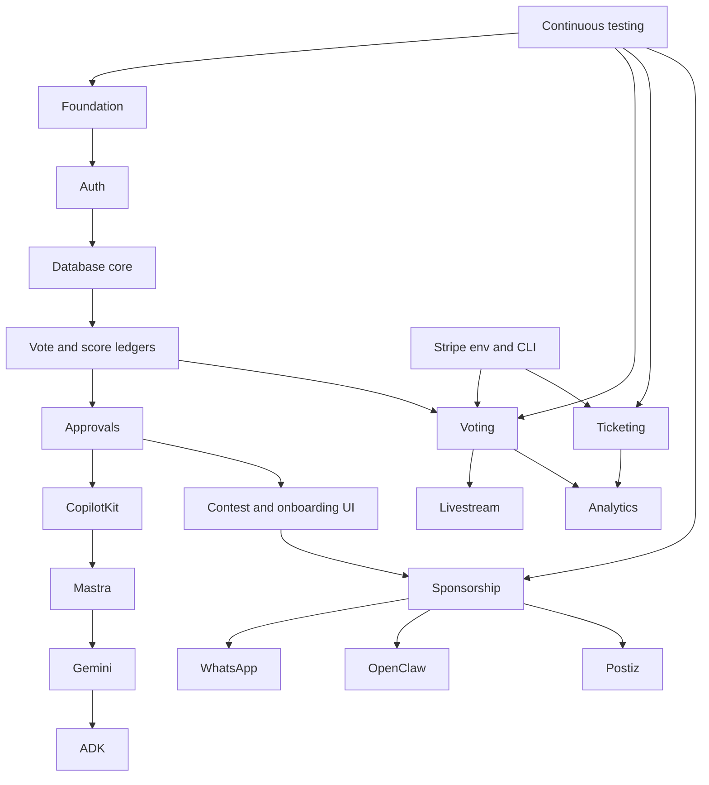
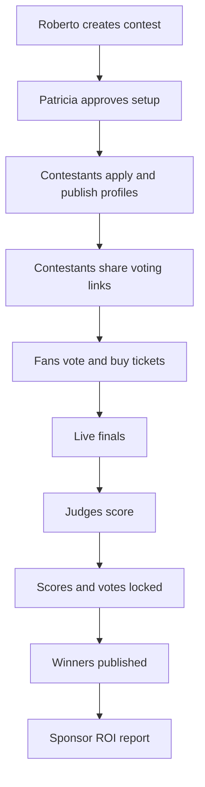
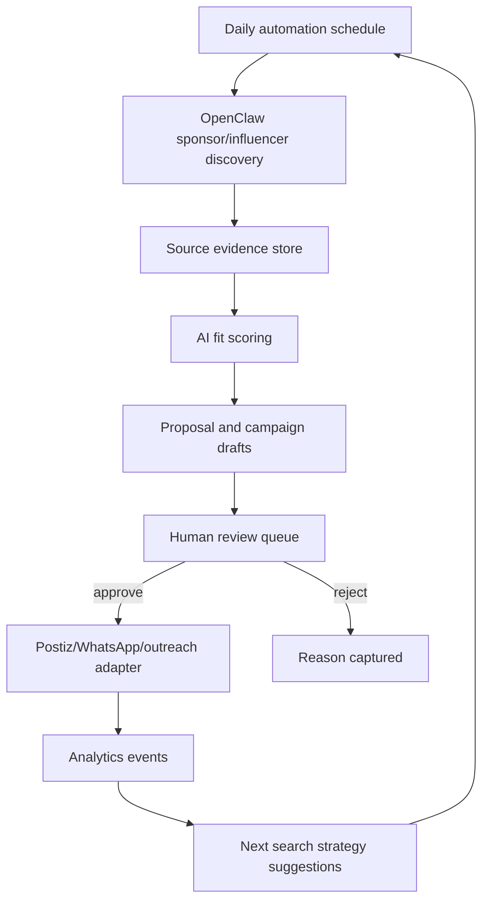
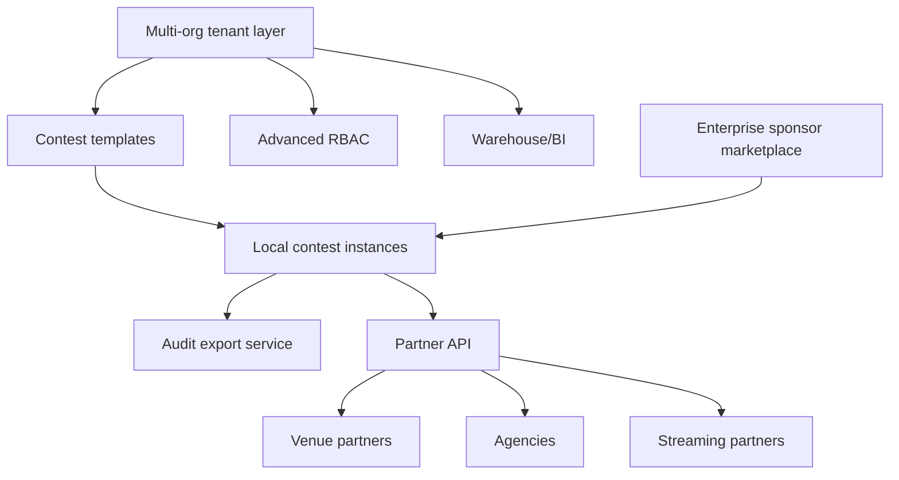
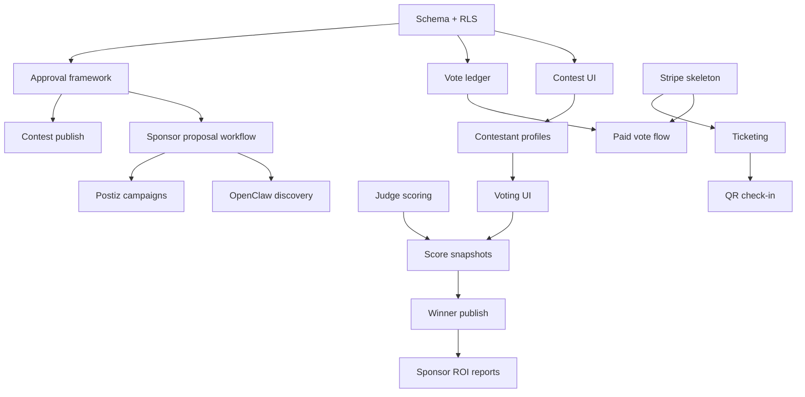

# Contest/Event AI OS Roadmap

This roadmap turns the **Miss Medellin Beauty Contest Finals** concept into an executable staged plan. It is deliberately MVP-first: ship the trust core before expanding into autonomous sponsor discovery, influencer systems, livestream depth, and enterprise white-label.

## Roadmap North Star

```text
One organizer can launch and run a trusted paid/live contest with:
contestants + tickets + voting + judge scoring + WhatsApp reminders
+ sponsor proposals + deterministic winner/audit proof.
```

## Stage Overview

| Stage | Theme | Timebox | Primary outcome | AI maturity | Risk |
|---|---|---:|---|---|---|
| 1. CORE | Trust and data foundations | 3-5 weeks | Contest/event/vote/payment schema and approval rails | AI drafts only | Medium |
| 2. MVP | One credible live contest | 5-8 weeks | Miss Medellin Finals vertical slice | AI workspaces + HITL | High event-day risk |
| 3. POST-MVP | Sponsor and growth revenue | 6-10 weeks | Sponsor CRM, campaigns, contestant growth | AI-assisted revenue ops | Medium |
| 4. ADVANCED | Automation and live depth | 8-14 weeks | OpenClaw discovery, livestream overlays, advanced fraud | Governed automation | High compliance risk |
| 5. ENTERPRISE | Multi-org platform | 12+ weeks | Franchise/white-label/enterprise governance | AI portfolio operations | High complexity |

## Task Implementation Order

This is the correct build order for a future contest vertical. It keeps the MVP boring where it must be boring: auth, database truth, approvals, payments, and tests before AI automation depth.

| Order | Task | Objective | Files/modules | Dependencies | Effort | Risk | MVP priority |
|---:|---|---|---|---|---:|---|---|
| 1 | Foundation setup | Confirm route namespace, env strategy, feature flag, and docs/task index | `mdeapp/src/app/contests`, `mdeapp/src/lib/config`, `tasks/contests` | Current mdeapp foundation | 1-2d | Low | P0 |
| 2 | Auth and roles | Define organizer, contestant, judge, sponsor, staff, admin access | Supabase auth/RLS, `src/lib/auth` | Foundation | 2-4d | High | P0 |
| 3 | Database core | Add contests, rounds, contestants, events, assets | Supabase migrations/types | Auth | 4-6d | High | P0 |
| 4 | Database ledgers | Add voting windows, vote ledger, judge scores, score snapshots, audit events | Supabase migrations/RPCs | Database core | 5-8d | High | P0 |
| 5 | Approval system | Generic approvals, approval diffs, commit guard | `src/lib/approvals`, API routes, DB | Auth + ledgers | 3-5d | High | P0 |
| 6 | CopilotKit setup | Contest workspace, provider/runtime wiring, approval cards | `/api/copilotkit`, CopilotKit UI cards | Approval system | 3-5d | Medium | P0 |
| 7 | Mastra setup | Minimal contestHostAgent, sponsorAgent, votingIntegrityAgent workflows | `src/mastra/**` | CopilotKit setup | 4-6d | Medium | P0 |
| 8 | Gemini setup | Gemini 3.5 Flash default, structured outputs, eval prompts, refusal boundaries | Mastra model config/evals | Mastra setup | 2-4d | Medium | P0 |
| 9 | ADK setup | Venue/sponsor geo sidecar adapter with Places/Routes field masks | `src/lib/geo`, ADK adapter | Gemini setup | 3-5d | Medium | P1 |
| 10 | Contest and onboarding UI | Contest create/review/publish and contestant onboarding/profile pages | `/contests`, `/contestants` | DB + approvals + CK | 6-10d | Medium | P0 |
| 11 | Voting setup | Free vote, paid vote bundle skeleton, fraud signals, leaderboard snapshots | API routes, SQL/RPC, UI | Ledgers + Stripe | 8-12d | High | P0 |
| 12 | Ticketing setup | Stripe Checkout, webhook fulfillment, QR generation, check-in scanner | API routes, Stripe, scanner UI | Stripe + approvals | 8-12d | High | P0 |
| 13 | Sponsorship setup | Sponsor CRM, proposal drafts, deliverables checklist, approval queue | `/sponsors`, DB, Mastra | CK + Mastra + approvals | 5-8d | Medium | P1 |
| 14 | WhatsApp setup | Opt-in, templates, reminders, secure deep links, delivery webhooks | `src/lib/whatsapp`, API routes | Auth + campaigns | 4-7d | Medium | P1 |
| 15 | OpenClaw setup | Draft-only sponsor/influencer discovery with source evidence and quotas | automation adapter, DB jobs | Sponsor CRM + approvals | 5-8d | High | P2 |
| 16 | Postiz setup | Approved social schedule drafts and status sync | Postiz adapter, campaign UI | Campaigns + approvals | 4-7d | Medium | P2 |
| 17 | Livestream setup | Overlay queue, second-screen vote links, provider adapter | `/live`, stream adapter | Voting + sponsorship | 6-10d | High | P3 |
| 18 | Analytics setup | Sponsor ROI snapshots, UTM, QR/vote/ticket reports | analytics tables/views | Tickets/votes/campaigns | 5-8d | Medium | P1 |
| 19 | Testing setup | Playwright, Chrome DevTools MCP proof, workflow replay, Stripe/WhatsApp fixtures | tests/e2e, tests/workflows | Each feature slice | 5-8d | High | P0 |

### Setup and Integration Sequence



### Blockers to Resolve Before Code

| Blocker | Owner | Decision needed |
|---|---|---|
| Contest MVP scope | Product | Is Miss Medellin a demo, pilot, or production launch? |
| CopilotKit Cloud account | Engineering | Project/API key and data posture. |
| Stripe mode | Ops/engineering | Test-only, live pilot, or Connect requirement. |
| WhatsApp provider | Ops | Twilio/Meta setup, templates, opt-in capture. |
| Vote policy | Legal/product | Paid vote rules, refunds, transparency wording. |
| Sponsor outreach policy | Legal/sales | Manual-only vs approved adapter sends. |
| Streaming provider | Product/ops | Post-MVP provider choice or MVP out-of-scope. |

## Stage 1: CORE

### Goal

Create the deterministic backbone before any polished contest UI: Supabase schemas, RLS, ledgers, approval framework, and Stripe skeleton.

### Features

| Feature | Description | Dependency | Proof |
|---|---|---|---|
| Contest schema | `contests`, `contest_rounds`, `contestants`, assets, statuses | Supabase migrations | RLS enabled + policy tests |
| Approval framework | Generic `approvals` table and commit pattern | Auth roles | Approval insert/approve/reject smoke |
| Vote ledger | Append-only `vote_ledger`, `voting_windows`, `vote_tokens` | SQL/RPC | Duplicate/late vote tests fail correctly |
| Judge score ledger | `judge_panels`, `judge_scores`, `score_formulas`, `score_snapshots` | Contest schema | Deterministic formula test |
| Stripe skeleton | Checkout session adapter + webhook idempotency table | Stripe env | Local Stripe CLI webhook proof |
| Ticket skeleton | `ticket_tiers`, `ticket_orders`, QR token model | Stripe skeleton | QR verification unit/integration proof |
| Agent policy registry | Allowed/forbidden tools/actions per agent | Mastra | Policy blocks unsafe action |
| Audit events | Append-only event log | All commits | Audit row for each sensitive action |

### Engineering Effort

| Area | Estimate |
|---|---:|
| Database/RLS | 8-12 days |
| Edge/API routes | 5-8 days |
| Mastra workflow skeletons | 4-6 days |
| CopilotKit draft cards | 4-6 days |
| Tests/proofs | 5-7 days |

### Infrastructure

- Supabase migrations with RLS from day one.
- Stripe test mode and CLI forwarding.
- Local dev proof: `npm run dev`, route/API responses.
- Sentry/logging for webhook and agent failures.
- No production OpenClaw sends.

### Monetization

Not monetized yet. This stage only proves Roberto and Patricia can trust the system.

### Operational Risk

| Risk | Mitigation |
|---|---|
| Schema overbuild | Keep Miss Medellin fields only; use JSON for non-critical future metadata. |
| False vote confidence | Write deterministic tests before UI polish. |
| Payment drift | Start with Checkout and webhook idempotency only. |
| Approval bypass | Centralize sensitive commits behind approval id validation. |

### Technical Debt Allowed

- Basic UI cards.
- Manual sponsor proposal export.
- Single org.
- Simple free vote rate limits.

### Technical Debt Not Allowed

- Vote updates/deletes.
- Payment fulfillment from redirect success page.
- Service-role key in client/source paths outside approved server carve-outs.
- AI-generated winner output.

## Stage 2: MVP

### Goal

Run one credible **Miss Medellin Beauty Contest Finals** demo or pilot with tickets, contestants, voting, judge scoring, WhatsApp reminders, and a sponsor proposal workflow.

### MVP Scope

| Module | MVP feature | Acceptance proof |
|---|---|---|
| Contest | Create/publish one contest with rounds | Contest public page + admin draft approved |
| Contestants | Onboard/approve contestants with profiles | 10 sample contestants visible |
| Ticketing | Sell General/VIP tickets via Stripe Checkout | Paid order + QR issued from webhook |
| QR check-in | Scan ticket QR and log entry | Valid/duplicate/invalid scan proof |
| Voting | Free vote + paid vote bundle | Ledger rows + counts match SQL |
| Judge scoring | Judges submit category scores | Locked score snapshot |
| Winner calculation | Deterministic formula | Snapshot explains ranking with no AI mutation |
| WhatsApp | Ticket/vote/reminder links | Provider sandbox/prod-template proof |
| Sponsor | Draft 3 sponsor packages | Approval card + exported/send-ready proposal |
| Admin | Moderation/fraud/approval dashboard | Patricia can approve/freeze/reject |

### User Journey



### Dependencies

| Dependency | Required before |
|---|---|
| CORE vote ledger | Any public voting |
| Stripe webhook skeleton | Paid votes/tickets |
| Approval framework | Contest publish, outreach, winner announcement |
| WhatsApp opt-in/template setup | Reminders and vote links |
| QR verifier | Event-day check-in |
| Admin roles | Moderation and review |

### Engineering Effort

| Workstream | Estimate |
|---|---:|
| Public contest/event UI | 7-10 days |
| Contestant onboarding/profile UI | 7-10 days |
| Voting UI/API | 8-12 days |
| Ticketing/QR/check-in | 8-12 days |
| Judge/admin UI | 7-10 days |
| WhatsApp reminders | 4-7 days |
| Sponsor proposal workspace | 5-8 days |
| E2E/regression testing | 6-10 days |

### Monetization

| Revenue | MVP version |
|---|---|
| Ticket commission | Platform fee on Stripe Checkout or manual reporting if Connect deferred. |
| Paid voting | Fixed bundles with clear rules and refund policy. |
| Sponsor packages | Manual invoice/Checkout link after approval. |
| Managed event setup | Service fee for configuring contest. |

### AI Maturity

| Capability | MVP behavior |
|---|---|
| Contest setup assistant | Drafts fields and rules; human approves. |
| Contestant coach | Helps with bio/social post copy. |
| Sponsor proposal | Drafts packages and activation ideas. |
| Voting integrity | Summarizes SQL anomaly signals. |
| WhatsApp copy | Drafts template text; human approves. |
| Winner explanation | Explains locked SQL snapshot only. |

### Operational Risk

| Risk | Severity | Mitigation |
|---|---:|---|
| Event-day check-in failure | High | Offline attendee export, supervisor override, scanner smoke rehearsal. |
| Vote fraud complaints | High | Publish rules, show audit snapshot, freeze display during review. |
| Payment webhook miss | High | Stripe dashboard monitoring, idempotency, manual reconciliation report. |
| Sponsor expectations mismatch | Medium | Contract deliverables checklist and ROI definitions. |
| WhatsApp deliverability | Medium | Template approval early, fallback email/SMS link. |

### MVP Done Gates

- `npm run dev` boots cleanly locally.
- Relevant routes respond locally.
- Stripe webhook test creates order/vote state.
- Vote ledger tests prove duplicate, late, and invalid votes fail.
- Judge score formula test proves deterministic ranking.
- QR scan flow proves valid/duplicate/invalid outcomes.
- Admin approval gate prevents unapproved publish/outreach/winner announcement.
- Evidence section recorded in task file before any `Done` status.

## Stage 3: POST-MVP

### Goal

Turn one contest into repeatable revenue: sponsor CRM, Postiz campaigns, influencer discovery, contestant growth dashboards, and sponsor ROI reporting.

### Features

| Feature | Business outcome | Dependency |
|---|---|---|
| Sponsor CRM pipeline | More sponsor revenue | MVP sponsor proposal |
| Sponsor ROI report | Renewals and upsells | Analytics events/UTM |
| Postiz scheduling | Operational marketing scale | Campaign approvals |
| Contestant growth dashboard | More shares/votes | UTM/referral links |
| Influencer lead discovery | Audience acquisition | OpenClaw governance |
| Sponsor activation inventory | Sell booths/overlays/posts | Event/live inventory |
| Referral loops | More fans at lower CAC | Vote/share links |
| Sponsor contract checklist | Cleaner fulfillment | Proposal workflow |

### Post-MVP Workflow


### Engineering Effort

| Workstream | Estimate |
|---|---:|
| CRM pipeline | 8-12 days |
| Postiz adapter | 5-8 days |
| Campaign analytics | 8-12 days |
| Contestant growth dashboard | 7-10 days |
| Influencer discovery drafts | 6-10 days |
| Sponsor ROI reports | 8-12 days |

### Monetization

| Revenue stream | Post-MVP upgrade |
|---|---|
| Sponsor packages | Tiered packages with measurable deliverables. |
| Campaign management | Monthly/contest campaign fee. |
| Contestant premium | AI profile, campaign, and media kit features. |
| Influencer campaigns | Managed influencer add-on for sponsors. |

### Technical Debt to Retire

- Manual sponsor proposal export.
- Manual campaign metric collection.
- Hardcoded contest templates.
- Basic vote fraud thresholds.
- Single-event campaign assumptions.

## Stage 4: ADVANCED

### Goal

Add governed automation and premium live-event capabilities without compromising trust.

### Features

| Feature | Description | Guardrail |
|---|---|---|
| Daily OpenClaw sponsor discovery | Search, enrich, score, draft proposals every day | Draft-only, quotas, allowlists |
| Advanced influencer discovery | Instagram/LinkedIn/public web enrichment where compliant | No unapproved DMs |
| Livestream overlays | Sponsor lower-thirds, QR votes, leaderboard moments | Producer approval |
| Live second-screen | Fan polls, vote windows, sponsor CTAs | Winner-impacting votes use ledger |
| Advanced fraud models | Behavioral anomaly scoring | AI recommends, human reviews |
| Geo sponsor heatmaps | Sponsor clusters by district | Places field masks and cache |
| Tourism/event packages | Hotels/restaurants/routes for contest weekend | Grounded source links |
| Auto-generated clips | Reels/highlight suggestions | Human publish approval |

### Advanced Automation Diagram



### Infrastructure

- Dedicated automation worker/container.
- OpenClaw network egress controls.
- Job queue and retry policy.
- Source-specific quotas.
- Audit export and kill switch.
- Streaming provider integration and event-day monitoring.

### Operational Risk

| Risk | Mitigation |
|---|---|
| Scraping/platform ToS violations | Source review, allowlists, official APIs first. |
| Sponsor spam | Draft-only by default, approval, rate limits, opt-out. |
| Live overlay mistakes | Producer confirmation and preview mode. |
| AI fraud false positives | AI only summarizes; Patricia decides. |
| Cost spikes | API budgets, field masks, quota dashboards. |

## Stage 5: ENTERPRISE

### Goal

Scale from one contest to a multi-org, multi-city, enterprise-grade contest and experiential marketing network.

### Features

| Feature | Outcome |
|---|---|
| Multi-org/franchise controls | Miss Medellin, Miss Antioquia, Miss Colombia workflows with shared templates. |
| White-label contest apps | Branded contest portals for agencies/brands. |
| Enterprise sponsor marketplace | Sponsors discover events/contestants by audience/geo/category. |
| Advanced audit exports | Legal-grade vote/payment/winner packages. |
| Role/permission depth | Regional admins, judges, staff, sponsors, agencies. |
| SLA observability | Event-day uptime, webhook queues, notification delivery. |
| Data warehouse | Cross-contest analytics and sponsor portfolio reporting. |
| Contract and invoice automation | Stripe Connect, tax, payout workflows. |
| API platform | Partner integrations for venues, agencies, streaming providers. |

### Enterprise Architecture Additions



### Monetization

| Model | Description |
|---|---|
| SaaS subscription | Organizer/franchise monthly fee. |
| Per-ticket fee | Tickets and livestream purchases. |
| Paid voting fee | Percent/platform fee on bundles. |
| Sponsor marketplace fee | Lead fee, success fee, or package commission. |
| Managed services | Premium operations for major contests. |
| Enterprise license | White-label, SLA, custom reporting. |

## Prioritization Framework

### RICE Scoring

| Epic | Reach | Impact | Confidence | Effort | RICE | Priority |
|---|---:|---:|---:|---:|---:|---|
| Vote ledger + scoring | 100 | 5 | 0.9 | 8 | 56 | P0 |
| Stripe tickets/paid votes | 90 | 5 | 0.8 | 10 | 36 | P0 |
| Contestant profiles | 100 | 4 | 0.85 | 8 | 43 | P0 |
| Admin approval gates | 80 | 5 | 0.9 | 6 | 60 | P0 |
| WhatsApp reminders | 80 | 4 | 0.75 | 6 | 40 | P1 |
| Sponsor proposal drafts | 50 | 4 | 0.7 | 6 | 23 | P1 |
| Postiz publishing | 60 | 3 | 0.7 | 7 | 18 | P2 |
| OpenClaw daily discovery | 40 | 4 | 0.55 | 10 | 9 | P3 |
| Livestream overlays | 30 | 4 | 0.6 | 12 | 6 | P3 |
| Sponsor marketplace | 20 | 5 | 0.45 | 16 | 3 | P4 |

## Release Plan

### Release 0: Planning Pack

| Output | Status |
|---|---|
| PRD | This doc set |
| Architecture | This doc set |
| Roadmap | This doc |
| Task specs | Not yet created |
| Schema migrations | Not yet created |

### Release 1: Trust Core

| Gate | Proof |
|---|---|
| DB tables + RLS | Migration + policy tests |
| Vote ledger | Unit/integration tests |
| Approval framework | Block/approve proof |
| Stripe skeleton | Webhook local proof |
| Audit events | Query evidence |

### Release 2: Miss Medellin Pilot

| Gate | Proof |
|---|---|
| Contest live page | Browser proof |
| 10 contestants | Public profile proof |
| Ticket purchase | Stripe test order + QR |
| Voting | Free + paid vote ledger |
| Judge scoring | Locked snapshot |
| Winner publish | Approval + deterministic result |
| WhatsApp | Sandbox/prod template delivery proof |

### Release 3: Revenue Ops

| Gate | Proof |
|---|---|
| Sponsor CRM | Lead -> proposal -> approval |
| Postiz | Approved post scheduled |
| ROI report | Sponsor dashboard with tracked metrics |
| Contestant growth | Share/referral metrics |

### Release 4: Automation and Live

| Gate | Proof |
|---|---|
| OpenClaw daily job | Draft-only leads with audit |
| Livestream control | Overlay preview and approval |
| Advanced fraud | Fraud review queue |
| Geo heatmap | Grounded sponsor cluster view |

## Testing Strategy

| Layer | Tests |
|---|---|
| SQL | Vote formula, score snapshot, duplicate prevention, RLS policies. |
| Edge/API | Stripe webhook signatures/idempotency, vote token validation, QR check-in. |
| Mastra | Workflow transitions, approval suspension/resume, forbidden-action policies. |
| CopilotKit UI | Approval cards, contest setup, admin review, live dashboard. |
| WhatsApp | Template rendering, opt-out, delivery webhook, deep-link expiry. |
| Postiz | Draft/schedule/status sync with fake adapter first. |
| OpenClaw | Sandbox mock sources, quota enforcement, policy blocks. |
| Browser | Playwright/Chrome DevTools smoke for public vote, ticket purchase, admin approval. |
| Event-day | Scanner rehearsal, offline export, manual override reconciliation. |

## Continuous Proof Gates

| Gate | Required evidence |
|---|---|
| Local boot | `npm run dev` clean boot from `mdeapp/`. |
| UI route | Browser or curl proof for touched route. |
| API route | HTTP proof with success/failure cases. |
| DB truth | SQL query showing expected rows/policies. |
| Payment | Stripe CLI/dashboard test proof for payment work. |
| Vote | Ledger/snapshot proof for voting work. |
| AI boundary | Test or log showing forbidden action blocked. |
| Messaging | WhatsApp/Postiz sandbox proof for campaign work. |

## What Not To Build Early

| Cut | Reason |
|---|---|
| Native mobile apps | Web/WhatsApp covers MVP distribution faster. |
| Autonomous sponsor sends | Brand/compliance risk before governance matures. |
| Complex seat maps | General/VIP tiers are enough for first contest. |
| Multi-city franchises | Single-contest proof first. |
| Fully custom streaming stack | Use provider; focus on overlays and second-screen. |
| AI winner decisions | Violates trust model. |
| Custom payment forms | Checkout reduces PCI and build time. |
| Deep sponsor marketplace | CRM/proposals must prove value first. |
| Advanced vector recommendations | Deterministic flows first, semantic matching later. |

## Milestone Dependency Graph



## Team Operating Model

| Role | Responsibility |
|---|---|
| Product/Roberto proxy | Validate contest setup and event-day flow. |
| Patricia/Admin proxy | Validate moderation, approvals, audit exports. |
| Sofía/Engineering | Own architecture, tests, floor gates, local proof. |
| Lucía/QA | Browser checks, event-day rehearsals, regression suite. |
| Sponsor sales | Validate proposal and ROI workflow. |
| Legal/ops | Review paid voting rules, sponsor terms, scraping/messaging compliance. |

## Launch Checklist for First Contest Pilot

| Area | Checklist |
|---|---|
| Contest | Rules public, dates locked, contestant list approved. |
| Voting | Windows configured, paid/free limits public, fraud review staffed. |
| Money | Stripe test/live keys, webhook endpoint, refund policy, reconciliation sheet. |
| Tickets | QR scan tested, offline export generated, staff trained. |
| Judges | Accounts active, rubric understood, backup score sheet ready. |
| WhatsApp | Templates approved, opt-ins captured, fallback email/social links ready. |
| Sponsors | Deliverables approved, creative assets loaded, ROI metrics defined. |
| Live | Stream rehearsal complete, overlay preview, emergency static screen. |
| Admin | Patricia can freeze leaderboard, approve winners, export audit. |
| Support | Event-day escalation contacts and rollback plan documented. |

## Success Metrics

| Metric | MVP target |
|---|---:|
| Contest created/published | 1 |
| Approved contestants | 10-30 |
| Ticket conversion | Baseline measured |
| Paid vote conversion | Baseline measured |
| Vote ledger discrepancy | 0 |
| Duplicate QR accepted | 0 |
| Judge score completion | 100% before winner snapshot |
| Sponsor packages proposed | 3 |
| Sponsor ROI report generated | 1 |
| WhatsApp delivery rate | Baseline measured |
| Event-day P0 incidents | 0 unresolved |

## Investor Narrative by Stage

| Stage | Narrative |
|---|---|
| CORE | We built a trust-grade contest transaction layer. |
| MVP | We proved a full contest can run with tickets, voting, judges, and WhatsApp. |
| POST-MVP | We turned the contest into a sponsor and audience growth engine. |
| ADVANCED | We added governed automation and live-event intelligence. |
| ENTERPRISE | We can power a network of contests and experiential marketing activations. |

## Final Recommendation

Start with the trust spine:

1. Contest schema.
2. Approval framework.
3. Vote ledger.
4. Stripe tickets/paid votes.
5. Judge scoring.
6. Admin audit.

Then build the exciting parts: sponsor proposals, contestant growth, Postiz campaigns, WhatsApp loops, OpenClaw discovery, and livestream overlays.

The temptation will be to start with OpenClaw or livestream spectacle because they feel futuristic. For Miss Medellin, the real product trust starts when a fan can pay, vote, scan, watch, and believe the winner was calculated fairly.
