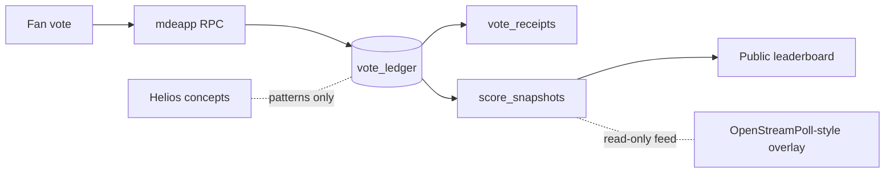

Short answer: **neither repo becomes your contest backend.** Both are **pattern libraries** while `mdeapp` + Supabase (`CTEST-001` done locally, `CTEST-002` next) own truth. That matches [`tasks/contest/docs/02-github-repos-use.md`](tasks/contest/docs/02-github-repos-use.md).

---

## Split of responsibilities

| Layer | Repo | Role in mdeai |
|--------|------|----------------|
| **Vote truth** | [Helios Server](https://github.com/benadida/helios-server) | Receipts, freeze/publish, audit *ideas* → `vote_ledger`, `vote_receipts`, RPCs (CTEST-002) |
| **Live show UX** | [OpenStreamPoll](https://github.com/yoanbernabeu/OpenStreamPoll) | OBS overlay, QR, real-time bars → **display only**, post-MVP |
| **Product** | `mdeapp` | Contests, contestants, RLS, Stripe, CopilotKit — already started |



---

## Helios — how to use it (CTEST-002 / trust)

**What it is:** End-to-end verifiable elections (booth + verifier + server). Python/Django, crypto-heavy — not a drop-in for Next.js.

**Borrow these patterns only** (from `helios/`, `heliosbooth/`, `heliosverifier/` in your clone at `/home/sk/mdeai/github/contest/helios-server`):

1. **Ballot → immutable record** — one canonical write path; map to `submit_contest_vote()` RPC, not client `INSERT`.
2. **Voter receipt** — fan gets a stable id/hash they can verify later → `vote_receipts` (public-safe fields only).
3. **Tally freeze** — no silent recount after “results published” → `lock_score_snapshot()` + `contest_rounds` windows.
4. **Separation of roles** — voter vs admin vs auditor → your existing `contest_memberships` roles + Patricia audit views.
5. **Threat model** — duplicate vote, window abuse, admin override → `vote_fraud_signals`, `vote_reviews` (CTEST-002).

**Do not for MVP:**

- Run Helios as a sidecar vote service (two systems of record).
- Port homomorphic/crypto tally into Supabase.
- Let overlay or AI mutate who won.

**Persona hook:** Andrés votes → receipt from **your** ledger; Patricia audits **SQL**, not Helios UI.

---

## OpenStreamPoll — how to use it (finals / MVP-B)

**What it is:** Streamer live polls — admin UI, duration/limits, **OBS browser source**, **QR for audience**, live result animation ([README](https://github.com/yoanbernabeu/OpenStreamPoll): Symfony + Docker).

**Borrow these patterns** (wireframe `19-live-contest-control-post-mvp.md`):

1. **OBS browser source URL** — transparent overlay route showing live % (no vote writes from OBS).
2. **QR → mobile vote page** — same as `/contests/[slug]` vote flow, not OpenStreamPoll’s DB.
3. **Draft → publish poll** — Roberto opens a “live moment” window; maps to `voting_windows`, not a second ledger.
4. **Rate limits / session caps** — inspiration for fraud signals; **enforce in RPC**, not IP-only like many stream polls.

**Do not:**

- Treat OpenStreamPoll totals as **official** People’s Choice (weak vs server ledger + auth).
- Fork the PHP app into `mdeapp`.
- Use it for paid votes or judge scores.

**Integration shape (later):**

```text
vote_ledger + locked snapshot  →  aggregate API  →  overlay component (React in mdeapp)
                                      ↑
                         optional: iframe to separate OSP deploy (engagement-only polls)
```

Official winner = `score_snapshots` / locked SQL. Overlay = **read replica of aggregates** or ephemeral “who should host next segment?” polls that **do not** write to `vote_ledger`.

---

## Sequencing (aligned with your tasks)

| Phase | Helios | OpenStreamPoll |
|--------|--------|----------------|
| **Now (CTEST-001)** | — | — |
| **Next (CTEST-002)** | Read freeze/receipt/tally flows; design tables + RPCs | — |
| **CTEST-010** | Receipt UI on public vote page | — |
| **MVP-B / post** | Optional: export receipt format for external verifier | OBS/QR UX; optional separate deploy |

---

## Copy vs reference (from your doc)

| Repo | Copy code? | Copy pattern? |
|------|------------|---------------|
| Helios | **No** | **Yes** — integrity, receipts, freeze |
| OpenStreamPoll | **No** | **Yes later** — live/OBS/QR UX |

---

## Practical “best use” checklist

**Helios (this week, for SAN-534):**

- Skim election lifecycle: create → vote → close → tally → publish.
- List 5 invariants for `vote_ledger` (append-only, one vote per token/window, receipt always returned, snapshot immutable, admin cannot insert votes).
- Implement those in Postgres; keep crypto out of Phase 1.

**OpenStreamPoll (after vote RPCs green):**

- Screenshot OBS + QR flows for Roberto/Patricia finals runbook.
- Spec one Next route: `/contests/[slug]/live-overlay` fed by `GET /api/contests/[slug]/live-tally`.
- Playwright: overlay updates when ledger changes; **no** POST from overlay.

---

## Bottom line

- **Helios** = how Camila’s vote stays **provable and frozen** in your DB.  
- **OpenStreamPoll** = how the **finale stream feels alive** without becoming source of truth.  

Canonical plan: [`tasks/contest/docs/02-github-repos-use.md`](tasks/contest/docs/02-github-repos-use.md) · voting schema: [`CTEST-002`](tasks/contest/tasks/CTEST-002-voting-scoring-ledgers.md).  

If you want, next step is a one-page “Helios → CTEST-002 column mapping” (Helios concept → exact mdeai table/RPC name).