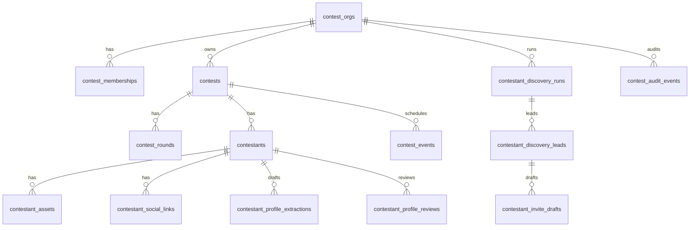
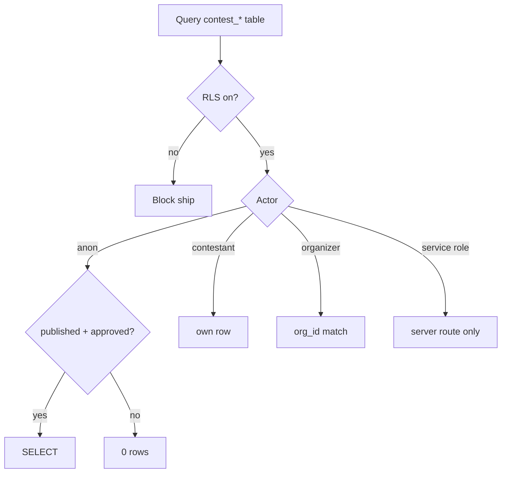
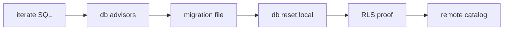
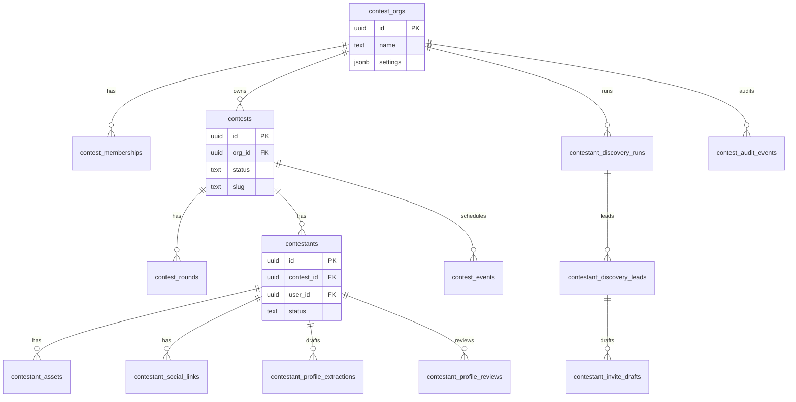
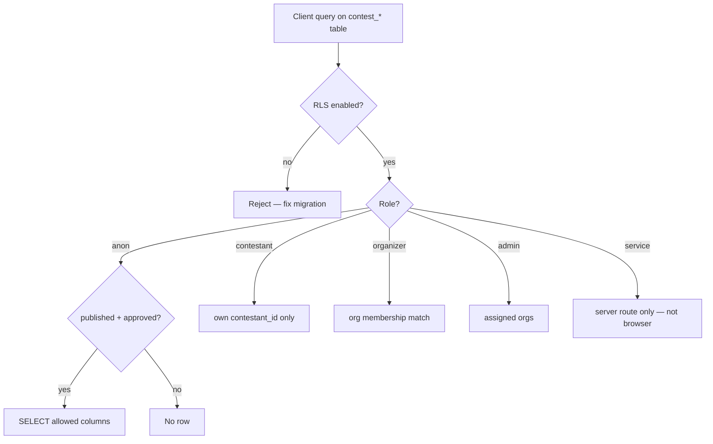
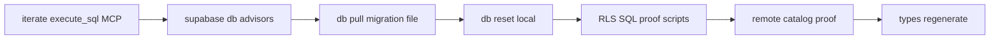

# CTEST-001 — Supabase contest core schema and RLS

> Full spec synced from repo. Re-run: `python3 tasks/contest/scripts/sync-ctest-linear.py`

## Task metadata

| Field | Value |
|-------|-------|
| **ID** | `CTEST-001` |
| **Status** | Draft |
| **Priority** | P0 |
| **Phase** | Contest data foundation |
| **Effort** | 1-2d |
| **Owner** | codex |
| **MVP track** | MVP-A |
| **Depends on** | CTEST-000 |
| **Linear** | SAN-533 |
| **Evidence** | `tasks/contest/notes/CTEST-001-evidence.md` |
| **Repo file** | [tasks/contest/tasks/CTEST-001-supabase-contest-core-schema.md](https://github.com/amo-tech-ai/mdeai/blob/main/tasks/contest/tasks/CTEST-001-supabase-contest-core-schema.md) |

### Skills

- `mde-supabase`
- `task-verifier`

### Docs

- `../docs/MVP-SCOPE.md`
- `../docs/01-mermaid-diagrams.md`
- `../docs/02-contest-core-schema-erd.md`
- `../docs/05-production-task-standard.md`

### Verified against

- `/home/sk/mdeai/.claude/skills/mde-supabase/SKILL.md`
- `/home/sk/mdeai/.claude/skills/task-verifier/SKILL.md`
- https://supabase.com/docs/guides/database/postgres/row-level-security
- https://supabase.com/docs/guides/storage/security/access-control

### Labels

- `prefix:CONT`
- `prefix:EVT`
- `track:contest`
- `track:events`
- `phase:phase2`

---

## 1. Purpose

Add the deterministic contest/contestant data model and RLS before UI, voting ledgers, or AI workflows.

## 2. Goals

- Ship migration `mdeapp/supabase/migrations/<timestamp>_contest_core.sql`.
- Enable RLS + ≥1 policy per table; public reads only for published/approved rows.
- Prove schema locally and on remote catalog (Supabase MCP or SQL file).

## 3. Features

| Table | Purpose | RLS |
|---|---|---|
| `contest_orgs` | Organizer tenant | Org members/admins |
| `contest_memberships` | Staff roles | Own read; admin manage |
| `contests` | Contest shell, status | Public when published |
| `contest_rounds` | Rounds, scoring windows | Public when published |
| `contestants` | Profile, division | Public when approved |
| `contestant_assets` | Media metadata | Approved public; docs private |
| `contestant_social_links` | Share handles / UTM | Public subset |
| `contestant_profile_extractions` | URL extraction drafts | Never public |
| `contestant_profile_reviews` | Human review decisions | Org/admin/staff |
| `contest_events` | Finals/rehearsal events | Public when published |
| `contestant_discovery_runs` | Discovery job logs | Admin/org only |
| `contestant_discovery_leads` | Invite lead drafts | Admin/org only |
| `contestant_invite_drafts` | Approval-gated copy; no auto-send | Admin/org only |
| `contest_audit_events` | Append-only audit | Admin/org read |

Status enums: `draft`, `review`, `published`, `closed`, `archived`. Extraction/review: `draft`, `approved`, `rejected`, `needs_info`.

## 4. Workflows

1. Author migration with indexes on RLS predicate columns.
2. Storage bucket plan: public photos vs private docs (policies before UI uploads).
3. Regenerate Supabase types if repo workflow supports it.
4. SQL proof scripts → `tasks/contest/notes/CTEST-001-evidence.md`.
5. Remote catalog proof (required before Done):
   ```sql
   SELECT tablename, rowsecurity FROM pg_tables
   WHERE schemaname = 'public' AND tablename LIKE 'contest%';
   SELECT tablename, policyname FROM pg_policies WHERE tablename LIKE 'contest%';
   ```

## 5. User Journeys

- Roberto creates a contest shell; contestants apply with draft data; Patricia reviews; fans see only published contests and approved contestants.

## 6. Agents

- No agent writes canonical rows in this task. Future Mastra tools use server APIs/RPCs only.

## 7. Integrations

- Supabase Postgres + Storage; `mdeapp/src/lib/supabase/**` (anon client in UI; service role server-only per CLAUDE.md F13 carve-out).
- MCP: Supabase plugin for migration list + `execute_sql` catalog proof.

## 8. Summary

Data foundation that fail-closes drafts, extraction rows, discovery leads, and invite drafts.

## 9. Definition Of Done

- [ ] Migration applies cleanly (`supabase db reset` or CI).
- [ ] RLS enabled on every contest table.
- [ ] Policies cover anon, contestant, organizer, judge/staff, admin.
- [ ] Negative: anon cannot read drafts/extractions/leads/invite drafts/private docs.
- [ ] Positive: published contest + approved contestant readable.
- [ ] Remote catalog proof recorded in evidence.
- [ ] `npm run test`, `npm run typecheck`, `npm run build` green after typegen.

## 10. Tests

| Test | Command / probe | Expected |
|---|---|---|
| Tables exist | `SELECT tablename FROM pg_tables WHERE tablename LIKE 'contest%'` | all core tables |
| RLS on | `rowsecurity = true` per table | 100% |
| Anon negative | SQL script as anon role | drafts denied |
| Cross-contestant | authenticated wrong id update | denied |
| Vitest (optional) | `npm test -- contest-schema` if helpers added | exit 0 |

**Do not:** add `vote_ledger` here (CTEST-002); add pgvector; allow client writes to audit tables.

## 11. Implementation steps (mde-supabase)

1. Read [`supabase-migrations.md`](../../../.agents/skills/mde-supabase/references/project-rules/supabase-migrations.md) and [`supabase-rls-policies.md`](../../../.agents/skills/mde-supabase/references/project-rules/supabase-rls-policies.md).
2. Iterate DDL locally with Supabase MCP `execute_sql` — **do not** `apply_migration` until schema stabilizes.
3. Run `supabase db advisors` on local DB; fix security/perf findings.
4. Author `mdeapp/supabase/migrations/<timestamp>_contest_core.sql` with:
   - `CREATE TABLE` + PK/FK + `CHECK` on status enums
   - `ALTER TABLE … ENABLE ROW LEVEL SECURITY`
   - Policies per actor (anon / authenticated contestant / org member / admin)
   - Indexes on every column used in `USING` / `WITH CHECK`
5. Storage: create buckets `contestant-photos`, `contestant-docs`; policies on `storage.objects` (INSERT+SELECT+UPDATE for upsert paths).
6. `supabase db reset` (or CI migration apply) — must be clean.
7. Regenerate types if workflow uses `supabase gen types`.
8. SQL proof scripts (anon JWT vs service) → `tasks/contest/notes/CTEST-001-evidence.md`.
9. Remote catalog proof (required):
   ```sql
   SELECT tablename, rowsecurity FROM pg_tables
   WHERE schemaname = 'public' AND tablename LIKE 'contest%';
   SELECT tablename, policyname, cmd FROM pg_policies WHERE tablename LIKE 'contest%';
   ```
10. Negative probes: anon `SELECT` on `contestant_profile_extractions`, `contestant_discovery_leads`, `contestant_invite_drafts` → 0 rows.
11. Positive probes: published `contests` + approved `contestants` readable by anon.
12. Cross-tenant: contestant A cannot `UPDATE` contestant B row.
13. `npm run test`, `npm run typecheck`, `npm run build` after typegen.

## 12. Mermaid diagrams

See also [`../docs/02-contest-core-schema-erd.md`](../docs/02-contest-core-schema-erd.md).

### Core ERD (CTEST-001 tables)



### RLS read decision



### Migration workflow



**Production standard:** `../docs/05-production-task-standard.md`.

---

## Supplemental diagrams (repo doc)

## Entity relationship (core pack)


## RLS decision flow (read path)


## Migration workflow (mde-supabase)

