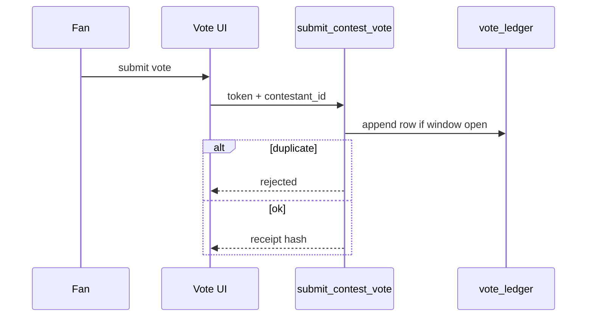
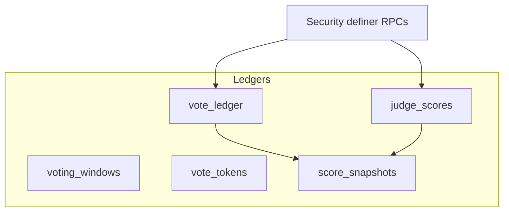

# CTEST-002 — Voting and judge scoring ledgers

> Full spec synced from repo. Re-run: `python3 tasks/contest/scripts/sync-ctest-linear.py`

## Task metadata

| Field | Value |
|-------|-------|
| **ID** | `CTEST-002` |
| **Status** | Draft |
| **Priority** | P0 |
| **Phase** | Contest trust foundation |
| **Effort** | 2-3d |
| **Owner** | codex |
| **MVP track** | MVP-A |
| **Depends on** | CTEST-001 |
| **Linear** | SAN-534 |
| **Evidence** | `tasks/contest/notes/CTEST-002-evidence.md` |
| **Repo file** | [tasks/contest/tasks/CTEST-002-voting-scoring-ledgers.md](https://github.com/amo-tech-ai/mdeai/blob/main/tasks/contest/tasks/CTEST-002-voting-scoring-ledgers.md) |

### Skills

- `mde-supabase`
- `testing`

### Docs

- `../docs/01-mermaid-diagrams.md`
- `../docs/05-production-task-standard.md`
- `../../../../docs/plan/contests/docs/13-security-checklist.md`

### Verified against

- `/home/sk/mdeai/.claude/skills/mde-supabase/SKILL.md`
- `/home/sk/mdeai/.claude/skills/testing/SKILL.md`
- https://supabase.com/docs/guides/database/postgres/row-level-security

### Repo refs

- `/home/sk/mdeai/github/contest/helios-server`

### Labels

- `prefix:CONT`
- `prefix:EVT`
- `track:contest`
- `track:events`
- `phase:phase2`

---

## 1. Purpose

Create append-only vote and judge-score truth in Postgres. AI may summarize anomalies; it never mutates ledgers or winners.

## 2. Goals

- RPC-only writes: `submit_contest_vote()`, `submit_judge_score()`, `lock_score_snapshot()`.
- Block direct client inserts; paid credits consumed only via CTEST-003 path.
- Vitest/SQL tests before any public vote UI (CTEST-010).

## 3. Features

| Object | Purpose |
|---|---|
| `voting_windows` | Type, start/end, round, weight, limits |
| `vote_tokens` | Signed/hashed eligibility |
| `vote_ledger` | Append-only canonical votes |
| `vote_receipts` | Public-safe receipt id/hash |
| `vote_fraud_signals` | Deterministic anomalies |
| `vote_reviews` | Human review decisions |
| `judge_panels` | Judge assignments |
| `judge_scores` | Append-only scores |
| `score_formulas` | Versioned weights |
| `score_snapshots` | Locked results |

Pattern refs: Helios (hash/freeze/tally concepts only); OpenStreamPoll post-MVP for live QR UX only.

## 4. Workflows

1. Migration for tables + triggers/constraints enforcing append-only.
2. Security-definer RPCs with validation (window open, token, duplicate rules).
3. Safe views for public/admin read; `votingIntegrityAgent` read-only later.
4. Evidence + `mdeapp/src/lib/contest/__tests__/vote-rpc.test.ts` (or SQL harness).

## 5. User Journeys

- Fan votes → receipt; Patricia audits fraud signals; judge submits scores; Patricia locks snapshot; public UI shows locked SQL results only.

## 6. Agents

- `votingIntegrityAgent`: read safe views, explain state — **no** insert/update/delete on votes/scores/snapshots.

## 7. Integrations

- Supabase RPCs; blocks CTEST-010 `/contests/*/vote` until this task is Done.
- Realtime tally broadcast may use `vote:tally:{contest_id}` when schema exists (`20260505000200_realtime_broadcast_migration.sql`).

## 8. Summary

Trust layer for beauty-contest voting — must ship before vote routes or AI winner displays.

## 9. Definition Of Done

- [ ] Append-only vote ledger; closed window rejects votes.
- [ ] Duplicate token/session/user rejected.
- [ ] Paid credits not minted here (CTEST-003 only).
- [ ] Judge scores immutable after lock; snapshot deterministic.
- [ ] Direct insert denied for non-service roles.
- [ ] Audit rows on vote/score events.

## 10. Tests

| Test | Expected |
|---|---|
| RPC valid free vote | one ledger row + receipt |
| Duplicate vote | rejected |
| Late vote | rejected |
| Direct insert | denied |
| Snapshot formula | matches fixture |
| Vitest | `npm test -- vote-rpc` exit 0 |

**Do not:** build public vote UI here; implement Helios crypto in MVP; let AI pick winners.

## 11. Mermaid diagrams

### Vote truth flow (RPC-only writes)

### Voting architecture (CTEST-002 scope)

**Production standard:** `../docs/05-production-task-standard.md`.
