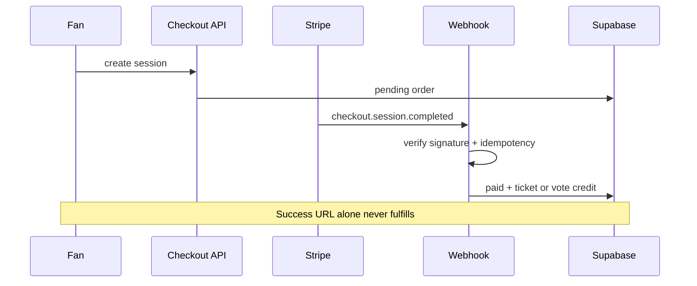

# CTEST-003 — Tickets and paid-vote payment-derived schema

> Full spec synced from repo. Re-run: `python3 tasks/contest/scripts/sync-ctest-linear.py`

## Task metadata

| Field | Value |
|-------|-------|
| **ID** | `CTEST-003` |
| **Status** | Draft |
| **Priority** | P0 |
| **Phase** | Contest payments foundation |
| **Effort** | 2-3d |
| **Owner** | codex |
| **MVP track** | MVP-B |
| **Depends on** | CTEST-001, CTEST-002 |
| **Linear** | SAN-535 |
| **Evidence** | `tasks/contest/notes/CTEST-003-evidence.md` |
| **Repo file** | [tasks/contest/tasks/CTEST-003-ticket-paid-vote-schema.md](https://github.com/amo-tech-ai/mdeai/blob/main/tasks/contest/tasks/CTEST-003-ticket-paid-vote-schema.md) |

### Skills

- `mde-supabase`
- `mde-stripe`
- `testing`

### Docs

- `../docs/01-mermaid-diagrams.md`
- `../docs/05-production-task-standard.md`

### Verified against

- `/home/sk/mdeai/.claude/skills/mde-supabase/SKILL.md`
- `/home/sk/mdeai/.claude/skills/mde-stripe/SKILL.md`
- `/home/sk/mdeai/.claude/skills/testing/SKILL.md`
- https://docs.stripe.com/webhooks

### Repo refs

- `/home/sk/mdeai/github/events/Hi.Events`

### Labels

- `prefix:CONT`
- `prefix:EVT`
- `track:contest`
- `track:events`
- `phase:phase2`

---

## 1. Purpose

Add contest tickets, QR check-in, and paid vote credits where **Stripe owns money** and **Supabase stores webhook-derived truth only**.

## 2. Goals

- No fulfillment from success URL or client-side “paid” flags.
- Idempotent `stripe_webhook_events`; signature verification required.
- `consume_paid_vote_credit()` feeds CTEST-002 vote RPC safely.

## 3. Features

| Object | Purpose |
|---|---|
| `contest_ticket_tiers` | Tier capacity/pricing |
| `contest_ticket_orders` | pending/paid/refunded/cancelled |
| `contest_tickets` | QR-bearing tickets |
| `contest_check_ins` | Append-only scans |
| `paid_vote_products` | Vote bundles |
| `paid_vote_orders` | Checkout session mapping |
| `paid_vote_credits` | Webhook-issued credits |
| `stripe_webhook_events` | Idempotency log |
| `issue_ticket_from_paid_order()` | Post-webhook ticket issue |
| `consume_paid_vote_credit()` | Single-use credit → vote flow |
| `check_in_ticket()` | QR validate + log |

Refs: Hi.Events patterns only (AGPL — no copy); reuse mdeapp EVP ticket checkout patterns where compatible.

## 4. Workflows

1. Migration + RLS (orders/credits server-write heavy).
2. Webhook route: verify signature → idempotent upsert → issue ticket/credit.
3. Port patterns from existing event ticket flow in `mdeapp`.
4. Stripe test fixtures → evidence.

## 5. User Journeys

- Andrés buys VIP ticket or vote pack → webhook issues QR/credits → `/me/tickets` shows wallet → staff scans once at door.

## 6. Agents

- No agent handles payments, credits, or check-in truth.

## 7. Integrations

- Stripe Checkout + webhooks; Next.js `src/app/api/**` server-only secrets.
- Depends on CTEST-002 for credit consumption into vote ledger.

## 8. Summary

Payment-derived state for tickets and paid votes — MVP-B after free-vote ledger (MVP-A).

## 9. Definition Of Done

- [ ] Checkout creates pending order only.
- [ ] Verified webhook marks paid and issues exactly one ticket/credit per event.
- [ ] Duplicate webhook harmless.
- [ ] Invalid signature rejected.
- [ ] QR check-in: valid once; duplicate logged/rejected.
- [ ] Credit consumed once through RPC.

## 10. Tests

| Test | Expected |
|---|---|
| Stripe fixture paid | one ticket + audit row |
| Duplicate event | no double issue |
| Bad signature | 400/401 |
| Success URL alone | no fulfillment |
| Credit consume twice | second fails |
| Playwright (later) | `e2e/contest/stripe-paid-vote.spec.ts` |

**Do not:** fulfill from success URL; put Stripe secrets in client; Stripe Connect until sponsor payouts need it.

## 11. Mermaid diagrams

### Stripe webhook fulfillment (no client truth)

**Production standard:** `../docs/05-production-task-standard.md`.
