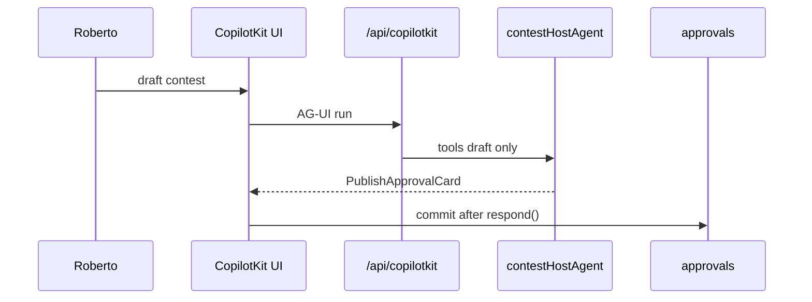

# CTEST-004 — CopilotKit contest workspace and approval cards

> Full spec synced from repo. Re-run: `python3 tasks/contest/scripts/sync-ctest-linear.py`

## Task metadata

| Field | Value |
|-------|-------|
| **ID** | `CTEST-004` |
| **Status** | Draft |
| **Priority** | P0 |
| **Phase** | Contest AI UI |
| **Effort** | 1-2d |
| **Owner** | codex |
| **MVP track** | MVP-A |
| **Depends on** | CTEST-001 |
| **Linear** | SAN-536 |
| **Evidence** | `tasks/contest/notes/CTEST-004-evidence.md` |
| **Repo file** | [tasks/contest/tasks/CTEST-004-copilotkit-contest-workspace.md](https://github.com/amo-tech-ai/mdeai/blob/main/tasks/contest/tasks/CTEST-004-copilotkit-contest-workspace.md) |

### Skills

- `copilotkit`
- `copilotkit-agui`
- `copilotkit-develop`
- `copilotkit-integrations`

### Docs

- `../docs/01-mermaid-diagrams.md`
- `../docs/03-screens-wireframes.md`
- `../docs/05-production-task-standard.md`
- `../docs/06-shadcn-component-audit.md`

### Verified against

- `/home/sk/mdeai/.claude/skills/copilotkit/SKILL.md`
- `/home/sk/mdeai/.claude/skills/copilotkit-agui/SKILL.md`
- `/home/sk/mdeai/.claude/skills/copilotkit-integrations/SKILL.md`
- https://docs.copilotkit.ai/mastra/

### Labels

- `prefix:CONT`
- `prefix:EVT`
- `track:contest`
- `track:events`
- `phase:phase2`

---

## 1. Purpose

Contest AI workspace on mdeapp **CopilotKit 1.55.2 Pattern 1** (in-process Mastra via `/api/copilotkit`) with HITL approval cards — no direct writes to votes, payments, or winners.

## 2. Goals

- Routes: `/host/contests/new`, `/host/contests`, `/admin/contests`, `/sponsors` (shell + provider).
- Card/action names **identical** to Mastra tool ids (CTEST-005).
- `useCoAgent({ name })` keys match `Mastra({ agents: { … } })` map keys exactly.

## 3. Features

| Card | Purpose |
|---|---|
| ContestDraftCard | Basics, rounds, venue, voting windows |
| ContestantReadinessCard | Missing profile/media fields |
| VotingIntegrityCard | Read-only anomaly summary |
| SponsorProposalCard | Draft package copy |
| PublishApprovalCard | HITL publish — `renderAndWaitForResponse` |
| WinnerSnapshotCard | Locked SQL snapshot display only |

**CopilotKit Phase 1 APIs only:**

| Need | API |
|---|---|
| Shared state | `useCoAgent` |
| Tool render | `useCopilotAction({ available: "disabled", render })` |
| HITL | `renderAndWaitForResponse` |
| Runtime | `/api/copilotkit` + `getLocalAgents({ mastra })` |

## 4. Workflows

1. Add App Router pages + `CopilotKit` provider (relative `runtimeUrl="/api/copilotkit"`).
2. Register `useCopilotAction` mirrors for each contest tool id.
3. shadcn: `Card`, `Button`, `Badge`, `Dialog`/`Sheet`, `Skeleton`, `Tooltip` per `../docs/06-shadcn-component-audit.md`.
4. Probe runtime:
   ```bash
   curl -s -o /dev/null -w "%{http_code}\n" -X POST http://localhost:3001/api/copilotkit
   ```

## 5. User Journeys

- Roberto drafts contest on `/host/contests/new`; Patricia approves publish card; integrity/winner cards show deterministic data only.

## 6. Agents

- UI binds to `contestHostAgent`, `votingIntegrityAgent`, `sponsorAgent` (CTEST-005) — names must match agent map keys.

## 7. Integrations

| Surface | mdeapp pattern | Do not use |
|---|---|---|
| Runtime | Pattern 1 `getLocalAgents` | Mastra separate-server `:4111/chat` only |
| Version | CopilotKit `1.55.2` v1 hooks | v2 imports on same surface |
| Logging | `logAgentRunForTurn` via runtime (F13) | Mastra HTTP `/chat` alone for DoD |

## 8. Summary

Generative UI + HITL for contest setup; commits go through approval APIs/RPCs, not cards.

## 9. Definition Of Done

- [ ] `/host/contests/new` returns 200 (auth as host).
- [ ] `POST /api/copilotkit` returns 200 with contest agent connected.
- [ ] Publish card requires explicit `respond()` approval.
- [ ] No card writes vote/payment/winner/profile truth.
- [ ] shadcn CLI proof recorded in evidence.

## 10. Tests

| Test | Expected |
|---|---|
| Route smoke | GET `/host/contests/new` → 200 |
| Runtime | POST `/api/copilotkit` → 200 |
| Component | PublishApprovalCard blocks without `respond` |
| Negative | Card action cannot call ledger insert RPC |
| Browser | approval card visible in Playwright (CTEST-007) |

**Do not:** self-host CopilotKit; mix v2 hooks; custom AG-UI backend unless Pattern 1 blocked.

## 11. Mermaid diagrams

### CopilotKit + Mastra HITL (Pattern 1)



**Production standard:** `../docs/05-production-task-standard.md` + `../docs/06-shadcn-component-audit.md`.
