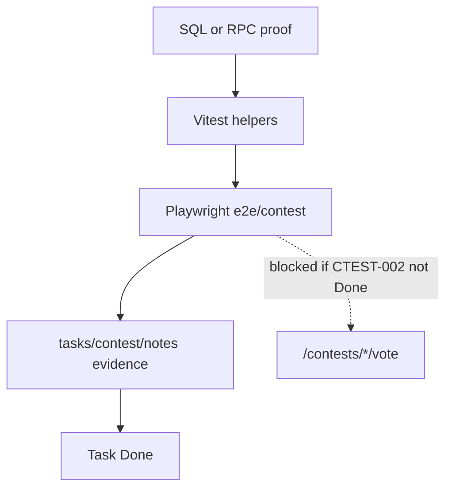

# CTEST-007 — Contest Playwright proof gates

> Full spec synced from repo. Re-run: `python3 tasks/contest/scripts/sync-ctest-linear.py`

## Task metadata

| Field | Value |
|-------|-------|
| **ID** | `CTEST-007` |
| **Status** | Draft |
| **Priority** | P0 |
| **Phase** | Contest testing |
| **Effort** | 1-2d |
| **Owner** | codex |
| **MVP track** | MVP-A |
| **Depends on** | CTEST-002, CTEST-003, CTEST-006 |
| **Linear** | SAN-539 |
| **Evidence** | `tasks/contest/notes/CTEST-007-evidence.md` |
| **Repo file** | [tasks/contest/tasks/CTEST-007-playwright-proof-gates.md](https://github.com/amo-tech-ai/mdeai/blob/main/tasks/contest/tasks/CTEST-007-playwright-proof-gates.md) |

### Skills

- `testing`
- `playwright-cli`
- `task-verifier`

### Docs

- `../../../../docs/plan/contests/docs/12-task-proof-gates.md`
- `../docs/05-production-task-standard.md`

### Verified against

- `/home/sk/mdeai/.claude/skills/testing/SKILL.md`
- `/home/sk/mdeai/.claude/skills/playwright-cli/SKILL.md`
- https://playwright.dev/docs/locators

### Labels

- `prefix:CONT`
- `prefix:EVT`
- `track:contest`
- `track:events`
- `phase:phase2`

---

## 1. Purpose

Define and maintain the contest E2E suite that blocks fake Done — SQL/RPC proof first, then Playwright on real routes.

## 2. Goals

- `mdeapp/e2e/contest/*.spec.ts` covers MVP-A flows + negatives.
- Done bundle runs with `npm run floor` and contest shard.
- Fixtures: no live Stripe, WhatsApp, OpenClaw, or Postiz.

## 3. Features

| Spec | Flow | Depends |
|---|---|---|
| `host-contest-new.spec.ts` | Roberto draft + approval card | CTEST-004 |
| `public-contest.spec.ts` | Fan hub + profile | CTEST-006/010 |
| `contestant-signup.spec.ts` | Signup + URL intake | CTEST-008 |
| `contestant-profile-editor.spec.ts` | Profile edit + review | CTEST-009 |
| `contestant-photos.spec.ts` | Upload states | CTEST-009 |
| `contestant-coach.spec.ts` | Coach without auto-publish | CTEST-009 |
| `vote-free.spec.ts` | Valid vote + receipt | CTEST-002 |
| `vote-negative.spec.ts` | Duplicate/closed/invalid | CTEST-002 |
| `profile-share.spec.ts` | Share + UTM | CTEST-010 |
| `stripe-paid-vote.spec.ts` | Webhook credit | CTEST-003 (MVP-B) |
| `ticket-qr-checkin.spec.ts` | QR scan rules | CTEST-003 (MVP-B) |
| `judge-scoring.spec.ts` | Score lock | CTEST-002 |
| `sponsor-proposal.spec.ts` | HITL before send | CTEST-005 (MVP-B) |
| `discovery-sandbox.spec.ts` | No send path | CTEST-011 (MVP-B) |
| `responsive.spec.ts` | 375/414/768/1024/1440 | CTEST-006 |

## 4. Workflows

1. Add test data factory (one contest, three contestants, judge, fixtures).
2. Create specs as upstream routes land — **do not** mark CTEST-007 Done until MVP-A specs green.
3. Run bundle:
   ```bash
   cd mdeapp
   npm run test && npm run lint && npm run typecheck && npm run build
   npm run verify:console && npm run floor
   npx playwright test e2e/contest --project=chromium
   ```
4. Save traces/screenshots on failure; record in `tasks/contest/notes/CTEST-007-evidence.md`.

## 5. User Journeys

- End-to-end proof for Roberto setup, contestant onboarding, fan vote, Patricia audit — per `12-task-proof-gates.md`.

## 6. Agents

- E2E asserts coach/host cards do not auto-commit publish/vote without HITL.

## 7. Integrations

- Playwright + existing mdeapp `PW_SKIP_WEBSERVER=1` patterns.
- Cross-ref: `tasks/testing/evidence/` for ship evidence format.

## 8. Summary

Anti-fake-done test gate for the contest vertical.

## 9. Definition Of Done

- [ ] MVP-A specs exist and pass locally.
- [ ] Test factory documented.
- [ ] Negative vote/payment/approval tests included.
- [ ] Responsive spec passes five widths.
- [ ] Evidence lists all commands with exit codes.

## 10. Tests

| Gate | Command | Expected |
|---|---|---|
| Unit | `npm run test` | exit 0 |
| Lint | `npm run lint` | exit 0 |
| Build | `npm run build` | exit 0 |
| Floor | `npm run floor` | exit 0 |
| Contest E2E | `npx playwright test e2e/contest --project=chromium` | all MVP-A green |

**Do not:** mark Done on docs-only if `mdeapp/src` changed without green E2E; hit production Stripe/WhatsApp.

## 11. Mermaid diagrams

### Proof gate order (no fake Done)



**Production standard:** `../docs/05-production-task-standard.md` + `../../../../docs/plan/contests/docs/12-task-proof-gates.md`.
