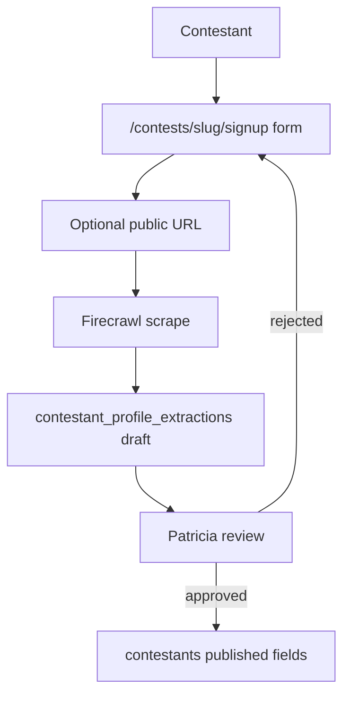

# CTEST-008 — Contestant signup, URL intake, and profile extraction

> Full spec synced from repo. Re-run: `python3 tasks/contest/scripts/sync-ctest-linear.py`

## Task metadata

| Field | Value |
|-------|-------|
| **ID** | `CTEST-008` |
| **Status** | Draft |
| **Priority** | P0 |
| **Phase** | Contest contestant onboarding |
| **Effort** | 2-4d |
| **Owner** | codex |
| **MVP track** | MVP-A |
| **Depends on** | CTEST-001, CTEST-006 |
| **Linear** | SAN-540 |
| **Evidence** | `tasks/contest/notes/CTEST-008-evidence.md` |
| **Repo file** | [tasks/contest/tasks/CTEST-008-contestant-signup-url-intake.md](https://github.com/amo-tech-ai/mdeai/blob/main/tasks/contest/tasks/CTEST-008-contestant-signup-url-intake.md) |

### Skills

- `shadcn`
- `mde-firecrawl`
- `mde-supabase`
- `testing`

### Docs

- `../docs/03-screens-wireframes.md`
- `../docs/04-verification-report-2026-06-02.md`
- `../docs/05-production-task-standard.md`
- `../docs/06-shadcn-component-audit.md`

### Verified against

- `/home/sk/mdeai/.claude/skills/shadcn/SKILL.md`
- `/home/sk/mdeai/.claude/skills/mde-firecrawl/SKILL.md`
- https://ui.shadcn.com/docs/forms/react-hook-form
- https://ui.shadcn.com/docs/components
- https://ui.shadcn.com/docs/cli

### Labels

- `prefix:CONT`
- `prefix:EVT`
- `track:contest`
- `track:events`
- `phase:phase2`

---

## 1. Purpose

Create a contestant signup flow where a contestant can apply to a contest, paste an Instagram/public portfolio URL, upload initial profile data, and receive a source-attributed draft profile that Patricia or Roberto can approve.

## 2. Goals

- Add `/contests/[slug]/signup` with a mobile-first shadcn form.
- Use React Hook Form, Zod, `Field`, `FieldGroup`, `FieldError`, and `aria-invalid`.
- Accept public URLs as optional inputs, including Instagram profile URLs, portfolio pages, agency pages, or personal sites.
- Extract only public, allowed profile hints into a draft: display name, bio, public image URL candidates, location hints, category, and source URL.
- Store extracted data as draft fields, never as approved profile truth.
- Add admin review path for accepting, editing, or rejecting extracted profile suggestions.

## 3. Features

- Contestants get a guided signup instead of a blank form.
- Patricia can review profile drafts and source links before publication.
- The system can ask follow-up questions when extracted data is incomplete.
- Private content, login-gated pages, platform-prohibited scraping, and automatic contact are explicitly out of scope.

## 4. Workflows

1. Inspect current shadcn config:
   ```bash
   cd mdeapp
   npx shadcn@latest info --json
   npx shadcn@latest docs field input input-group textarea select checkbox button card sheet alert spinner sonner --json
   npx shadcn@latest add field input-group textarea select checkbox alert spinner sonner --dry-run
   ```
2. Add missing shadcn components only after reviewing the dry run.
3. If absent, install form dependencies:
   ```bash
   cd mdeapp
   npm install react-hook-form @hookform/resolvers
   ```
4. Create `/contests/[slug]/signup` with:
   - Required fields: legal/display name, email, phone/WhatsApp, city, age eligibility acknowledgement, division/category.
   - Optional fields: Instagram URL, portfolio URL, bio, talents, measurements if appropriate for the contest, availability, consent checkboxes.
   - Upload placeholder or storage handoff for profile photos.
5. Add server action/API route for draft submission.
6. Use Firecrawl/OpenClaw only for public URL extraction through an allowlisted, rate-limited server-side path.
7. Write `contestant_profile_extractions` rows with source URL, extracted JSON, confidence, and review status.
8. Add Patricia admin review table under `/admin/contests/[id]/contestants`.

## 5. User Journeys

- Contestant opens the public contest page, taps Apply, pastes an Instagram or portfolio URL, answers guided questions, and submits a draft application.
- Patricia reviews extracted fields, edits the bio/photo choices, asks for missing information, and approves the contestant profile.
- A failed extraction still lets the contestant complete the form manually.

## 6. Agents

- `contestantOnboardingAgent` asks missing-profile questions and explains next steps.
- URL extraction is tool-backed and draft-only.
- No agent may approve a contestant, publish a profile, scrape private content, or contact a lead.

## 7. Integrations

- Supabase tables from CTEST-001: `contestants`, `contestant_assets`, `contestant_social_links`, `contest_audit_events`.
- New draft table: `contestant_profile_extractions`.
- Firecrawl/OpenClaw for public URL extraction, bounded by allowlists and source logging.
- shadcn React Hook Form for accessible validation.
- Required shadcn components: `Field`, `FieldGroup`, `FieldLabel`, `FieldError`, `Input`, `InputGroup`, `InputGroupTextarea`, `Textarea`, `Select`, `Checkbox`, `Button`, `Card`, `Sheet`, `Alert`, `Spinner`, `Sonner`.

## 8. Summary

This task fills the biggest missing contestant journey gap: signup and URL-assisted profile creation. It keeps extraction as an assistant, not a source of truth.

## 9. Definition Of Done

- [ ] `/contests/[slug]/signup` renders on desktop and mobile.
- [ ] Form uses React Hook Form + Zod + shadcn Field components.
- [ ] shadcn CLI dry run completed for missing signup components before installation.
- [ ] Invalid fields show accessible errors.
- [ ] URL extraction stores source-attributed draft JSON.
- [ ] Private/login-gated URLs fail closed with manual-entry fallback.
- [ ] Admin can approve/edit/reject extracted suggestions.
- [ ] Audit rows are written for submit, extraction, review, and approval.

## 10. Tests

- [ ] Unit test Zod schema for required fields and URL validation.
- [ ] Component test form error states.
- [ ] Component test proves `Field data-invalid` and controls with `aria-invalid` render on validation errors.
- [ ] API test: manual signup succeeds without URL.
- [ ] API test: unsupported/private URL is rejected or skipped without blocking manual signup.
- [ ] SQL proof: draft row, extraction row, audit row.
- [ ] Playwright: mobile 375/414 and desktop 1440 signup flow.
- [ ] Responsive proof: no horizontal overflow; touch targets at least 44px.
- [ ] Rollback: disable URL extraction feature flag and keep manual signup working.

## Production Standard Addendum

This task must satisfy `../docs/05-production-task-standard.md`: create tasks, tech stack, feature, problem solving, agents/workflows/automations, user journey, Mermaid diagrams, skills to run, MCP/official docs, verification steps, real-world examples, data, frontend/backend wiring, success criteria, production-ready checklist, and testing.

## 11. Mermaid diagrams

### Signup + URL extraction (draft only)


