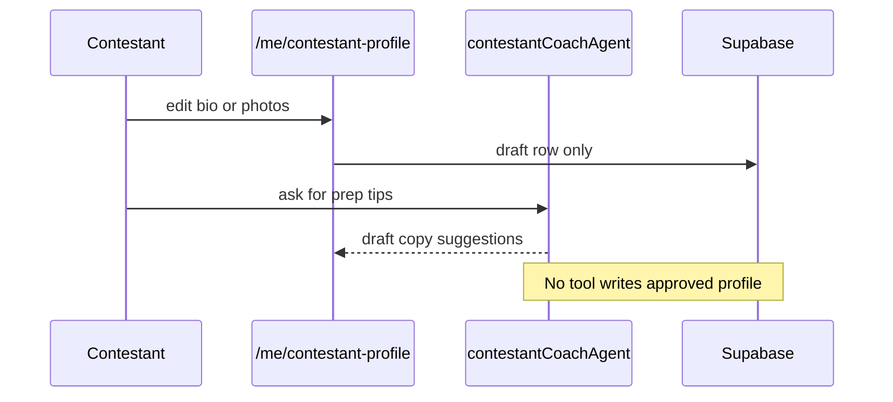

# CTEST-009 — Contestant profile editor, photo uploads, and AI coach

> Full spec synced from repo. Re-run: `python3 tasks/contest/scripts/sync-ctest-linear.py`

## Task metadata

| Field | Value |
|-------|-------|
| **ID** | `CTEST-009` |
| **Status** | Draft |
| **Priority** | P0 |
| **Phase** | Contest contestant workspace |
| **Effort** | 3-5d |
| **Owner** | codex |
| **MVP track** | MVP-A |
| **Depends on** | CTEST-001, CTEST-004, CTEST-008 |
| **Linear** | SAN-541 |
| **Evidence** | `tasks/contest/notes/CTEST-009-evidence.md` |
| **Repo file** | [tasks/contest/tasks/CTEST-009-contestant-profile-editor-coach.md](https://github.com/amo-tech-ai/mdeai/blob/main/tasks/contest/tasks/CTEST-009-contestant-profile-editor-coach.md) |

### Skills

- `shadcn`
- `mde-supabase`
- `copilotkit`
- `testing`

### Docs

- `../docs/03-screens-wireframes.md`
- `../docs/05-production-task-standard.md`
- `../docs/06-shadcn-component-audit.md`

### Verified against

- `/home/sk/mdeai/.claude/skills/shadcn/SKILL.md`
- `/home/sk/mdeai/.claude/skills/mde-supabase/SKILL.md`
- https://ui.shadcn.com/docs/forms/react-hook-form
- https://ui.shadcn.com/docs/components
- https://ui.shadcn.com/docs/cli

### Labels

- `prefix:CONT`
- `prefix:EVT`
- `track:contest`
- `track:events`
- `phase:phase2`

---

## 1. Purpose

Give contestants a private workspace to edit their profile, upload approved photos, understand next steps, prepare for casting/events, and chat with a guide that helps improve the profile without publishing unapproved changes.

## 2. Goals

- Add `/me/contestant-profile`, `/me/contestant-profile/photos`, and `/me/contestant-profile/coach`.
- Add photo upload/storage rules for public profile images and private review-only documents.
- Add a CopilotKit coach panel that suggests better bios, outfits/prep checklists, and event next steps.
- Keep profile publication approval-gated.

## 3. Features

- Profile completion checklist.
- Photo gallery with pending/approved/rejected states.
- Event/casting preparation checklist: venue, call time, dress code, documents, transport, rehearsal, sponsor obligations.
- AI coach asks focused questions and drafts profile improvements.
- Contestants can promote an approved profile after publication.

## 4. Workflows

1. Create profile workspace routes.
2. Run shadcn CLI verification:
   ```bash
   cd mdeapp
   npx shadcn@latest info --json
   npx shadcn@latest docs field input-group textarea select avatar alert empty spinner sonner tabs drawer --json
   npx shadcn@latest add field input-group textarea select avatar alert empty spinner sonner tabs drawer --dry-run
   ```
3. Add storage buckets/policies or reuse contest media buckets from CTEST-001.
4. Add profile completion calculation.
5. Add coach action cards: `BioDraftCard`, `PhotoReadinessCard`, `PrepChecklistCard`, `PromotionPlanCard`.
6. Add admin approval queue for profile/photo changes.

## 5. User Journeys

- Contestant logs in, edits profile details, uploads photos, and submits changes for approval.
- Contestant asks the coach what to prepare for casting and gets a checklist tied to contest events.
- Patricia reviews pending photos/profile changes and publishes the approved version.

## 6. Agents

- `contestantCoachAgent` can draft copy, suggest questions, summarize next steps, and generate checklists.
- It cannot approve media, publish profiles, modify votes, or contact sponsors/fans.

## 7. Integrations

- Supabase storage for contestant media.
- Supabase RLS for contestant-owned private edits and public approved profile reads.
- CopilotKit for coach and action cards.
- Mastra/Gemini for draft suggestions after CTEST-005.
- Required shadcn components: `Field`, `InputGroup`, `Textarea`, `Select`, `Avatar`, `Alert`, `Empty`, `Spinner`, `Sonner`, `Tabs`, `Drawer`, plus installed `Card`, `Button`, `Badge`, `Dialog`, and `Sheet`.

## 8. Summary

This task turns signup into an ongoing contestant workspace, which is required for profile quality and event readiness.

## 9. Definition Of Done

- [ ] Profile editor route renders.
- [ ] shadcn CLI dry run completed for missing profile/coach components before installation.
- [ ] Photo upload route renders.
- [ ] Coach route renders.
- [ ] Contestant can save draft changes but cannot self-publish.
- [ ] Photo status workflow supports pending, approved, rejected.
- [ ] Coach responses are draft-only and include next-step checklists.
- [ ] Admin approval is required before public profile changes.

## 10. Tests

- [ ] Unit test profile completion calculation.
- [ ] Storage policy test: contestant cannot read another contestant's private docs.
- [ ] Storage policy test: public can read approved public profile photos only.
- [ ] Playwright: edit profile, upload photo stub, submit for approval.
- [ ] Playwright: coach asks missing-profile questions.
- [ ] SQL proof: audit rows for profile edit, media upload, review decision.
- [ ] Responsive proof at 375, 414, 768, 1024, 1440.

## Production Standard Addendum

This task must satisfy `../docs/05-production-task-standard.md`: create tasks, tech stack, feature, problem solving, agents/workflows/automations, user journey, Mermaid diagrams, skills to run, MCP/official docs, verification steps, real-world examples, data, frontend/backend wiring, success criteria, production-ready checklist, and testing.

## 11. Mermaid diagrams

### Profile editor + coach (no auto-publish)


