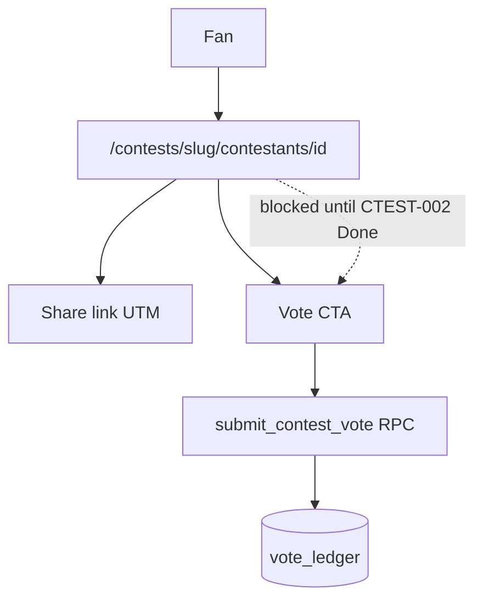

# CTEST-010 — Public contestant profile voting page and share growth loop

> Full spec synced from repo. Re-run: `python3 tasks/contest/scripts/sync-ctest-linear.py`

## Task metadata

| Field | Value |
|-------|-------|
| **ID** | `CTEST-010` |
| **Status** | Draft |
| **Priority** | P0 |
| **Phase** | Contest growth and voting |
| **Effort** | 2-4d |
| **Owner** | codex |
| **MVP track** | MVP-A |
| **Depends on** | CTEST-002, CTEST-006, CTEST-009 |
| **Linear** | SAN-542 |
| **Evidence** | `tasks/contest/notes/CTEST-010-evidence.md` |
| **Repo file** | [tasks/contest/tasks/CTEST-010-public-profile-vote-share-growth.md](https://github.com/amo-tech-ai/mdeai/blob/main/tasks/contest/tasks/CTEST-010-public-profile-vote-share-growth.md) |

### Skills

- `responsive-design`
- `tailwind-responsive-ui`
- `testing`

### Docs

- `../docs/03-screens-wireframes.md`
- `../docs/05-production-task-standard.md`
- `../docs/06-shadcn-component-audit.md`

### Verified against

- `/home/sk/mdeai/.claude/skills/responsive-design/SKILL.md`
- `/home/sk/mdeai/.claude/skills/tailwind-responsive-ui/SKILL.md`
- `/home/sk/mdeai/.claude/skills/responsive-design/SKILL.md`
- `/home/sk/mdeai/.claude/skills/shadcn/SKILL.md`
- `/home/sk/mdeai/.claude/skills/testing/SKILL.md`
- https://ui.shadcn.com/docs/components
- https://ui.shadcn.com/docs/cli

### Labels

- `prefix:CONT`
- `prefix:EVT`
- `track:contest`
- `track:events`
- `phase:phase2`

---

## 1. Purpose

Make each approved contestant profile double as a public voting page that fans can view, share, and use to cast valid free or paid votes.

## 2. Goals

- **Hard dependency:** CTEST-002 vote RPCs must be Done before this route accepts votes (no client-side vote writes).
- Implement `/contests/[slug]/contestants/[id]` as the primary public voting profile.
- Add share links for WhatsApp, Instagram copy, direct URL, and contact import prompt where legally/technically appropriate.
- Add referral/UTM tracking without exposing private voter data.
- Make vote CTA states obvious: open, closed, already voted, paid credits available, in review.

## 3. Features

- Public profile hero with approved photos and contestant story.
- Vote module with free/paid path handoff.
- Share panel with trackable links.
- Fan-facing receipt after vote.
- Contestant-facing promotion guidance.

## 4. Workflows

1. Build responsive public profile route.
2. Run shadcn CLI verification:
   ```bash
   cd mdeapp
   npx shadcn@latest info --json
   npx shadcn@latest docs avatar radio-group alert sonner spinner button card badge dialog tooltip --json
   npx shadcn@latest add avatar radio-group alert sonner spinner --dry-run
   ```
3. Connect vote CTA to CTEST-002 RPC/API.
4. Connect paid vote CTA to CTEST-003.
5. Generate share URLs with UTM/referral token.
6. Track public profile views and share clicks in audit/analytics tables.

## 5. User Journeys

- Fan lands on a contestant profile from WhatsApp and votes.
- Contestant copies their profile link and shares it with friends.
- Patricia reviews traffic/vote anomalies from the admin audit view.

## 6. Agents

- AI can suggest share copy and promotion tips.
- AI cannot cast votes, buy votes, or pressure contacts.

## 7. Integrations

- Vote ledger/RPC from CTEST-002.
- Paid vote credits from CTEST-003.
- Public approved profile from CTEST-009.
- Optional WhatsApp share link only; no autonomous messaging.
- Required shadcn components: `Avatar`, `RadioGroup`, `Alert`, `Sonner`, `Spinner`, plus installed `Button`, `Card`, `Badge`, `Dialog`, and `Tooltip`.

## 8. Summary

This task closes the growth loop: the profile page is also the voting page and sharing surface.

## 9. Definition Of Done

- [ ] Public profile route renders approved contestant data only.
- [ ] shadcn CLI dry run completed for missing public profile/vote components before installation.
- [ ] Vote CTA handles open/closed/already-voted/paid-credit states.
- [ ] Share links include source tracking.
- [ ] Private documents and rejected media never render publicly.
- [ ] Mobile layout is single-column, touch-safe, and free of horizontal overflow.

## 10. Tests

- [ ] Playwright: fan views profile and votes.
- [ ] Playwright: profile share link copies/opens.
- [ ] Negative test: unapproved contestant is not public.
- [ ] Negative test: rejected/private media is not public.
- [ ] SQL proof: vote receipt, share event, profile view.
- [ ] Responsive proof at 375, 414, 768, 1024, 1440.

## Production Standard Addendum

This task must satisfy `../docs/05-production-task-standard.md`: create tasks, tech stack, feature, problem solving, agents/workflows/automations, user journey, Mermaid diagrams, skills to run, MCP/official docs, verification steps, real-world examples, data, frontend/backend wiring, success criteria, production-ready checklist, and testing.

## 11. Mermaid diagrams

### Public profile + vote (requires CTEST-002)


