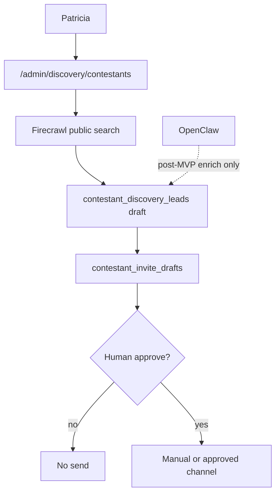

# CTEST-011 — OpenClaw and Firecrawl discovery plus approved invite drafts

> Full spec synced from repo. Re-run: `python3 tasks/contest/scripts/sync-ctest-linear.py`

## Task metadata

| Field | Value |
|-------|-------|
| **ID** | `CTEST-011` |
| **Status** | Draft |
| **Priority** | P1 |
| **Phase** | Contest discovery sandbox |
| **Effort** | 2-4d |
| **Owner** | codex |
| **MVP track** | MVP-B |
| **Depends on** | CTEST-001, CTEST-005 |
| **Linear** | SAN-543 |
| **Evidence** | `tasks/contest/notes/CTEST-011-evidence.md` |
| **Repo file** | [tasks/contest/tasks/CTEST-011-openclaw-discovery-invite-sandbox.md](https://github.com/amo-tech-ai/mdeai/blob/main/tasks/contest/tasks/CTEST-011-openclaw-discovery-invite-sandbox.md) |

### Skills

- `mde-firecrawl`
- `mde-supabase`
- `task-verifier`

### Docs

- `../docs/02-github-repos-use.md`
- `../docs/05-production-task-standard.md`
- `../docs/06-shadcn-component-audit.md`

### Verified against

- `/home/sk/mdeai/.claude/skills/mde-firecrawl/SKILL.md`
- `/home/sk/mdeai/.claude/skills/shadcn/SKILL.md`
- https://ui.shadcn.com/docs/components
- https://ui.shadcn.com/docs/cli

### Labels

- `prefix:CONT`
- `prefix:EVT`
- `track:contest`
- `track:events`
- `phase:phase2`
- `stack:openclaw`

---

## 1. Purpose

Add a governed discovery sandbox for finding public model/contestant/pageant/casting leads and drafting invite messages, without automated Instagram scraping or unsolicited autonomous outreach.

## 2. Goals

- Add `/admin/discovery/contestants` for Patricia.
- Use public web search and allowed page extraction for leads.
- Store leads as drafts with source URLs, confidence, and compliance notes.
- Draft invitation copy for human review.
- Require approval before any contact, export, or CRM mutation.

## 3. Features

- Search queries for model agencies, casting pages, public pageant websites, university/fashion event pages, and public creator directories.
- Structured lead extraction schema: name, public profile URL, source type, city, category, contact method if explicitly published, evidence snippets, risk flags.
- Human review queue with approve/reject/needs-research.
- Invite draft generation with opt-in language and no deceptive claims.

## 4. Workflows

1. Define allowlisted discovery sources and blocked sources.
2. Run shadcn CLI verification:
   ```bash
   cd mdeapp
   npx shadcn@latest info --json
   npx shadcn@latest docs table sheet dialog textarea alert empty skeleton badge button input --json
   npx shadcn@latest add table textarea alert empty --dry-run
   ```
3. Use Firecrawl search/scrape or OpenClaw sandbox against public pages only.
4. Write `contestant_discovery_runs`, `contestant_discovery_leads`, and `contestant_invite_drafts`.
5. Add approval action for invite drafts.
6. Export/send remains disabled until a separate approved communications task exists.

## 5. User Journeys

- Patricia searches for public Medellin model/casting pages and reviews extracted leads.
- Patricia approves a lead and edits an invite draft.
- A blocked source or private/login-gated URL fails closed and records a risk note.

## 6. Agents

- Discovery agent can search, summarize, extract, and draft.
- It cannot scrape private content, bypass platform protections, send DMs/emails, impersonate anyone, or mutate contestant truth.

## 7. Integrations

- Firecrawl for search/scrape/structured extraction.
- OpenClaw for sandboxed browser automation after allowlists are approved.
- Supabase for discovery run logs and draft leads.
- Paperclip-style approval gate if that control plane exists later.
- Required shadcn components: `Table`, `Sheet`, `Dialog`, `Textarea`, `Alert`, `Empty`, `Skeleton`, `Badge`, `Button`, and `Input`.

## 8. Summary

This task keeps discovery useful but boringly governed: public sources, source logging, approval gates, and no autonomous contact.

## 9. Definition Of Done

- [ ] Discovery admin route renders.
- [ ] shadcn CLI dry run completed for missing discovery/admin components before installation.
- [ ] Allowlist/blocklist exists.
- [ ] Structured extraction schema is documented.
- [ ] Leads store source URLs and risk flags.
- [ ] Invite drafts require approval.
- [ ] No automated contact path exists in MVP.

## 10. Tests

- [ ] Unit test extraction schema validation.
- [ ] Negative test: private/login-gated URL is rejected.
- [ ] Negative test: Instagram DM/send action is unavailable.
- [ ] SQL proof: discovery run, lead, invite draft, approval status.
- [ ] Playwright: Patricia reviews and approves a draft without sending it.
- [ ] Evidence: source URL and extraction output redacted for private data.

## Production Standard Addendum

This task must satisfy `../docs/05-production-task-standard.md`: create tasks, tech stack, feature, problem solving, agents/workflows/automations, user journey, Mermaid diagrams, skills to run, MCP/official docs, verification steps, real-world examples, data, frontend/backend wiring, success criteria, production-ready checklist, and testing.

## 11. Mermaid diagrams

### Discovery sandbox (MVP-B, human approval)


