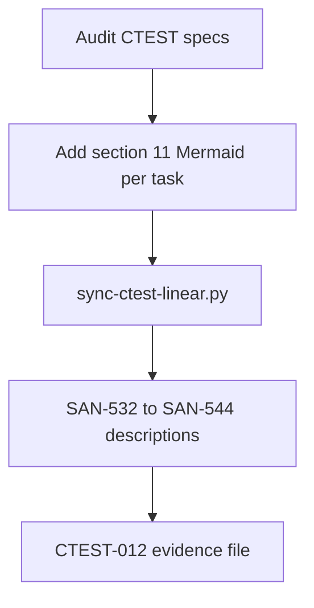

# CTEST-012 — Contest spec normalization, Linear sync, labels, and validation proof

> Full spec synced from repo. Re-run: `python3 tasks/contest/scripts/sync-ctest-linear.py`

## Task metadata

| Field | Value |
|-------|-------|
| **ID** | `CTEST-012` |
| **Status** | In Progress |
| **Priority** | P0 |
| **Phase** | Contest task governance |
| **Effort** | 1-2d |
| **Owner** | codex |
| **MVP track** | — |
| **Depends on** | CTEST-000 |
| **Linear** | SAN-544 |
| **Evidence** | `tasks/contest/notes/CTEST-012-evidence.md` |
| **Repo file** | [tasks/contest/tasks/CTEST-012-spec-normalization-linear-sync.md](https://github.com/amo-tech-ai/mdeai/blob/main/tasks/contest/tasks/CTEST-012-spec-normalization-linear-sync.md) |

### Skills

- `task-verifier`
- `mermaid-diagrams`
- `testing`

### Docs

- `../audit/2026-06-02-forensic-audit.md`
- `../docs/04-verification-report-2026-06-02.md`
- `../docs/05-production-task-standard.md`
- `../docs/06-shadcn-component-audit.md`

### Verified against

- `/home/sk/mdeai/.claude/skills/task-verifier/SKILL.md`
- `/home/sk/mdeai/.claude/skills/mermaid-diagrams/SKILL.md`
- `/home/sk/mdeai/.claude/skills/testing/SKILL.md`
- `/home/sk/mdeai/.claude/skills/shadcn/SKILL.md`

### Labels

- `prefix:CONT`
- `prefix:EVT`
- `track:contest`
- `track:events`
- `phase:phase2`

---

## 1. Purpose

Make the contest task pack executable by normalizing every CTEST spec to the repo task template, syncing issues to Linear, and recording proof for labels, links, Mermaid diagrams, and validation commands.

## 2. Goals

- Normalize CTEST-000 through CTEST-011 to the ten-section task template.
- Ensure every task has frontmatter: `id`, `title`, `status`, `priority`, `phase`, `effort`, `owner`, `depends_on`, `skill`, `labels`, `linear_project`, `verified_against`.
- Ensure every task covers create tasks, tech stack, feature, problem solving, agents/workflows/automations, user journey, Mermaid diagrams, skills, MCP/official docs, verification steps, real-world examples, data, frontend/backend wiring, success criteria, production checklist, and testing.
- Ensure every Linear issue has `prefix:CONT`, `prefix:EVT`, `track:contest`, `track:events`, and `phase:phase2`.
- Record Linear issue identifiers back into task files when available.
- Validate Markdown links and Mermaid blocks.

## 3. Features

- Sofia can execute tasks without guessing what proof is required.
- Patricia can see the contest/event scope in Linear.
- Future audits can distinguish docs-only readiness from implementation readiness.

## 4. Workflows

1. Run a local task frontmatter/section audit over `tasks/contest/tasks/*.md`.
2. Patch missing sections and frontmatter.
3. Verify every task references `../docs/05-production-task-standard.md`.
4. Validate local links.
5. Validate Mermaid blocks using MCP, Mermaid CLI, or documented offline syntax review.
6. Verify shadcn UI gates for CTEST-004, CTEST-006, CTEST-008, CTEST-009, CTEST-010, and CTEST-011:
   ```bash
   cd mdeapp
   npx shadcn@latest info --json
   npx shadcn@latest docs field input-group textarea select checkbox radio-group table tabs drawer avatar alert empty sonner spinner --json
   npx shadcn@latest add field input-group textarea select checkbox radio-group table tabs drawer avatar alert empty sonner spinner --dry-run
   ```
7. Create/update Linear issues in the Events Platform project.
8. Write `tasks/contest/notes/CTEST-012-evidence.md`.

## 5. User Journeys

- Sofia opens Linear and sees every contest task in order with labels and repo links.
- Codex runs task-verifier and gets a clean spec-readiness table.
- Roberto/Patricia can tell which tasks are Phase 2 contest work versus current Phase 1 events work.

## 6. Agents

- No product agents are introduced.
- Codex/Linear sync is governance only.

## 7. Integrations

- Linear project: Events Platform.
- Task docs under `tasks/contest/tasks`.
- Mermaid diagrams under `tasks/contest/docs/01-mermaid-diagrams.md`.
- shadcn audit under `tasks/contest/docs/06-shadcn-component-audit.md`.

## 8. Summary

This is the first safe task to execute because it fixes planning hygiene without changing product runtime.

## 9. Definition Of Done

- [x] Every CTEST task has required frontmatter (`evidence`, `phase:phase2`, `mvp_track` where applicable).
- [x] Every CTEST task has the ten required sections (verified 2026-06-02 — see `../audit/2026-06-02-spec-verification.md`).
- [x] Every CTEST task references `../docs/05-production-task-standard.md`.
- [ ] Every UI CTEST task references `../docs/06-shadcn-component-audit.md`.
- [ ] Every CTEST task covers the required production topics listed in `../docs/05-production-task-standard.md`.
- [ ] Every CTEST task has labels `prefix:CONT` and `prefix:EVT`.
- [x] Linear issues exist for every CTEST task (SAN-532..544 on Events Platform).
- [x] Linear labels and project assignment verified 2026-06-02.
- [x] Mermaid in every CTEST task §11; Linear descriptions synced (SAN-532..544, 2026-06-02).
- [ ] Mermaid/link validation evidence is recorded in CTEST-012-evidence.md.

## 10. Tests

- [ ] `rg -n "labels:|prefix:CONT|prefix:EVT" tasks/contest/tasks`.
- [ ] `rg -L "../docs/05-production-task-standard.md" tasks/contest/tasks/CTEST-*.md` returns no task files.
- [ ] `rg -L "../docs/06-shadcn-component-audit.md" tasks/contest/tasks/CTEST-00{4,6,8,9}.md tasks/contest/tasks/CTEST-010-public-profile-vote-share-growth.md tasks/contest/tasks/CTEST-011-openclaw-discovery-invite-sandbox.md` returns no task files.
- [ ] `npx shadcn@latest info --json` records installed components.
- [ ] `npx shadcn@latest docs field input-group textarea select checkbox radio-group table tabs drawer avatar alert empty sonner spinner --json` returns docs links.
- [ ] `npx shadcn@latest add field input-group textarea select checkbox radio-group table tabs drawer avatar alert empty sonner spinner --dry-run` records component/dependency changes and overwrite warnings.
- [ ] Local Markdown link check for `tasks/contest`.
- [ ] Mermaid validation or offline syntax checklist.
- [ ] Linear `list_issues(project=events-platform-46150ec19346)` returns all CTEST issues.
- [ ] Evidence file records commands, results, and unresolved gaps.

## Production Standard Addendum

This governance task must verify every contest task satisfies `../docs/05-production-task-standard.md`: create tasks, tech stack, feature, problem solving, agents/workflows/automations, user journey, Mermaid diagrams, skills to run, MCP/official docs, verification steps, real-world examples, data, frontend/backend wiring, success criteria, production-ready checklist, and testing.

## 11. Mermaid diagrams

### Linear sync workflow (this task)


