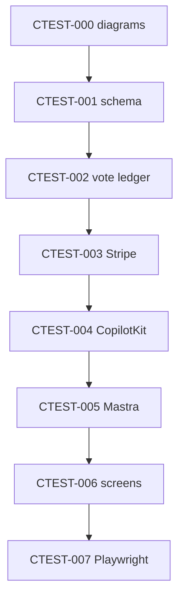

# CTEST-000 — Contest Diagrams, Repo Decisions, And Scope Gate

## 1. Purpose

Establish the contest vertical implementation map (diagrams, repo references, MVP boundaries) before any database, route, or agent work. Docs-only — no `mdeapp/src` changes.

## 2. Goals

- Confirm `tasks/contest/docs/01-mermaid-diagrams.md` covers architecture, task sequence, vote flow, Stripe flow, CopilotKit/Mastra approval flow, screens, and post-MVP boundaries.
- Confirm `tasks/contest/docs/02-github-repos-use.md` classifies repos as foundation, reference, post-MVP, or avoid.
- Confirm `tasks/contest/docs/00-docs-review.md` records doc gaps and red flags.
- Link all CTEST tasks in `tasks/contest/tasks/INDEX.md` with MVP-A / MVP-B cut lines.

## 3. Features

- Roberto/Patricia/Sofía share one technical starting point for Phase 2 contest work.
- Prevents scope creep (OpenClaw daily scrape, Postiz auto-publish, live overlays) into MVP-A.

## 4. Workflows

1. Review and patch `01-mermaid-diagrams.md`, `02-github-repos-use.md`, `00-docs-review.md` if gaps found.
2. Static Mermaid fence check:
   ```bash
   rg '^```mermaid' /home/sk/mdeai/tasks/contest/docs/01-mermaid-diagrams.md
   rg 'note inside state|end\[|class\[' /home/sk/mdeai/tasks/contest/docs || true
   ```
3. Local link check under `tasks/contest/` (fix broken `tasks/contest/core/*` refs if any).
4. Record docs-only runtime N/A in `tasks/contest/notes/CTEST-000-evidence.md`.

## 5. User Journeys

- Sofia opens the pack and sees build order, repo choices, and deferred boundaries before CTEST-001.

## 6. Agents

- None introduced. Governance/verification only.

## 7. Integrations

| Repo | Use |
|---|---|
| CopilotKit Mastra starter | Pattern 1 in-process runtime reference for `mdeapp` |
| Helios | Vote hash / freeze / tally concepts only |
| Hi.Events | Ticket/check-in patterns only — **AGPL: no source copy** |
| OpenStreamPoll | Post-MVP live/OBS overlay |
| TanStack Table | Admin tables |
| React Email | Sponsor/ticket email templates |
| Playwright | Proof gates (CTEST-007) |
| OpenClaw / Postiz / Trigger.dev | Post-MVP only |

## 8. Summary

Planning gate for the contest vertical. Safe to execute without touching production runtime.

## 9. Definition Of Done

- [ ] Diagrams doc exists with valid Mermaid fences (static scan).
- [ ] GitHub repo use plan exists.
- [ ] Docs review exists and lists red flags.
- [ ] Task index links all CTEST tasks with MVP-A/B columns.
- [ ] Evidence file states runtime N/A and records probe commands + exit codes.

## 10. Tests

| Check | Command | Expected |
|---|---|---|
| Mermaid fences | `rg -c '^```mermaid' tasks/contest/docs/01-mermaid-diagrams.md` | ≥ 7 |
| Reserved-label scan | `rg 'note inside state\|end\[\|class\[' tasks/contest/docs` | no matches |
| Index links CTEST | `rg 'CTEST-' tasks/contest/tasks/INDEX.md` | 000–012 listed |
| Template sections (downstream) | `rg -c '^## 1\. Purpose' tasks/contest/tasks/CTEST-*.md` | 13 matches |

**Do not:** write app code; clone external apps into `mdeapp`; move OpenClaw/Postiz/livestream into MVP-A.


## 11. Mermaid diagrams

Authoritative pack: [`../docs/01-mermaid-diagrams.md`](../docs/01-mermaid-diagrams.md) (7 diagrams). Linear copy: [SAN-532](https://linear.app/sanjiovani/issue/SAN-532).

### Task sequence (summary)



**Production standard:** `../docs/05-production-task-standard.md`.
