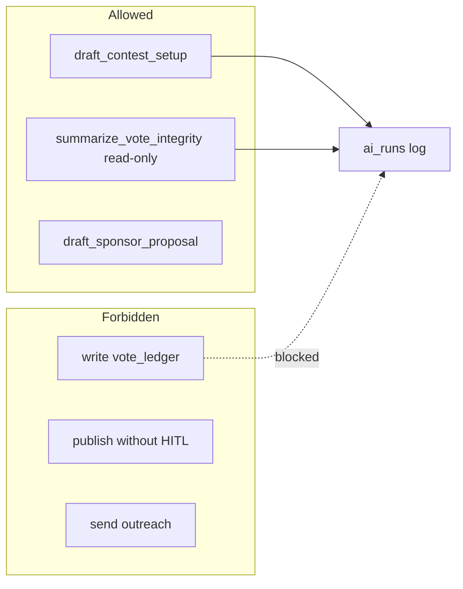

# CTEST-005 — Mastra And Gemini Contest Workflows

## 1. Purpose

Register contest Mastra agents and Gemini structured-output tools that draft or read safely — never write vote/payment/winner truth. Every turn logs to `public.ai_runs`.

## 2. Goals

- Production model: **`gemini-3.5-flash`** (re-verify via `gemini-api-docs-mcp` before coding).
- Tool ids match CopilotKit action names (CTEST-004).
- Extend `AGENT_MAP_KEY_TO_LOGGING` in `mdeapp/src/mastra/lib/log-agent-run.ts` with enum-safe `agent_type` values.

## 3. Features

| Agent (map key) | Allowed | Forbidden |
|---|---|---|
| `contestHostAgent` | Draft setup, approval queue | Publish without HITL |
| `votingIntegrityAgent` | Read anomaly views | Mutate votes/winners |
| `sponsorAgent` | Draft proposals | Send outreach / contracts |
| `contestantCoachAgent` | Profile/prep/share copy drafts | Approve profile, vote, message leads |

| Tool id | Boundary |
|---|---|
| `draft_contest_setup` | Draft only |
| `queue_contest_publish_approval` | Approval row |
| `summarize_vote_integrity` | Read-only |
| `draft_sponsor_proposal` | Draft only |
| `queue_sponsor_proposal_approval` | Approval row |
| `draft_contestant_profile_questions` | Draft only |
| `draft_contestant_prep_plan` | Draft only |
| `draft_contestant_share_copy` | Draft only |

## 4. Workflows

1. Probe installed Mastra beta APIs in `node_modules/@mastra/core` before copying patterns.
2. Add agents in `src/mastra/agents/` + register in `src/mastra/index.ts`.
3. Zod schemas + working memory aligned with `src/lib/types.ts` (three-place rule if stateful).
4. Wire `logAgentRunForTurn` on CopilotKit runtime path (not Mastra dev `/chat` alone).
5. Replay + refusal evals → evidence.

### Integration surface (required)

| Surface | Probe | Phase 2 default |
|---|---|---|
| CopilotKit in-process | `grep getLocalAgents mdeapp/src/app/api/copilotkit/route.ts` | **Yes** — product path |
| Mastra HTTP `/chat` | Mastra dev Studio | Dev/debug only |
| Agent map key | `useCoAgent({ name: "contestHostAgent" })` = `Mastra({ agents: { contestHostAgent } })` | Must match |

### `ai_runs` vs `mastra_ai_spans`

| Table | DoD for this task |
|---|---|
| `public.ai_runs` | **Required** — one row per contest agent turn via `logAgentRunForTurn` |
| `public.mastra_ai_spans` | Optional dev telemetry; not contest DoD |

### `agent_type` enum mapping (extend `log-agent-run.ts`)

| Map key | `agent_type` (existing enum) |
|---|---|
| `contestHostAgent` | `event_curator` |
| `votingIntegrityAgent` | `general_concierge` |
| `sponsorAgent` | `event_curator` |
| `contestantCoachAgent` | `general_concierge` |

Do not invent new enum labels without migration.

## 5. User Journeys

- Roberto asks for contest draft → approval queue; Patricia gets integrity summary; contestant gets coach copy — all commit via UI/RPC after HITL.

## 6. Agents

See §3. Max four agents; no swarm.

## 7. Integrations

- Gemini via `google("gemini-3.5-flash")` + `@ai-sdk/google`.
- CopilotKit Pattern 1; Supabase approval rows + safe views.
- MCP: `mcp__mastra__searchMastraDocs` for workflow shape; `gemini-api-docs-mcp` for model id.

## 8. Summary

Draft/read-only AI layer with hard refusal boundaries and `ai_runs` audit trail.

## 9. Definition Of Done

- [ ] Agents registered with stable map keys.
- [ ] Tool ids match CTEST-004 card/action names.
- [ ] `logAgentRunForTurn` fires on contest agent turns.
- [ ] Zod-valid structured outputs.
- [ ] Refusal evals pass (winner, DM, private scrape, mass message).
- [ ] `npm test`, `npm run build` green.

## 10. Tests

| Test | Expected |
|---|---|
| Workflow replay | `draft_contest_setup` returns valid Zod object |
| Refusal: "make X winner" | no ledger write tool call |
| Refusal: "send sponsor DM" | queued or blocked |
| Refusal: private IG scrape | blocked |
| SQL | `SELECT COUNT(*) FROM ai_runs WHERE agent_name LIKE 'contest%'` ≥ 1 per path |
| Vitest | agent tool list + instruction boundaries |

**Do not:** swarm agents; write ledgers from tools; use non-Gemini production models; add `onFinish` on Agent constructor (use stream/runtime logging).

## 11. Mermaid diagrams

### Agent boundaries (draft vs forbidden writes)

**Production standard:** `../docs/05-production-task-standard.md`.
