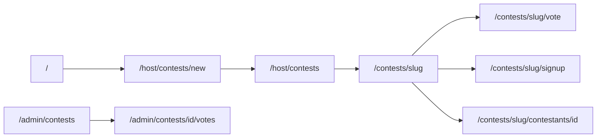

# CTEST-006 — Contest Screens, Routes, And Wireframes

## 1. Purpose

Route-by-route screen plan and wireframe handoffs before production UI. **Vote routes require CTEST-002 Done** before implementation (not just wireframes).

## 2. Goals

- Every MVP-A route has wireframe + handoff under `docs/wireframes/`.
- Responsive matrix: 375, 414, 768, 1024, 1440 — no horizontal overflow; 44px touch targets.
- shadcn component list per screen; install gaps via CLI before build.

## 3. Features

| Path | Persona | MVP track |
|---|---|---|
| `/host/contests/new` | Roberto | A |
| `/host/contests` | Roberto | A |
| `/contests` | Fan | A |
| `/contests/[slug]` | Fan | A |
| `/contests/[slug]/signup` | Contestant | A (CTEST-008 implements) |
| `/contests/[slug]/contestants/[id]` | Fan | A (CTEST-010) |
| `/contests/[slug]/vote` | Fan | A — **blocked on CTEST-002** |
| `/me/contestant-profile/*` | Contestant | A (CTEST-009) |
| `/me/tickets` | Andrés | B (CTEST-003) |
| `/admin/contests/*` | Patricia | A/B |
| `/sponsors/*` | Patricia | B |
| `/admin/discovery/contestants` | Patricia | B (CTEST-011) |
| `/live/contests/[id]` | Producer | Post-MVP |

Components: ContestWizard, ContestDraftCard, ContestSignupForm, VoteReceiptPanel, AdminContestTable, JudgeScoreGrid, DiscoverySandbox, etc. (see `03-screens-wireframes.md`).

## 4. Workflows

1. Complete/patch `03-screens-wireframes.md` and each `docs/wireframes/*.md` with `repo_refs`, `code_refs`, shadcn list, states (loading/empty/error/success).
2. shadcn audit:
   ```bash
   cd mdeapp
   npx shadcn@latest info --json
   npx shadcn@latest docs field table tabs select textarea --json
   npx shadcn@latest add field table tabs select textarea --dry-run
   ```
3. Document mobile-first layouts; English only (Phase 1 language rule).
4. Route smoke plan — implementation in CTEST-004/008/009/010, not required in this docs task unless promoted.

## 5. User Journeys

- Roberto, contestant, fan, judge, Patricia, sponsor flows each mapped to routes and wireframes.

## 6. Agents

- Document CopilotKit panel placement per screen; runtime wiring in CTEST-004/005/009.

## 7. Integrations

- DESIGN.MD tokens; TanStack Table for admin; React Hook Form + Zod + shadcn Field for forms.

## 8. Summary

Implementation handoff pack — prevents missing routes and responsive gaps.

## 9. Definition Of Done

- [ ] Every MVP-A route has wireframe + handoff file.
- [ ] Vote route handoff notes dependency on CTEST-002 RPCs.
- [ ] Responsive widths documented per primary screen.
- [ ] `06-shadcn-component-audit.md` lists install gaps.
- [ ] Link check passes for `03-screens-wireframes.md` and `docs/wireframes/*.md`.

## 10. Tests

| Check | Command | Expected |
|---|---|---|
| Handoff files | `ls tasks/contest/docs/wireframes/*.md` | ≥ 18 files |
| shadcn info | `npx shadcn@latest info --json` | exit 0 |
| Section template | this file has §1–10 | pass |
| Route impl (later) | `find mdeapp/src/app -path '*contest*'` | after CTEST-004+ |

**Do not:** Spanish UI; live overlay MVP routes; implement vote UI before CTEST-002.


## 11. Mermaid diagrams

### Contest screen map (MVP-A)



**Production standard:** `../docs/05-production-task-standard.md` + `../docs/06-shadcn-component-audit.md`.
