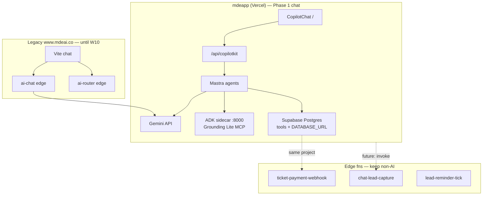

# 17 — Edge Functions audit (38 live · Phase A done)

## Live inventory (2026-05-24)

**38 functions** on `zkwcbyxiwklihegjhuql` after Phase A deleted 10 legacy AI slugs.  
**Score** = relevance to **mdeapp only** (0 = safe Phase B delete, 100 = keep/port now).

| Slug | Purpose (who / what) | JWT | Score | Verdict |
|------|----------------------|-----|-------|---------|
| `chat-lead-capture` | Camila/Roberto leave email → `leads` row from chat | off | **92** | 🟢 **Keep** — wire from mdeapp chat (F12) |
| `ticket-checkout` | Andrés starts Stripe Checkout for event ticket | off | **95** | 🟢 **Keep** — port EVT-01 → mdeapp |
| `ticket-payment-webhook` | Stripe confirms payment → paid `event_orders` + QR | off | **95** | 🟢 **Keep** — port EVT-01; update Stripe URL on cutover |
| `ticket-validate` | Staff scans QR at door | off | **90** | 🟢 **Keep** — W9 door flow |
| `event-staff-link-generator` | Patricia generates staff scanner link | on | **72** | 🟡 Keep until W9 staff UX in mdeapp |
| `google-directions` | Server proxy for Google Directions API | off | **48** | 🟡 Optional MAP-011; or Vercel route |
| `lead-from-form` | Marketing form POST → `leads` | off | **45** | 🟡 Keep if legacy forms live; else Phase B |
| `lead-reminder-tick` | Cron: nudge stale leads | off | **38** | 🔴 Phase B — ops cron, not mdeapp chat |
| `listing-create` | Host submits rental listing | on | **35** | 🔴 Phase B — legacy marketplace |
| `listing-moderate` | Approve/reject listing | off | **35** | 🔴 Phase B |
| `p1-crm` | CRM webhook / sync hooks | on | **32** | 🔴 Phase B |
| `vote-cast` | Contest vote + Turnstile | off | **30** | 🔴 Phase B — contests not Phase 1 |
| `contestant-social-enrich` | Enrich contestant social profile | on | **28** | 🔴 Phase B |
| `moderate-asset` | UGC image/text moderation (Gemini) | on | **40** | 🔴 Phase B — reuse pattern in W8+ if needed |
| `event-photo-moderate` | Event photo moderation | on | **38** | 🔴 Phase B |
| `fraud-scan` | Batch fraud scoring | off | **42** | 🔴 Phase B — Patricia ops |
| `notify-entity-approved` | Email when entity approved | off | **36** | 🔴 Phase B |
| `rules-engine` | Business rules HTTP trigger | off | **40** | 🔴 Phase B |
| `sponsor-checkout` | Sponsor Stripe checkout | on | **25** | 🔴 Phase B — sponsor product legacy |
| `sponsor-payment-webhook` | Sponsor Stripe webhook | off | **25** | 🔴 Phase B |
| `sponsor-cancel` | Cancel sponsor subscription | on | **22** | 🔴 Phase B |
| `sponsor-click` | Track sponsor click | off | **20** | 🔴 Phase B |
| `sponsor-impression` | Track impression pixel | off | **20** | 🔴 Phase B |
| `sponsor-application-create` | New sponsor application | on | **22** | 🔴 Phase B |
| `sponsor-contract-generate` | Generate sponsor contract PDF | off | **22** | 🔴 Phase B |
| `sponsor-contract-sign` | Sign sponsor contract | on | **22** | 🔴 Phase B |
| `sponsor-creative-gen` | AI sponsor creative (Gemini) | on | **20** | 🔴 Phase B |
| `sponsor-moderate` | Moderate sponsor creative | on | **20** | 🔴 Phase B |
| `sponsor-optimize` | Optimize sponsor campaign | on | **20** | 🔴 Phase B |
| `sponsor-roi-explain` | Explain sponsor ROI | on | **20** | 🔴 Phase B |
| `sponsor-audience-match` | Match sponsor to audience | on | **20** | 🔴 Phase B |
| `whatsapp-webhook` | Inbound WhatsApp (Twilio) | off | **18** | 🔴 Phase B — Phase 4 WhatsApp |
| `openclaw-delivery-webhook` | OpenClaw delivery callback | off | **15** | 🔴 Phase B |
| `openclaw-outreach` | OpenClaw outreach worker | off | **15** | 🔴 Phase B |
| `postiz-approval-webhook` | Postiz approval callback | on | **12** | 🔴 Phase B |
| `postiz-schedule-posts` | Schedule social via Postiz | off | **12** | 🔴 Phase B |
| `outbox-dispatch` | Message outbox worker | off | **35** | 🔴 Phase B |
| `failed-deliveries-digest` | Ops digest email for failed sends | off | **30** | 🔴 Phase B |

### Score key

| Range | Meaning |
|-------|---------|
| **90–100** | mdeapp Phase 1 — keep; port into `mdeapp/supabase/functions/` |
| **70–89** | mdeapp W9+ — keep until ported |
| **40–69** | Legacy ops — Phase B when product retired |
| **0–39** | No mdeapp path — Phase B delete |

### Phase A deleted (backup only)

`ai-chat`, `ai-router`, `ai-search`, `ai-embed`, `ai-suggest-collections`, `ai-trip-planner`, `ai-optimize-route`, `rentals`, `hermes-ranking`, `openclaw-concierge-webhook` — see `tasks/notes/edge-delete-phase-a-evidence.md`.

### Roll-up

| Bucket | Count | Avg score |
|--------|-------|-----------|
| 🟢 Keep (≥90) | 4 | 93 |
| 🟡 Keep/port soon (70–89) | 1 | 72 |
| 🟡 Optional (40–69) | 6 | 44 |
| 🔴 Phase B (≤39) | 27 | 24 |
| **Live total** | **38** | **~36** weighted avg |

---

## Executive summary

**Yes, it’s a mess — but the rule is simple:**

| Surface | AI + chat path | Edge functions |
|---------|----------------|----------------|
| **mdeapp (new)** | `POST /api/copilotkit` → Mastra → Gemini + ADK `:8000` → Supabase **direct** (tools / `DATABASE_URL`) | **Zero calls from `mdeapp/src` today** |
| **Legacy site** | Was `ai-chat` / `ai-router` — **Phase A removed** | **38** remain (webhooks, tickets, sponsors, ops) |

**Backup completed 2026-05-24** → `tasks/backup/edge-functions-2026-05-24/` (48 pre-delete snapshot + tarball). **Phase A executed** — 10 AI slugs deleted. **Do not extend** AI edge stack for mdeapp.

```text
BEFORE (legacy):  Browser → ai-router → ai-chat → Gemini
NOW (mdeapp):     Browser → /api/copilotkit → Mastra → Gemini + ADK grounding
                  Supabase edge fns = webhooks, Stripe, cron, leads — NOT chat
```

---

## What mdeapp actually needs (Phase 1)

### In repo today (`/home/sk/mdeai/supabase/functions/`)

| Slug | Status | Purpose |
|------|--------|---------|
| `chat-lead-capture` | ✅ in repo (F12 Done) | Anon/authed lead INSERT — **wire from mdeapp chat when C03 lands** |

### Must port before W9 / W10 (not deployed from mdeapp tree yet)

| Slug | Task | Why |
|------|------|-----|
| `ticket-checkout` | EVT-01 | Andrés pays — Stripe session |
| `ticket-payment-webhook` | EVT-01 | Mint paid `event_orders` |
| `ticket-validate` | W9 | Door QR scan |
| `approval-commit` | F38 | Roberto HITL publish → `decide_approval()` RPC |

### Optional later (not chat)

| Slug | When |
|------|------|
| `places-proxy` | MAP-005 — server Places cache (edge or Vercel route) |
| `google-directions` | MAP-011 — routes tool |

**Everything else is legacy-prod or Phase 2+ ops.**

---

## Tier 1 — REPLACED by Mastra (do not build on these for mdeapp)

These powered **legacy discovery chat**. mdeapp **`/` and `/chat` never POST here** (verified: `rg functions/v1 mdeapp/src` → 0).

| Function | Was | Replaced by |
|----------|-----|-------------|
| `ai-chat` | Streaming Gemini chat | Mastra `conciergeAgent` + `/api/copilotkit` |
| `ai-router` | Intent routing | Mastra router / `classify_intent` tool (F19) |
| `ai-search` | DB + embed search | Mastra `search-rentals`, `search-events`, etc. |
| `ai-embed` | Embedding jobs | Mastra / batch (Phase 3 pgvector) — not user chat |
| `ai-suggest-collections` | Trip/collection suggestions | Defer — not Phase 1 |
| `ai-trip-planner` | Multi-day planner | Defer post-MVP |
| `ai-optimize-route` | Route optimization | MAP-011 / defer |
| `rentals` | Rental API from edge | Mastra tool → Supabase `apartments` |
| `hermes-ranking` | Rerank / ranker | Phase 3 — not wired in mdeapp |
| `openclaw-concierge-webhook` | External concierge bridge | OpenClaw Phase 4 — not mdeapp `/` |

**Action:** 🔒 **Hard-freeze** after 2026-05-26 (`/home/sk/mde/FREEZE.md`). P0 security only. No new features.

---

## Tier 2 — KEEP (legacy prod + webhooks + cron)

Still required while **www.mdeai.co** and Stripe/WhatsApp integrations run on the shared Supabase project.

### Ticketing (O1 — Andrés / Miguel)

| Function | Role |
|----------|------|
| `ticket-checkout` | Stripe Checkout session |
| `ticket-payment-webhook` | Webhook → paid orders + QR |
| `ticket-validate` | Scanner at door |
| `event-staff-link-generator` | Staff scanner links |

→ **Port copy to `mdeapp/supabase/functions/`** (EVT-01) before mdeapp sells tickets; keep legacy until cutover.

### Sponsors (legacy sponsor product)

| Function |
|----------|
| `sponsor-checkout` |
| `sponsor-payment-webhook` |
| `sponsor-cancel` |
| `sponsor-click` |
| `sponsor-impression` |
| `sponsor-application-create` |
| `sponsor-contract-generate` |
| `sponsor-contract-sign` |
| `sponsor-creative-gen` |
| `sponsor-moderate` |
| `sponsor-optimize` |
| `sponsor-roi-explain` |
| `sponsor-audience-match` |

**Action:** Keep for legacy. mdeapp Phase 1 does **not** call these.

### Leads & CRM

| Function | Role | mdeapp |
|----------|------|--------|
| `chat-lead-capture` | Lead from chat intent | **Port pattern done** — wire when lead UI ships |
| `lead-from-form` | Form → leads | Legacy forms |
| `lead-reminder-tick` | Cron reminders | Ops |
| `p1-crm` | CRM hooks | Legacy |

### Ops / automation / integrations

| Function | Role |
|----------|------|
| `outbox-dispatch` | Message outbox worker |
| `failed-deliveries-digest` | Ops digest email |
| `fraud-scan` | Fraud batch |
| `rules-engine` | Business rules |
| `postiz-schedule-posts` | Social scheduling |
| `postiz-approval-webhook` | Postiz callback |
| `openclaw-outreach` | VPS outreach |
| `openclaw-delivery-webhook` | Delivery callbacks |
| `whatsapp-webhook` | WhatsApp inbound (Phase 4) |

### Contests & moderation

| Function | Role |
|----------|------|
| `vote-cast` | Contest votes |
| `moderate-asset` | UGC moderation |
| `contestant-social-enrich` | Enrichment |
| `event-photo-moderate` | Photo mod |
| `listing-create` / `listing-moderate` | Marketplace listings |
| `notify-entity-approved` | Approval notifications |

### Maps (non-chat)

| Function | Role |
|----------|------|
| `google-directions` | Directions API proxy — **not** Grounding Lite (that's ADK `:8000`) |

---

## Tier 3 — Secrets vs functions (your Supabase custom secrets)

Edge AI secrets (`GEMINI_API_KEY`, `GOOGLE_GENERATIVE_AI_API_KEY`) still feed **Tier 1 legacy fns** on www.mdeai.co.

| Secret | Needed for legacy edge | Needed for mdeapp on Vercel |
|--------|------------------------|-----------------------------|
| `GEMINI_API_KEY` | ✅ ai-chat, ai-router, … | ❌ use `GOOGLE_GENERATIVE_AI_API_KEY` on **Vercel** |
| `GOOGLE_GENERATIVE_AI_API_KEY` | ✅ (same key OK) | ✅ **Vercel** — Mastra |
| `GOOGLE_MAPS_API_KEY` | ✅ google-directions, MCP-adjacent | ✅ Vercel server + ADK |
| `GOOGLE_PLACES_API_KEY` | ✅ ai-search, rentals | ✅ Vercel server tools |
| `STRIPE_*` | ✅ ticket + sponsor webhooks | ✅ when EVT-01 ports |
| `ANTHROPIC_API_KEY` | ⚠️ legacy only | ❌ **never** in mdeapp |

Updating Gemini in Supabase secrets **fixes legacy edge AI**, not mdeapp preview — **Vercel env is separate**.

---

## Architecture (current vs target)



---

## Recommended cleanup plan (no big-bang delete)

| Phase | When | Action |
|-------|------|--------|
| **Now** | W1–W6 | Stop adding AI edge fns. Mastra-only for chat. |
| **W9** | Ticketing | Port 3 ticket fns → `mdeapp/supabase/functions/` |
| **W3–W4** | Roberto | Deploy F38 `approval-commit` |
| **W10** | Cutover | Traffic off legacy → deprecate Tier 1 (ai-*) |
| **Post-cutover** | +30d | Archive unused slugs; keep webhooks 90d overlap |

---

## Count summary

| Tier | Functions | mdeapp Phase 1 |
|------|-----------|----------------|
| **Replaced (AI chat)** | 10 | ❌ **Deleted Phase A** |
| **Keep (legacy prod)** | ~27 | 🔴 Phase B candidates |
| **Port to mdeapp** | 4–5 | ✅ EVT-01, F38, chat-lead |
| **Live on Supabase** | 38 | see inventory table ↑ |

**48 total on Supabase dashboard = mostly legacy baggage.** For CopilotKit + Mastra + ADK, you need **~0 AI edge functions** for chat and **~4–5 edge functions** for money + HITL + leads.

---

## Verification commands

```bash
# mdeapp does not call edge AI (expect 0)
rg "functions/v1|supabase\.functions\.invoke" mdeapp/src

# Chat path is CopilotKit only
rg "api/copilotkit" mdeapp/src

# Legacy still live (expect hits in /home/sk/mde only after freeze)
rg "functions/v1/ai-chat" /home/sk/mde --glob "*.{ts,tsx,vue,js}" | head
```

---

## Score

| Area | Score | Note |
|------|-------|------|
| Clarity of ownership | 🔴 35/100 | 48 fns, 1 in mdeai repo, dual AI stacks |
| mdeapp isolation | 🟢 90/100 | Zero edge chat deps in src |
| Path to cutover | 🟡 60/100 | EVT-01 + F38 + W10 plan documented |

**Verdict:** Treat the 48 as **legacy + webhook layer**. mdeapp chat is **Vercel-only**. Supabase Gemini secrets you updated help **legacy ai-chat**, not mdeapp until Vercel env matches.
