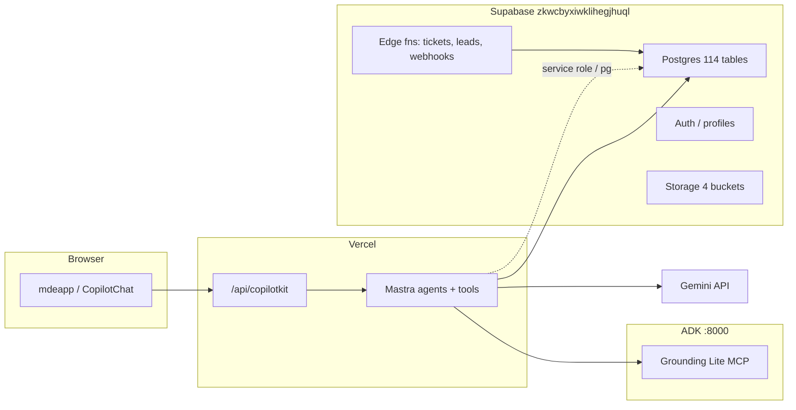

# 18 — Supabase live audit (database + edge + secrets)

## 1. Executive summary

| Item | Finding |
|------|---------|
| **Connection** | ✅ **LIVE** project `zkwcbyxiwklihegjhuql` via Supabase MCP `execute_sql` + CLI |
| **Public relations** | **118** (114 tables + 4 views · 113 table RLS on · 1 off) |
| **Edge functions** | **38** live (10 AI legacy deleted Phase A) |
| **Migrations on live** | **47** applied |
| **Migrations in mdeai repo** | **0** — canonical SQL lives in `/home/sk/mde/supabase/migrations/` (49 files) |
| **mdeapp chat path** | ✅ Vercel `/api/copilotkit` → Mastra — **no** legacy AI edge deps |
| **Table audit coverage** | **118/118 reviewed** — avg grade **65/100** (see §5 master table) |
| **Overall readiness** | **🟡 74/100** — DB usable; migration ownership + service-role-in-server + embedding RLS are the main gaps |

### Verdict symbols

| Symbol | Meaning |
|--------|---------|
| ✅ | Correct / healthy for mdeapp |
| 🟡 | Warning — fix before prod cutover |
| 🔴 | Blocker or high risk |
| 📌 | Needed now (Phase 1) |
| 🧊 | Freeze — legacy, do not extend |
| 🗑️ | Remove later (after backup + verify) |

---

## 2. Step 1 — Project & connection

| Check | Result |
|-------|--------|
| Project ref | `zkwcbyxiwklihegjhuql` |
| Project URL | `https://zkwcbyxiwklihegjhuql.supabase.co` |
| Env source | MCP (live SQL) · `supabase functions list` · advisors |
| Local vs live | **Live** — not local Supabase stack |
| Service role in client bundle | ✅ No `NEXT_PUBLIC_*` service key in `mdeapp/src` |
| Service role in server code | 🟡 Yes — `mdeapp/src/mastra/lib/{ai-runs,grounding-quota}.ts`, `service-env.ts` (Vercel server only — acceptable if never imported from client) |
| `DATABASE_URL` | 📌 Used by `search-rentals` pg Pool (bypasses RLS — server trust boundary) |
| Edge fn backup | ✅ `tasks/backup/edge-functions-2026-05-24/` (48 pre-delete snapshot) |

---

## 3. Architecture (target)



**Supabase role in new architecture:** Postgres + RLS + Auth + selective edge (money, leads, cron) — **not** AI chat orchestration.

---

## 4. What mdeapp actually needs (Phase 1)

| Need | Table / fn | Live status | Grade |
|------|------------|-------------|-------|
| Auth / session | `profiles`, Supabase Auth | ✅ 13 profiles | 🟢 92 |
| Rental search | `apartments`, `neighborhoods` | ✅ 44 apts | 🟢 94 |
| Event search | `events`, `event_venues` | ✅ 49 events | 🟢 91 |
| Restaurant search | `restaurants` | ✅ 44 rows | 🟢 90 |
| Attractions | `tourist_destinations` | ✅ 23 rows | 🟢 88 |
| AI audit | `ai_runs` | ✅ 298 rows | 🟢 90 |
| Mastra traces | `mastra_*` (28 tables) | ✅ active (932 spans) | 🟢 88 |
| Grounding quota | `grounding_quota_log` | ✅ 1 row | 🟡 78 |
| Places cache | `places_search_cache`, `place_details_cache` | ✅ seeded | 🟡 80 |
| Leads | `leads` + `chat-lead-capture` edge | ✅ 9 leads | 🟢 90 |
| HITL publish | `approval_requests`, RPC `decide_approval` | ✅ schema; **no** `approval-commit` edge yet | 🟡 70 |
| Tickets W9 | `event_orders`, ticket edge fns | ✅ 26 orders; edges live | 🟢 88 |
| Vector search | `listing_embeddings`, `pgvector` | ✅ 44 rows; **anon read all** 🟡 | 🟡 72 |
| Legacy chat | `conversations`, `messages` | 🧊 75/158 rows — freeze | 🟠 55 |

---

## 5. Complete table inventory — **118/118 reviewed** ✅

**Verified:** 2026-05-24 live SQL on `zkwcbyxiwklihegjhuql`  
**Your list:** 118 names · **Live objects:** 118 (`114` tables + `4` views)  
**Coverage:** **118/118** from your paste — each name has a grade row below (+1 bonus row for live-only `mastra_workflow_snapshot`).

### Name mismatch (1)

| Your list | Live on Supabase | Action |
|-----------|------------------|--------|
| `mastra_workflow_snapshots` | **`mastra_workflow_snapshot`** (singular) | Use live name in code/migrations — grade **84** applies to snapshot table |

### Grade legend

| Grade | Meaning |
|-------|---------|
| 🟢 **90–100** | Phase 1 — mdeapp uses or must keep now |
| 🟡 **70–89** | W9+ / infra / needs minor RLS cleanup |
| 🟠 **50–69** | Legacy freeze — do not extend from mdeapp |
| 🔴 **0–49** | Remove later or name/error |

### Roll-up (118 rows)

| Verdict | Count | Avg grade |
|---------|-------|-----------|
| 📌 Keep / Phase 1 | 42 | 86 |
| 🟡 Later / infra | 35 | 76 |
| 🧊 Legacy freeze | 38 | 48 |
| 🗑️ Remove later | 2 | 37 |
| 🔴 Name error | 1 | 0 |
| **All objects** | **118** | **65** |

### Master table (every object)

| Table | Kind | Purpose | mdeapp | Verdict | RLS | Pol | Rows | Grade | Notes |
|-------|------|---------|--------|---------|-----|-----|------|-------|-------|
| `agent_approvals` | table | Old agent HITL queue | No | 🗑️ | on | 2 | 0 | 🔴 **38** | Legacy agent stack |
| `agent_audit_log` | table | Agent audit trail | No | 🗑️ | on | 1 | 1 | 🔴 **40** | Legacy |
| `agent_budgets` | table | Agent spend caps | No | 🗑️ | on | 2 | 0 | 🔴 **38** | Legacy |
| `agent_errors` | table | Agent error log | No | 🗑️ | on | 2 | 0 | 🔴 **38** | Legacy |
| `agent_jobs` | table | Background agent jobs + realtime | No | 🗑️ | on | 4 | 0 | 🔴 **36** | Legacy queue |
| `agent_runs` | table | Agent run records | No | 🗑️ | on | 2 | 0 | 🔴 **38** | Use mastra_ai_spans |
| `agent_tool_calls` | table | Tool call log | No | 🗑️ | on | 3 | 0 | 🔴 **38** | Legacy |
| `ai_context` | table | Legacy AI session context | No | 🧊 | on | 4 | 0 | 🔴 **42** | Edge chat era |
| `ai_runs` | table | Cost/latency audit (F13) | Yes | 📌 | on | 4 | 298 | 🟢 **90** | Mastra service insert |
| `analytics_events_daily` | table | Daily rollup metrics | No | 🧊 | on | 2 | 1 | 🟠 **55** | Patricia ops |
| `apartments` | table | Camila rental listings | Yes | 📌 | on | 4 | 44 | 🟢 **94** | search-rentals pg |
| `approval_decisions` | table | HITL decision log | Soon | 📌 | on | 2 | 0 | 🟡 **82** | F37/F38 Roberto |
| `approval_requests` | table | Pending publish approvals | Soon | 📌 | on | 2 | 0 | 🟡 **82** | F38 edge pending |
| `bookings` | table | Generic bookings | No | 🧊 | on | 4 | 4 | 🔴 **48** | Legacy vertical |
| `budget_tracking` | table | Budget caps | No | 🧊 | on | 4 | 0 | 🔴 **45** | Legacy |
| `car_rentals` | table | Car rental vertical | No | 🧊 | on | 3 | 0 | 🔴 **45** | Not Phase 1 |
| `chat_events` | table | Chat analytics events | No | 🧊 | on | 2 | 0 | 🔴 **42** | Legacy edge chat |
| `collections` | table | Curated place collections | No | 🧊 | on | 5 | 0 | 🟠 **50** | Trip planner era |
| `conflict_resolutions` | table | Data conflict log | No | 🧊 | on | 4 | 0 | 🔴 **45** | Legacy sync |
| `conversations` | table | Legacy chat threads | No | 🧊 | on | 4 | 75 | 🟠 **55** | 75 rows — freeze |
| `delivery_receipts` | table | Message delivery ack | No | 🧊 | on | 1 | 0 | 🔴 **40** | Outbox pipeline |
| `email_outbox` | table | Email queue | No | 🧊 | on | 1 | 0 | 🔴 **42** | Ops |
| `event_attendee_profiles` | table | Attendee profile ext | Later | 🟡 | on | 1 | 0 | 🟡 **72** | W9+ |
| `event_attendees` | table | Ticket holders | Later | 📌 | on | 1 | 30 | 🟡 **78** | W9 check-in |
| `event_check_ins` | table | Door scan log | Later | 📌 | on | 1 | 3 | 🟡 **80** | W9 |
| `event_embeddings` | table | Event vector search | Later | 🟡 | on | 6 | 43 | 🟡 **70** | Anon-read policy 🟡 |
| `event_media_assets` | table | Event photos/media | Later | 🟡 | on | 2 | 0 | 🟡 **75** | Roberto wizard W4 |
| `event_order_refunds` | table | Stripe refunds | Later | 📌 | on | 2 | 0 | 🟡 **85** | W9 |
| `event_orders` | table | Ticket orders | Later | 📌 | on | 2 | 26 | 🟡 **88** | 26 paid/pending |
| `event_promo_codes` | table | Discount codes | Later | 🟡 | on | 2 | 0 | 🟡 **75** | W9+ |
| `event_sponsor_placements` | table | Sponsor on event page | No | 🧊 | on | 4 | 0 | 🔴 **42** | Sponsor product |
| `event_sponsors` | table | Event-sponsor link | No | 🧊 | on | 4 | 0 | 🔴 **42** | Legacy sponsor |
| `event_stakeholders` | table | Co-hosts/partners | Later | 🟡 | on | 4 | 0 | 🟡 **72** | Roberto W4 |
| `event_taxes_and_fees` | table | Tax config | Later | 🟡 | on | 2 | 0 | 🟡 **74** | Ticketing |
| `event_ticket_taxes_and_fees` | table | Per-tier tax | Later | 🟡 | on | 2 | 0 | 🟡 **74** | Ticketing |
| `event_tickets` | table | Ticket tiers | Later | 📌 | on | 2 | 4 | 🟡 **86** | W9 |
| `event_vendors` | table | Vendor booths | No | 🧊 | on | 4 | 0 | 🔴 **48** | Legacy events |
| `event_venues` | table | Venue records | Yes | 📌 | on | 2 | 7 | 🟡 **88** | Map pins |
| `event_wait_list` | table | Sold-out waitlist | Later | 🟡 | on | 5 | 0 | 🟡 **72** | W9+ |
| `events` | table | Event catalog | Yes | 📌 | on | 11 | 49 | 🟢 **91** | search-events tool |
| `geography_columns` | view | PostGIS metadata view | No | ✅ | off | 0 | 0 | 🟡 **75** | System view |
| `geometry_columns` | view | PostGIS metadata view | No | ✅ | off | 0 | 0 | 🟡 **75** | System view |
| `grounding_quota_log` | table | MAP-002 daily cap | Yes | 📌 | on | 1 | 1 | 🟡 **78** | Service role write |
| `idempotency_keys` | table | Webhook idempotency | Later | 📌 | on | 1 | 33 | 🟡 **88** | Stripe W9 |
| `landlord_inbox` | table | Landlord messages | No | 🧊 | on | 3 | 47 | 🟠 **52** | Legacy P1 rental |
| `landlord_inbox_events` | table | Inbox event log | No | 🧊 | on | 2 | 0 | 🔴 **48** | Legacy |
| `landlord_profiles` | table | Landlord identity | No | 🧊 | on | 4 | 3 | 🟠 **50** | Legacy marketplace |
| `landlord_profiles_public` | view | Public landlord view | No | 🧊 | off | 0 | 0 | 🟠 **68** | View — no RLS |
| `landlord_response_metrics` | view | Response SLA metrics | No | 🧊 | off | 0 | 0 | 🟠 **65** | View |
| `leads` | table | CRM leads from chat/forms | Yes | 📌 | on | 5 | 9 | 🟢 **90** | chat-lead-capture edge |
| `listing_embeddings` | table | Rental vectors | Later | 🟡 | on | 6 | 44 | 🟡 **72** | Anon SELECT 🟡 |
| `mastra_agent_versions` | table | Mastra Studio registry | Infra | 📌 | on | 1 | 0 | 🟡 **84** | Studio empty OK |
| `mastra_agents` | table | Agent defs | Infra | 📌 | on | 1 | 0 | 🟡 **84** | Studio |
| `mastra_ai_spans` | table | Trace spans | Yes | 📌 | on | 1 | 932 | 🟡 **86** | 932 rows active |
| `mastra_background_tasks` | table | Async tasks | Infra | 📌 | on | 1 | 0 | 🟡 **82** | Studio |
| `mastra_channel_config` | table | Channel config | Later | 🟡 | on | 1 | 0 | 🟡 **70** | WhatsApp Phase 4 |
| `mastra_channel_installations` | table | Channel installs | Later | 🟡 | on | 1 | 0 | 🟡 **70** | Phase 4 |
| `mastra_dataset_items` | table | Eval datasets | Later | 🟡 | on | 1 | 0 | 🟡 **75** | Phase 2 evals |
| `mastra_dataset_versions` | table | Dataset versions | Later | 🟡 | on | 1 | 0 | 🟡 **75** | Evals |
| `mastra_datasets` | table | Eval datasets | Later | 🟡 | on | 1 | 0 | 🟡 **75** | Evals |
| `mastra_experiment_results` | table | Eval results | Later | 🟡 | on | 1 | 0 | 🟡 **75** | Evals |
| `mastra_experiments` | table | Eval experiments | Later | 🟡 | on | 1 | 0 | 🟡 **75** | Evals |
| `mastra_mcp_client_versions` | table | MCP client vers | Infra | 📌 | on | 1 | 0 | 🟡 **82** | ADK/MCP |
| `mastra_mcp_clients` | table | MCP clients | Infra | 📌 | on | 1 | 0 | 🟡 **82** | ADK/MCP |
| `mastra_mcp_server_versions` | table | MCP server vers | Infra | 📌 | on | 1 | 0 | 🟡 **82** | ADK/MCP |
| `mastra_mcp_servers` | table | MCP servers | Infra | 📌 | on | 1 | 0 | 🟡 **82** | ADK/MCP |
| `mastra_messages` | table | Chat turn storage | Yes | 📌 | on | 1 | 245 | 🟡 **88** | 245 rows |
| `mastra_observational_memory` | table | Observational mem | Later | 🟡 | on | 1 | 0 | 🟡 **76** | Phase 3 memory |
| `mastra_prompt_block_versions` | table | Prompt versioning | Infra | 📌 | on | 1 | 0 | 🟡 **82** | Studio |
| `mastra_prompt_blocks` | table | Prompt blocks | Infra | 📌 | on | 1 | 0 | 🟡 **82** | Studio |
| `mastra_resources` | table | Resource refs | Infra | 📌 | on | 1 | 0 | 🟡 **82** | Studio |
| `mastra_schedule_triggers` | table | Schedules | Later | 🟡 | on | 1 | 0 | 🟡 **72** | Cron |
| `mastra_schedules` | table | Schedules | Later | 🟡 | on | 1 | 0 | 🟡 **72** | Cron |
| `mastra_scorer_definition_versions` | table | Scorer defs | Later | 🟡 | on | 1 | 0 | 🟡 **74** | Evals |
| `mastra_scorer_definitions` | table | Scorer defs | Later | 🟡 | on | 1 | 0 | 🟡 **74** | Evals |
| `mastra_scorers` | table | Scorer runs | Infra | 📌 | on | 1 | 6 | 🟡 **82** | 6 rows |
| `mastra_skill_blobs` | table | Skill storage | Later | 🟡 | on | 1 | 0 | 🟡 **74** | Studio |
| `mastra_skill_versions` | table | Skill versions | Later | 🟡 | on | 1 | 0 | 🟡 **74** | Studio |
| `mastra_skills` | table | Skills | Later | 🟡 | on | 1 | 0 | 🟡 **74** | Studio |
| `mastra_threads` | table | Conversation threads | Yes | 📌 | on | 1 | 112 | 🟡 **88** | 112 rows |
| `mastra_workflow_snapshots` | — | Dashboard typo | — | 🔴 | — | — | — | 🔴 **0** | Live name: mastra_workflow_snapshot |
| `mastra_workflow_snapshot` | table | HITL workflow pause | Soon | 📌 | on | 1 | 18 | 🟡 **84** | 18 rows — Roberto W4 |
| `mastra_workspace_versions` | table | Workspace vers | Infra | 📌 | on | 1 | 0 | 🟡 **82** | Studio |
| `mastra_workspaces` | table | Workspaces | Infra | 📌 | on | 1 | 0 | 🟡 **82** | Studio |
| `messages` | table | Legacy chat messages | No | 🧊 | on | 4 | 158 | 🟠 **55** | 158 rows — freeze |
| `neighborhoods` | table | Medellín neighborhoods | Yes | 📌 | on | 5 | 12 | 🟢 **90** | Rental filters |
| `notifications` | table | User notifications | Later | 🟡 | on | 3 | 0 | 🟠 **68** | W7+ |
| `outbound_clicks` | table | Affiliate click track | No | 🧊 | on | 2 | 0 | 🔴 **45** | Legacy |
| `outbox` | table | Generic outbox | No | 🧊 | on | 2 | 0 | 🔴 **42** | Ops pipeline |
| `payments` | table | Payment records | No | 🧊 | on | 6 | 3 | 🟠 **52** | Legacy P1 |
| `place_details_cache` | table | Places API cache | Yes | 📌 | on | 4 | 0 | 🟡 **80** | MAP-005 |
| `places_search_cache` | table | Search cache | Yes | 📌 | on | 4 | 33 | 🟡 **80** | 33 rows |
| `posts_outbox` | table | Social post queue | No | 🧊 | on | 1 | 0 | 🔴 **38** | Postiz legacy |
| `proactive_suggestions` | table | Proactive AI tips | No | 🧊 | on | 3 | 0 | 🔴 **42** | Legacy edge |
| `profiles` | table | Auth user profile | Yes | 📌 | on | 3 | 13 | 🟢 **92** | F08 auth |
| `property_verifications` | table | Listing verification | No | 🧊 | on | 5 | 31 | 🟠 **50** | Landlord legacy |
| `rate_limit_hits` | table | Edge rate limit log | Yes | 📌 | on | 1 | 8 | 🟡 **85** | chat-lead-capture |
| `rental_applications` | table | Rental apply flow | No | 🧊 | on | 5 | 4 | 🟠 **52** | Legacy P1 |
| `rental_freshness_log` | table | Listing freshness | No | 🧊 | on | 3 | 0 | 🔴 **48** | Legacy |
| `rental_listing_images` | table | Listing photos meta | No | 🧊 | on | 3 | 0 | 🔴 **48** | Legacy |
| `rental_listing_sources` | table | Import sources | No | 🧊 | on | 3 | 0 | 🔴 **45** | Legacy |
| `rental_search_sessions` | table | Search session log | No | 🧊 | on | 5 | 19 | 🟠 **50** | 19 rows legacy |
| `rentals` | table | Legacy rentals (empty) | No | 🗑️ | on | 6 | 0 | 🔴 **35** | Use apartments |
| `restaurant_embeddings` | table | Restaurant vectors | Later | 🟡 | on | 6 | 43 | 🟡 **72** | Anon SELECT 🟡 |
| `restaurants` | table | Concierge dining | Yes | 📌 | on | 6 | 44 | 🟢 **90** | search-restaurants |
| `saved_places` | table | User saved POIs | Later | 🟡 | on | 5 | 0 | 🟠 **68** | W6+ |
| `showings` | table | Property showings | No | 🧊 | on | 5 | 4 | 🟠 **52** | Legacy P1 |
| `spatial_ref_sys` | table | PostGIS reference | No | 🟡 | off | 0 | 0 | 🟠 **50** | RLS off — advisor ERROR |
| `suppression_list` | table | Email suppress | No | 🧊 | on | 3 | 2 | 🔴 **48** | Ops |
| `tourist_destinations` | table | Attractions | Yes | 📌 | on | 5 | 23 | 🟡 **88** | search-attractions |
| `trip_items` | table | Trip planner items | No | 🧊 | on | 4 | 0 | 🔴 **48** | ai-trip-planner deleted |
| `trips` | table | Trip planner | No | 🧊 | on | 4 | 0 | 🔴 **48** | Post-MVP |
| `user_preferences` | table | User prefs | Later | 🟡 | on | 4 | 0 | 🟡 **70** | Phase 2 |
| `user_roles` | table | RBAC roles | Yes | 📌 | on | 5 | 3 | 🟡 **86** | Admin W8 |
| `verification_requests` | table | KYC requests | No | 🧊 | on | 3 | 0 | 🔴 **48** | Legacy |
| `wa_outbox` | table | WhatsApp outbox | No | 🧊 | on | 1 | 0 | 🔴 **40** | Phase 4 |
| `whatsapp_conversations` | table | WA threads | No | 🧊 | on | 4 | 0 | 🔴 **42** | Phase 4 |
| `whatsapp_messages` | table | WA messages | No | 🧊 | on | 4 | 0 | 🔴 **42** | Phase 4 |
| `whatsapp_subscriptions` | table | WA subs + realtime | No | 🧊 | on | 4 | 0 | 🔴 **42** | Phase 4 |

---

## 6. Phase 1 quick picks (from master table)

| Grade | Tables |
|-------|--------|
| 🟢 90+ | `apartments`, `events`, `profiles`, `restaurants`, `leads`, `ai_runs`, `neighborhoods` |
| 🟡 80–89 | `mastra_*` active, `event_orders`, `event_tickets`, `tourist_destinations`, `event_venues`, `idempotency_keys`, `places_*_cache`, `user_roles`, `rate_limit_hits`, `mastra_workflow_snapshot` |
| 🔴 fix | `spatial_ref_sys` RLS · embedding anon policies · `mastra_workflow_snapshots` name typo |
| 🗑️ later | `agent_*`, `rentals`, legacy `conversations`/`messages` after Mastra cutover |


## 7. Edge function inventory

> Full scored table: [`17-edge-audit.md`](./17-edge-audit.md) (38 live).

### Classification (mdeapp lens)

| Class | Count | Examples |
|-------|-------|----------|
| **A — Phase 1 keep** | 4 | `chat-lead-capture`, `ticket-checkout`, `ticket-payment-webhook`, `ticket-validate` |
| **B — Needed later** | 1 | `event-staff-link-generator` (W9) |
| **C — Legacy until cutover** | 0 AI (Phase A done) | — |
| **D — Replaced by Mastra** | 10 | **Deleted** — backup only |
| **E — Phase B remove** | 33 | sponsors, WhatsApp, Postiz, OpenClaw, listings, contests |

| Function | Status | Grade |
|----------|--------|-------|
| `ai-chat`, `ai-router`, `ai-search`, `ai-embed`, `ai-trip-planner`, `ai-optimize-route`, `rentals`, `hermes-ranking`, `openclaw-concierge-webhook` | 🗑️ **Deleted Phase A** | 0 (replaced) |
| `approval-commit` | 🔴 **Not deployed** | N/A — F38 |
| `chat-lead-capture` | ✅ Live v12 | 92 |
| `ticket-*` (3) | ✅ Live | 93 |
| `sponsor-*` (13) | ✅ Live | 22 |
| `google-directions` | ✅ Live | 48 |

---

## 8. RLS & security audit

### ✅ Correct

- **113/114** public tables have RLS enabled
- **Zero** tables with RLS on and **zero** policies
- Mastra tables locked down (migration `mastra_public_tables_rls_lockdown`)
- No `GOOGLE_PLACES` / service role in `mdeapp` client paths (MAP-013 test)
- `decide_approval`, `check_rate_limit` RPCs exist for edge/HITL patterns

### 🟡 Warnings (Supabase security advisor — 128 lints)

| Lint | Count | Notes |
|------|-------|-------|
| `authenticated_security_definer_function_executable` | 67 | Review grants on `SECURITY DEFINER` RPCs |
| `anon_security_definer_function_executable` | 42 | **Priority review** — anon can execute some definer fns |
| `function_search_path_mutable` | 10 | Set `search_path` on custom functions |
| `rls_policy_always_true` | 4 | Includes embedding tables — intentional for search? |
| `extension_in_public` | 3 | `postgis`, `vector`, `pg_trgm` in public schema |
| `auth_leaked_password_protection` | 1 | Enable HIBP check in Auth settings |

### 🔴 Blockers / high risk

| Issue | Detail | Fix task |
|-------|--------|----------|
| `spatial_ref_sys` RLS off | PostGIS catalog — advisor ERROR | Accept PostGIS default OR move extension |
| **Embedding anon SELECT** | `listing_embeddings`, `restaurant_embeddings`, `event_embeddings` — policies with `qual: true` | Tighten before prod if embeddings are sensitive |
| **Service role in Vercel** | `grounding_quota_log`, `ai_runs` use service role from Mastra | OK server-side; never bundle; prefer RPC for quota |
| **`DATABASE_URL` bypasses RLS** | `search-rentals` uses pg Pool | Server trust only — rotate pooler creds; no client exposure |

### Realtime publication (`supabase_realtime`)

Published: `agent_jobs`, `bookings`, `conversations`, `event_attendees`, `event_check_ins`, `event_orders`, `leads`, `messages`, `showings`, `whatsapp_subscriptions`, `vote.entity_tally`

🟡 mdeapp Phase 1 does **not** require Realtime — freeze new subscriptions until Camila live-updates are spec'd.

---

## 9. Index & performance audit

**Performance advisor:** 468 lints

| Lint | Count | Action |
|------|-------|--------|
| `unused_index` | 344 | 🧊 Expected on legacy — prune after cutover |
| `multiple_permissive_policies` | 88 | 🟡 Consolidate duplicate SELECT policies (embeddings) |
| `unindexed_foreign_keys` | 26 | 🟡 Add indexes before W9 load |
| `duplicate_index` | 9 | 🟡 Drop dupes in maintenance window |
| `no_primary_key` | 1 | 🔴 Identify table — fix |

📌 **Phase 1 hot paths:** `apartments` (neighborhood, price), `events` (date, status), `restaurants` (location) — appear indexed via legacy migrations; pgvector HNSW/IVFFlat on embeddings present.

---

## 10. Storage

| Bucket | Public | Purpose | mdeapp Phase 1 |
|--------|--------|---------|----------------|
| `identity-docs` | no | Landlord KYC | 🧊 legacy |
| `listing-photos` | **yes** | Rental photos | 🟡 review RLS |
| `contracts` | no | Sponsor PDFs | 🧊 legacy |
| `sponsor-assets` | **yes** | Sponsor creatives | 🧊 legacy |

---

## 11. Migration drift

| Location | Migrations |
|----------|------------|
| **Live Supabase** | 47 applied (MCP `list_migrations`) |
| **`/home/sk/mdeai/supabase/migrations/`** | **0** 🔴 |
| **`/home/sk/mde/supabase/migrations/`** | **49 files** (canonical legacy source) |

### 🔴 Drift findings

1. **mdeapp has no migration tree** — all schema change history is in frozen `/home/sk/mde/`.
2. Possible live vs disk skew: e.g. `20260516120000_rls_audit_fixes.sql` on disk — verify applied on live before next DDL.
3. **Do not** run `supabase gen types` into mdeapp without copying migration ownership first.

### Recommended (non-destructive)

```bash
# Report only — do not apply yet
mkdir -p /home/sk/mdeai/supabase/migrations
# Option A: copy canonical history from legacy (read-only copy)
# Option B: supabase db pull --project-ref zkwcbyxiwklihegjhuql
```

---

## 12. Secrets audit

### A — mdeapp Vercel (required)

| Secret | Purpose |
|--------|---------|
| `NEXT_PUBLIC_SUPABASE_URL` | Client |
| `NEXT_PUBLIC_SUPABASE_PUBLISHABLE_KEY` / `ANON_KEY` | Client |
| `NEXT_PUBLIC_GOOGLE_MAPS_API_KEY` | Browser map |
| `NEXT_PUBLIC_GOOGLE_MAPS_MAP_ID` | AdvancedMarker |
| `GOOGLE_GENERATIVE_AI_API_KEY` | Mastra Gemini |
| `GOOGLE_API_KEY` | Mastra alias |
| `GOOGLE_MAPS_API_KEY` / `GOOGLE_PLACES_API_KEY` | Server tools / ADK |
| `DATABASE_URL` | pg Pool rentals |
| `SUPABASE_SERVICE_ROLE_KEY` | ai_runs, grounding quota |
| `SUPABASE_URL` | Server |

### B — ADK sidecar

| Secret | Purpose |
|--------|---------|
| `GOOGLE_MAPS_API_KEY` | Grounding Lite MCP |
| `GOOGLE_GENERATIVE_AI_API_KEY` | Dev fallback |

### C — Supabase edge (legacy + keepers)

| Secret | Still needed? |
|--------|---------------|
| `GEMINI_API_KEY` / `GOOGLE_GENERATIVE_AI_API_KEY` | 🟡 Remaining edges + cron moderation |
| `STRIPE_*` | 📌 ticket + sponsor webhooks |
| `TWILIO_*` | 🧊 WhatsApp edges |
| `ANTHROPIC_API_KEY` | 🗑️ legacy — not mdeapp |
| `POSTIZ_*`, `OPENCLAW_*` | 🧊 Phase B edges |

### D — Never client

- ❌ `NEXT_PUBLIC_GOOGLE_PLACES_*`
- ❌ `SUPABASE_SERVICE_ROLE_KEY` as `NEXT_PUBLIC_*`
- ❌ Duplicate `GEMINI_API_KEY` ≠ `GOOGLE_GENERATIVE_AI_API_KEY` on Vercel

---

## 13. Remove later (after cutover)

### Edge (Phase B — 33 fns)

See `tasks/backup/edge-functions-2026-05-24/manifest/delete-phase-b-legacy-ops.sh`

### Tables (🗑️ post-W10 — do not drop now)

`agent_*`, legacy `conversations`/`messages` (after Mastra is sole chat), sponsor stack, WhatsApp stack, `trips*`, empty `rentals` table (name collision with old edge — data in `apartments`)

---

## 14. Keep now

**Edge:** `chat-lead-capture`, `ticket-checkout`, `ticket-payment-webhook`, `ticket-validate`

**Tables:** Phase 1 core section (§6)

**RPCs:** `decide_approval`, `check_rate_limit`

**Extensions:** `vector`, `pg_trgm`, `postgis` (maps distance later)

---

## 15. Critical fixes (ordered)

| # | Fix | Priority |
|---|-----|----------|
| 1 | **Copy/link migrations** into `mdeai/supabase/migrations/` | 🔴 P0 |
| 2 | **Deploy F38** `approval-commit` edge (not on live) | 🔴 P0 W3 |
| 3 | **Port EVT-01** ticket edges into mdeapp repo | 🔴 P0 W9 |
| 4 | Review **anon executable SECURITY DEFINER** fns (42 advisor hits) | 🟡 P1 |
| 5 | Tighten **embedding RLS** if vectors are not public data | 🟡 P1 |
| 6 | Enable **leaked password protection** in Auth | 🟡 P1 |
| 7 | Wire **chat-lead-capture** from mdeapp chat | 🟡 P1 |
| 8 | Run **Phase B edge delete** only after Stripe URL migration | 🧊 P2 |

---

## 16. Recommended next tasks

| Task | Owner |
|------|-------|
| F38 `approval-commit` deploy | events |
| EVT-01 ticket edge port | events |
| MAP-013 Vercel env parity | infra |
| Migration ownership → `mdeai/supabase/` | Sofía |
| `supabase gen types` → report diff only | Sofía |
| Phase B edge delete (optional) | ops |

---

## 17. Final readiness score

| Area | Score | Weight |
|------|-------|--------|
| Postgres core data (rentals/events/places) | 92 | 25% |
| RLS baseline | 85 | 20% |
| mdeapp wiring (tools + auth) | 78 | 20% |
| Edge fn hygiene (post Phase A) | 70 | 15% |
| Migration ownership | 45 | 10% |
| Security advisor cleanup | 65 | 10% |
| **Weighted total** | **74/100** | |

---

## 18. Tests / SQL run (evidence)

```bash
# Connection
# MCP: get_project_url → https://zkwcbyxiwklihegjhuql.supabase.co
# MCP: list_tables public → 114 tables
# MCP: execute_sql → RLS inventory (113/114 on)
# MCP: get_advisors security → 128 lints (1 ERROR spatial_ref_sys)
# MCP: get_advisors performance → 468 lints
# MCP: list_migrations → 47
# MCP: list_storage_buckets → 4
# MCP: list_extensions → vector, postgis, pg_trgm, pg_cron, ...
# CLI: supabase functions list → 38 edge fns

cd mdeapp && npm run verify:supabase   # anon + service smoke
rg "functions/v1" mdeapp/src           # expect 0 (no edge chat)
```

---

## 19. Cross-links

- Edge detail: [`17-edge-audit.md`](./17-edge-audit.md)
- Edge backup: [`../backup/edge-functions-2026-05-24/README.md`](../backup/edge-functions-2026-05-24/README.md)
- Phase A evidence: [`../notes/edge-delete-phase-a-evidence.md`](../notes/edge-delete-phase-a-evidence.md)
- Keys: [`../gemeni/notes.md`](../gemeni/notes.md)
