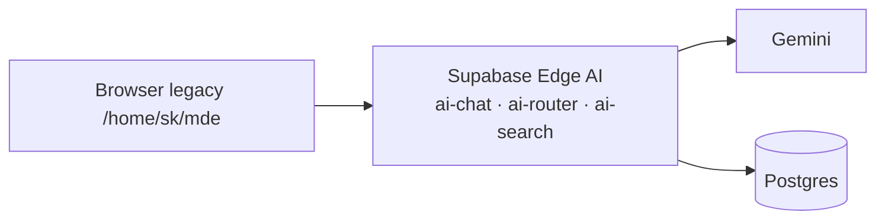
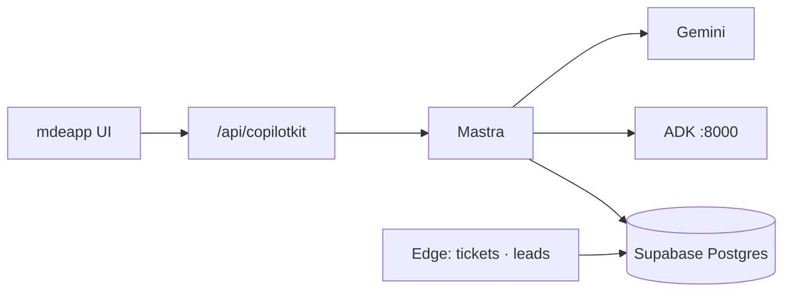

# 19 — Product schema roadmap audit

Forensic alignment of **PRD + MVP + live Supabase** against the locked architecture:

```text
Browser → /api/copilotkit → Mastra → Gemini + ADK :8000 → Supabase Postgres direct
```

**Rule enforced:** no new AI chat edge functions. Edge = webhooks, payments, cron, leads, approvals, optional Places proxy/cache.

---

## 1. Executive summary

| Dimension | Score | Verdict |
|-----------|------:|---------|
| **Plan ↔ schema alignment** | **82/100** | PRD domains map cleanly to existing tables |
| **MVP schema readiness** | **78/100** | Core inventory exists; wiring + migration ownership gaps |
| **New mdeapp code ↔ DB** | **72/100** | Tools hit right tables; host event + tickets not wired |
| **RLS / security** | **68/100** | All public tables RLS on except PostGIS; embedding anon read; 42+ DEFINER warnings |
| **Edge function hygiene** | **65/100** | Phase A done; 38 live, only 4–5 needed for MVP |
| **Audit logging clarity** | **75/100** | `ai_runs` + Mastra tables active; `agent_*` legacy empty |
| **Overall** | **72/100** | **Ship MVP on existing schema** — do not redesign DB first |

### Headline findings

1. **MVP needs ~35 public tables + 28 `mastra_*` + cache/quota** — not a greenfield schema.
2. **`apartments` is canonical** for rentals (`44` rows, `17` indexes). **`rentals` is empty duplicate** — remove after cutover.
3. **Contests live in `vote.*` (10 tables)** — not in the public paste; **Phase 3 only** per `mvp.md`; edge `vote-cast` exists but frozen.
4. **Events/tickets schema is W9-ready** — `event_orders` has `26` rows, `11` indexes; port 3 ticket edges + deploy `approval-commit`.
5. **Restaurants + tourism sufficient for map cards** — all have `latitude`, `longitude`, `maps_url`, `primary_image_url`.
6. **No mdeapp calls to `functions/v1`** — confirmed `rg` zero matches; chat is Mastra-only ✅
7. **Migration drift:** live `47` migrations; **`mdeai/supabase/migrations/` = 0** — canonical SQL still in `/home/sk/mde/supabase/migrations/`.
8. **Missing for CopilotKit cards:** `platform/contracts` pin types wired in code; still need host event generative UI + lead CTA → edge.
9. **Missing for ADK:** sidecar production deploy; MAP-004 `places-proxy` (Vercel route acceptable vs edge).

### Live verification (2026-05-24)

| Check | Result |
|-------|--------|
| Public tables | **114** |
| Public views | **4** |
| `vote` schema tables | **10** |
| RLS on public tables | **113/114** (`spatial_ref_sys` off — advisor ERROR) |
| Edge functions live | **38** (10 AI deleted Phase A) |
| Migrations applied | **47** |
| mdeapp `supabase.functions.invoke` | **0** |
| Mastra active rows | `mastra_ai_spans` 932 · `mastra_messages` 245 · `ai_runs` 298 |

---

## 2. Current architecture (OLD — retired for chat)



**Status:** Phase A deleted 10 AI edge slugs. **`conversations` / `messages` / `agent_*` are tombstones** — freeze writes from mdeapp.

---

## 3. Target architecture (NEW — authoritative)

See full diagram in [`tasks/data/data-plan.md` §1](../data/data-plan.md).



| Layer | Owns | Must not own |
|-------|------|--------------|
| CopilotKit | Cards, sidebar, HITL UI, map column | Service role, inventing geo |
| Mastra | Agents, tools, workflows, quota, cache writes | Browser Places calls |
| ADK sidecar | Grounding Lite JSON | Supabase, Stripe, sessions |
| Supabase | Inventory, RLS, money edges | LLM orchestration |

---

## 4. Product domain map

| Domain | Persona | MVP surfaces | Primary tables | Mastra agent/tool | Edge fn (if any) |
|--------|---------|--------------|----------------|-------------------|------------------|
| **Rentals** | Camila | `/chat`, `/rentals` | `apartments`, `neighborhoods`, `leads` | `conciergeAgent`, `search-rentals`, `rental-search-workflow` | `chat-lead-capture` |
| **Events** | Roberto, Andrés | `/host/event/new`, `/events` | `events`, `event_venues`, `event_tickets`, `event_orders`, `approval_*` | `eventAgent`, `search-events`, `hostEventAgent` (F33+) | `ticket-*`, `approval-commit` (missing) |
| **Restaurants** | Tourist | `/chat` | `restaurants` | `search-restaurants` | — |
| **Tourism** | Tourist | `/chat` | `tourist_destinations` | `search-attractions` | — |
| **Maps/grounding** | All | map column | `places_*_cache`, `grounding_quota_log` | `search-grounded-places` | optional `places-proxy` / Vercel |
| **AI audit** | Patricia | `/admin` | `ai_runs`, `mastra_*` | `logAgentRunForTurn` → `ai_runs` | — |
| **Contests** | — | **Out of MVP** | `vote.*` (10 tables) | deferred | `vote-cast` freeze |
| **Sponsors** | — | Phase 3 | `event_sponsor_*` + sponsor edges | — | Phase B delete |
| **WhatsApp** | — | Phase 4 | `whatsapp_*`, `wa_outbox` | — | `whatsapp-webhook` freeze |

---

## 5. Current schema inventory

| Bucket | Count | Avg grade | Action |
|--------|------:|----------:|--------|
| MVP-required public | **~35** | 86 | Keep + wire |
| Post-MVP public | **~25** | 76 | Keep, implement later |
| Legacy freeze public | **~45** | 48 | No mdeapp writes |
| Remove later public | **~9** | 37 | After backup + cutover |
| `vote.*` contests | **10** | 70 | Freeze until Phase 3 LOI |
| Mastra infra (28) | **28** | 82 | Keep — Studio + traces |

Detailed row-level live audit: [`18-supabase-audit.md`](./18-supabase-audit.md) §5 (118/118 reviewed).

---

## 6. Required MVP schema

Minimum tables **must exist and be wired** before MVP exit (`mvp.md` O1–O5):

### 6.1 Identity + auth

- `profiles`, `user_roles`

### 6.2 Rentals + leads (O3)

- `apartments`, `neighborhoods`, `leads`, `rate_limit_hits`
- Optional MVP-adjacent (schema OK, code later): `showings`, `rental_applications`

### 6.3 Events + tickets (O1, O2)

- `events`, `event_venues`, `event_tickets`, `event_orders`, `idempotency_keys`
- HITL: `approval_requests`, `approval_decisions`, `mastra_workflow_snapshot`

### 6.4 Concierge inventory (O4)

- `restaurants`, `tourist_destinations`

### 6.5 Maps + grounding (O4, O5)

- `places_search_cache`, `place_details_cache`, `grounding_quota_log`

### 6.6 AI runtime (required infra)

- `mastra_threads`, `mastra_messages`, `mastra_ai_spans`, `mastra_workflow_snapshot`
- `mastra_mcp_*` (ADK bridge metadata)
- `ai_runs` (Patricia cost audit — F13)

### 6.7 Explicitly NOT MVP schema

- `vote.*`, sponsor tables, `whatsapp_*`, `agent_*`, `conversations`/`messages`, `trips*`, `rentals` (duplicate)

---

## 7. Required post-MVP schema

| Area | Tables | When |
|------|--------|------|
| Rental ops | `showings`, `rental_applications`, `landlord_inbox*` | After first lead loop |
| Event ops | `event_attendees`, `event_check_ins`, `event_wait_list`, `event_media_assets` | W9+ door scanner |
| User product | `saved_places`, `user_preferences`, `notifications` | W6–W8 |
| Vector search | `listing_embeddings`, `restaurant_embeddings`, `event_embeddings` | Phase 3 — tighten RLS first |
| Contests | `vote.contests`, `vote.votes`, … | Phase 3 + legal |
| Sponsors | `event_sponsor_*` + 12 sponsor edges | Phase 3 marketplace |
| WhatsApp | `whatsapp_*`, `wa_outbox` | Phase 4 VPS |
| Evals | `mastra_datasets*`, `mastra_experiments*` | Phase 2 eval harness |

---

## 8. Table-by-table classification

| Domain | Table | Purpose | MVP? | Used by new mdeapp? | Keep/Freeze/Remove later | RLS status | Index status | Risk | Grade /100 | Fix |
|---|---|---|---|---|---|---|---|---|---:|---|
| Auth | `profiles` | User profile row | Yes | Yes | Keep | on·3 | 🟢 17 | Low | 92 | — |
| Auth | `user_roles` | RBAC roles | Yes | Yes | Keep | on·5 | 🟢 | Low | 86 | Wire admin W8 |
| Auth | `user_preferences` | User prefs | No | Later | Keep | on·4 | 🟡 | Low | 70 | Phase 2 |
| Rentals | `apartments` | Camila listing inventory | Yes | Yes | Keep | on·4 | 🟢 17 | Low | 94 | Canonical — not `rentals` |
| Rentals | `neighborhoods` | Hood filters | Yes | Yes | Keep | on·5 | 🟢 | Low | 90 | — |
| Leads/CRM | `leads` | Chat/form leads | Yes | Yes | Keep | on·5 | 🟢 14 | Low | 90 | Wire chat-lead-capture |
| Leads/CRM | `rate_limit_hits` | Edge rate limit log | Yes | Yes | Keep | on·1 | 🟢 | Low | 85 | — |
| Rentals | `showings` | Property showings | No | Legacy | Freeze | on·5 | 🟡 | Med | 52 | Post-MVP rental ops |
| Rentals | `rental_applications` | Apply flow | No | Legacy | Freeze | on·5 | 🟡 | Med | 52 | Post-MVP |
| Rentals | `landlord_inbox` | Landlord messages | No | No | Freeze | on·3 | 🟡 | Med | 52 | Legacy marketplace |
| Rentals | `landlord_inbox_events` | Inbox events | No | No | Freeze | on·2 | 🟡 | Low | 48 | Legacy |
| Rentals | `landlord_profiles` | Landlord identity | No | No | Freeze | on·4 | 🟡 | Med | 50 | Legacy |
| Rentals | `landlord_profiles_public` | Public landlord view | No | No | Freeze | view | — | Med | 68 | View — no RLS |
| Rentals | `landlord_response_metrics` | SLA metrics view | No | No | Freeze | view | — | Low | 65 | View |
| Rentals | `property_verifications` | Listing KYC | No | No | Freeze | on·5 | 🟡 | Med | 50 | Legacy |
| Rentals | `rental_freshness_log` | Freshness audit | No | No | Freeze | on·3 | 🟡 | Low | 48 | Legacy |
| Rentals | `rental_listing_images` | Photo meta | No | No | Freeze | on·3 | 🟡 | Low | 48 | Legacy |
| Rentals | `rental_listing_sources` | Import sources | No | No | Freeze | on·3 | 🟡 | Low | 45 | Legacy |
| Rentals | `rental_search_sessions` | Search session log | No | No | Freeze | on·5 | 🟡 | Low | 50 | 19 legacy rows |
| Rentals | `rentals` | Empty duplicate table | No | No | Remove later | on·6 | 🟢 10 | High | 35 | Drop after apartments cutover |
| Rentals/AI | `listing_embeddings` | pgvector rentals | No | Later | Keep | on·6 | 🟡 4 | Med | 72 | Tighten anon SELECT |
| Rentals | `bookings` | Generic bookings | No | No | Freeze | on·4 | 🟡 | Med | 48 | Phase 5 Stripe rental |
| Payments | `payments` | Payment records | No | No | Freeze | on·6 | 🟡 | Med | 52 | Legacy P1 |
| Events | `events` | Event catalog | Yes | Yes | Keep | on·11 | 🟢 17 | Low | 91 | Roberto + Camila discovery |
| Events | `event_venues` | Venue pins | Yes | Yes | Keep | on·2 | 🟢 | Low | 88 | — |
| Events | `event_tickets` | Ticket tiers | Yes | Later | Keep | on·2 | 🟡 2 | Low | 86 | W9 — add tier indexes if hot |
| Events | `event_orders` | Stripe orders | Yes | Later | Keep | on·2 | 🟢 11 | Low | 88 | Port ticket edges to mdeapp |
| Events | `event_order_refunds` | Refunds | No | Later | Keep | on·2 | 🟡 | Low | 85 | W9+ |
| Events | `event_attendees` | Ticket holders | No | Later | Keep | on·1 | 🟡 | Low | 78 | W9 check-in |
| Events | `event_check_ins` | Door scans | No | Later | Keep | on·1 | 🟡 | Low | 80 | W9 |
| Events | `event_attendee_profiles` | Attendee ext | No | Later | Keep | on·1 | 🟡 | Low | 72 | W9+ |
| Events | `event_media_assets` | Event photos | No | Later | Keep | on·2 | 🟡 | Low | 75 | W4 wizard |
| Events | `event_promo_codes` | Discount codes | No | Later | Keep | on·2 | 🟡 | Low | 75 | W9+ |
| Events | `event_stakeholders` | Co-hosts | No | Later | Keep | on·4 | 🟡 | Low | 72 | W4 |
| Events | `event_taxes_and_fees` | Tax config | No | Later | Keep | on·2 | 🟡 | Low | 74 | Ticketing |
| Events | `event_ticket_taxes_and_fees` | Per-tier tax | No | Later | Keep | on·2 | 🟡 | Low | 74 | Ticketing |
| Events | `event_wait_list` | Sold-out waitlist | No | Later | Keep | on·5 | 🟡 | Low | 72 | W9+ |
| Events | `event_vendors` | Vendor booths | No | No | Freeze | on·4 | 🟡 | Low | 48 | Post-MVP |
| Events/AI | `event_embeddings` | Event vectors | No | Later | Keep | on·6 | 🟡 4 | Med | 70 | Anon read policy |
| Sponsors | `event_sponsor_placements` | Sponsor surfaces | No | No | Freeze | on·4 | 🟡 | Low | 42 | Phase 3 |
| Sponsors | `event_sponsors` | Event-sponsor link | No | No | Freeze | on·4 | 🟡 | Low | 42 | Phase 3 |
| Approvals | `approval_requests` | HITL publish queue | Yes | Soon | Keep | on·2 | 🟡 3 | Med | 82 | Deploy approval-commit edge |
| Approvals | `approval_decisions` | HITL decision log | Yes | Soon | Keep | on·2 | 🟡 | Low | 82 | F37/F38 |
| Payments | `idempotency_keys` | Webhook idempotency | Yes | Later | Keep | on·1 | 🟢 | Low | 88 | W9 Stripe |
| Restaurants | `restaurants` | Concierge dining | Yes | Yes | Keep | on·6 | 🟢 13 | Low | 90 | search-restaurants tool |
| Restaurants/AI | `restaurant_embeddings` | Restaurant vectors | No | Later | Keep | on·6 | 🟡 4 | Med | 72 | Anon SELECT — Phase 3 |
| Tourism | `tourist_destinations` | Attractions | Yes | Yes | Keep | on·5 | 🟢 18 | Low | 88 | search-attractions tool |
| Maps | `places_search_cache` | Places search cache MAP-005 | Yes | Yes | Keep | on·4 | 🟢 4 | Low | 80 | Add places-proxy edge or Vercel route |
| Maps | `place_details_cache` | Place details cache MAP-004 | Yes | Yes | Keep | on·4 | 🟡 2 | Low | 80 | Seed on first ADK miss |
| Maps | `grounding_quota_log` | MAP-002 daily cap | Yes | Yes | Keep | on·1 | 🟡 1 | Med | 78 | Service-role write only |
| Maps | `saved_places` | User saved POIs | No | Later | Keep | on·5 | 🟡 | Low | 68 | W6+ |
| Maps | `outbound_clicks` | Affiliate clicks | No | No | Freeze | on·2 | 🟡 | Low | 45 | Legacy |
| AI audit | `ai_runs` | Cost/latency audit F13 | Yes | Yes | Keep | on·4 | 🟢 8 | Med | 90 | Service role server-only |
| AI legacy | `agent_runs` | Old agent runs | No | No | Remove later | on·2 | 🟢 5 | Low | 38 | Empty — use ai_runs + mastra_ai_spans |
| AI legacy | `agent_tool_calls` | Old tool log | No | No | Remove later | on·3 | 🟢 6 | Low | 38 | Empty |
| AI legacy | `agent_jobs` | Job queue | No | No | Remove later | on·4 | 🟡 | Low | 36 | Empty |
| AI legacy | `agent_errors` | Agent errors | No | No | Remove later | on·2 | 🟡 | Low | 38 | Empty |
| AI legacy | `agent_budgets` | Spend caps | No | No | Remove later | on·2 | 🟡 | Low | 38 | Empty |
| AI legacy | `agent_approvals` | Old HITL queue | No | No | Remove later | on·2 | 🟡 | Low | 38 | Use approval_requests |
| AI legacy | `agent_audit_log` | Agent audit | No | No | Remove later | on·1 | 🟡 | Low | 40 | 1 row only |
| AI legacy | `ai_context` | Edge chat context | No | No | Freeze | on·4 | 🟡 | Low | 42 | Legacy edge era |
| AI legacy | `chat_events` | Chat analytics | No | No | Freeze | on·2 | 🟡 | Low | 42 | Legacy |
| AI legacy | `proactive_suggestions` | Proactive tips | No | No | Freeze | on·3 | 🟡 | Low | 42 | Legacy |
| AI legacy | `conversations` | Legacy chat threads | No | No | Freeze | on·4 | 🟢 8 | Med | 55 | 75 rows — no mdeapp writes |
| AI legacy | `messages` | Legacy chat messages | No | No | Freeze | on·4 | 🟢 7 | Med | 55 | 158 rows |
| Mastra | `mastra_threads` | Session threads | Yes | Yes | Keep | on·1 | 🟡 2 | Med | 88 | Service role RLS |
| Mastra | `mastra_messages` | Turn storage | Yes | Yes | Keep | on·1 | 🟡 2 | Med | 88 | 112 threads active |
| Mastra | `mastra_ai_spans` | Trace spans | Yes | Yes | Keep | on·1 | 🟢 11 | Med | 86 | 932 spans |
| Mastra | `mastra_workflow_snapshot` | HITL workflow pause | Yes | Soon | Keep | on·1 | 🟡 | Low | 84 | 18 rows — Roberto W4 |
| Mastra | `mastra_agents` | Studio registry | Infra | Infra | Keep | on·1 | 🟡 | Low | 84 | Studio |
| Mastra | `mastra_agent_versions` | Agent versions | Infra | Infra | Keep | on·1 | 🟡 | Low | 84 | Studio |
| Mastra/ADK | `mastra_mcp_clients` | MCP clients | Yes | Yes | Keep | on·1 | 🟡 | Low | 82 | ADK sidecar |
| Mastra/ADK | `mastra_mcp_servers` | MCP servers | Yes | Yes | Keep | on·1 | 🟡 | Low | 82 | ADK sidecar |
| Mastra | `mastra_mcp_client_versions` | MCP client vers | Infra | Infra | Keep | on·1 | 🟡 | Low | 82 | — |
| Mastra | `mastra_mcp_server_versions` | MCP server vers | Infra | Infra | Keep | on·1 | 🟡 | Low | 82 | — |
| Mastra | `mastra_background_tasks` | Async tasks | Infra | Infra | Keep | on·1 | 🟡 | Low | 82 | — |
| Mastra | `mastra_resources` | Resource refs | Infra | Infra | Keep | on·1 | 🟡 | Low | 82 | — |
| Mastra | `mastra_prompt_blocks` | Prompt blocks | Infra | Infra | Keep | on·1 | 🟡 | Low | 82 | — |
| Mastra | `mastra_prompt_block_versions` | Prompt versions | Infra | Infra | Keep | on·1 | 🟡 | Low | 82 | — |
| Mastra | `mastra_scorers` | Scorer runs | Infra | Infra | Keep | on·1 | 🟡 | Low | 82 | 6 rows |
| Mastra | `mastra_scorer_definitions` | Scorer defs | No | Later | Keep | on·1 | 🟡 | Low | 74 | Phase 2 evals |
| Mastra | `mastra_scorer_definition_versions` | Scorer vers | No | Later | Keep | on·1 | 🟡 | Low | 74 | Evals |
| Mastra | `mastra_datasets` | Eval datasets | No | Later | Keep | on·1 | 🟡 | Low | 75 | Phase 2 |
| Mastra | `mastra_dataset_versions` | Dataset vers | No | Later | Keep | on·1 | 🟡 | Low | 75 | — |
| Mastra | `mastra_dataset_items` | Dataset items | No | Later | Keep | on·1 | 🟡 | Low | 75 | — |
| Mastra | `mastra_experiments` | Experiments | No | Later | Keep | on·1 | 🟡 | Low | 75 | — |
| Mastra | `mastra_experiment_results` | Eval results | No | Later | Keep | on·1 | 🟡 | Low | 75 | — |
| Mastra | `mastra_skills` | Skills storage | No | Later | Keep | on·1 | 🟡 | Low | 74 | Studio |
| Mastra | `mastra_skill_versions` | Skill versions | No | Later | Keep | on·1 | 🟡 | Low | 74 | — |
| Mastra | `mastra_skill_blobs` | Skill blobs | No | Later | Keep | on·1 | 🟡 | Low | 74 | — |
| Mastra | `mastra_workspaces` | Workspaces | Infra | Infra | Keep | on·1 | 🟡 | Low | 82 | — |
| Mastra | `mastra_workspace_versions` | Workspace vers | Infra | Infra | Keep | on·1 | 🟡 | Low | 82 | — |
| Mastra | `mastra_channel_config` | Channel config | No | Phase 4 | Keep | on·1 | 🟡 | Low | 70 | WhatsApp |
| Mastra | `mastra_channel_installations` | Channel installs | No | Phase 4 | Keep | on·1 | 🟡 | Low | 70 | WhatsApp |
| Mastra | `mastra_schedule_triggers` | Schedules | No | Later | Keep | on·1 | 🟡 | Low | 72 | Cron |
| Mastra | `mastra_schedules` | Schedules | No | Later | Keep | on·1 | 🟡 | Low | 72 | — |
| Mastra | `mastra_observational_memory` | Observational mem | No | Phase 3 | Keep | on·1 | 🟡 | Low | 76 | Memory Phase 3 |
| Mastra | `mastra_workflow_snapshots` | Dashboard typo | — | No | Remove later | — | — | High | 0 | Use mastra_workflow_snapshot |
| WhatsApp | `whatsapp_conversations` | WA threads | No | No | Freeze | on·4 | 🟡 | Low | 42 | Phase 4 |
| WhatsApp | `whatsapp_messages` | WA messages | No | No | Freeze | on·4 | 🟡 | Low | 42 | Phase 4 |
| WhatsApp | `whatsapp_subscriptions` | WA subs | No | No | Freeze | on·4 | 🟡 | Low | 42 | Phase 4 |
| WhatsApp | `wa_outbox` | WA outbox | No | No | Freeze | on·1 | 🟡 | Low | 40 | Phase 4 |
| Ops | `email_outbox` | Email queue | No | No | Freeze | on·1 | 🟡 | Low | 42 | Ops |
| Ops | `outbox` | Generic outbox | No | No | Freeze | on·2 | 🟡 | Low | 42 | Ops |
| Ops | `posts_outbox` | Postiz queue | No | No | Freeze | on·1 | 🟡 | Low | 38 | Legacy |
| Ops | `delivery_receipts` | Delivery ack | No | No | Freeze | on·1 | 🟡 | Low | 40 | — |
| Ops | `suppression_list` | Email suppress | No | No | Freeze | on·3 | 🟡 | Low | 48 | — |
| Ops | `notifications` | User notifications | No | Later | Keep | on·3 | 🟡 | Low | 68 | W7+ |
| Ops | `analytics_events_daily` | Daily metrics | No | No | Freeze | on·2 | 🟡 | Low | 55 | Patricia ops |
| Ops | `budget_tracking` | Budget caps | No | No | Freeze | on·4 | 🟡 | Low | 45 | Legacy |
| Ops | `conflict_resolutions` | Conflict log | No | No | Freeze | on·4 | 🟡 | Low | 45 | Legacy |
| Vertical | `car_rentals` | Car rentals | No | No | Freeze | on·3 | 🟡 | Low | 45 | Not Phase 1 |
| Vertical | `collections` | Curated collections | No | No | Freeze | on·5 | 🟡 | Low | 50 | Trip planner era |
| Vertical | `trips` | Trip planner | No | No | Freeze | on·4 | 🟡 | Low | 48 | Post-MVP |
| Vertical | `trip_items` | Trip items | No | No | Freeze | on·4 | 🟡 | Low | 48 | Post-MVP |
| Vertical | `verification_requests` | KYC | No | No | Freeze | on·3 | 🟡 | Low | 48 | Legacy |
| PostGIS | `spatial_ref_sys` | PostGIS reference | No | No | Keep | off·0 | n/a | High | 50 | Enable RLS or exclude from API |
| PostGIS | `geography_columns` | System view | No | No | Keep | view | — | Low | 75 | System |
| PostGIS | `geometry_columns` | System view | No | No | Keep | view | — | Low | 75 | System |

### Contests schema (`vote.*` — live, not in public paste)

| Domain | Table | Purpose | MVP? | Used by new mdeapp? | Keep/Freeze/Remove later | RLS status | Index status | Risk | Grade /100 | Fix |
|---|---|---|---|---|---|---|---|---|---:|---|
| Contests | `vote.contests` | Contest definition | No | No | Freeze | on | 🟢 | Med | 75 | Phase 3 — separate schema |
| Contests | `vote.entities` | Contestants | No | No | Freeze | on | 🟢 | Med | 72 | Phase 3 |
| Contests | `vote.votes` | Vote records | No | No | Freeze | on | 🟢 | High | 70 | Anti-fraud required |
| Contests | `vote.entity_tally` | Leaderboard | No | No | Freeze | on | 🟢 | Med | 72 | Realtime broadcast exists |
| Contests | `vote.categories` | Categories | No | No | Freeze | on | 🟡 | Low | 68 | — |
| Contests | `vote.judges` | Judges | No | No | Freeze | on | 🟡 | Low | 68 | — |
| Contests | `vote.judge_scores` | Judge scores | No | No | Freeze | on | 🟡 | Low | 68 | — |
| Contests | `vote.scoring_criteria` | Scoring rubric | No | No | Freeze | on | 🟡 | Low | 68 | — |
| Contests | `vote.fraud_signals` | Fraud signals | No | No | Freeze | on | 🟡 | Med | 70 | — |
| Contests | `vote.paid_vote_orders` | Paid votes Stripe | No | No | Freeze | on | 🟡 | Med | 68 | Phase 3 fintech |

---

## 9. Edge function classification

Full scored inventory: [`17-edge-audit.md`](./17-edge-audit.md).

| Class | Slugs | MVP? | Action |
|-------|-------|------|--------|
| **A — Keep now** | `chat-lead-capture`, `ticket-checkout`, `ticket-payment-webhook`, `ticket-validate` | Yes | Port to `mdeapp/supabase/functions/` |
| **B — W9+** | `event-staff-link-generator` | Soon | Keep until staff PWA in mdeapp |
| **C — Deploy missing** | `approval-commit` | Yes | **F38 — not on live project** |
| **D — Optional maps** | `google-directions` | No | Vercel route or MAP-011 |
| **E — Legacy forms** | `lead-from-form` | Maybe | Keep if marketing forms live |
| **F — Contests** | `vote-cast`, `contestant-social-enrich` | No | Freeze — `vote.*` schema exists |
| **G — Phase B delete (27)** | sponsor-*, whatsapp-webhook, openclaw-*, postiz-*, listing-*, ops crons | No | After backup + product retirement |

**Deleted (Phase A — do not restore for chat):** `ai-chat`, `ai-router`, `ai-search`, `ai-embed`, `ai-suggest-collections`, `ai-trip-planner`, `ai-optimize-route`, `rentals`, `hermes-ranking`, `openclaw-concierge-webhook`.

---

## 10. Agents / tools / workflows map

### 10.1 Registered in `mdeapp/src/mastra/index.ts`

| Agent | MVP role | Tools / workflows | DB tables |
|-------|----------|-------------------|-----------|
| `routerAgent` | Intent classify | `classify-intent` | working memory only |
| `conciergeAgent` | Primary `/chat` | all search tools + `search-grounded-places` | apartments, events, restaurants, tourist_destinations, grounding_quota_log |
| `rentalAgent` | Rental specialist | `search-rentals`, `rental-search-workflow` | apartments |
| `eventAgent` | Event discovery | `search-events`, `event-discovery-workflow` | events, event_venues |
| `evaluationAgent` | Rerank labels | in-workflow | none (in-memory) |
| `pingAgent` | W1 wiring test | none | mastra_* via memory |

**Not yet registered (PRD):** `hostEventAgent` — Roberto wizard F33–F38.

### 10.2 Tools → tables (verified in code)

| Tool | Data source | Connection |
|------|-------------|------------|
| `search-rentals` | `apartments` | `DATABASE_URL` pg Pool |
| `search-events` | `events` | Supabase client |
| `search-restaurants` | `restaurants` | Supabase client |
| `search-attractions` | `tourist_destinations` | Supabase client |
| `search-grounded-places` | ADK → optional cache | `grounding_quota_log` |
| Audit wrapper | `ai_runs` | service role via `recordMastraRun` |

### 10.3 Workflows

| Workflow | Purpose | MVP? |
|----------|---------|------|
| `rental-search-workflow` | Query → cards → rerank | Yes |
| `event-discovery-workflow` | NL → event cards | Yes |
| `concierge-routing-workflow` | Router dispatch | Yes |
| Roberto publish workflow | HITL suspend/resume | W4 — uses `mastra_workflow_snapshot` |

---

## 11. Automations plan

| Automation | Trigger | Owner | MVP? |
|------------|---------|-------|------|
| Lead capture | Chat CTA | `chat-lead-capture` edge | **Yes** |
| Ticket payment | Stripe webhook | `ticket-payment-webhook` | **Yes** |
| Publish commit | HITL approve | `approval-commit` edge + RPC | **Yes — missing deploy** |
| Grounding quota | Per ADK call | Mastra `grounding-quota.ts` | **Yes** |
| Lead reminder cron | pg_cron | `lead-reminder-tick` | No — Phase B |
| Outbox dispatch | cron | `outbox-dispatch` | No — legacy ops |
| Contest tally realtime | DB trigger | `vote.entity_tally` broadcast | No — Phase 3 |
| OpenClaw outreach | VPS | `openclaw-outreach` | No — Phase 4 |
| WhatsApp inbound | Twilio | `whatsapp-webhook` | No — Phase 4 |

**Rule:** Mastra proposes; edges/RPCs commit money and publish.

---

## 12. Missing schema

| Gap | Severity | Recommendation |
|-----|----------|----------------|
| `approval-commit` edge not deployed | 🔴 MVP | Port F38 from legacy; wire to `decide_approval` RPC |
| `mdeai/supabase/migrations/` empty | 🔴 Ops | Copy/link canonical migrations from `/home/sk/mde/supabase/migrations/` |
| `places-proxy` edge or Vercel route | 🟡 MAP-004 | Server-side Places with field masks |
| `hostEventAgent` + event draft tools | 🔴 MVP | No new tables — use `events` + working memory |
| `packages/types` shared Zod | 🟡 PR-1 | Contract layer for cards/pins — not a DB migration |
| Contest tables in public | ✅ N/A | Already in `vote.*` — do not duplicate |
| `apartments.maps_url` column | 🟡 UX | Add migration if Google Maps deep links needed on rental cards |

---

## 13. Duplicate / legacy schema

| Issue | Tables | Resolution |
|-------|--------|------------|
| Rental duplicate | `apartments` vs `rentals` | **Use `apartments` only**; drop `rentals` post-cutover |
| Chat duplicate | `conversations`/`messages` vs `mastra_*` | Mastra is source of truth; freeze legacy |
| Agent audit duplicate | `agent_runs`/`agent_tool_calls` vs `ai_runs`/`mastra_ai_spans` | **`ai_runs` + Mastra** — delete `agent_*` after backup |
| HITL duplicate | `agent_approvals` vs `approval_requests` | Use `approval_requests` |
| Workflow name typo | `mastra_workflow_snapshots` vs `mastra_workflow_snapshot` | Code uses **singular** (live) |
| AI context | `ai_context` | Legacy edge era — freeze |

---

## 14. RLS / index / function red flags

| Flag | Detail | Fix |
|------|--------|-----|
| 🔴 `spatial_ref_sys` RLS off | PostGIS catalog exposed | Exclude from API or enable RLS per advisor |
| 🟡 Embedding anon SELECT | `listing_embeddings`, `restaurant_embeddings`, `event_embeddings` | Replace with authenticated or service-only policy |
| 🟡 Mastra RLS = service role | All `mastra_*` policies service-only | OK for server Mastra; never expose publishable key to Studio in prod |
| 🟡 `DATABASE_URL` bypasses RLS | `search-rentals` pg Pool | Server-only trust boundary — document in ARCHITECTURE.md |
| 🟡 42+ anon EXECUTE on SECURITY DEFINER RPCs | Legacy helper functions | Audit grants; revoke anon where not needed |
| 🟡 `search_path` mutable functions | Advisor WARN bulk | Set `search_path` on custom RPCs |
| 🟢 Core inventory indexes | apartments 17 · events 17 · leads 14 | Sufficient for MVP scale |
| 🟡 `event_tickets` only 2 indexes | Low row count OK now | Add `(event_id)` if tier queries grow |

---

## 15. Migration recommendations

| # | Action | Priority |
|---|--------|----------|
| 1 | **Establish `mdeai/supabase/migrations/`** as canonical — pull 47 live migrations | P0 |
| 2 | Migration: tighten embedding RLS (remove anon SELECT) | P1 before prod |
| 3 | Migration: add `approval-commit` edge + verify `decide_approval` RPC | P0 MVP |
| 4 | Migration: optional `apartments.maps_url` if product wants Maps links on rental cards | P2 |
| 5 | Migration: drop `rentals` table **only after** grep shows zero legacy refs | P3 cutover |
| 6 | Migration: archive `agent_*` tables post-cutover | P3 |
| 7 | **Do not** add AI chat edge migrations | — |

---

## 16. Mermaid diagrams

All nine diagrams live in [`tasks/data/data-plan.md`](../data/data-plan.md):

1. Overall architecture  
2. Rentals workflow  
3. Events workflow  
4. Restaurants/tourism workflow  
5. Maps grounding workflow  
6. Payments/tickets workflow  
7. Leads/CRM workflow  
8. Agent/tool workflow  
9. Supabase schema ERD (MVP core)

---

## 17. Recommended roadmap (schema → ideal)

| Step | Work | Schema touch | Proof |
|------|------|--------------|-------|
| **1** | Migration ownership → `mdeai/supabase/` | pull 47 files | `supabase migration list` matches live |
| **2** | MAP-001–003 + ADK sidecar | none (code only) | `npm run verify:grounding` |
| **3** | Wire `chat-lead-capture` from `/chat` | `leads`, `rate_limit_hits` | INSERT lead row |
| **4** | Roberto F33–F38 + `hostEventAgent` | `events`, `approval_*`, `mastra_workflow_snapshot` | publish HITL |
| **5** | Deploy `approval-commit` | RPC only | approval row → live event |
| **6** | Port ticket edges to mdeapp | `event_orders`, `idempotency_keys` | Stripe test → paid |
| **7** | Tighten embedding RLS | 3 embedding tables | anon cannot SELECT all |
| **8** | MVP exit soak | — | O1–O5 checklist |
| **9** | Phase B edge delete script | — | 27 slugs removed |
| **10** | Post-cutover DROP `rentals`, `agent_*` | DDL | backup first |

---

## 18. Final score /100

| Category | Weight | Score |
|----------|--------|------:|
| MVP table coverage | 25% | 88 |
| mdeapp wiring vs schema | 25% | 65 |
| RLS / security | 20% | 68 |
| Edge fn hygiene | 15% | 70 |
| Migration / ops ownership | 15% | 62 |
| **Weighted overall** | 100% | **72** |

---

## 19. Final questions (answered)

### What schema is actually needed for MVP?

~35 public business tables + 28 `mastra_*` + 3 cache/quota tables. See §6.

### What schema can be frozen?

Legacy chat (`conversations`, `messages`), landlord marketplace stack, sponsor stack, WhatsApp, trips/collections, `agent_*`, empty `rentals`, and entire `vote.*` until Phase 3.

### What schema should be removed only after cutover?

`rentals`, `agent_jobs`, `agent_runs`, `agent_tool_calls`, `agent_errors`, `agent_budgets`, `agent_approvals`, `ai_context` — after backup + zero legacy edge refs.

### What edge functions are actually needed?

**MVP:** `chat-lead-capture`, `ticket-checkout`, `ticket-payment-webhook`, `ticket-validate`, plus **deploy** `approval-commit`.  
**Soon:** `event-staff-link-generator`.  
**Optional:** `places-proxy` or Vercel equivalent.  
**Not needed:** any AI chat slug (deleted), 27 Phase B legacy ops/sponsor/WhatsApp fns.

### Are apartments and rentals duplicate?

**Yes.** `apartments` = 44 rows, used by `search-rentals`. `rentals` = 0 rows, legacy schema — **do not write from mdeapp**.

### Are ai_runs, agent_runs, agent_tool_calls, Mastra tables overlapping?

| System | Status | Role |
|--------|--------|------|
| `ai_runs` | **Active** (298 rows) | Patricia cost/latency — `logAgentRunForTurn` |
| `mastra_ai_spans` / `mastra_messages` / `mastra_threads` | **Active** | Studio traces + chat persistence |
| `agent_runs` / `agent_tool_calls` | **Empty legacy** | Pre-Mastra job queue — remove later |

**No duplication on hot path** if mdeapp never writes to `agent_*`.

### Are events tables production-ready?

**Schema yes (88/100)** — RLS 11 policies on `events`, ticket tables indexed, 26 orders exist. **mdeapp wiring no** — ticket edges still legacy-deployed; Roberto agent not shipped.

### Are restaurant/tourism tables sufficient?

**Yes for MVP map cards** — lat/lng/maps_url/primary_image_url present on all three inventory tables. ADK fills gaps when DB miss.

### What is missing for CopilotKit cards and map pins?

- `hostEventAgent` + event generative actions (F33+)  
- Lead CTA → `chat-lead-capture` from chat UI  
- Pin contract enforcement in `platform/maps` (MAP-001 — partial)  
- Optional `maps_url` on `apartments` for parity with events/restaurants

### What is missing for ADK Google Maps grounding?

- Production ADK sidecar on `:8000` with health checks  
- MAP-004 Places proxy for structured enrich  
- Cache warm path into `places_search_cache` / `place_details_cache`  
- Attribution UI (MAP-002 — partially done)

### What is the next implementation order?

1. Migration pull into `mdeai/supabase/`  
2. Wire lead capture + verify `leads` insert  
3. MAP-001–003 production proof on `/chat`  
4. F33–F38 Roberto + deploy `approval-commit`  
5. Port ticket edges (PR-4) + Stripe webhook URL  
6. Embedding RLS tighten before prod traffic  
7. Phase B edge cleanup (non-destructive until MVP green)

---

*Audit only — no destructive changes applied.*
