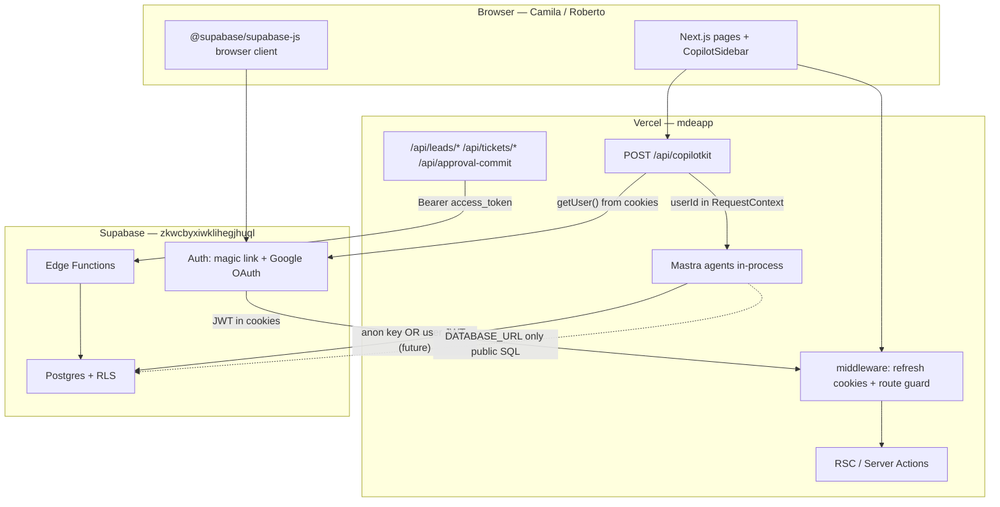
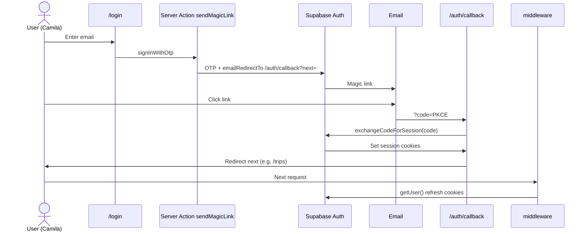
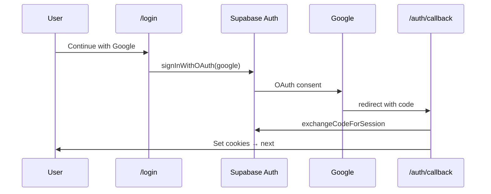
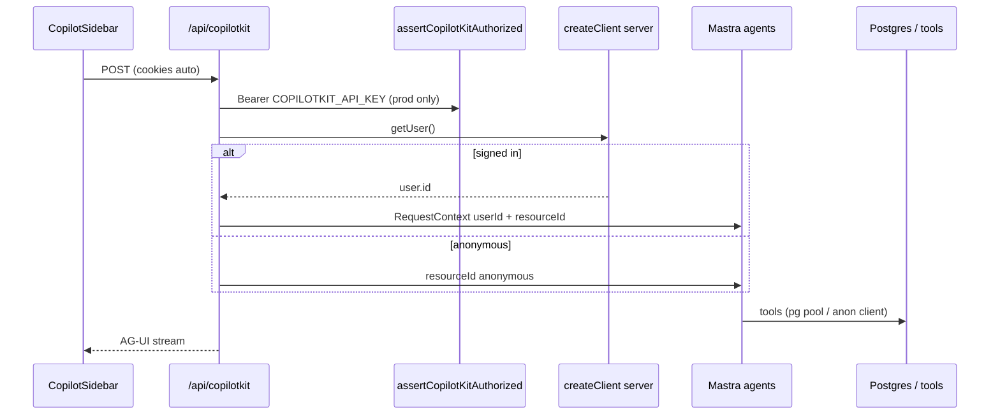
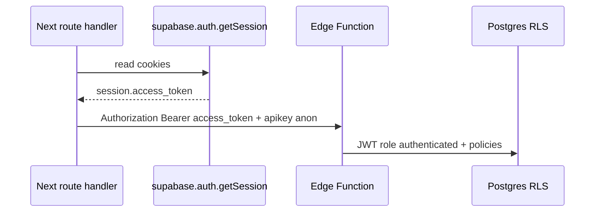

# 21 — Auth architecture review (mdeapp)

## Executive summary

| Metric | Score | Grade |
|--------|------:|-------|
| **MVP auth readiness** | **64/100** | 🟡 |
| **Production cutover readiness** | **52/100** | 🟡 |
| **RLS-safe tool execution** | **58/100** | 🟡 |
| **Google OAuth in mdeapp** | **0/100** | 🔴 Not wired (Supabase project may already support it) |

**Single source of truth:** Supabase Auth issues JWTs; Next.js `@supabase/ssr` stores them in cookies; server code must call `getUser()` (not trust client claims). Mastra agents run **in-process** behind `/api/copilotkit` — they do **not** receive the user JWT today; they receive `userId` via `RequestContext` only.

**Recommended MVP pattern:** Keep **Pattern 1** (CopilotKit route reads cookies → passes `userId` to Mastra). Add Google OAuth + harden routes before calling production “auth complete.” Defer `@mastra/auth-supabase` on port `:4111` until Studio must be exposed on the public internet.

---

## 1. Current architecture (as-built)

### 1.1 What works today (green)

| Layer | Behavior | Files |
|-------|----------|-------|
| Session cookies | `@supabase/ssr` refreshes JWT on each matched request | `src/lib/supabase/middleware.ts`, `src/middleware.ts` |
| Magic link | `signInWithOtp` → email → `/auth/callback?code=` → `exchangeCodeForSession` | `src/app/auth/actions.ts`, `src/app/auth/callback/route.ts` |
| Host routes | `/host/**` → redirect `/login?next=…` if no user | `PROTECTED_PREFIXES` in middleware |
| CopilotKit identity | `getUser()` → `userId` → `MASTRA_RESOURCE_ID_KEY` + `ai_runs` audit | `src/app/api/copilotkit/route.ts` |
| Edge proxy (good) | Forwards `session.access_token` as `Authorization: Bearer` | `schedule-viewing`, `approval-commit` |
| CopilotKit prod gate | `COPILOTKIT_API_KEY` Bearer required in production | `src/lib/copilotkit-auth.ts` |

### 1.2 Gaps vs PRD / MVP doc (yellow/red)

| Gap | Risk | Notes |
|-----|------|-------|
| **No Google OAuth in UI** | 🔴 UX | `plan/mvp.md` lists “Google OAuth + email” production-ready at **platform** level; `mdeapp` only has magic link (F08). |
| **`/trips`, `/saved` not middleware-gated** | 🟡 Data | Pages show sign-in empty state; RLS returns zero rows — OK for MVP, weak for “private URL” expectation. |
| **`search-rentals` uses `DATABASE_URL`** | 🔴 RLS bypass | Postgres pool runs as DB role, not `auth.uid()`. Safe only while SQL is **public catalog** reads. |
| **`search-events` anon → service role fallback** | 🟡 | `SUPABASE_ANON_KEY ?? SUPABASE_SERVICE_ROLE_KEY` — service role in `mdeapp/src` is hook-guarded but bypasses RLS if misconfigured. |
| **Mastra dev `:4111` unauthenticated** | 🟡 Local / 🔴 if exposed | No `MastraAuthSupabase`; anyone on LAN can hit agents if port forwarded. |
| **CopilotKit dev: no Bearer** | 🟡 | Allowed when `NODE_ENV !== 'production'` — correct for localhost. |
| **38 edge fns mostly `verify_jwt: off`** | 🟡 | See `tasks/data/17-edge-audit.md`; money/lead paths rely on app-layer checks. |
| **CopilotKit Mastra example** | — | No auth — mdeapp correctly adds cookie `getUser()` in route (not in upstream example). |

---

## 2. Recommended target architecture (MVP-simple)



**Principles (official docs aligned):**

1. **Authentication** = Supabase Auth JWT in `Authorization: Bearer` or session cookies ([Auth guide](https://supabase.com/docs/guides/auth)).
2. **Authorization** = Postgres RLS using `auth.uid()` from that JWT ([JWT + RLS](https://supabase.com/docs/guides/auth/jwts)).
3. **Never** put `SUPABASE_SERVICE_ROLE_KEY` in client bundle (`CLAUDE.md` hard rule).
4. **CopilotKit** does not replace Supabase Auth — it consumes the same session the Next route reads.
5. **Mastra `@mastra/auth-supabase`** is for **Mastra HTTP server / Studio** ([Mastra Supabase auth](https://mastra.ai/docs/server/auth/supabase)), not required for in-process CopilotKit wiring.

---

## 3. End-to-end JWT flow

### 3.1 Sign-in (magic link — live)



**Failure points:** wrong `NEXT_PUBLIC_SITE_URL` / Supabase redirect URL allowlist; expired link; `code` missing → `auth_callback_missing_code`.

### 3.2 Sign-in (Google OAuth — planned)

Per [Supabase Google OAuth](https://supabase.com/docs/guides/auth/social-login/auth-google):

1. Dashboard: enable Google provider, set OAuth client ID/secret.
2. Add redirect URLs: `https://<site>/auth/callback`, `http://localhost:3001/auth/callback`.
3. Client: `supabase.auth.signInWithOAuth({ provider: 'google', options: { redirectTo } })`.
4. Same `/auth/callback` + `exchangeCodeForSession` path as magic link.



### 3.3 Chat (CopilotKit → Mastra)



**JWT is not forwarded into Mastra tool SQL today** — only `userId` string for audit (`runAuditedSearch`). RLS-aware tools need a follow-up task (AUTH-010).

### 3.4 Edge function call (correct pattern)



Reference: `src/lib/supabase/edge-functions.ts` — **never** send service role from browser routes.

---

## 4. When should users sign up? (persona journeys)

| Persona | Surface | Anonymous OK? | Sign-up trigger | Method |
|---------|---------|---------------|-----------------|--------|
| **Camila** | `/`, `/chat` | ✅ Browse + chat | Save listing, schedule viewing, `/saved`, `/trips` | Magic link or Google |
| **Tourist** | `/chat` concierge | ✅ | Same as Camila when saving/booking | Same |
| **Roberto** | `/host/event/new` | ❌ | First visit to host wizard | Magic link / Google (middleware already blocks) |
| **Andrés** | Ticket checkout | 🟡 Guest possible | Pay + wallet QR | Email magic link at payment or account |
| **Patricia** | `/admin/*` (W8) | ❌ | Admin role in `profiles` | Org SSO later; magic link MVP |

**UX rule:** Ask for auth **at the moment of write** (save trip, publish event, pay, commit approval) — not on homepage load. `/login?next=` must preserve intent (`safeNextPath` already used).

---

## 5. Risk register

| ID | Item | Grade | Impact |
|----|------|-------|--------|
| R1 | `DATABASE_URL` in `search-rentals` | 🔴 | Any SQL bug = full DB read as pool user |
| R2 | Service role fallback in `search-events` | 🟡 | Mis-env → bypass RLS on events |
| R3 | Open Mastra `:4111` | 🟡/🔴 | Agent abuse if tunnelled publicly |
| R4 | Edge fns `verify_jwt: off` | 🟡 | Relies on manual token forward + app logic |
| R5 | No Google button in mdeapp | 🟡 | PRD expectation gap; Colombia users expect Google |
| R6 | `getSession()` vs `getUser()` in some routes | 🟡 | Supabase recommends `getUser()` for server validation |
| R7 | `listing_embeddings` anon read-all | 🟡 | From `18-supabase-audit.md` |
| R8 | CopilotKit anonymous chat | 🟡 | OK for discovery; cap/quota if abuse (legacy `ai-chat` had 3-msg gate) |

---

## 6. Implementation strategy

**Phase 0 — Quick wins (1–2 days)**  
→ readiness **64 → 72**

1. Add Google OAuth button on `/login` + `/signup` (reuse callback).
2. Extend `PROTECTED_PREFIXES` to `/trips`, `/saved` (optional flag `SOFT_AUTH_ROUTES` for gradual rollout).
3. Normalize server routes to `getUser()` before `getSession()` for token forward.
4. Document Supabase Dashboard redirect URLs for staging + prod.

**Phase 1 — RLS-safe tools (3–5 days)**  
→ readiness **72 → 80**

5. Introduce `createUserScopedSupabase(accessToken)` for tools touching user-owned rows (`trips`, `saved_listings`, `approval_requests`).
6. Restrict `DATABASE_URL` pool to **read-only** DB user or move rental search to anon+RLS public policy.
7. Remove `SUPABASE_SERVICE_ROLE_KEY` fallback from `search-events` in production builds (fail loud).

**Phase 2 — Production gates (W9 / cutover)**  
→ readiness **80 → 88**

8. Edge JWT sweep for `ticket-checkout`, `chat-lead-capture` (companion `17-edge-audit`, `25V-edge-fn-jwt-hmac-sweep`).
9. Set `COPILOTKIT_API_KEY` on Vercel production.
10. Mastra Studio: either localhost-only OR `MastraAuthSupabase` if `:4111` exposed.

**Phase 3 — Optional hardening (post-MVP)**

11. `@mastra/auth-supabase` on standalone Mastra deploy ([reference](https://mastra.ai/reference/auth/supabase)).
12. Custom Access Token Hook for `app_metadata.role` (host/admin).
13. MFA / leaked-password protection (Supabase Dashboard).

---

## 7. Phased task list (mdeapp)

| ID | Task | Effort | Depends | Verify |
|----|------|--------|---------|--------|
| **AUTH-001** | Google OAuth UI + `signInWithOAuth` server action | 3h | F08 | Click Google → lands on `/trips` with session |
| **AUTH-002** | Supabase Dashboard: Google provider + redirect URLs | 1h | — | OAuth consent completes |
| **AUTH-003** | Middleware: protect `/trips`, `/saved` | 2h | AUTH-001 optional | Logged-out → `/login?next=` |
| **AUTH-004** | `getUser()` everywhere server reads auth | 2h | — | Grep: no bare `getSession()` without user check |
| **AUTH-005** | Playwright: magic link + Google smoke (OTP inject OK for CI) | 4h | AUTH-001 | E2E green in `npm run test:e2e` |
| **AUTH-006** | `createToolSupabaseClient(jwt?)` helper for Mastra tools | 6h | — | Tool query returns only user's trips when JWT passed |
| **AUTH-007** | Remove service-role fallback from `search-events` prod | 1h | — | Missing anon key → empty results, not elevated |
| **AUTH-008** | `search-rentals`: anon client or read-only PG role | 4h | — | RLS audit query as authenticated user |
| **AUTH-009** | Forward `access_token` into RequestContext (optional) | 4h | AUTH-006 | Tool uses JWT for user-scoped writes |
| **AUTH-010** | Mastra Studio auth OR bind `:4111` to localhost only | 2h | — | `curl :4111` without Bearer → 401 in prod-like env |
| **AUTH-011** | Production auth checklist run (§13) | 2h | all above | Evidence in `tasks/notes/AUTH-prod-evidence.md` |

---

## 8. Folder / file structure (recommended)

```
mdeapp/src/
  lib/
    auth/
      site-url.ts          # exists — redirect origins
      session.ts           # exists — getServerSession
      oauth.ts             # NEW — signInWithGoogle action helper
    supabase/
      client.ts | server.ts | middleware.ts | edge-functions.ts  # keep
      user-scoped.ts         # NEW — createClient(jwt) for tools
    copilotkit-auth.ts       # exists — runtime API key
  app/
    login/ signup/
    auth/
      callback/route.ts    # exists — PKCE for magic + Google
      actions.ts           # extend: signInWithGoogle
    api/
      copilotkit/route.ts  # exists — getUser → RequestContext
  middleware.ts            # matcher excludes api/copilotkit (keep)
  mastra/
    lib/tool-audit-context.ts
    tools/                 # migrate user writes to user-scoped client
```

**Do not add** a second auth system (Clerk, NextAuth) — Supabase stays canonical per project rules.

---

## 9. Security checklist

- [ ] `SUPABASE_SERVICE_ROLE_KEY` only in server env / edge — never `NEXT_PUBLIC_*`
- [ ] Server Components use `supabase.auth.getUser()` not client-side session alone
- [ ] PKCE callback only at `/auth/callback` — `safeNextPath` prevents open redirects
- [ ] `COPILOTKIT_API_KEY` set in Vercel Production
- [ ] `assertCopilotKitAuthorized` stays strict when `NODE_ENV=production`
- [ ] Google OAuth Client: authorized redirect URIs match Supabase project settings
- [ ] RLS enabled on every new table + policy uses `auth.uid()`
- [ ] Tools that write user data use user JWT, not `DATABASE_URL` superuser path
- [ ] Edge money paths: verify JWT or signed webhook secrets (Stripe)
- [ ] Mastra Studio not public without auth
- [ ] Rotate keys if service role ever committed (guard hook already blocks new writes)

---

## 10. Environment variable checklist

| Variable | Where | Purpose |
|----------|-------|---------|
| `NEXT_PUBLIC_SUPABASE_URL` | Client + server | Project URL |
| `NEXT_PUBLIC_SUPABASE_PUBLISHABLE_KEY` or `NEXT_PUBLIC_SUPABASE_ANON_KEY` | Client + server | Anon JWT for RLS-scoped reads |
| `NEXT_PUBLIC_SITE_URL` | Server actions | Magic link / OAuth redirect base |
| `SUPABASE_URL` | Server / Mastra tools | Same project (server) |
| `SUPABASE_ANON_KEY` | Mastra tools | Prefer over service role |
| `SUPABASE_SERVICE_ROLE_KEY` | `ai_runs`, edge-only patterns | **Never client** |
| `DATABASE_URL` | `search-rentals` pool | 🟡 Minimize; read-only role |
| `COPILOTKIT_API_KEY` | Production `/api/copilotkit` | Blocks unsigned runtime abuse |
| `NEXT_PUBLIC_COPILOTKIT_PUBLIC_API_KEY` | Browser | CopilotKit Cloud pairing |
| `E2E_BYPASS_AUTH` | Local/CI only | Skips `/host` guard — never prod |

**Google OAuth (Dashboard + GCP):** no extra env in mdeapp if using Supabase-hosted OAuth — configure in Supabase Dashboard only ([Google provider doc](https://supabase.com/docs/guides/auth/social-login/auth-google)).

---

## 11. Route protection strategy

| Route prefix | Middleware | Page-level | RLS |
|--------------|------------|------------|-----|
| `/`, `/chat`, `/rentals` | Refresh cookies only | Optional sign-in CTA | Public read policies |
| `/login`, `/signup`, `/auth/*` | Public | — | — |
| `/host/**` | **Redirect if no user** ✅ | — | Host policies |
| `/trips/**`, `/saved` | **Add redirect** (AUTH-003) | Today: empty state | User-owned rows |
| `/api/copilotkit` | Excluded from middleware | `getUser()` in handler | Audit `ai_runs` by userId |
| `/api/tickets/*` | — | Session for checkout | Edge + orders |
| `/admin/**` (W8) | Redirect + role check | `profiles.role` | Admin policies |

---

## 12. Edge function auth strategy

| Pattern | Use when | mdeapp example |
|---------|----------|----------------|
| **Forward user JWT** | User-specific writes | `schedule-viewing` → `chat-lead-capture` |
| **Service role inside edge only** | Webhooks, cron, Stripe | `ticket-payment-webhook` |
| **`verify_jwt: true` on gateway** | Hardening pass | Not yet — AUTH-011 + `25V` draft |
| **Never** service role from browser | Always | `CLAUDE.md` |

Rule: Next.js route validates session → passes `access_token` → edge runs as `authenticated` role ([JWT claims `role`](https://supabase.com/docs/guides/auth/jwt-fields)).

---

## 13. Middleware strategy

**Keep** existing matcher excluding `api/copilotkit` (long-lived stream + double cookie refresh risk).

```ts
// Today — extend PROTECTED_PREFIXES only
const PROTECTED_PREFIXES = ["/host", "/trips", "/saved"];
```

**Always** call `getUser()` in middleware (already does) — validates JWT with Auth server per [Next.js SSR guide](https://supabase.com/docs/guides/auth/server-side/nextjs).

**Do not** parse JWT in middleware manually — use Supabase client.

---

## 14. RLS strategy

| Data class | Access pattern | Tool / route |
|------------|----------------|--------------|
| Public catalog | `anon` + SELECT policies | `search-events`, public rentals |
| User-owned | `authenticated` + `auth.uid()` | trips, saved, approvals |
| Admin / ops | `service_role` **edge only** | webhooks, batch jobs |
| AI audit | service role server-side | `ai_runs` insert via `mastra/lib/ai-runs.ts` |

**Mastra tool rule:** If a tool reads/writes a row with `user_id`, it must use the **user access token**, not `DATABASE_URL` or service role ([RLS docs](https://supabase.com/docs/guides/database/postgres/row-level-security)).

---

## 15. Testing checklist

- [ ] Magic link E2E: request link → callback → protected page loads data
- [ ] Google OAuth E2E (staging): full redirect cycle
- [ ] Logged-out `/host/event/new` → `/login?next=`
- [ ] Logged-out `/trips` → redirect (after AUTH-003)
- [ ] Anonymous `/chat` POST `/api/copilotkit` → 200, `resourceId=anonymous`
- [ ] Logged-in chat → `ai_runs.user_id` populated
- [ ] `schedule-viewing` without session → edge receives anon key only → expect 401/403 from edge or app
- [ ] RLS negative test: user A cannot SELECT user B `trips` via Supabase client
- [ ] Production build with `COPILOTKIT_API_KEY`: missing Bearer → 401

---

## 16. Localhost verification steps

```bash
cd /home/sk/mdeai/mdeapp
# Terminal 1
npm run dev
# Expect [ui] http://localhost:3001  [agent] http://localhost:4111
```

| Step | Command / action | Expected |
|------|------------------|----------|
| 1 | `curl -s -o /dev/null -w "%{http_code}" http://localhost:3001/login` | `200` |
| 2 | `curl -s -o /dev/null -w "%{http_code}" -X POST http://localhost:3001/api/copilotkit` | `400` or `200` (empty body = route alive) |
| 3 | Open `/host/event/new` logged out | Redirect `/login?next=/host/...` |
| 4 | Magic link login `qa-landlord@mdeai.co` | `/trips` shows cards |
| 5 | `/trips/11111111-1111-1111-1111-000000000002` | Itinerary panel renders |
| 6 | `npm run test` | All unit tests pass |
| 7 | `npm run floor` | Exit 0 |

**E2E auth inject (CI):** admin `generateLink` + `verifyOtp` — pattern in `SCREEN-013-itinerary.spec.ts`.

---

## 17. Production deployment checklist

### Supabase Dashboard

- [ ] Site URL + Redirect URLs: production domain + `https://<vercel>/auth/callback`
- [ ] Google provider enabled (if shipping AUTH-001)
- [ ] Email templates / SMTP for magic links
- [ ] JWT signing: prefer asymmetric keys ([signing keys](https://supabase.com/docs/guides/auth/signing-keys))
- [ ] Leaked password protection / MFA (optional Phase 3)

### Vercel (mdeapp)

- [ ] `NEXT_PUBLIC_SITE_URL=https://<production-domain>`
- [ ] `COPILOTKIT_API_KEY` set (Production only)
- [ ] No `E2E_BYPASS_AUTH` in Production
- [ ] `DATABASE_URL` uses pooler + read-only creds if still required
- [ ] Stripe webhook URLs point to live edge fns

### Mastra / CopilotKit

- [ ] CopilotKit Cloud → production runtime URL + API key
- [ ] Do not expose `:4111` publicly without `MastraAuthSupabase`
- [ ] Smoke: signed-in chat on prod → trace in `mastra_ai_spans` / `ai_runs`

### Post-deploy

- [ ] `curl` prod `/api/copilotkit` without Bearer → `401`
- [ ] Google sign-in on real domain
- [ ] Patricia: spot-check RLS advisor in Supabase MCP

---

## 18. Missing infrastructure

| Item | Status | Task |
|------|--------|------|
| Google OAuth UI | Missing | AUTH-001/002 |
| `mdeapp/supabase/functions/` owned copies | Partial | Port ticket + lead fns per `17-edge-audit` |
| `approval-commit` edge | RPC exists; edge TBD | F38 |
| User-scoped Mastra tool client | Missing | AUTH-006 |
| `@mastra/auth-supabase` package | Not installed | AUTH-010 when needed |
| Auth task spec in `tasks/core/` | Only F08 | Add AUTH-001…011 files or track in INDEX |

---

## 19. Quick wins (do first)

1. **AUTH-002** — Enable Google in Supabase Dashboard (no code).
2. **AUTH-001** — “Continue with Google” on login/signup (shares callback).
3. **AUTH-003** — Protect `/trips` + `/saved` in middleware (Camila privacy).
4. **AUTH-004** — `getUser()` in `schedule-viewing` + ticket routes before forwarding token.
5. Document redirect URLs in `mdeapp/docs/localhost-qa-runbook.md` (one paragraph).

---

## 20. CopilotKit + Mastra: what official examples do

| Source | Auth behavior | mdeapp delta |
|--------|---------------|--------------|
| [CopilotKit/mastra example](https://github.com/CopilotKit/CopilotKit/tree/main/examples/integrations/mastra) | None | `getUser()` in `route.ts` ✅ |
| [Mastra Supabase auth](https://mastra.ai/docs/server/auth/supabase) | `MastraAuthSupabase` on **Mastra server** | In-process agents: use RequestContext instead |
| [mastra-auth-examples/supabase](https://github.com/mastra-ai/mastra-auth-examples/tree/main/examples/supabase) | Next + Supabase cookies + Mastra API Bearer | Reference for **Phase 2** if splitting Mastra to its own deploy |

---

## 21. Readiness scoring detail

| Area | Weight | Score | Notes |
|------|--------|------:|-------|
| Supabase SSR + magic link | 20% | 90 | F08 Done |
| Route protection | 15% | 55 | Host only |
| Google OAuth | 10% | 0 | Not in app |
| JWT → CopilotKit → Mastra | 20% | 75 | userId yes; JWT in tools no |
| RLS-safe tools | 20% | 50 | pg pool + role fallback |
| Edge auth | 10% | 45 | Many JWT off |
| Production gates | 5% | 60 | COPILOTKIT_KEY pattern ready |

**Weighted MVP auth readiness: 64/100**

---

## 22. Official references (only)

- [Supabase Auth](https://supabase.com/docs/guides/auth)
- [Google OAuth (Supabase)](https://supabase.com/docs/guides/auth/social-login/auth-google)
- [JWT overview](https://supabase.com/docs/guides/auth/jwts)
- [JWT claims](https://supabase.com/docs/guides/auth/jwt-fields)
- [Next.js server-side auth](https://supabase.com/docs/guides/auth/server-side/nextjs)
- [Mastra auth overview](https://mastra.ai/docs/server/auth)
- [Mastra Supabase provider](https://mastra.ai/docs/server/auth/supabase)
- [MastraAuthSupabase reference](https://mastra.ai/reference/auth/supabase)
- Mastra + Supabase cookie patterns only (optional): [mastra-auth-examples/supabase](https://github.com/mastra-ai/mastra-auth-examples/tree/main/examples/supabase) — **Next.js starter, not `MastraAuthSupabase`**

---

*Executable tasks: [`tasks/data/auth/INDEX.md`](../auth/INDEX.md) (AUTH-001…011). Supabase guide: [`tasks/data/supabase/README.md`](../supabase/README.md).*
