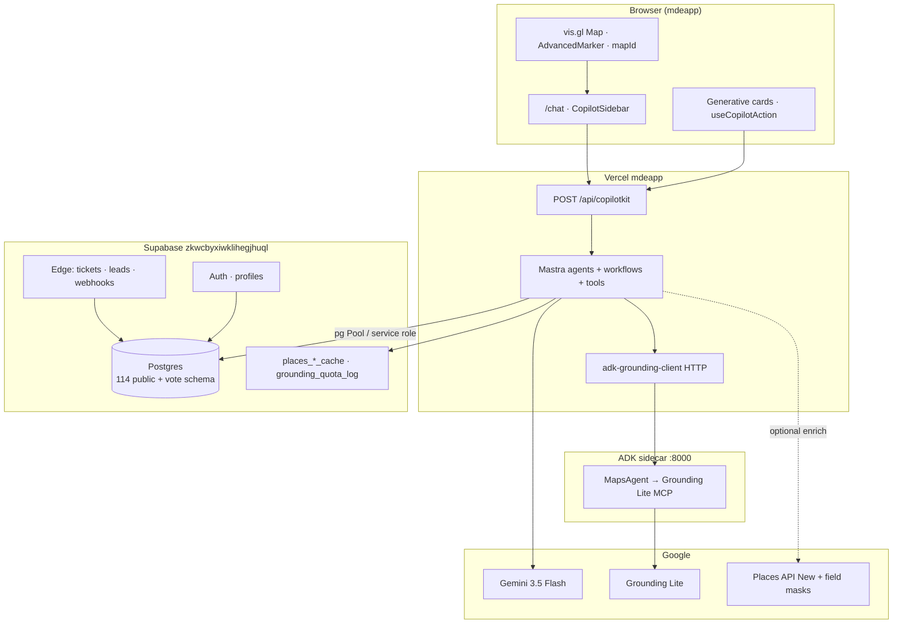
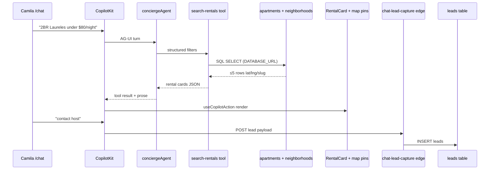
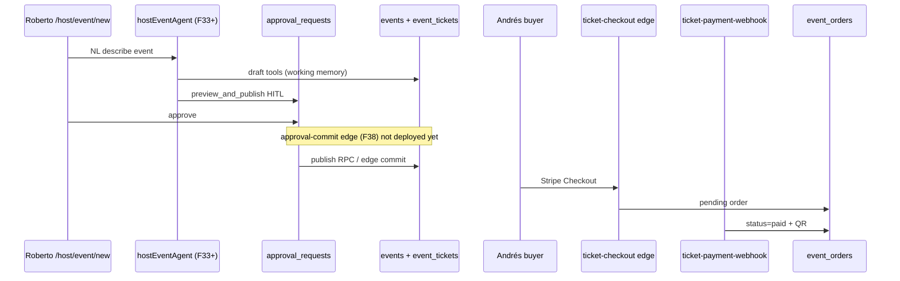
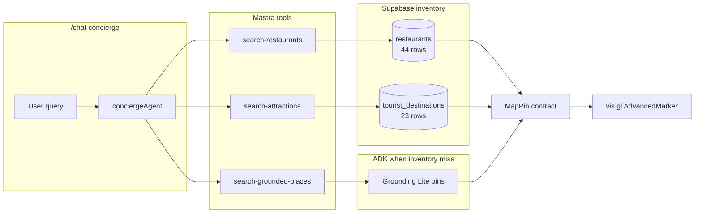
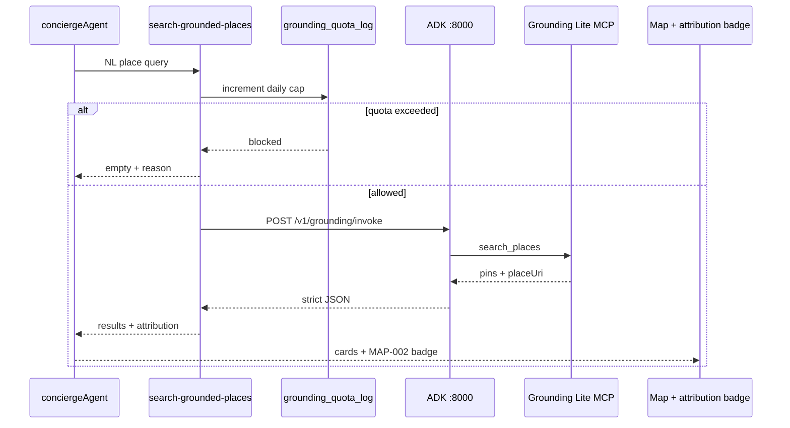
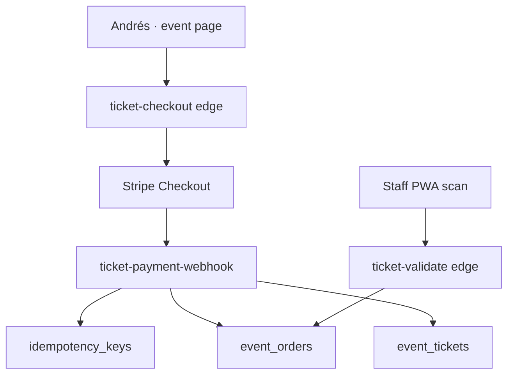
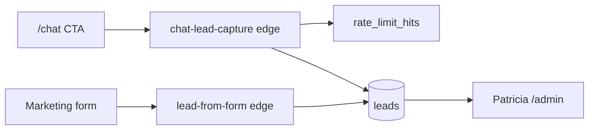
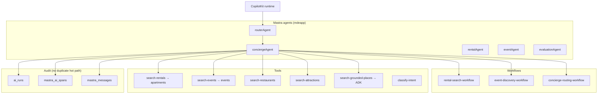
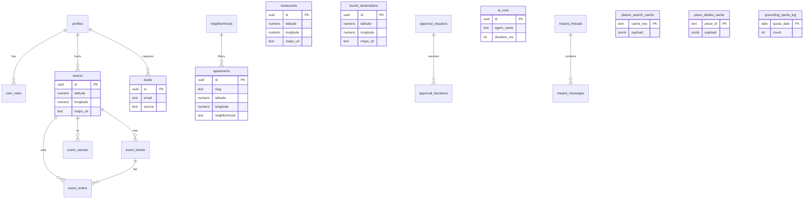

# Data plan — architecture diagrams

Visual companion to [`19-product-schema-roadmap-audit.md`](../audit/19-product-schema-roadmap-audit.md). All diagrams assume **new architecture only** — no AI chat edge functions.

---

## 1. Overall architecture (current → target)

---

## 2. Rentals workflow (Camila)

---

## 3. Events workflow (Roberto + Andrés)

---

## 4. Restaurants + tourism workflow

---

## 5. Maps grounding workflow (MAP-002B)

---

## 6. Payments / tickets workflow (W9)

---

## 7. Leads / CRM workflow

---

## 8. Agent / tool workflow

---

## 9. Supabase schema ERD (MVP core)

---

## 10. Schema roadmap phases

| Phase | Weeks | Schema focus | Edge focus |
|-------|-------|--------------|------------|
| **MVP** | W1–10 | `apartments`, `events*`, `restaurants`, `tourist_destinations`, `leads`, `mastra_*`, cache tables, `ai_runs` | `chat-lead-capture`, `ticket-*`, deploy `approval-commit` |
| **Post-MVP** | W11–18 | `showings`, `rental_applications`, `saved_places`, eval tables | `event-staff-link-generator`, optional `places-proxy` |
| **Advanced** | W19+ | `vote.*` contests, sponsor stack, WhatsApp | Phase B delete legacy sponsor/OpenClaw fns |
| **Cutover cleanup** | After MVP proof | Drop `rentals`, `agent_*`, freeze `conversations`/`messages` | Phase B delete 27 legacy edges |

**Full table grades:** [`19-product-schema-roadmap-audit.md` §8](../audit/19-product-schema-roadmap-audit.md)
